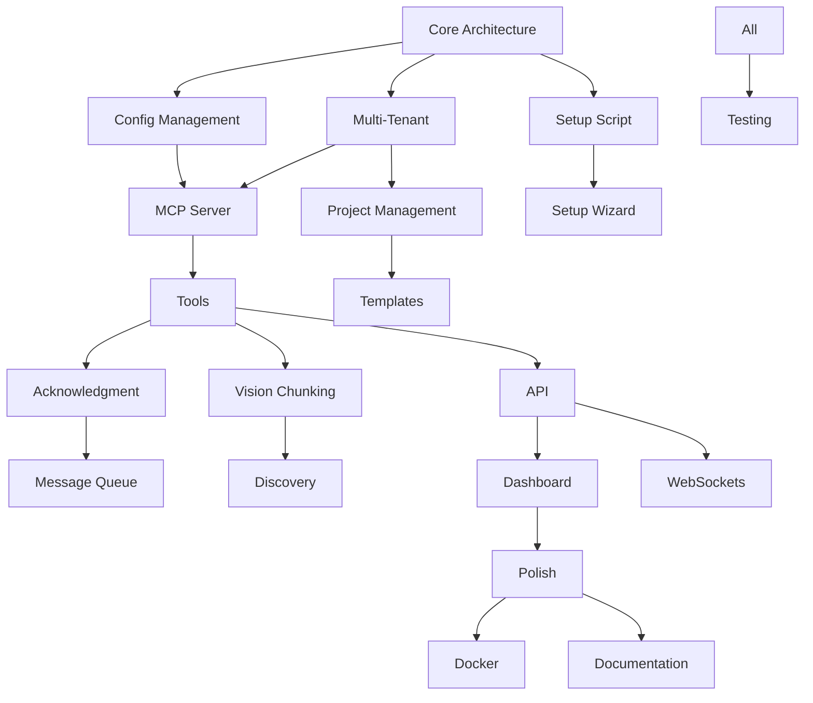

# GiljoAI MCP - Project Orchestration Plan

## Development Strategy

We'll use the existing AKE-MCP server to orchestrate building GiljoAI MCP through a series of focused projects. Each project will be created and executed through the orchestrator, building the new system incrementally.

## Setup Script Strategy

**Approach: Progressive Enhancement from Day 1**

Rather than waiting until MVP completion, we'll build setup scripts iteratively:
1. **Phase 1**: Basic configuration (database, paths) - manual but documented
2. **Phase 2**: Automated setup script with prompts
3. **Phase 3**: Platform detection and defaults
4. **Phase 4**: GUI setup wizard (stretch goal)

This ensures we're always testing the "first run" experience and catching setup issues early.

## Project Flow Map

```
PHASE 1: FOUNDATION (Week 1)
├── Project 1.1: Core Architecture & Database
├── Project 1.2: Multi-Tenant Schema
├── Project 1.3: Basic Setup Script
└── Project 1.4: Configuration Management

PHASE 2: MCP INTEGRATION (Week 1-2)
├── Project 2.1: FastMCP Server Structure
├── Project 2.2: Tool Implementation (20 tools)
├── Project 2.3: Vision Chunking System
└── Project 2.4: Message Acknowledgment

PHASE 3: ORCHESTRATION ENGINE (Week 2)
├── Project 3.1: Project/Agent Management
├── Project 3.2: Message Queue & Routing
├── Project 3.3: Dynamic Discovery
└── Project 3.4: Orchestrator Templates

PHASE 4: USER INTERFACE (Week 3)
├── Project 4.1: API Endpoints
├── Project 4.2: Dashboard Foundation
├── Project 4.3: Real-time WebSockets
└── Project 4.4: UI Polish & Themes

PHASE 5: DEPLOYMENT & POLISH (Week 4)
├── Project 5.1: Docker Packaging
├── Project 5.2: Enhanced Setup Wizard
├── Project 5.3: Documentation & Examples
└── Project 5.4: Testing & Validation
```

## Detailed Project Descriptions

### PHASE 1: FOUNDATION

#### Project 1.1: Core Architecture & Database
**Mission**: Create the foundational structure for GiljoAI MCP with proper organization and database connectivity.

**Tasks**:
- Create project structure (`/src/giljo_mcp/`, `/tests/`, `/docs/`)
- Set up SQLAlchemy models with dual database support (SQLite/PostgreSQL)
- Implement DatabaseManager class with connection pooling
- Create Alembic migration structure
- Write database initialization scripts

**Deliverables**:
- Working project structure
- Database models for all entities
- Migration system ready
- Connection management tested

---

#### Project 1.2: Multi-Tenant Schema Implementation
**Mission**: Implement project isolation via tenant keys, enabling multiple concurrent products/projects.

**Tasks**:
- Add `tenant_key` field to all relevant tables
- Update all queries to filter by tenant_key
- Create tenant key generation system
- Implement project isolation tests
- Remove `is_active` product limitation

**Deliverables**:
- Multi-tenant database schema
- Tenant key management system
- Isolation verification tests

---

#### Project 1.3: Basic Setup Script
**Mission**: Create initial setup experience that guides users through configuration.

**Tasks**:
- Create `setup.py` interactive script
- Prompt for database choice (SQLite/PostgreSQL)
- Collect database credentials if PostgreSQL
- Generate `.env` file with configuration
- Create initial directories
- Test on Windows, Mac, Linux

**Deliverables**:
- Working setup.py script
- .env.example template
- Platform-specific instructions

---

#### Project 1.4: Configuration Management
**Mission**: Build robust configuration system supporting local/LAN/WAN modes.

**Tasks**:
- Create config.yaml structure
- Implement ConfigManager class
- Support environment variable overrides
- Mode detection (local/lan/wan)
- Configuration validation

**Deliverables**:
- Configuration management system
- Mode-based behavior switching
- Validation and defaults

---

### PHASE 2: MCP INTEGRATION

#### Project 2.1: FastMCP Server Structure
**Mission**: Create the MCP server foundation with proper tool organization.

**Tasks**:
- Set up FastMCP server with dependencies
- Organize tools into logical groups
- Implement authentication middleware
- Create server startup logic
- Add health check endpoints

**Deliverables**:
- Working MCP server shell
- Tool organization structure
- Basic authentication ready

---

#### Project 2.2: Tool Implementation
**Mission**: Implement all 20 essential MCP tools with proper error handling.

**Tasks**:
- Implement 5 project management tools
- Implement 5 agent management tools  
- Implement 5 messaging tools
- Implement 5 context/discovery tools
- Add comprehensive error handling
- Write tool documentation

**Deliverables**:
- All 20 tools working
- Error handling complete
- Tool documentation

---

#### Project 2.3: Vision Chunking System
**Mission**: Port and enhance the proven vision chunking system from AKE-MCP.

**Tasks**:
- Port get_vision() with chunking logic
- Implement natural boundary breaking
- Create vision index in database
- Add get_vision_index() for navigation
- Test with 50K+ token documents

**Deliverables**:
- Vision chunking working
- Index creation functional
- Large document support verified

---

#### Project 2.4: Message Acknowledgment System
**Mission**: Implement the complete message acknowledgment system with arrays.

**Tasks**:
- Implement acknowledged_by arrays
- Add completed_by tracking
- Create auto-acknowledgment on retrieval
- Add completion timestamps and notes
- Update message statistics

**Deliverables**:
- Full acknowledgment system
- Completion tracking
- Auto-acknowledgment working

---

### PHASE 3: ORCHESTRATION ENGINE

#### Project 3.1: Project/Agent Management
**Mission**: Build core orchestration logic for project and agent lifecycle.

**Tasks**:
- Implement ProjectOrchestrator class
- Create agent spawning system
- Build handoff mechanism
- Add context usage tracking
- Implement agent decommissioning

**Deliverables**:
- Project lifecycle management
- Agent spawning and handoffs
- Context tracking system

---

#### Project 3.2: Message Queue & Routing
**Mission**: Implement database-backed message queue with intelligent routing.

**Tasks**:
- Create MessageQueue class
- Implement priority routing
- Add broadcast support
- Build message monitoring
- Create stuck message detection

**Deliverables**:
- Message queue system
- Routing and priorities
- Monitoring capabilities

---

#### Project 3.3: Dynamic Discovery System
**Mission**: Implement dynamic context discovery eliminating static indexing.

**Tasks**:
- Create discovery priority system
- Implement path resolution from config
- Add Serena MCP integration hooks
- Build selective context loading
- Remove all static indexing code

**Deliverables**:
- Dynamic discovery working
- Priority-based loading
- No static contexts

---

#### Project 3.4: Orchestrator Mission Templates
**Mission**: Create comprehensive mission generation system for orchestrators and agents.

**Tasks**:
- Port orchestrator mission template
- Add vision chunking instructions
- Create role-specific agent missions
- Ensure consistent behavior
- Include dynamic discovery guidance

**Deliverables**:
- Mission generation system
- Role-specific templates
- Consistent instructions

---

#### Project 3.5: Integration Testing & Validation
**Mission**: Comprehensive integration testing and validation of all Phase 1-3 components to ensure system reliability before UI development.

**Tasks**:
- Audit existing 45+ test files
- Build end-to-end workflow tests
- Test database operations (SQLite & PostgreSQL)
- Validate multi-tenant isolation
- Run performance benchmarks
- Create CI/CD pipeline

**Deliverables**:
- Integration test suite
- Performance benchmark report
- Bug priority list
- Test coverage report (>90% target)
- CI/CD configuration

---

#### Project 3.6: Quick Integration Fixes
**Mission**: Fix simple integration issues identified in Project 3.5 for immediate test improvements.

**Tasks**:
- Fix configuration import paths
- Correct async method names
- Remove Unicode encoding issues
- Add UTF-8 encoding to file operations
- Verify no regression in working tests

**Deliverables**:
- Updated test files with correct imports
- Fixed async method calls
- Windows-compatible output
- 30-40% test pass rate improvement

---

#### Project 3.7: Tool-API Integration Bridge
**Mission**: Build critical integration layer between MCP tools and API endpoints.

**Tasks**:
- Analyze MCP tool registration patterns
- Design adapter pattern for integration
- Create wrapper functions for tools
- Update API endpoints
- Ensure context properly passed
- Test with both databases

**Deliverables**:
- Tool adapter module
- Updated API endpoints
- Integration architecture docs
- 80%+ integration tests passing

---

#### Project 3.8: Final Integration Validation
**Mission**: Complete validation after fixing all issues from Projects 3.5-3.7 before Phase 4.

**Tasks**:
- Re-run all 110+ tests
- Execute E2E workflow tests
- Validate both databases
- Test multi-tenant isolation
- Run performance benchmarks
- Create go/no-go recommendation

**Deliverables**:
- Complete test report (90%+ passing)
- Performance analysis
- Production readiness assessment
- Go/no-go for Phase 4

---

### PHASE 4: USER INTERFACE

#### Project 4.1: API Endpoints
**Mission**: Build comprehensive REST API for all system functions.

**Tasks**:
- Create FastAPI application structure
- Implement project endpoints
- Add agent management endpoints
- Build message/task endpoints
- Create configuration endpoints
- Add OpenAPI documentation

**Deliverables**:
- Complete REST API
- OpenAPI/Swagger docs
- Endpoint testing suite

---

#### Project 4.2: Dashboard Foundation
**Mission**: Create modern, responsive dashboard for system management.

**Tasks**:
- Choose UI framework (Streamlit vs Vue)
- Create dashboard layout
- Implement project management UI
- Add agent monitoring views
- Build message center interface
- Create settings pages

**Deliverables**:
- Working dashboard
- All core views implemented
- Responsive design

---

#### Project 4.3: Real-time WebSockets
**Mission**: Add real-time updates for agent activity and messages.

**Tasks**:
- Implement WebSocket server
- Create client-side WebSocket handler
- Add real-time agent status updates
- Stream message notifications
- Build progress indicators
- Add connection management

**Deliverables**:
- WebSocket integration
- Real-time updates working
- Graceful reconnection

---

#### Project 4.4: UI Polish & Themes
**Mission**: Polish UI with themes, animations, and enhanced UX.

**Tasks**:
- Implement dark/light themes
- Add smooth transitions
- Create loading states
- Build error notifications
- Add keyboard shortcuts
- Implement responsive tables

**Deliverables**:
- Polished, themeable UI
- Smooth user experience
- Professional appearance

---

### PHASE 5: DEPLOYMENT & POLISH

#### Project 5.1: Docker Packaging
**Mission**: Create Docker containers for easy deployment.

**Tasks**:
- Create multi-stage Dockerfile
- Write docker-compose.yml
- Add environment configuration
- Create volume mappings
- Test container builds
- Add container health checks

**Deliverables**:
- Docker images building
- Compose file working
- Deployment documented

---

#### Project 5.2: Enhanced Setup Wizard
**Mission**: Create polished setup experience with smart defaults.

**Tasks**:
- Enhance setup.py with GUI option
- Add platform detection
- Implement dependency checking
- Create first-run wizard
- Add migration from AKE-MCP
- Build configuration import/export

**Deliverables**:
- Polished setup experience
- Platform-specific installers
- Migration tools

---

#### Project 5.3: Documentation & Examples
**Mission**: Create comprehensive documentation and example projects.

**Tasks**:
- Write README with quick start
- Create user guide
- Document all MCP tools
- Add example projects
- Create video tutorials
- Build troubleshooting guide

**Deliverables**:
- Complete documentation
- Working examples
- Tutorial content

---

#### Project 5.4: Testing & Validation
**Mission**: Comprehensive testing ensuring system reliability.

**Tasks**:
- Write unit tests (>80% coverage)
- Create integration tests
- Add load testing
- Test multi-tenant isolation
- Verify large vision handling
- Test all database modes

**Deliverables**:
- Test suite complete
- Coverage reports
- Performance benchmarks

---

## Project Dependencies



## Execution Strategy

### How to Create Each Project in AKE-MCP:

1. **Create Project**:
```python
create_project(
    name="1.1 Core Architecture",
    mission="Create foundational structure with database connectivity",
    agents=["analyzer", "architect", "implementer", "tester"]
)
```

2. **Monitor Progress**:
- Use dashboard to track agent work
- Review generated code
- Test incrementally

3. **Handoff Between Projects**:
- Document completion state
- Update dependencies
- Create next project with context

### Success Metrics Per Project:

- Code compiles/runs without errors
- Tests pass (when applicable)
- Documentation updated
- Ready for next phase

## Risk Mitigation

### Technical Risks:
- **Database complexity**: Start with SQLite, add PostgreSQL later
- **MCP protocol changes**: Abstract tool interfaces
- **UI framework choice**: Build API first, UI is swappable

### Process Risks:
- **Orchestrator limitations**: Have manual fallback plans
- **Context overflow**: Break large projects into smaller ones
- **Integration issues**: Test early and often

## Timeline

- **Week 1**: Foundation + Core MCP (Projects 1.1-2.2)
- **Week 2**: Complete MCP + Orchestration (Projects 2.3-3.4)
- **Week 3**: User Interface (Projects 4.1-4.4)
- **Week 4**: Deployment + Polish (Projects 5.1-5.4)
- **Week 5**: Integrations (Projects 6.1-6.4)

## Notes on Setup Scripts

We'll build setup incrementally:

1. **Project 1.3**: Basic text-based setup
2. **Project 2.1**: Add MCP configuration to setup
3. **Project 3.1**: Add product/project initialization
4. **Project 4.2**: Add setup status to dashboard
5. **Project 5.2**: Full GUI wizard option
6. **Project 6.1**: Add Serena optimization config

This ensures the setup experience improves with the product, and we're always testing the onboarding flow.

## Phase 6: Integrations

### 6.1 Serena MCP Optimization Layer

**Objective**: Implement token-efficient Serena MCP integration

**Agents**: architect, implementer, tester

**Deliverables**:
- SerenaOptimizer class with symbolic operation enforcement
- Auto-injection of optimization rules into agent missions
- Tool call interceptor for max_answer_chars limits
- Token usage monitoring dashboard
- Configuration system for optimization thresholds

**Technical Requirements**:
- Enforce find_symbol over read_file patterns
- Set default max_answer_chars to 1000
- Track token usage per agent/operation
- Alert on inefficient operations
- Support dynamic rule updates via messages

**Success Criteria**:
- 90% reduction in token usage
- No operations exceed 5K tokens
- All agents use symbolic operations
- Dashboard shows real-time metrics

### 6.2 External Tool Integrations

**Objective**: Connect with development ecosystem tools

**Agents**: integrator, implementer, documenter

**Deliverables**:
- GitHub integration (issues, PRs, webhooks)
- Slack/Discord notification systems
- Jira connector for enterprise
- Monitoring tool adapters (Prometheus/Grafana)
- Generic webhook system

**Technical Requirements**:
- Respect tenant isolation
- Async event handling
- Configurable per-tenant
- Rate limiting support
- Fallback mechanisms

### 6.3 AI Model Adapters

**Objective**: Support multiple LLM providers

**Agents**: architect, implementer, tester

**Deliverables**:
- OpenAI GPT-4/GPT-4o adapters
- Anthropic Claude native MCP support
- Google Gemini connector
- Local LLM support (Ollama/LlamaCpp)
- Model routing system

**Technical Requirements**:
- Serena optimization per model
- Cost tracking per tenant/model
- Fallback chains for reliability
- Model-specific prompt optimization
- Token counting accuracy

### 6.4 Enterprise Connectors

**Objective**: Enterprise-grade features and compliance

**Agents**: security_expert, implementer, compliance_auditor

**Deliverables**:
- LDAP/Active Directory auth
- SAML/SSO support
- Audit logging system
- RBAC implementation
- Backup/restore capabilities

**Technical Requirements**:
- SOC2/GDPR compliance paths
- Data retention policies
- High availability support
- Encrypted data at rest
- Multi-tenant security

---

*This orchestration plan allows us to use AKE-MCP to build GiljoAI MCP systematically, with clear phases and dependencies.*