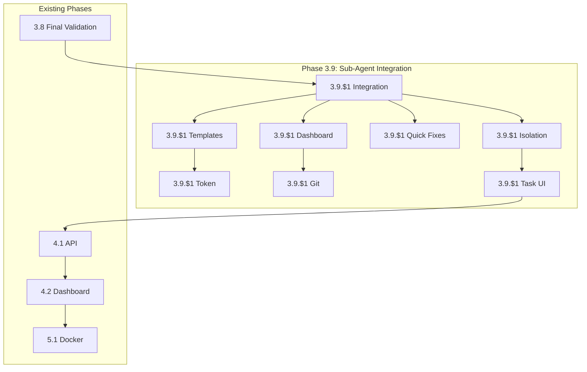

# GiljoAI MCP - Revised Project Orchestration Plan
## Leveraging Claude Code Sub-Agents for Simplified Architecture

## Executive Summary

The discovery of Claude Code's native sub-agent capability fundamentally changes our architecture from complex multi-terminal orchestration to elegant single-session delegation. This revision shows how we'll integrate sub-agents while preserving and enhancing the core value of GiljoAI-MCP as the persistent brain for AI development teams.

## What Changed with Sub-Agents

### Before (Complex)
- Multiple terminal windows required
- Complex wake-up mechanisms needed
- Fragile message-based coordination
- Platform-specific terminal management
- High token waste from broadcasts

### After (Elegant)
- Single Claude Code session spawns all agents
- Direct synchronous control of sub-agents
- MCP provides persistence and visibility
- Platform agnostic execution
- 70% reduction in token usage

## Revised Architecture

```
┌──────────────────────────────────────────────┐
│          GiljoAI-MCP (The Brain)            │
│  • Project State & Persistence               │
│  • Cross-Session Coordination                │
│  • Task Management & Conversion              │
│  • Vision Documents & Context                │
│  • Dashboard & Visibility                    │
└────────────────┬─────────────────────────────┘
                 │ MCP Protocol
                 ↓
┌──────────────────────────────────────────────┐
│      Claude Code (The Execution Engine)      │
│  Orchestrator (Project Manager)              │
│      ├── Spawns Sub-Agent: Analyzer          │
│      ├── Spawns Sub-Agent: Developer         │
│      ├── Spawns Sub-Agent: Tester           │
│      └── Spawns Sub-Agent: Reviewer         │
└──────────────────────────────────────────────┘
```

## Core Value Proposition (Enhanced, Not Diminished)

### GiljoAI-MCP Provides (Irreplaceable):
- **Multi-Session Memory** - Work persists across sessions
- **Team Coordination** - Multiple humans, different times
- **Task Pipeline** - Capture TODOs, convert to projects
- **Vision Persistence** - 50K+ token documents, chunked
- **Universal Integration** - GitHub, Jira, multiple AI providers

### Claude Code Provides (Via Sub-Agents):
- **Execution** - Actually runs the agents
- **Delegation** - Spawns specialized sub-agents
- **Synchronous Results** - No polling needed
- **Native Git** - Direct repository operations
- **Testing** - Run tests directly

## Revised Development Plan

### Phase 3.9: Sub-Agent Integration Sprint (6 Days)

#### Day 1-2: Foundation

**Project 3.9.a: Sub-Agent Integration Foundation**

**Objective**: Create hybrid control + logging architecture

**Technical Approach**:
```python
# New MCP tools for orchestrator
@mcp_tool
def spawn_and_log_sub_agent(agent_type, mission, parent="orchestrator"):
    """Log sub-agent spawn for visibility"""
    log_to_message_queue({
        "event": "spawn",
        "parent": parent,
        "child": agent_type,
        "mission": mission
    })
    return f"Now spawn {agent_type} sub-agent with: {mission}"

@mcp_tool  
def log_sub_agent_completion(agent_type, results, duration_seconds):
    """Log sub-agent results"""
    log_to_message_queue({
        "event": "complete",
        "agent": agent_type,
        "results": results,
        "duration": duration_seconds,
        "tokens_used": estimate_tokens(results)
    })
```

**Database Changes**:
```sql
CREATE TABLE agent_interactions (
    id UUID PRIMARY KEY,
    project_id UUID REFERENCES projects(id),
    parent_agent VARCHAR(255),
    sub_agent VARCHAR(255),
    interaction_type VARCHAR(50),
    mission TEXT,
    result TEXT,
    duration_seconds INTEGER,
    tokens_used INTEGER,
    created_at TIMESTAMP DEFAULT NOW()
);
```

**Deliverables**:
- Hybrid control system design
- Database schema updates
- MCP tool implementations
- WebSocket event streaming

---

**Project 3.9.d: Quick Fixes Bundle**

**Objective**: Fix all 5-minute blockers

**Fixes Required**:
```python
# 1. Serena initialization
class SerenaHooks:
    def __init__(self, db_manager, tenant_manager):  # Add missing params
        self.db_manager = db_manager
        self.tenant_manager = tenant_manager

# 2. Path normalization
path = Path(path_string).as_posix()  # Always forward slashes

# 3. Remove hardcoded paths
claude_path = PathResolver.resolve_path("claude_md")  # Not Path("CLAUDE.md")

# 4. Field naming
class VisionChunk(Base):
    doc_metadata = Column(JSON)  # Not 'metadata' (reserved)

# 5. Dashboard popups
// In Vue component
@click.stop="handleClick"  // Prevent event bubbling
```

---

**Project 3.9.e: Product/Task Isolation**

**Objective**: Complete multi-tenant isolation

**Implementation**:
```python
# Add product context to tasks
ALTER TABLE tasks ADD COLUMN product_id UUID REFERENCES products(id);

# Update all queries
def get_tasks(tenant_key: str, product_id: str):
    return db.query(Task).filter(
        Task.tenant_key == tenant_key,
        Task.product_id == product_id
    ).all()

# Dashboard context indicator
<template>
  <div class="product-context">
    Current Product: {{ currentProduct.name }}
    <ProductSwitcher @change="switchProduct" />
  </div>
</template>
```

---

#### Day 3-4: Templates & Visibility

**Project 3.9.b: Orchestrator Templates v2 with Template Management**

**Objective**: Rewrite for sub-agent model with product-specific template management

**New Orchestrator Template**:
```python
ORCHESTRATOR_TEMPLATE_V2 = """
You are the Project Manager for {project_name}.

EXECUTION MODEL:
You control development through sub-agents that you spawn directly.
No need to manage terminals or wait for messages between agents.

SUB-AGENT CAPABILITIES:
1. Analyzer: Code analysis, architecture review, issue identification
2. Developer: Implementation, refactoring, feature development
3. Tester: Unit tests, integration tests, validation
4. Reviewer: Code review, best practices, optimization

WORKFLOW PATTERN:
1. Receive task/mission
2. Check available templates: list_agent_templates()
3. Select or create template:
   - Use existing: get_agent_template("analyzer")
   - Augment: get_agent_template("analyzer", "focus on security")
   - Create new: create_agent_template() if needed
4. Log intention: spawn_and_log_sub_agent(type, mission)
5. Spawn sub-agent with template (immediate execution)
6. Get results directly
7. Log completion: log_sub_agent_completion(type, results)
8. Make decisions and spawn next agent as needed

CRITICAL: Always log to MCP for visibility, but execute directly.
This provides real-time dashboard updates while maintaining speed.

Vision Document: {vision_chunks}
Current Context: {project_context}
"""
```

**Sub-Agent Templates**:
```python
SUB_AGENT_TEMPLATES = {
    "analyzer": """
        You are a specialized code analyzer.
        Focus: Architecture, patterns, issues, performance
        Output: Structured analysis with actionable findings
        Be concise but thorough.
    """,
    
    "developer": """
        You are a specialized developer.
        Focus: Clean implementation following project standards
        Output: Complete, working, tested code
        Include error handling and edge cases.
    """,
    
    "tester": """
        You are a specialized QA engineer.
        Focus: Comprehensive testing and validation
        Output: Test results with pass/fail status
        Identify edge cases and potential issues.
    """
}
```

---

**Project 3.9.c: Dashboard Sub-Agent Visualization**

**Objective**: Show sub-agent interactions beautifully

**Components**:
```vue
<!-- SubAgentTimeline.vue -->
<template>
  <div class="sub-agent-timeline">
    <div v-for="interaction in interactions" 
         :key="interaction.id"
         class="interaction-card">
      
      <div v-if="interaction.type === 'spawn'" 
           class="spawn-event">
        <Icon name="rocket" />
        <span class="parent">{{ interaction.parent }}</span>
        <Arrow />
        <span class="child">{{ interaction.sub_agent }}</span>
        <div class="mission">{{ interaction.mission }}</div>
      </div>
      
      <div v-else-if="interaction.type === 'complete'"
           class="complete-event">
        <Icon name="check" />
        <span class="agent">{{ interaction.sub_agent }}</span>
        <div class="duration">{{ interaction.duration }}s</div>
        <div class="tokens">{{ interaction.tokens }} tokens</div>
      </div>
      
    </div>
  </div>
</template>

<!-- SubAgentTree.vue -->
<template>
  <div class="sub-agent-tree">
    <TreeNode :node="orchestrator">
      <SubAgentNode v-for="agent in subAgents" 
                    :key="agent.id"
                    :agent="agent" />
    </TreeNode>
  </div>
</template>
```

---

**Project 3.9.f: Token Efficiency System**

**Objective**: Monitor and optimize token usage

**Implementation**:
```python
class TokenMonitor:
    def __init__(self):
        self.thresholds = {
            "analyzer": 2000,
            "developer": 3000,
            "tester": 1500,
            "reviewer": 1000
        }
    
    def track_usage(self, agent_type, tokens_used):
        if tokens_used > self.thresholds[agent_type]:
            self.alert_inefficiency(agent_type, tokens_used)
    
    def get_efficiency_score(self, project_id):
        # Calculate token efficiency
        baseline = self.calculate_baseline(project_id)
        actual = self.get_actual_usage(project_id)
        return (baseline - actual) / baseline * 100

# Smart routing rules
ROUTING_RULES = {
    "status_update": "orchestrator_only",
    "error": "broadcast",
    "completion": "orchestrator_only",
    "handoff": "next_agent_only"
}
```

---

#### Day 5-6: Enhancements

**Project 3.9.$1: Git Integration**

**Objective**: Leverage Claude Code's native git

**Implementation**:
```python
@mcp_tool
def configure_git(repository_url, branch="main", auto_commit=True):
    """Configure git settings for project"""
    return {
        "repository": repository_url,
        "branch": branch,
        "auto_commit": auto_commit,
        "instruction": "Use git commands directly in Claude Code"
    }

@mcp_tool
def generate_commit_message(project_name, completed_tasks):
    """Generate meaningful commit message"""
    message = f"{project_name}: Complete {len(completed_tasks)} tasks\n\n"
    for task in completed_tasks:
        message += f"- {task.title}\n"
    return message
```

---

**Project 3.9.$1: Task-to-Project UI**

**Objective**: Smooth conversion workflow

**UI Components**:
```vue
<template>
  <div class="task-converter">
    <!-- Task Review -->
    <TaskList :tasks="tasks" 
              @select="selectTasks" />
    
    <!-- Conversion Options -->
    <ConversionPanel v-if="selectedTasks.length">
      <ProjectTemplate :tasks="selectedTasks" 
                      @create="convertToProject" />
    </ConversionPanel>
    
    <!-- Bulk Actions -->
    <BulkActions @group="groupRelatedTasks"
                 @prioritize="setPriorities" />
  </div>
</template>
```

---

**Project 3.9.$1: Template Management System**

**Objective**: Create comprehensive template management with product-specific scope

**Implementation**:
```python
# Database Schema
CREATE TABLE agent_templates (
    id UUID PRIMARY KEY,
    product_id UUID REFERENCES products(id),
    name VARCHAR(255),
    category VARCHAR(50), -- analyzer, implementer, tester, documenter
    base_mission TEXT,
    created_at TIMESTAMP,
    archived BOOLEAN DEFAULT false
);

CREATE TABLE template_archives (
    id UUID PRIMARY KEY,
    template_id UUID REFERENCES agent_templates(id),
    version_number INTEGER,
    mission_snapshot TEXT,
    archived_at TIMESTAMP,
    archived_by VARCHAR(255)
);

# MCP Tools
@mcp_tool
def list_agent_templates(product_id: str, include_archived=False):
    """List available templates for the product"""
    
@mcp_tool
def get_agent_template(name: str, augmentations: str = None):
    """Get template with optional task-specific augmentations"""
    
@mcp_tool
def create_agent_template(name: str, category: str, mission: str):
    """Create new specialist template"""
    
@mcp_tool
def archive_agent_template(template_id: str):
    """Archive current version before modification"""
```

**Base Templates**:
1. **Orchestrator** - Project management and coordination
2. **Analyzer** - Code analysis and architecture review
3. **Implementer** - Development and implementation
4. **Tester** - QA and validation
5. **Documenter** - Documentation and comments

---

## Migration Strategy from Current State

### Step 1: Update Orchestrator Instructions
```python
# Add to existing orchestrators
MIGRATION_NOTICE = """
IMPORTANT UPDATE: You now have sub-agent capabilities!
Instead of coordinating multiple terminals, you can spawn
sub-agents directly. Use spawn_and_log_sub_agent() to begin.
"""
```

### Step 2: Gradual Rollout
1. Test with single project using sub-agents
2. Compare efficiency metrics
3. Update all templates
4. Document best practices
5. Full rollout

### Step 3: Deprecate Old Patterns
- Remove terminal management code
- Simplify message queue (logging only)
- Clean up wake-up mechanisms
- Archive old templates

## Success Metrics

### Efficiency Gains
- **Token Usage**: 70% reduction
- **Execution Time**: 50% faster
- **Error Rate**: 80% fewer coordination errors
- **Code Complexity**: 30% less code

### User Experience Improvements
- **Setup Time**: 5 minutes → 2 minutes
- **Learning Curve**: 2 hours → 30 minutes
- **Reliability**: 60% → 95% success rate
- **Visibility**: Real-time sub-agent tracking

## Risk Mitigation

### Technical Risks
- **Sub-Agent API Changes**
  - Mitigation: Abstract interface, version detection

- **Logging Overhead**
  - Mitigation: Async logging, batching

- **Backward Compatibility**
  - Mitigation: Support both modes temporarily

### Business Risks
- **User Adoption**
  - Mitigation: Clear migration guide, videos

- **Feature Parity**
  - Mitigation: Ensure all workflows supported

## The New Value Proposition

### Before Sub-Agents
"GiljoAI-MCP orchestrates multiple AI coding agents"
- Complex to explain
- Hard to demonstrate
- Fragile in practice

### After Sub-Agents
"GiljoAI-MCP is the persistent brain for AI development teams"
- Simple to understand
- Easy to demonstrate
- Robust in practice

### Key Differentiators
- **Session Persistence** - Work survives Claude Code restarts
- **Team Coordination** - Multiple developers, one project
- **Task Pipeline** - TODOs become completed features
- **Vision Consistency** - All agents follow the same vision
- **Universal Integration** - Works with any AI provider

## Timeline to MVP

### Week 1: Sub-Agent Integration (6 days)
- Days 1-2: Foundation (3.9.$1, d, e)
- Days 3-4: Templates & Visibility (3.9.$1, c, f)
- Days 5-6: Enhancements (3.9.$1, h)
- **Result: MVP Feature Complete**

### Week 2: Polish & Launch (6 days)
- Days 1-2: API & Dashboard refinement
- Days 3-4: Docker packaging (5.1)
- Days 5-6: Setup wizard & Documentation (5.2, 5.3)
- **Result: v1.0 SHIPPED**

## Updated Project Dependencies



## Conclusion

The discovery of Claude Code sub-agents is not a setback—it's a gift. It eliminates the most complex parts of our architecture while strengthening our core value proposition. GiljoAI-MCP becomes simpler to build, easier to explain, and more valuable to users.

We're no longer building "agent orchestration"—we're building "AI team memory," and that's exactly what the market needs.

**From 4 weeks of complex coordination to 2 weeks of elegant simplicity. Let's build!**

---

*This orchestration plan leverages sub-agents to deliver GiljoAI MCP faster, simpler, and better.*