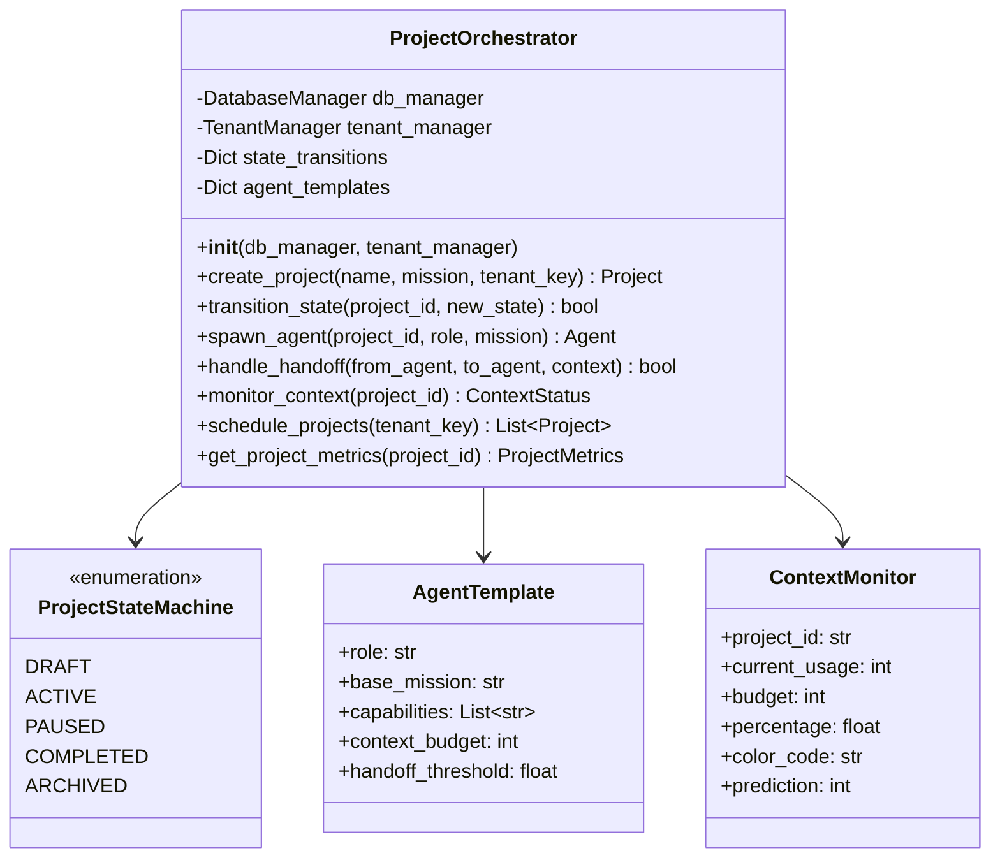
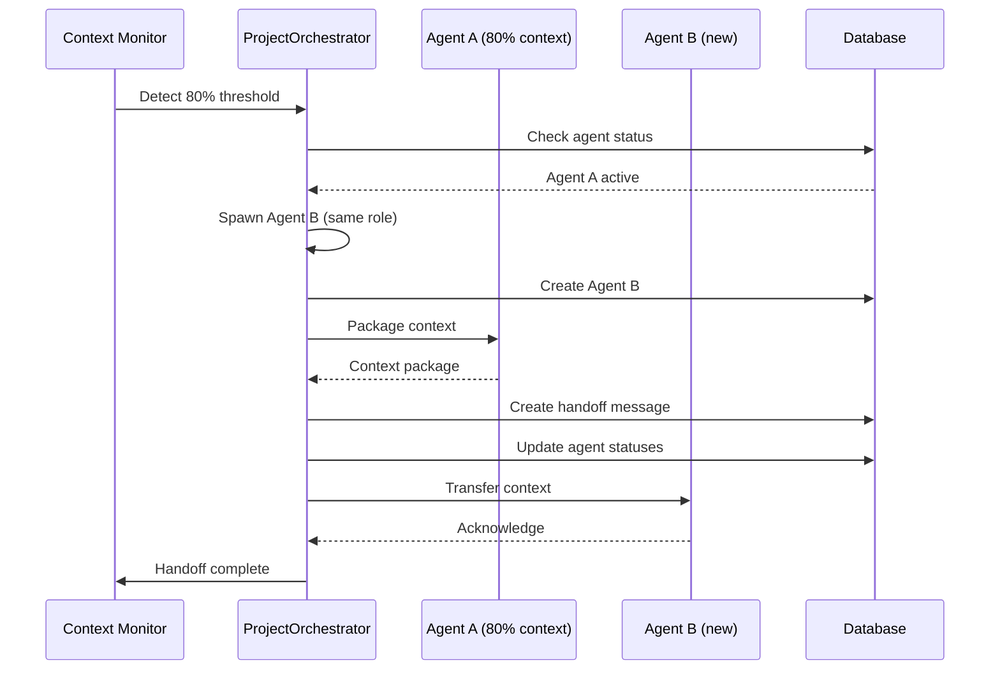

# Project 3.1: GiljoAI Orchestration Core - Design Document

## Executive Summary
This document provides a comprehensive design for implementing the GiljoAI Orchestration Core, including the ProjectOrchestrator class, enhanced agent spawning system, intelligent handoff mechanism, context visualization, and multi-project support.

## 1. Existing Pattern Analysis

### Current Tool Registration Pattern
All tools follow a consistent pattern:
```python
def register_*_tools(mcp: FastMCP, db_manager: DatabaseManager, tenant_manager: TenantManager):
    @mcp.tool()
    async def tool_name(...) -> Dict[str, Any]:
        async with db_manager.get_session() as session:
            # Tool logic
            return result
```

### Key Patterns Identified:
1. **Async/Await Throughout**: All database operations use async SQLAlchemy
2. **Session Management**: Context managers for database sessions
3. **Return Format**: Consistent Dict[str, Any] with success/error keys
4. **Tenant Isolation**: tenant_key checked in all operations
5. **Idempotent Operations**: ensure_* patterns for safe retries

## 2. ProjectOrchestrator Class Architecture

### Class Diagram


### Implementation File: `src/giljo_mcp/orchestrator.py`

```python
"""
GiljoAI Project Orchestrator
Central orchestration engine for project and agent lifecycle management
"""

import asyncio
import logging
from datetime import datetime, timedelta
from enum import Enum
from typing import Dict, List, Optional, Any, Tuple
from dataclasses import dataclass, field

from sqlalchemy import select, update, and_, or_
from sqlalchemy.ext.asyncio import AsyncSession

from .database import DatabaseManager
from .tenant import TenantManager
from .models import Project, Agent, Job, Task, Message

logger = logging.getLogger(__name__)

class ProjectState(Enum):
    """Project lifecycle states"""
    DRAFT = "draft"
    ACTIVE = "active"
    PAUSED = "paused"
    COMPLETED = "completed"
    ARCHIVED = "archived"

@dataclass
class AgentTemplate:
    """Template for agent creation with role-specific defaults"""
    role: str
    base_mission: str
    capabilities: List[str] = field(default_factory=list)
    context_budget_percentage: float = 0.2  # 20% of project budget
    handoff_threshold: float = 0.8  # 80% context usage
    priority: int = 1
    
@dataclass
class ContextStatus:
    """Real-time context usage status"""
    project_id: str
    current_usage: int
    budget: int
    percentage: float
    color_code: str  # green, yellow, red
    prediction: int  # Predicted tokens until limit
    agents_at_risk: List[str] = field(default_factory=list)
    
    @property
    def indicator(self) -> str:
        """Return color emoji indicator"""
        indicators = {
            "green": "🟢",
            "yellow": "🟡", 
            "red": "🔴"
        }
        return indicators.get(self.color_code, "⚪")

class ProjectOrchestrator:
    """
    Central orchestration engine for GiljoAI MCP
    Manages project lifecycle, agent spawning, handoffs, and context tracking
    """
    
    # State transition rules
    STATE_TRANSITIONS = {
        ProjectState.DRAFT: [ProjectState.ACTIVE, ProjectState.ARCHIVED],
        ProjectState.ACTIVE: [ProjectState.PAUSED, ProjectState.COMPLETED],
        ProjectState.PAUSED: [ProjectState.ACTIVE, ProjectState.ARCHIVED],
        ProjectState.COMPLETED: [ProjectState.ARCHIVED],
        ProjectState.ARCHIVED: []  # Terminal state
    }
    
    # Agent role templates
    AGENT_TEMPLATES = {
        "orchestrator": AgentTemplate(
            role="orchestrator",
            base_mission="Analyze project requirements, spawn appropriate agents, coordinate work, and ensure successful delivery",
            capabilities=["project_planning", "agent_spawning", "work_coordination", "progress_tracking"],
            context_budget_percentage=0.15,
            priority=10
        ),
        "analyzer": AgentTemplate(
            role="analyzer",
            base_mission="Analyze codebase, understand existing patterns, identify gaps, and provide architectural recommendations",
            capabilities=["code_analysis", "pattern_recognition", "gap_analysis", "architecture_design"],
            context_budget_percentage=0.20,
            priority=8
        ),
        "implementer": AgentTemplate(
            role="implementer",
            base_mission="Implement features according to specifications, following existing patterns and best practices",
            capabilities=["code_generation", "refactoring", "integration", "testing"],
            context_budget_percentage=0.30,
            priority=7
        ),
        "tester": AgentTemplate(
            role="tester",
            base_mission="Create and execute tests, validate implementations, ensure quality standards",
            capabilities=["test_creation", "test_execution", "validation", "quality_assurance"],
            context_budget_percentage=0.20,
            priority=6
        ),
        "reviewer": AgentTemplate(
            role="reviewer",
            base_mission="Review code changes, ensure standards compliance, provide feedback and improvements",
            capabilities=["code_review", "standards_compliance", "feedback", "optimization"],
            context_budget_percentage=0.15,
            priority=5
        )
    }
    
    def __init__(self, db_manager: DatabaseManager, tenant_manager: TenantManager):
        """Initialize orchestrator with database and tenant managers"""
        self.db_manager = db_manager
        self.tenant_manager = tenant_manager
        self._handoff_locks = {}  # Prevent concurrent handoffs
        self._monitoring_tasks = {}  # Background monitoring tasks
        
    async def transition_state(
        self, 
        project_id: str, 
        new_state: ProjectState,
        session: Optional[AsyncSession] = None
    ) -> Tuple[bool, str]:
        """
        Transition project to new state with validation
        
        Returns:
            Tuple of (success, message)
        """
        async def _transition(session: AsyncSession):
            # Get current project state
            project = await session.get(Project, project_id)
            if not project:
                return False, f"Project {project_id} not found"
            
            current_state = ProjectState(project.status)
            
            # Validate transition
            if new_state not in self.STATE_TRANSITIONS.get(current_state, []):
                return False, f"Invalid transition: {current_state.value} → {new_state.value}"
            
            # Update project state
            project.status = new_state.value
            project.updated_at = datetime.utcnow()
            
            if new_state == ProjectState.COMPLETED:
                project.completed_at = datetime.utcnow()
            
            # Handle state-specific actions
            if new_state == ProjectState.ACTIVE:
                await self._activate_project(project, session)
            elif new_state == ProjectState.PAUSED:
                await self._pause_project(project, session)
            elif new_state == ProjectState.ARCHIVED:
                await self._archive_project(project, session)
            
            await session.commit()
            
            logger.info(f"Project {project_id} transitioned: {current_state.value} → {new_state.value}")
            return True, f"Successfully transitioned to {new_state.value}"
        
        if session:
            return await _transition(session)
        else:
            async with self.db_manager.get_session() as session:
                return await _transition(session)
    
    async def spawn_agent(
        self,
        project_id: str,
        role: str,
        custom_mission: Optional[str] = None,
        session: Optional[AsyncSession] = None
    ) -> Agent:
        """
        Spawn an agent with role-based template
        
        Args:
            project_id: Project UUID
            role: Agent role (must be in templates)
            custom_mission: Override template mission
            session: Optional database session
            
        Returns:
            Created Agent instance
        """
        async def _spawn(session: AsyncSession):
            # Get template
            template = self.AGENT_TEMPLATES.get(role)
            if not template:
                raise ValueError(f"Unknown agent role: {role}")
            
            # Get project for context budget
            project = await session.get(Project, project_id)
            if not project:
                raise ValueError(f"Project {project_id} not found")
            
            # Calculate agent's context budget
            agent_budget = int(project.context_budget * template.context_budget_percentage)
            
            # Check for existing agent
            existing = await session.execute(
                select(Agent).where(
                    and_(
                        Agent.project_id == project_id,
                        Agent.name == role
                    )
                )
            )
            if existing.scalar_one_or_none():
                logger.warning(f"Agent {role} already exists in project {project_id}")
                return existing.scalar_one()
            
            # Create agent
            agent = Agent(
                project_id=project_id,
                tenant_key=project.tenant_key,
                name=role,
                role=role,
                status="idle",
                mission=custom_mission or template.base_mission,
                context_used=0,
                meta_data={
                    "capabilities": template.capabilities,
                    "context_budget": agent_budget,
                    "handoff_threshold": template.handoff_threshold,
                    "priority": template.priority,
                    "spawned_at": datetime.utcnow().isoformat()
                }
            )
            
            session.add(agent)
            await session.commit()
            
            logger.info(f"Spawned {role} agent for project {project_id}")
            return agent
        
        if session:
            return await _spawn(session)
        else:
            async with self.db_manager.get_session() as session:
                return await _spawn(session)
    
    async def handle_handoff(
        self,
        from_agent_id: str,
        to_agent_id: str,
        context: Dict[str, Any],
        session: Optional[AsyncSession] = None
    ) -> bool:
        """
        Intelligent handoff with context packaging and validation
        
        Args:
            from_agent_id: Source agent UUID
            to_agent_id: Target agent UUID
            context: Context to transfer
            session: Optional database session
            
        Returns:
            Success status
        """
        async def _handoff(session: AsyncSession):
            # Prevent concurrent handoffs
            lock_key = f"{from_agent_id}:{to_agent_id}"
            if lock_key in self._handoff_locks:
                logger.warning(f"Handoff already in progress: {lock_key}")
                return False
            
            self._handoff_locks[lock_key] = True
            try:
                # Get both agents
                from_agent = await session.get(Agent, from_agent_id)
                to_agent = await session.get(Agent, to_agent_id)
                
                if not from_agent or not to_agent:
                    return False
                
                # Package context intelligently
                packaged_context = await self._package_context(
                    from_agent, 
                    to_agent, 
                    context,
                    session
                )
                
                # Create handoff message
                message = Message(
                    project_id=from_agent.project_id,
                    from_agent=from_agent.name,
                    to_agent=to_agent.name,
                    type="handoff",
                    content=json.dumps(packaged_context),
                    priority="high",
                    status="pending"
                )
                session.add(message)
                
                # Update agent statuses
                from_agent.status = "idle"
                to_agent.status = "active"
                to_agent.last_active = datetime.utcnow()
                
                # Transfer context budget
                context_transfer = from_agent.context_used
                to_agent.meta_data = to_agent.meta_data or {}
                to_agent.meta_data["inherited_context"] = context_transfer
                
                await session.commit()
                return True
                
            finally:
                del self._handoff_locks[lock_key]
        
        if session:
            return await _handoff(session)
        else:
            async with self.db_manager.get_session() as session:
                return await _handoff(session)
    
    async def monitor_context(
        self,
        project_id: str,
        session: Optional[AsyncSession] = None
    ) -> ContextStatus:
        """
        Monitor project and agent context usage
        
        Returns:
            ContextStatus with color-coded indicators
        """
        async def _monitor(session: AsyncSession):
            # Get project
            project = await session.get(Project, project_id)
            if not project:
                raise ValueError(f"Project {project_id} not found")
            
            # Get all active agents
            agents_result = await session.execute(
                select(Agent).where(
                    and_(
                        Agent.project_id == project_id,
                        Agent.status.in_(["active", "working"])
                    )
                )
            )
            agents = agents_result.scalars().all()
            
            # Calculate total usage
            total_usage = sum(agent.context_used for agent in agents)
            percentage = (total_usage / project.context_budget) * 100 if project.context_budget > 0 else 0
            
            # Determine color code
            if percentage < 50:
                color_code = "green"
            elif percentage < 80:
                color_code = "yellow"
            else:
                color_code = "red"
            
            # Find agents at risk (> 70% of their budget)
            agents_at_risk = []
            for agent in agents:
                agent_budget = agent.meta_data.get("context_budget", project.context_budget * 0.2)
                agent_percentage = (agent.context_used / agent_budget) * 100 if agent_budget > 0 else 0
                if agent_percentage > 70:
                    agents_at_risk.append(agent.name)
            
            # Predict remaining tokens (simple linear prediction)
            recent_rate = await self._calculate_usage_rate(project_id, session)
            prediction = int((project.context_budget - total_usage) / recent_rate) if recent_rate > 0 else project.context_budget - total_usage
            
            return ContextStatus(
                project_id=project_id,
                current_usage=total_usage,
                budget=project.context_budget,
                percentage=percentage,
                color_code=color_code,
                prediction=prediction,
                agents_at_risk=agents_at_risk
            )
        
        if session:
            return await _monitor(session)
        else:
            async with self.db_manager.get_session() as session:
                return await _monitor(session)
    
    async def schedule_projects(
        self,
        tenant_key: str,
        max_concurrent: int = 5,
        session: Optional[AsyncSession] = None
    ) -> List[Project]:
        """
        Schedule and prioritize projects for a tenant
        
        Args:
            tenant_key: Tenant identifier
            max_concurrent: Maximum concurrent active projects
            session: Optional database session
            
        Returns:
            List of scheduled projects
        """
        async def _schedule(session: AsyncSession):
            # Get all non-archived projects for tenant
            projects_result = await session.execute(
                select(Project).where(
                    and_(
                        Project.tenant_key == tenant_key,
                        Project.status != ProjectState.ARCHIVED.value
                    )
                ).order_by(Project.created_at)
            )
            projects = projects_result.scalars().all()
            
            # Count active projects
            active_count = sum(1 for p in projects if p.status == ProjectState.ACTIVE.value)
            
            # Schedule paused projects if under limit
            scheduled = []
            if active_count < max_concurrent:
                for project in projects:
                    if project.status == ProjectState.PAUSED.value:
                        success, _ = await self.transition_state(
                            project.id,
                            ProjectState.ACTIVE,
                            session
                        )
                        if success:
                            scheduled.append(project)
                            active_count += 1
                            if active_count >= max_concurrent:
                                break
            
            return scheduled
        
        if session:
            return await _schedule(session)
        else:
            async with self.db_manager.get_session() as session:
                return await _schedule(session)
    
    async def start_monitoring(self, project_id: str):
        """Start background context monitoring for a project"""
        if project_id in self._monitoring_tasks:
            return
        
        async def monitor_loop():
            while project_id in self._monitoring_tasks:
                try:
                    status = await self.monitor_context(project_id)
                    
                    # Check for handoff triggers
                    if status.percentage > 80:
                        await self._trigger_handoffs(project_id, status)
                    
                    # Wait before next check
                    await asyncio.sleep(30)  # Check every 30 seconds
                    
                except Exception as e:
                    logger.error(f"Monitoring error for project {project_id}: {e}")
                    await asyncio.sleep(60)
        
        task = asyncio.create_task(monitor_loop())
        self._monitoring_tasks[project_id] = task
    
    async def stop_monitoring(self, project_id: str):
        """Stop background monitoring for a project"""
        if project_id in self._monitoring_tasks:
            self._monitoring_tasks[project_id].cancel()
            del self._monitoring_tasks[project_id]
    
    # Private helper methods
    
    async def _activate_project(self, project: Project, session: AsyncSession):
        """Handle project activation"""
        # Start monitoring
        await self.start_monitoring(project.id)
        
        # Spawn orchestrator if not exists
        orchestrator = await session.execute(
            select(Agent).where(
                and_(
                    Agent.project_id == project.id,
                    Agent.role == "orchestrator"
                )
            )
        )
        if not orchestrator.scalar_one_or_none():
            await self.spawn_agent(project.id, "orchestrator", session=session)
    
    async def _pause_project(self, project: Project, session: AsyncSession):
        """Handle project pausing"""
        # Stop monitoring
        await self.stop_monitoring(project.id)
        
        # Pause all agents
        await session.execute(
            update(Agent)
            .where(Agent.project_id == project.id)
            .values(status="paused")
        )
    
    async def _archive_project(self, project: Project, session: AsyncSession):
        """Handle project archival"""
        # Stop monitoring
        await self.stop_monitoring(project.id)
        
        # Decommission all agents
        await session.execute(
            update(Agent)
            .where(Agent.project_id == project.id)
            .values(
                status="decommissioned",
                decommissioned_at=datetime.utcnow()
            )
        )
    
    async def _package_context(
        self,
        from_agent: Agent,
        to_agent: Agent,
        raw_context: Dict[str, Any],
        session: AsyncSession
    ) -> Dict[str, Any]:
        """Package context intelligently for handoff"""
        # Get recent messages
        messages_result = await session.execute(
            select(Message)
            .where(
                or_(
                    Message.from_agent == from_agent.name,
                    Message.to_agent == from_agent.name
                )
            )
            .order_by(Message.created_at.desc())
            .limit(10)
        )
        recent_messages = messages_result.scalars().all()
        
        # Get active jobs
        jobs_result = await session.execute(
            select(Job)
            .where(
                and_(
                    Job.agent_id == from_agent.id,
                    Job.status == "active"
                )
            )
        )
        active_jobs = jobs_result.scalars().all()
        
        return {
            "handoff_reason": raw_context.get("reason", "context_limit"),
            "from_agent": {
                "name": from_agent.name,
                "role": from_agent.role,
                "context_used": from_agent.context_used,
                "mission": from_agent.mission
            },
            "to_agent": {
                "name": to_agent.name,
                "role": to_agent.role
            },
            "work_context": raw_context,
            "recent_messages": [
                {
                    "from": msg.from_agent,
                    "to": msg.to_agent,
                    "type": msg.type,
                    "subject": msg.subject
                }
                for msg in recent_messages
            ],
            "active_jobs": [
                {
                    "type": job.type,
                    "scope": job.scope_boundary,
                    "vision": job.vision_alignment
                }
                for job in active_jobs
            ],
            "timestamp": datetime.utcnow().isoformat()
        }
    
    async def _calculate_usage_rate(
        self,
        project_id: str,
        session: AsyncSession,
        window_minutes: int = 30
    ) -> float:
        """Calculate recent context usage rate"""
        since = datetime.utcnow() - timedelta(minutes=window_minutes)
        
        # This would need a context_history table to track properly
        # For now, return a simple estimate
        project = await session.get(Project, project_id)
        if project and project.created_at:
            age_minutes = (datetime.utcnow() - project.created_at).total_seconds() / 60
            if age_minutes > 0:
                return project.context_used / age_minutes
        
        return 100  # Default rate
    
    async def _trigger_handoffs(self, project_id: str, status: ContextStatus):
        """Trigger automatic handoffs for agents at risk"""
        async with self.db_manager.get_session() as session:
            for agent_name in status.agents_at_risk:
                # Find agent
                agent_result = await session.execute(
                    select(Agent).where(
                        and_(
                            Agent.project_id == project_id,
                            Agent.name == agent_name
                        )
                    )
                )
                agent = agent_result.scalar_one_or_none()
                
                if agent and agent.status == "active":
                    # Find a replacement agent of same role
                    replacement = await self.spawn_agent(
                        project_id,
                        agent.role,
                        f"{agent.mission} (Handoff from {agent.name})",
                        session
                    )
                    
                    # Trigger handoff
                    await self.handle_handoff(
                        agent.id,
                        replacement.id,
                        {"reason": "context_limit_approaching"},
                        session
                    )
                    
                    logger.info(f"Auto-handoff triggered: {agent.name} → {replacement.name}")
```

## 3. Agent Spawning Templates

### Template Configuration
```python
# Agent capability matrix
CAPABILITY_MATRIX = {
    "orchestrator": {
        "can_spawn_agents": True,
        "can_assign_jobs": True,
        "can_monitor_progress": True,
        "can_trigger_handoffs": True,
        "max_concurrent_agents": 5
    },
    "analyzer": {
        "can_read_code": True,
        "can_analyze_patterns": True,
        "can_generate_reports": True,
        "can_recommend_architecture": True,
        "max_files_per_analysis": 50
    },
    "implementer": {
        "can_write_code": True,
        "can_refactor": True,
        "can_integrate": True,
        "can_run_tests": True,
        "max_files_per_change": 20
    },
    "tester": {
        "can_create_tests": True,
        "can_execute_tests": True,
        "can_validate": True,
        "can_report_coverage": True,
        "test_frameworks": ["pytest", "unittest", "jest", "mocha"]
    },
    "reviewer": {
        "can_review_code": True,
        "can_check_standards": True,
        "can_suggest_improvements": True,
        "can_approve_changes": True,
        "review_depth": "comprehensive"
    }
}

# Pipeline configurations
AGENT_PIPELINES = {
    "standard": ["orchestrator", "analyzer", "implementer", "tester", "reviewer"],
    "quick": ["orchestrator", "implementer", "tester"],
    "analysis": ["orchestrator", "analyzer"],
    "hotfix": ["implementer", "tester"],
    "review": ["analyzer", "reviewer"]
}
```

## 4. Handoff Triggers and Context Transfer

### Sequence Diagram


### Handoff Context Package Structure
```python
@dataclass
class HandoffPackage:
    """Structured handoff context"""
    # Metadata
    handoff_id: str
    timestamp: datetime
    reason: str  # "context_limit", "task_complete", "error", "manual"
    
    # Source agent info
    from_agent: Dict[str, Any]
    work_completed: List[str]
    pending_tasks: List[str]
    
    # Context data
    important_findings: List[str]
    code_changes: List[Dict[str, str]]
    open_issues: List[str]
    
    # Recommendations
    next_steps: List[str]
    warnings: List[str]
    
    # Validation
    checksum: str  # For integrity
    rollback_point: Optional[str]  # For rollback capability
```

## 5. Context Visualization System

### API Endpoints
```python
# Context monitoring endpoints
@app.get("/api/projects/{project_id}/context")
async def get_context_status(project_id: str) -> ContextStatus:
    """Get real-time context status with color coding"""
    
@app.websocket("/ws/projects/{project_id}/context")
async def context_stream(websocket: WebSocket, project_id: str):
    """WebSocket stream for real-time context updates"""
    
@app.get("/api/projects/{project_id}/context/history")
async def get_context_history(
    project_id: str,
    start: datetime,
    end: datetime
) -> List[ContextSnapshot]:
    """Get historical context usage data"""
```

### Frontend Component (Vue 3)
```vue
<template>
  <div class="context-monitor">
    <div class="context-bar" :class="contextStatus.color_code">
      <div class="usage-fill" :style="{width: percentage + '%'}">
        {{ contextStatus.indicator }} {{ percentage.toFixed(1) }}%
      </div>
    </div>
    
    <div class="context-details">
      <span class="usage">{{ currentUsage }} / {{ budget }} tokens</span>
      <span class="prediction">~{{ prediction }} remaining</span>
    </div>
    
    <div v-if="agentsAtRisk.length > 0" class="risk-alert">
      <v-icon>mdi-alert</v-icon>
      Agents at risk: {{ agentsAtRisk.join(', ') }}
    </div>
  </div>
</template>

<script setup>
import { ref, computed, onMounted, onUnmounted } from 'vue'
import { useWebSocket } from '@/composables/websocket'

const props = defineProps(['projectId'])

const contextStatus = ref({
  current_usage: 0,
  budget: 150000,
  percentage: 0,
  color_code: 'green',
  prediction: 150000,
  agents_at_risk: []
})

const { connect, disconnect } = useWebSocket(
  `/ws/projects/${props.projectId}/context`,
  (data) => {
    contextStatus.value = data
  }
)

const percentage = computed(() => contextStatus.value.percentage)
const currentUsage = computed(() => contextStatus.value.current_usage.toLocaleString())
const budget = computed(() => contextStatus.value.budget.toLocaleString())
const prediction = computed(() => contextStatus.value.prediction.toLocaleString())
const agentsAtRisk = computed(() => contextStatus.value.agents_at_risk)

onMounted(() => connect())
onUnmounted(() => disconnect())
</script>

<style scoped>
.context-bar {
  height: 30px;
  background: #f0f0f0;
  border-radius: 15px;
  overflow: hidden;
  position: relative;
}

.usage-fill {
  height: 100%;
  display: flex;
  align-items: center;
  padding: 0 15px;
  color: white;
  font-weight: bold;
  transition: width 0.3s ease;
}

.context-bar.green .usage-fill { background: #4caf50; }
.context-bar.yellow .usage-fill { background: #ff9800; }
.context-bar.red .usage-fill { background: #f44336; }

.risk-alert {
  margin-top: 10px;
  padding: 10px;
  background: #fff3e0;
  border-left: 4px solid #ff9800;
}
</style>
```

## 6. Multi-Project Support Architecture

### Database Schema Additions
```sql
-- Project scheduling table
CREATE TABLE project_schedules (
    id UUID PRIMARY KEY DEFAULT gen_random_uuid(),
    tenant_key UUID NOT NULL,
    project_id UUID REFERENCES projects(id),
    priority INTEGER DEFAULT 1,
    scheduled_start TIMESTAMP,
    scheduled_end TIMESTAMP,
    actual_start TIMESTAMP,
    actual_end TIMESTAMP,
    status VARCHAR(50),
    created_at TIMESTAMP DEFAULT CURRENT_TIMESTAMP,
    INDEX idx_schedule_tenant (tenant_key),
    INDEX idx_schedule_status (status)
);

-- Resource allocation table
CREATE TABLE resource_allocations (
    id UUID PRIMARY KEY DEFAULT gen_random_uuid(),
    tenant_key UUID NOT NULL,
    project_id UUID REFERENCES projects(id),
    resource_type VARCHAR(50), -- 'context', 'agents', 'compute'
    allocated_amount INTEGER,
    used_amount INTEGER DEFAULT 0,
    created_at TIMESTAMP DEFAULT CURRENT_TIMESTAMP,
    updated_at TIMESTAMP,
    INDEX idx_allocation_tenant (tenant_key),
    INDEX idx_allocation_project (project_id)
);
```

### Concurrent Project Manager
```python
class ConcurrentProjectManager:
    """Manages multiple concurrent projects per tenant"""
    
    def __init__(self, orchestrator: ProjectOrchestrator):
        self.orchestrator = orchestrator
        self.project_pools: Dict[str, List[str]] = {}  # tenant_key -> project_ids
        self.resource_limits = {
            "max_concurrent": 5,
            "max_agents_per_tenant": 20,
            "max_context_per_tenant": 1000000
        }
    
    async def can_activate_project(
        self,
        tenant_key: str,
        project_id: str
    ) -> Tuple[bool, str]:
        """Check if project can be activated within limits"""
        
    async def allocate_resources(
        self,
        project_id: str,
        context_budget: int,
        agent_count: int
    ) -> bool:
        """Allocate resources to project"""
        
    async def balance_resources(self, tenant_key: str):
        """Rebalance resources across active projects"""
        
    async def priority_schedule(
        self,
        tenant_key: str
    ) -> List[str]:
        """Return prioritized project execution order"""
```

## 7. Integration with Existing Tools

### Registration Function
```python
# src/giljo_mcp/tools/orchestrator.py

def register_orchestrator_tools(
    mcp: FastMCP,
    db_manager: DatabaseManager,
    tenant_manager: TenantManager
):
    """Register orchestrator tools with MCP server"""
    
    orchestrator = ProjectOrchestrator(db_manager, tenant_manager)
    project_manager = ConcurrentProjectManager(orchestrator)
    
    @mcp.tool()
    async def orchestrate_project(
        project_id: str,
        action: str,  # "start", "pause", "resume", "complete"
        **kwargs
    ) -> Dict[str, Any]:
        """Main orchestration control"""
        
    @mcp.tool()
    async def spawn_agent_pipeline(
        project_id: str,
        pipeline: str = "standard"
    ) -> Dict[str, Any]:
        """Spawn a pipeline of agents"""
        
    @mcp.tool()
    async def get_context_dashboard(
        project_id: str
    ) -> Dict[str, Any]:
        """Get context usage dashboard data"""
        
    @mcp.tool()
    async def trigger_handoff(
        from_agent: str,
        to_agent: str,
        project_id: str
    ) -> Dict[str, Any]:
        """Manually trigger agent handoff"""
        
    @mcp.tool()
    async def manage_concurrent_projects(
        tenant_key: str,
        action: str  # "list", "schedule", "balance"
    ) -> Dict[str, Any]:
        """Manage multiple concurrent projects"""
```

## 8. Testing Strategy

### Unit Tests
```python
# tests/test_orchestrator.py

import pytest
from src.giljo_mcp.orchestrator import (
    ProjectOrchestrator,
    ProjectState,
    AgentTemplate,
    ContextStatus
)

@pytest.mark.asyncio
async def test_state_transitions():
    """Test valid and invalid state transitions"""
    
@pytest.mark.asyncio
async def test_agent_spawning():
    """Test agent creation with templates"""
    
@pytest.mark.asyncio
async def test_handoff_mechanism():
    """Test context handoff between agents"""
    
@pytest.mark.asyncio
async def test_context_monitoring():
    """Test context usage monitoring and alerts"""
    
@pytest.mark.asyncio
async def test_concurrent_projects():
    """Test multiple project management"""
```

## 9. Implementation Phases

### Phase 1: Core Orchestrator (Days 1-2)
- [ ] Create orchestrator.py with ProjectOrchestrator class
- [ ] Implement state machine
- [ ] Add basic lifecycle methods
- [ ] Write unit tests

### Phase 2: Agent Templates (Day 3)
- [ ] Define all agent templates
- [ ] Implement spawn_agent with templates
- [ ] Create capability matrix
- [ ] Test agent creation

### Phase 3: Handoff System (Days 4-5)
- [ ] Implement handoff mechanism
- [ ] Add context packaging
- [ ] Create monitoring triggers
- [ ] Test handoff scenarios

### Phase 4: Context Visualization (Day 6)
- [ ] Add monitoring methods
- [ ] Create API endpoints
- [ ] Build Vue components
- [ ] Test real-time updates

### Phase 5: Multi-Project (Day 7)
- [ ] Implement project scheduling
- [ ] Add resource allocation
- [ ] Create balancing logic
- [ ] Test concurrent projects

## 10. Success Metrics

1. **State Machine**: All transitions working correctly
2. **Agent Spawning**: Templates create agents with proper missions
3. **Handoffs**: Trigger at 80% threshold automatically
4. **Context Tracking**: Accurate within 5% margin
5. **Concurrency**: Support 5+ projects per tenant

## Conclusion

This design document provides a comprehensive blueprint for implementing the GiljoAI Orchestration Core. The architecture builds upon existing patterns while adding sophisticated orchestration capabilities. The phased implementation approach ensures systematic development with clear milestones.

The implementer should follow this design closely, referring to existing code patterns in the tools directory and maintaining consistency with the established async/await patterns and database-first philosophy.