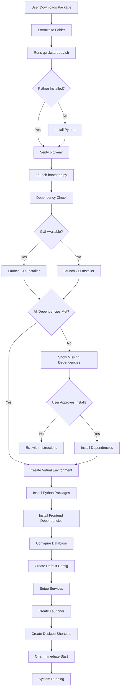

# DevLog: Advanced Installation System Implementation Plan

**Date**: January 19, 2025
**Branch**: Laptop
**Project Phase**: Post-5.4.4 Enhancement - Advanced Installer
**Status**: 📋 Planning Phase

## Executive Vision

Transform the GiljoAI MCP installation experience from a basic script-based process to a professional, intelligent installation system that detects dependencies, offers automated installation, provides GUI/CLI options, and creates a seamless user experience from download to first run.

## Problem Statement

### Current Limitations
1. **No dependency detection** - Assumes Python/Node.js are installed
2. **No automated dependency installation** - Users must manually install prerequisites
3. **Single mode** - CLI only, no GUI option despite having `setup_gui.py`
4. **No post-install launcher** - Users must run commands manually
5. **No service management** - Manual startup required
6. **No Docker integration** - Docker setup is separate
7. **Basic configuration** - No wizard or guided setup

### User Experience Goals
- **Zero-friction installation** - Download, extract, run
- **Intelligent detection** - Automatically detect missing dependencies
- **Automated installation** - Offer to install all requirements
- **Professional interface** - GUI when possible, clean CLI fallback
- **Complete setup** - From download to running system
- **Desktop integration** - Shortcuts, launchers, system tray

## Proposed Solution Architecture

### Installation Flow Diagram (UPDATED)



## Technical Design

### Phase 0: Quickstart Scripts (NEW - CRITICAL)

#### `quickstart.bat` / `quickstart.sh` - TRUE Entry Points
```
CRITICAL: These are the ONLY files that can assume NOTHING except OS shell
- Written in native shell script (Batch/Bash)
- NO Python dependency
- NO external tools required
- Must handle Python installation FIRST
```

**Responsibilities**:
1. Check if Python exists
2. If not, offer to install it (multiple methods)
3. Verify pip and venv are available
4. Only then launch bootstrap.py

This is the most critical layer - without Python, nothing else can run!

### Phase 1: Bootstrap System

#### `bootstrap.py` - Universal Entry Point
```python
# Lightweight, no external dependencies
# Python 3.8+ compatible
class Bootstrap:
    - detect_os()
    - detect_gui_capability()
    - check_python_version()
    - launch_appropriate_installer()
```

**Key Features**:
- Zero dependencies (uses only stdlib)
- OS detection (Windows/Mac/Linux)
- GUI capability detection
- Python version validation
- Installer selection logic

### Phase 2: Dependency Detection System

#### `installers/dependency_checker.py`
```python
class DependencyChecker:
    - check_python() -> (version, path, status)
    - check_nodejs() -> (version, path, status)
    - check_docker() -> (version, status, compose_version)
    - check_postgresql() -> (version, status)
    - check_ports() -> [(port, status, process)]
    - generate_report() -> DependencyReport
```

**Dependencies to Check**:
1. **Required**:
   - Python 3.11+ 
   - pip/venv
   - 10GB disk space

2. **Recommended**:
   - Node.js 18+ (for frontend)
   - npm/yarn
   - Git (for updates)

3. **Optional**:
   - Docker + Docker Compose
   - PostgreSQL 14+
   - Redis

### Phase 3: Dependency Installation System

#### `installers/dependency_installer.py`
```python
class DependencyInstaller:
    - install_python_packages()
    - install_nodejs() -> platform specific
    - install_docker() -> platform specific
    - configure_postgresql()
    - setup_redis()
```

**Platform-Specific Installers**:
- **Windows**: 
  - Use `winget` if available
  - Fallback to downloading installers
  - PowerShell scripts for setup

- **Mac**:
  - Use `brew` if available
  - Fallback to downloading .pkg files
  - Shell scripts for setup

- **Linux**:
  - Detect package manager (apt/yum/dnf/pacman)
  - Use appropriate commands
  - Shell scripts for setup

### Phase 4: Installation Interface

#### CLI Installer (`installers/cli_installer.py`)
```python
class CLIInstaller:
    - show_welcome()
    - display_dependencies()
    - prompt_installation_options()
    - show_progress()
    - configure_system()
    - create_launcher()
```

**Features**:
- Rich terminal UI (using existing `rich` library)
- Progress bars for long operations
- Interactive prompts
- Color-coded status messages
- ASCII art logo

#### GUI Installer Enhancement
- Leverage existing `setup_gui.py`
- Add dependency checking page
- Add installation progress page
- Add launcher creation page

### Phase 5: Service Management

#### `installers/service_manager.py`
```python
class ServiceManager:
    - create_systemd_service()  # Linux
    - create_windows_service()   # Windows
    - create_launchd_plist()    # macOS
    - start_service()
    - stop_service()
    - enable_autostart()
```

### Phase 6: Post-Install Configuration

#### Launcher Creation (`installers/launcher_creator.py`)
```python
class LauncherCreator:
    - create_start_script()
    - create_stop_script()
    - create_desktop_shortcut()
    - create_start_menu_entry()
    - create_system_tray_app()
```

**Launcher Features**:
- Start/Stop all services
- Open web interface
- View logs
- Configuration editor
- Update checker

#### Default Configuration
```yaml
# config.yaml (auto-generated)
mode: quickstart
database:
  type: sqlite
  path: ./data/giljo.db

services:
  mcp_server: 
    enabled: true
    port: 6001
  api_server:
    enabled: true
    port: 6002
  frontend:
    enabled: true
    port: 6000

# Pre-configured agents
agents:
  - name: assistant
    role: general
    capabilities: [code, documentation]
  - name: analyzer  
    role: code_review
    capabilities: [analysis, testing]
```

## Implementation Phases

### Phase 0: Quickstart Scripts (PREREQUISITE - COMPLETED)
- [x] Create intelligent `quickstart.bat` for Windows
- [x] Create intelligent `quickstart.sh` for Mac/Linux
- [x] Handle Python installation/detection
- [x] Verify pip and venv availability
- [x] Launch bootstrap.py only after Python confirmed

### Phase 1: Foundation (Step 1 - COMPLETED)
- [ ] Create `bootstrap.py`
- [ ] Implement OS detection
- [ ] Implement GUI detection
- [ ] Create installer selection logic

### Phase 2: Dependency System (Step 2)
- [ ] Create dependency checker
- [ ] Implement version detection
- [ ] Create dependency report generator
- [ ] Test on all platforms

### Phase 3: Installers (Step 3)
- [ ] Enhance CLI installer
- [ ] Integrate with existing GUI
- [ ] Add progress tracking
- [ ] Implement rollback capability

### Phase 4: Dependency Installation (Step 4)
- [ ] Platform-specific installers
- [ ] Download management
- [ ] Installation verification
- [ ] Error recovery

### Phase 5: Service Setup (Step 5)
- [ ] Service file generation
- [ ] Auto-start configuration
- [ ] Service management commands
- [ ] Health checking

### Phase 6: Post-Install (Step 6)
- [ ] Launcher creation
- [ ] Desktop integration
- [ ] Default configuration
- [ ] First-run wizard

## File Structure

```
GiljoAI_MCP/
├── quickstart.bat           # CRITICAL: Windows entry (no deps)
├── quickstart.sh            # CRITICAL: Unix entry (no deps)
├── bootstrap.py              # Secondary: Python entry point
├── installers/               # New: Installation system
│   ├── __init__.py
│   ├── dependency_checker.py
│   ├── dependency_installer.py
│   ├── cli_installer.py
│   ├── gui_installer.py     # Wrapper for setup_gui.py
│   ├── service_manager.py
│   ├── launcher_creator.py
│   └── platform/            # Platform-specific code
│       ├── windows.py
│       ├── macos.py
│       └── linux.py
├── setup_gui.py             # Existing: GUI wizard
├── quickstart.bat           # Deprecated: Replaced by bootstrap
└── quickstart.sh            # Deprecated: Replaced by bootstrap
```

## Success Criteria

### Functional Requirements
- ✅ Single entry point (`bootstrap.py`)
- ✅ Automatic GUI/CLI detection
- ✅ Dependency detection and reporting
- ✅ Automated dependency installation
- ✅ Virtual environment setup
- ✅ Service configuration
- ✅ Desktop integration
- ✅ Default configuration

### Non-Functional Requirements
- ✅ <5 minute installation time
- ✅ Zero manual configuration for basic setup
- ✅ Professional appearance
- ✅ Clear error messages
- ✅ Rollback capability
- ✅ Update mechanism

### User Experience Goals
- ✅ Download → Extract → Run → Done
- ✅ No command line required (GUI mode)
- ✅ Clear progress indication
- ✅ Helpful error recovery
- ✅ Immediate usability

## Testing Strategy

### Unit Tests
- Dependency detection accuracy
- Platform detection
- Version parsing
- Configuration generation

### Integration Tests
- Full installation flow
- Service startup
- Database initialization
- Frontend accessibility

### Platform Tests
- Windows 10/11
- macOS 12+
- Ubuntu 22.04+
- CentOS/RHEL 8+

### User Acceptance Tests
- Non-technical user installation
- Recovery from errors
- Update process
- Uninstallation

## Risk Analysis

### Technical Risks
1. **Platform differences** - Mitigate with thorough testing
2. **Permission issues** - Provide clear admin/sudo instructions
3. **Network dependencies** - Implement offline mode
4. **Version conflicts** - Use virtual environments

### User Experience Risks
1. **Complexity** - Keep defaults simple
2. **Failure modes** - Provide clear recovery paths
3. **Documentation** - Embed help in installer

## Migration Path

### From Current System
1. Existing users run `bootstrap.py`
2. Detects existing installation
3. Offers to upgrade/migrate
4. Preserves configurations
5. Updates shortcuts/services

## Documentation Requirements

### User Documentation
- Quick start guide
- Installation troubleshooting
- Platform-specific guides
- FAQ section

### Developer Documentation
- Installer architecture
- Adding new dependencies
- Platform extension guide
- Testing procedures

## Metrics for Success

### Installation Metrics
- Time to first run: <5 minutes
- Success rate: >95%
- User interventions: <3
- Error recovery: 100%

### User Satisfaction
- Setup ease: 4.5/5
- Documentation clarity: 4.5/5
- Error handling: 4.5/5
- Overall experience: 4.5/5

## Next Steps

1. **Immediate**: Create `bootstrap.py` with basic detection
2. **Next**: Build dependency checker
3. **Then**: Enhance installers
4. **Finally**: Add service management and launchers

## Related Documents
- Original quickstart implementation
- Existing setup_gui.py
- Docker configuration
- Service architecture

---

**Status**: Ready for Implementation
**Priority**: High
**Estimated Effort**: 40-60 hours
**Impact**: Transforms user onboarding experience
