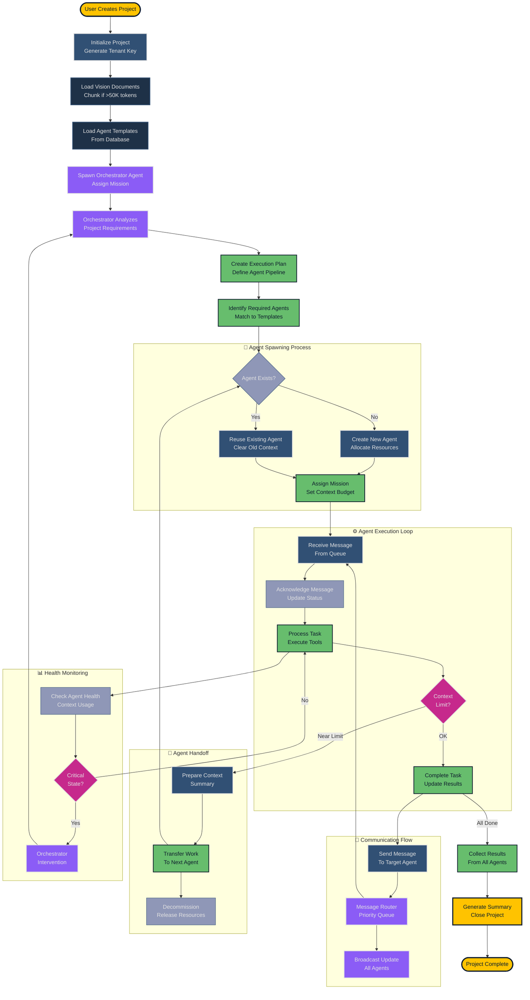
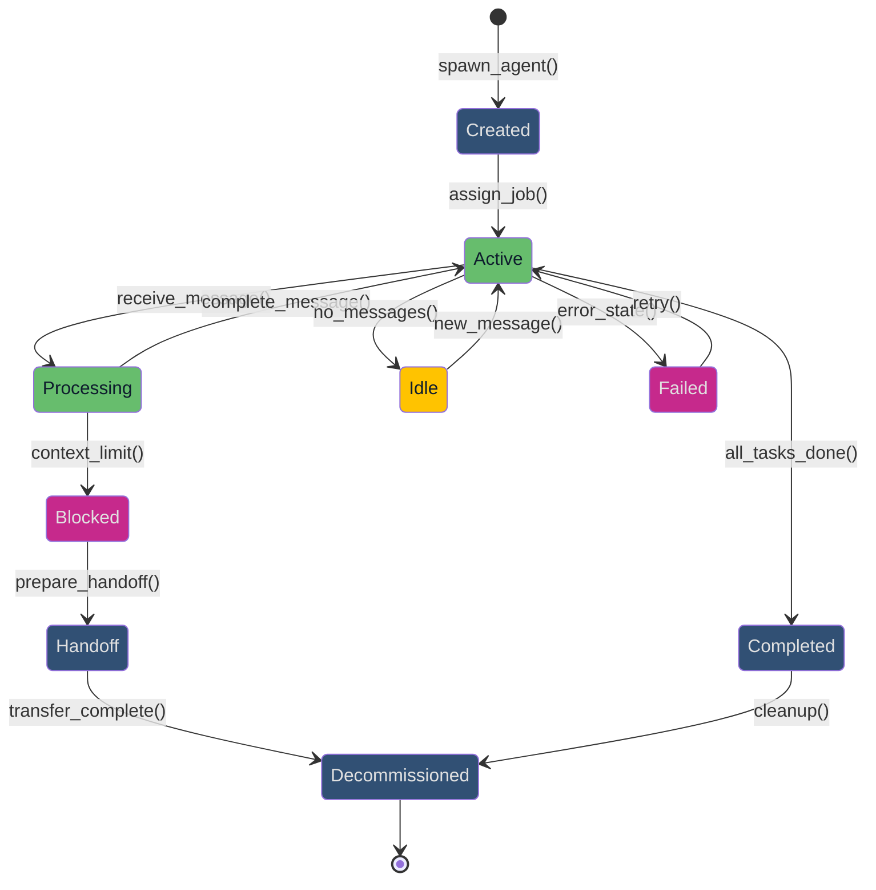
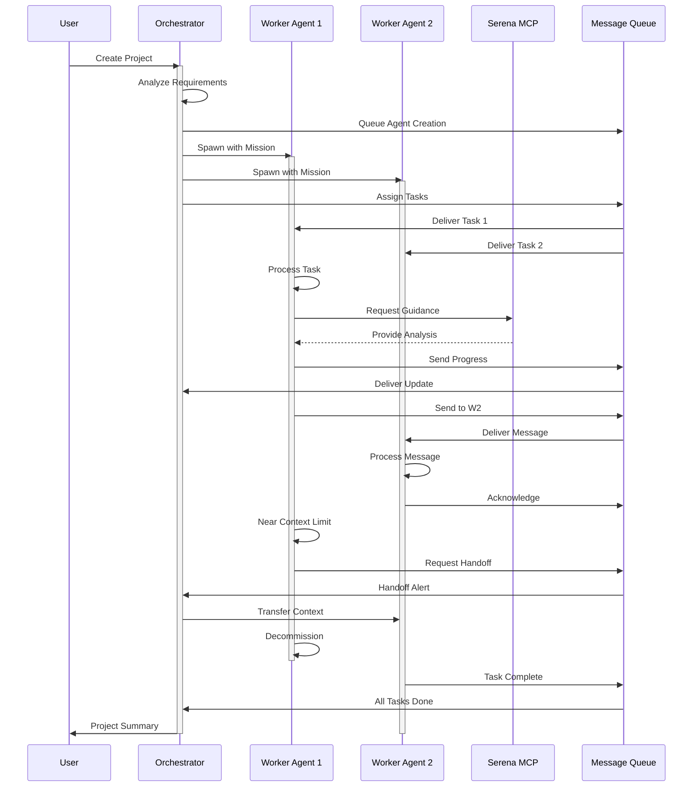
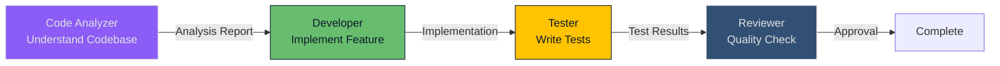
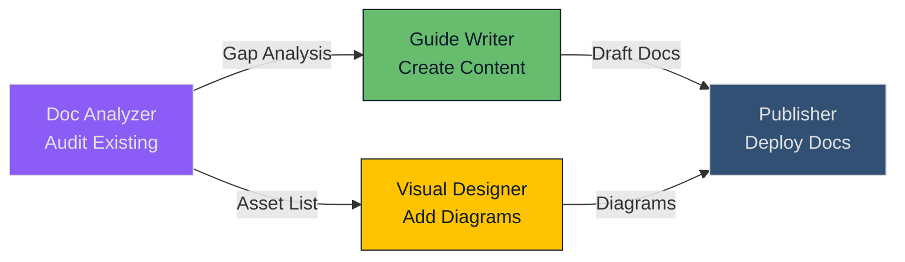
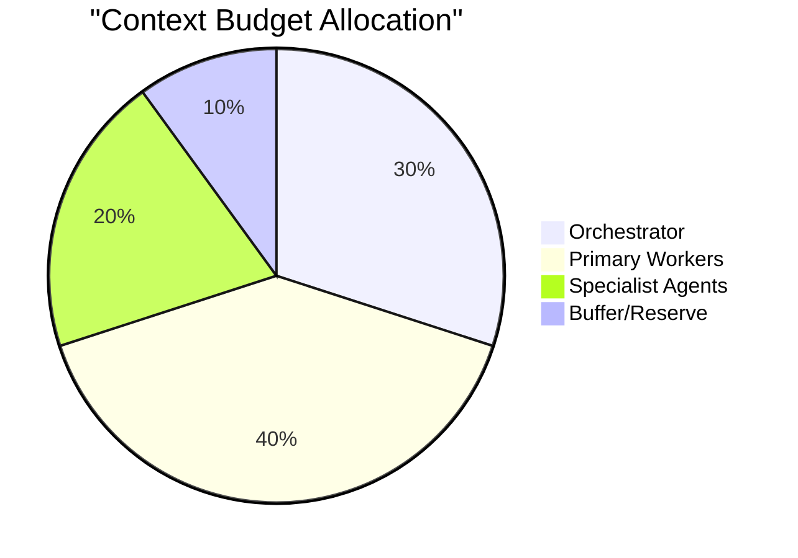

# Agent Orchestration Flow

## Agent Lifecycle and Interaction Patterns

This diagram illustrates how agents are created, coordinated, and interact within the GiljoAI MCP system.

## Agent Orchestration Flow

## Agent State Diagram

## Agent Communication Patterns

## Agent Pipeline Examples

### Example 1: Code Implementation Pipeline

### Example 2: Documentation Pipeline

## Key Orchestration Features

### 🔄 Dynamic Agent Management
- **On-Demand Spawning**: Agents created when needed
- **Resource Recycling**: Reuse existing agents when possible
- **Automatic Cleanup**: Decommission on completion

### 📬 Message-Driven Coordination
- **Priority Queue**: High-priority messages processed first
- **Acknowledgment Tracking**: Ensure message delivery
- **Broadcast Support**: Notify all agents simultaneously

### 🤝 Seamless Handoffs
- **Context Transfer**: Pass work between agents
- **State Preservation**: Maintain progress across handoffs
- **Resource Optimization**: Release resources when switching

### 📊 Health Monitoring
- **Context Usage Tracking**: Monitor token consumption
- **Performance Metrics**: Track agent efficiency
- **Automatic Intervention**: Orchestrator handles issues

### 🎯 Template-Based Missions
- **Predefined Roles**: Database-backed templates
- **Dynamic Augmentation**: Runtime mission customization
- **Version Control**: Template archive for rollback

## Context Management Strategy

## References

- Agent templates: [`src/giljo_mcp/template_manager.py`](../../src/giljo_mcp/template_manager.py)
- Message queue guide: [`docs/MESSAGE_QUEUE_GUIDE.md`](../MESSAGE_QUEUE_GUIDE.md)
- MCP tools: [`docs/manuals/MCP_TOOLS_MANUAL.md`](../manuals/MCP_TOOLS_MANUAL.md)