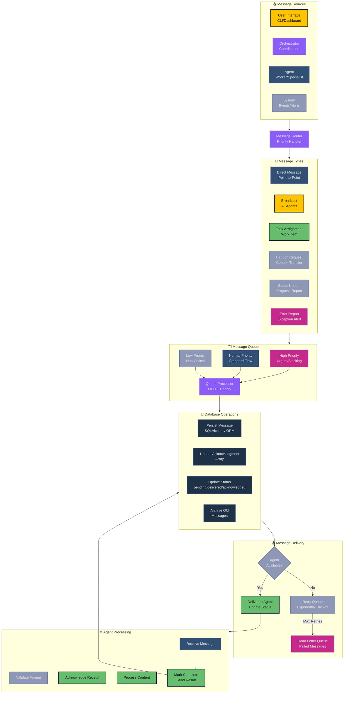
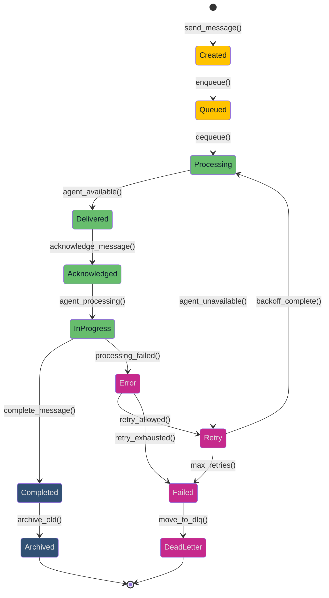
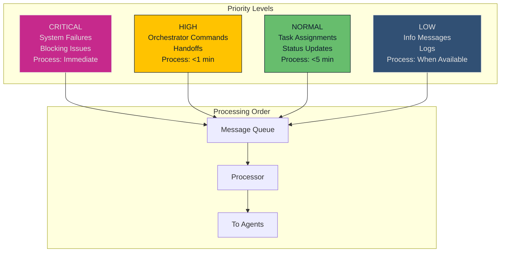
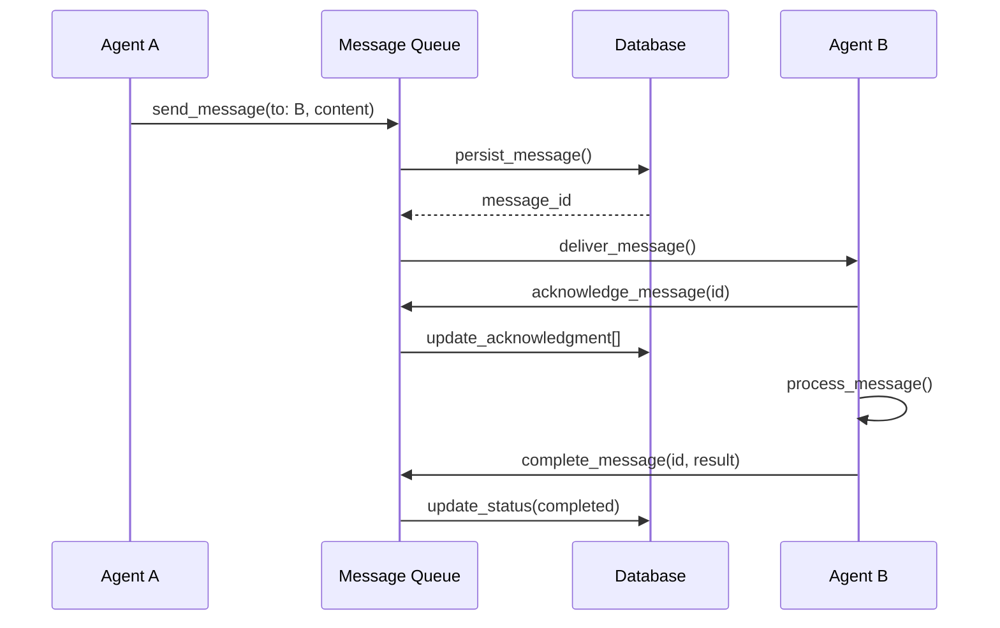
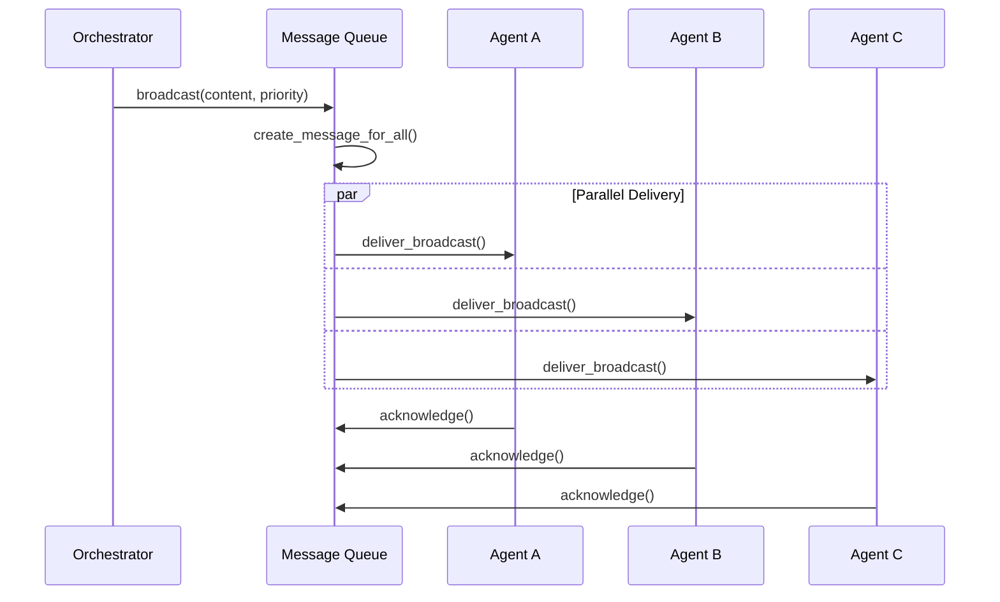
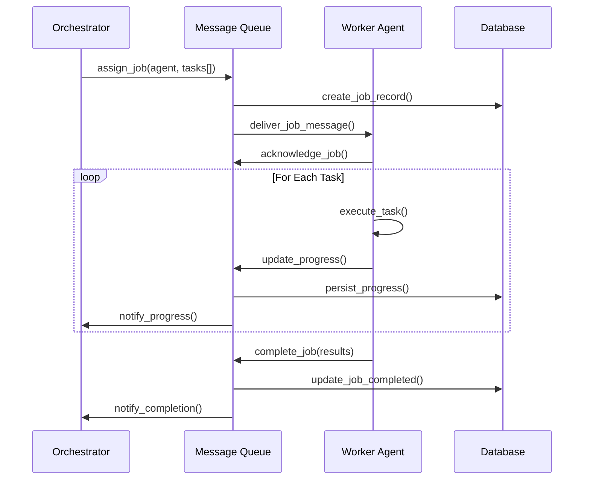
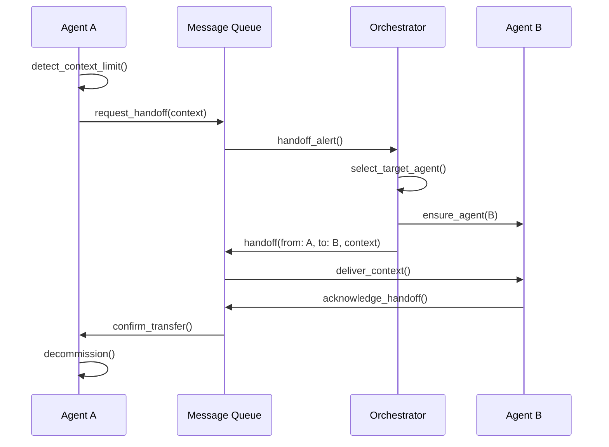
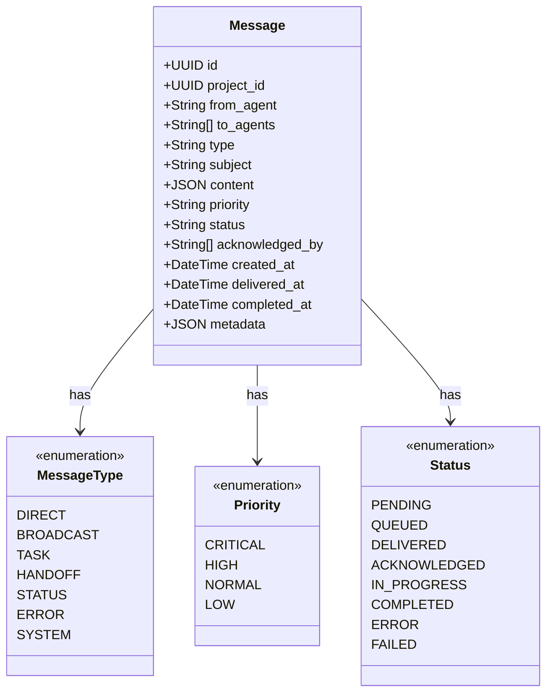
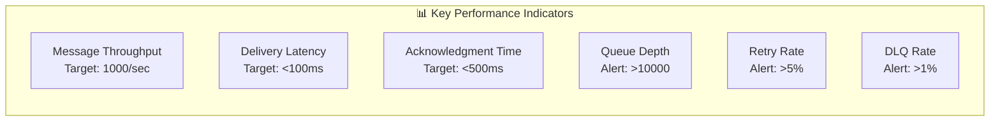
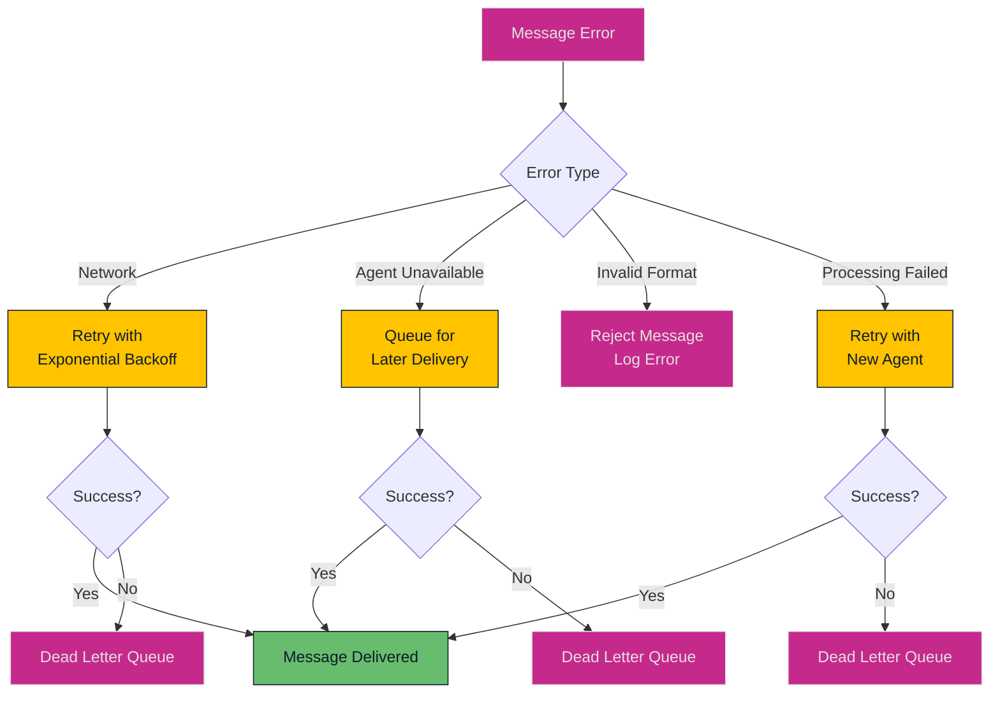

# Message Flow and Communication Patterns

## Message Queue Architecture and Flow

This diagram details the message-driven communication system that enables coordination between all agents in the GiljoAI MCP orchestrator.

## Message Flow Overview



## Message Lifecycle



## Message Priority System



## Communication Patterns

### 1. Direct Communication



### 2. Broadcast Pattern



### 3. Task Assignment Pattern



### 4. Handoff Pattern



## Message Format Specification



## Performance Metrics



## Error Handling Strategy



## Acknowledgment Array System

The acknowledgment array tracks which agents have received and processed broadcast messages:

```python
# Example acknowledgment array structure
{
    "message_id": "uuid-1234",
    "type": "broadcast",
    "acknowledged_by": [
        "orchestrator",      # First to acknowledge
        "agent_analyzer",    # Second
        "agent_developer",   # Third
        "agent_tester"      # Fourth
    ],
    "pending_acknowledgment": [
        "agent_reviewer",    # Not yet acknowledged
        "agent_deployer"    # Not yet acknowledged
    ]
}
```

## Key Features

### 🚀 High Performance

- **Database-First Design**: ACID compliance with PostgreSQL
- **Priority Queue**: Critical messages processed first
- **Batch Processing**: Efficient bulk operations
- **Connection Pooling**: Optimized database connections

### 🔒 Reliability

- **Acknowledgment Arrays**: Track message delivery
- **Retry Logic**: Exponential backoff for failures
- **Dead Letter Queue**: Handle undeliverable messages
- **Transaction Support**: Atomic operations

### 📊 Observability

- **Message Tracing**: Full audit trail
- **Performance Metrics**: Real-time monitoring
- **Status Tracking**: Complete lifecycle visibility
- **Error Reporting**: Detailed failure analysis

### 🔄 Scalability

- **Horizontal Scaling**: Add more workers
- **Redis Cache**: Optional performance boost
- **Async Processing**: Non-blocking operations
- **Batch Operations**: Efficient bulk handling

## References

- Message Queue Guide: [`docs/MESSAGE_QUEUE_GUIDE.md`](../MESSAGE_QUEUE_GUIDE.md)
- Database Schema: [`src/giljo_mcp/models.py`](../../src/giljo_mcp/models.py)
- API Documentation: [`docs/manuals/MCP_TOOLS_MANUAL.md`](../manuals/MCP_TOOLS_MANUAL.md)
