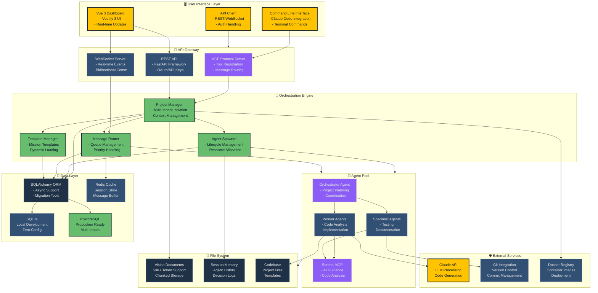
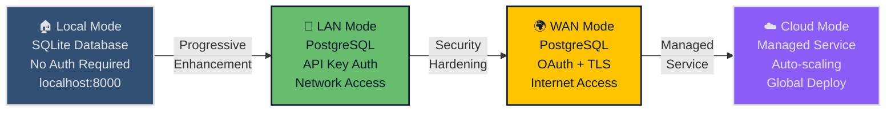
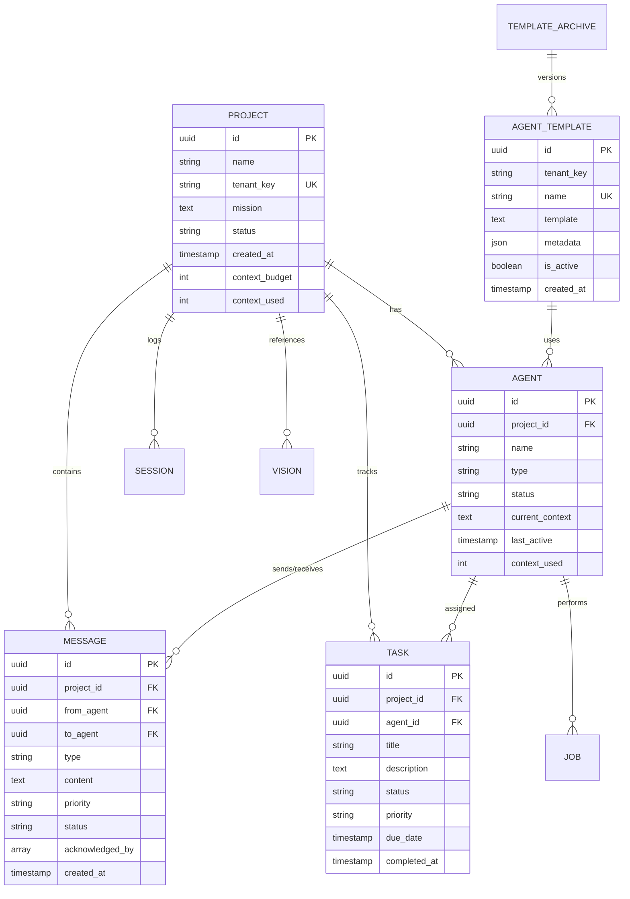

# GiljoAI MCP System Architecture

## Overview
This document provides visual representations of the GiljoAI MCP Coding Orchestrator architecture using Mermaid diagrams. The diagrams use the color themes defined in `docs/color_themes.md`.

## System Architecture Diagram

## Deployment Modes

## Database Schema Overview

## Key Features

### 🚀 Progressive Architecture
- **Local First**: Start with SQLite, zero configuration
- **Scale When Ready**: Seamlessly upgrade to PostgreSQL
- **Cloud Native**: Container-ready with Docker support
- **Multi-tenant**: Isolated projects via tenant keys

### 🔧 Core Capabilities
- **Vision Chunking**: Handle 50K+ token documents
- **Message Acknowledgment**: Reliable multi-agent coordination
- **Dynamic Discovery**: No static indexing required
- **Template System**: Database-backed mission templates
- **Real-time Updates**: WebSocket for live dashboard

### 🛡️ Security & Performance
- **API Key Authentication**: Secure LAN/WAN access
- **OAuth Integration**: Enterprise-ready authentication
- **Context Management**: Efficient token usage
- **Redis Caching**: High-performance message queue
- **Async Operations**: Non-blocking database access

## Color Legend

- 🟡 **Yellow (#ffc300)**: Primary components and user interfaces
- 🟢 **Green (#67bd6d)**: Core orchestration and healthy systems
- 🟣 **Purple (#8b5cf6)**: Special features and MCP integration
- 🔵 **Blue (#315074)**: Standard services and infrastructure
- 🌑 **Dark (#1e3147)**: Data storage and file systems
- 🔴 **Pink (#c6298c)**: Error states and critical alerts

## References

- Color themes: [`docs/color_themes.md`](../color_themes.md)
- Technical architecture: [`docs/TECHNICAL_ARCHITECTURE.md`](../TECHNICAL_ARCHITECTURE.md)
- MCP tools documentation: [`docs/manuals/MCP_TOOLS_MANUAL.md`](../manuals/MCP_TOOLS_MANUAL.md)
- Frontend assets: [`frontend/public/`](../../frontend/public/)