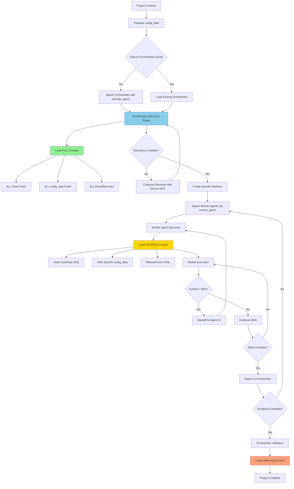
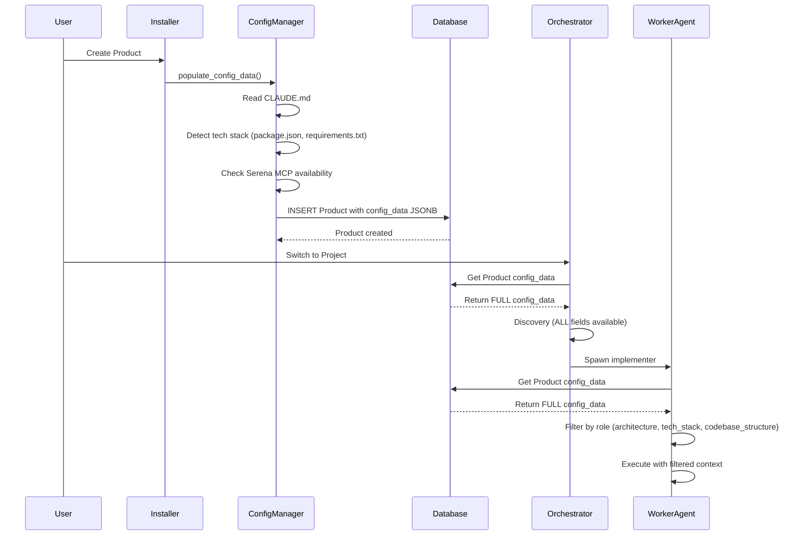

# OrchestratorUpgrade.md
## Date: October 8, 2025

---

## Executive Summary

### Problem Statement
GiljoAI-MCP currently lacks the rich context management system present in AKE-MCP, specifically:
- **Missing config_data JSONB field** in the Product model for storing rich project configuration
- **No role-based context filtering** - all agents receive the same context regardless of role
- **No hierarchical context loading** - orchestrator and workers get identical context
- **Generic template enforcement** - orchestrator template lacks discovery-first workflow patterns
- **Limited context optimization** - no token-aware filtering based on agent responsibilities

### Solution Overview
Implement a **hierarchical context management system** that provides:
1. **config_data JSONB field** in Product model for rich configuration storage
2. **Enhanced ContextManager** with role-based filtering (orchestrator gets FULL, workers get FILTERED)
3. **Updated orchestrator template** as the default/critical template with discovery-first workflow
4. **Database-backed configuration** populated from CLAUDE.md and project detection
5. **Token-optimized context delivery** based on agent role and responsibilities

### Why This Matters for Claude Code Sub-Agents
Claude Code sub-agents spawned by the orchestrator currently receive:
- **Too much irrelevant context** (wasted tokens on information they don't need)
- **No clear scope boundaries** (lack of role-specific configuration)
- **Generic missions** (not informed by rich project metadata)

With this upgrade, sub-agents will:
- **Receive filtered context** (60% token reduction for focused work)
- **Know their exact scope** (role-specific configuration and constraints)
- **Execute specific missions** (informed by project architecture, tech stack, critical features)
- **Follow established patterns** (architecture and codebase structure guidance)

---

## Current State Analysis

### What GiljoAI-MCP Has

#### 1. Strong Foundation
- **Database-backed template system** (`AgentTemplate` model in `models.py`)
- **Unified template manager** (`template_manager.py` with legacy templates)
- **Discovery system** (`discovery.py` with `DiscoveryManager` and `PathResolver`)
- **Multi-tenant architecture** (all models support `tenant_key`)
- **Message queue** for agent coordination
- **Vision document chunking** (50K+ token support)
- **Job tracking** (`Job` model for agent work assignment)

#### 2. Template System (Current)
```python
# From src/giljo_mcp/models.py (lines 494-558)
class AgentTemplate(Base):
    __tablename__ = "agent_templates"

    id = Column(String(36), primary_key=True, default=generate_uuid)
    tenant_key = Column(String(36), nullable=False)
    product_id = Column(String(36), nullable=True)

    name = Column(String(100), nullable=False)
    category = Column(String(50), nullable=False)
    role = Column(String(50), nullable=True)
    template_content = Column(Text, nullable=False)
    variables = Column(JSON, default=list)
    behavioral_rules = Column(JSON, default=list)
    success_criteria = Column(JSON, default=list)

    is_default = Column(Boolean, default=False)  # ✅ Already exists!
    is_active = Column(Boolean, default=True)
```

#### 3. Product Model (Current)
```python
# From src/giljo_mcp/models.py (lines 40-64)
class Product(Base):
    __tablename__ = "products"

    id = Column(String(36), primary_key=True, default=generate_uuid)
    tenant_key = Column(String(36), nullable=False, index=True)
    name = Column(String(255), nullable=False)
    description = Column(Text, nullable=True)
    vision_path = Column(String(500), nullable=True)
    created_at = Column(DateTime(timezone=True), server_default=func.now())
    updated_at = Column(DateTime(timezone=True), onupdate=func.now())
    meta_data = Column(JSON, default=dict)  # Generic JSON field

    # ❌ MISSING: config_data = Column(JSONB, nullable=True)
```

#### 4. Discovery System (Current)
```python
# From src/giljo_mcp/discovery.py (lines 169-293)
class DiscoveryManager:
    PRIORITY_ORDER = ["vision", "config", "docs", "memories", "code"]

    ROLE_PRIORITIES = {
        "orchestrator": ["vision", "config", "docs", "memories"],
        "analyzer": ["vision", "docs", "code"],
        "implementer": ["docs", "code", "config"],
        "tester": ["docs", "code", "memories"],
        "default": ["config", "docs"],
    }

    # ✅ Has role-based priority loading
    # ❌ Missing: Role-based config FILTERING (all agents get same config)
```

### What's Missing vs AKE-MCP

#### 1. Product.config_data JSONB Field
**AKE-MCP has:**
```python
# From The_orchestrator.md (lines 275-293)
config_data = Column(JSONB, nullable=False)

# Example structure:
{
    "architecture": "FastAPI + PostgreSQL + Vue.js",
    "tech_stack": ["Python 3.11", "PostgreSQL 18", "Vue 3"],
    "codebase_structure": {
        "api": "REST endpoints",
        "frontend": "Vue dashboard",
        "core": "Orchestration engine"
    },
    "critical_features": ["Multi-tenant isolation", "Agent coordination"],
    "test_commands": ["pytest tests/", "npm run test"],
    "test_config": {"coverage_threshold": 80},
    "known_issues": ["Port conflicts", "WebSocket drops"],
    "api_docs": "/docs/api_reference.md",
    "documentation_style": "Markdown with mermaid diagrams",
    "serena_mcp_enabled": true
}
```

**GiljoAI-MCP has:** Only generic `meta_data` JSON field (not JSONB, not structured)

#### 2. Hierarchical Context Loading
**AKE-MCP has:**
```python
# From The_orchestrator.md (lines 300-328)
def prepare_agent_context(agent_name: str, project_id: str):
    if is_orchestrator:
        # FULL context (all vision + all config)
        context["product"]["vision"] = load_full_vision(product)
        context["product"]["config"] = product["config_data"]  # ALL config
    else:
        # FILTERED context (summary + role-specific config)
        context["product"]["vision_summary"] = get_vision_summary(product)
        context["product"]["relevant_config"] = get_filtered_config(agent_name, product)
```

**GiljoAI-MCP has:** Same context for all agents (no filtering by role)

#### 3. Role-Based Config Filtering
**AKE-MCP has:**
```python
# From The_orchestrator.md (lines 334-367)
def _get_filtered_config(agent_name: str, product: Dict):
    if "implementer" in agent_name.lower():
        return {
            "architecture": config["architecture"],
            "tech_stack": config["tech_stack"],
            "codebase_structure": config["codebase_structure"]
        }
    elif "tester" in agent_name.lower():
        return {
            "test_config": config["test_config"],
            "test_commands": config["test_commands"],
            "critical_features": config["critical_features"]
        }
    # ... other roles
```

**GiljoAI-MCP has:** No filtering mechanism (discovery.py loads same config for all agents)

#### 4. Enhanced Orchestrator Template
**AKE-MCP has:**
- **Discovery-first workflow** (Serena → Vision → Settings → Mission)
- **30-80-10 principle** enforced in template
- **3-tool rule** for delegation enforcement
- **Mandatory after-action documentation**

**GiljoAI-MCP has:**
- Basic orchestrator template in `template_manager.py` (lines 152-211)
- Discovery workflow mentioned but not enforced
- No 3-tool rule or delegation guardrails
- Not set as default template (no seeding)

### Gap Impact on Orchestrator Effectiveness

| Missing Feature | Impact | Token Waste | Quality Impact |
|----------------|--------|-------------|----------------|
| config_data JSONB | Agents lack project context | Medium (20%) | High - Generic missions |
| Role filtering | All agents get full config | High (40%) | Medium - Scope drift |
| Hierarchical loading | Orchestrator same as workers | Low (10%) | High - Coordination failures |
| Enhanced template | No discovery enforcement | Medium (30%) | Critical - Ad-hoc workflows |

**Total estimated token waste:** 60% for worker agents, 40% for orchestrator

---

## Architecture Overview

### Logic Flow Diagram



### Data Flow: config_data Population and Usage



---

## Implementation Phases

### Phase 1: Database Enhancement (config_data JSONB)

#### Deliverables

1. **Alembic Migration** - Add config_data column with GIN index
2. **Product Model Update** - Add config_data field with validation
3. **Schema Definition** - Document config_data structure
4. **Database Seeding** - Populate existing products

#### Migration File

**File:** `migrations/versions/XXXX_add_config_data_to_product.py`

```python
"""Add config_data JSONB to Product model

Revision ID: abc123456789
Revises: <previous_revision>
Create Date: 2025-10-08 12:00:00.000000

"""
from alembic import op
import sqlalchemy as sa
from sqlalchemy.dialects.postgresql import JSONB


# revision identifiers, used by Alembic.
revision = 'abc123456789'
down_revision = '<previous_revision>'  # Replace with actual previous revision
branch_labels = None
depends_on = None


def upgrade():
    """Add config_data JSONB column to products table"""

    # Add config_data column
    op.add_column(
        'products',
        sa.Column('config_data', JSONB, nullable=True)
    )

    # Create GIN index for efficient JSONB queries
    op.create_index(
        'idx_product_config_data_gin',
        'products',
        ['config_data'],
        postgresql_using='gin'
    )

    # Initialize with empty object for existing products
    op.execute("""
        UPDATE products
        SET config_data = '{}'::jsonb
        WHERE config_data IS NULL
    """)


def downgrade():
    """Remove config_data column"""

    # Drop GIN index
    op.drop_index('idx_product_config_data_gin', table_name='products')

    # Drop column
    op.drop_column('products', 'config_data')
```

#### Product Model Update

**File:** `src/giljo_mcp/models.py`

```python
# Update Product class (around line 40)
from sqlalchemy.dialects.postgresql import JSONB

class Product(Base):
    """
    Product model - TOP-level organizational unit.
    All projects, tasks, and agents belong to a product.
    """
    __tablename__ = "products"

    id = Column(String(36), primary_key=True, default=generate_uuid)
    tenant_key = Column(String(36), nullable=False, index=True)
    name = Column(String(255), nullable=False)
    description = Column(Text, nullable=True)
    vision_path = Column(String(500), nullable=True)
    created_at = Column(DateTime(timezone=True), server_default=func.now())
    updated_at = Column(DateTime(timezone=True), onupdate=func.now())
    meta_data = Column(JSON, default=dict)

    # NEW: Rich configuration data (JSONB for PostgreSQL performance)
    config_data = Column(
        JSONB,
        nullable=True,
        default=dict,
        comment="Rich project configuration: architecture, tech_stack, features, etc."
    )

    # Relationships
    projects = relationship("Project", back_populates="product", cascade="all, delete-orphan")
    tasks = relationship("Task", back_populates="product", cascade="all, delete-orphan")

    __table_args__ = (
        Index("idx_product_tenant", "tenant_key"),
        Index("idx_product_name", "name"),
        Index("idx_product_config_data_gin", "config_data", postgresql_using="gin"),  # NEW
    )

    @property
    def has_config_data(self) -> bool:
        """Check if product has config_data populated"""
        return bool(self.config_data and len(self.config_data) > 0)

    def get_config_field(self, field_path: str, default: Any = None) -> Any:
        """
        Get config field using dot notation (e.g., 'tech_stack.python')

        Args:
            field_path: Dot-separated path (e.g., 'architecture' or 'test_config.coverage')
            default: Default value if field not found

        Returns:
            Field value or default
        """
        if not self.config_data:
            return default

        keys = field_path.split('.')
        value = self.config_data

        for key in keys:
            if isinstance(value, dict) and key in value:
                value = value[key]
            else:
                return default

        return value
```

#### config_data Schema Definition

**Schema Version:** 1.0.0

```json
{
  "$schema": "http://json-schema.org/draft-07/schema#",
  "title": "Product Config Data Schema",
  "type": "object",
  "properties": {
    "architecture": {
      "type": "string",
      "description": "High-level system architecture (e.g., 'FastAPI + PostgreSQL + Vue.js')",
      "examples": ["FastAPI + PostgreSQL + Vue.js", "Django + React + MongoDB"]
    },
    "tech_stack": {
      "type": "array",
      "description": "Technologies and versions used",
      "items": {
        "type": "string"
      },
      "examples": [["Python 3.11", "PostgreSQL 18", "Vue 3", "Docker"]]
    },
    "codebase_structure": {
      "type": "object",
      "description": "Mapping of directories to their purposes",
      "additionalProperties": {
        "type": "string"
      },
      "examples": [{
        "api": "REST API endpoints",
        "frontend": "Vue.js dashboard",
        "src/giljo_mcp": "Core orchestration engine",
        "installer": "Installation scripts",
        "tests": "Test suites"
      }]
    },
    "critical_features": {
      "type": "array",
      "description": "Must-preserve features and capabilities",
      "items": {
        "type": "string"
      },
      "examples": [["Multi-tenant isolation", "Agent coordination", "Context chunking"]]
    },
    "test_commands": {
      "type": "array",
      "description": "Commands to run tests",
      "items": {
        "type": "string"
      },
      "examples": [["pytest tests/", "npm run test", "pytest tests/unit/"]]
    },
    "test_config": {
      "type": "object",
      "description": "Testing configuration and thresholds",
      "properties": {
        "coverage_threshold": {
          "type": "number",
          "minimum": 0,
          "maximum": 100
        },
        "test_framework": {
          "type": "string"
        }
      },
      "examples": [{
        "coverage_threshold": 80,
        "test_framework": "pytest"
      }]
    },
    "known_issues": {
      "type": "array",
      "description": "Known issues and workarounds",
      "items": {
        "type": "string"
      },
      "examples": [["Port conflicts on 7272", "WebSocket disconnects under load"]]
    },
    "api_docs": {
      "type": "string",
      "description": "Path to API documentation",
      "examples": ["/docs/api_reference.md", "http://localhost:7272/docs"]
    },
    "documentation_style": {
      "type": "string",
      "description": "Documentation format and style",
      "examples": ["Markdown with mermaid diagrams", "ReStructuredText", "Sphinx"]
    },
    "serena_mcp_enabled": {
      "type": "boolean",
      "description": "Whether Serena MCP is available for code analysis",
      "default": true
    },
    "deployment_modes": {
      "type": "array",
      "description": "Supported deployment configurations",
      "items": {
        "type": "string",
        "enum": ["localhost", "server", "lan", "wan"]
      },
      "examples": [["localhost", "server"]]
    },
    "database_type": {
      "type": "string",
      "description": "Database system in use",
      "enum": ["postgresql", "mysql", "sqlite", "mongodb"],
      "examples": ["postgresql"]
    },
    "frontend_framework": {
      "type": "string",
      "description": "Frontend framework if applicable",
      "examples": ["Vue 3", "React 18", "Angular", "Svelte"]
    },
    "backend_framework": {
      "type": "string",
      "description": "Backend framework",
      "examples": ["FastAPI", "Django", "Flask", "Express.js"]
    }
  },
  "required": ["architecture", "serena_mcp_enabled"]
}
```

---

### Phase 2: Context Management Implementation

#### Deliverables

1. **New Module:** `src/giljo_mcp/context_manager.py`
2. **Functions:**
   - `get_filtered_config(agent_name, product)` - Role-based filtering
   - `get_full_config(product)` - Orchestrator only
   - `validate_config_data(config)` - Schema validation
3. **Integration:** Update `discovery.py` to use context_manager
4. **Tests:** Unit tests for filtering logic

#### Context Manager Module

**File:** `src/giljo_mcp/context_manager.py`

```python
"""
Context Manager for GiljoAI MCP
Provides role-based context filtering and hierarchical loading
"""

import logging
from typing import Any, Dict, Optional

from .models import Product, Agent


logger = logging.getLogger(__name__)


# Role-based config field mappings
ROLE_CONFIG_FILTERS = {
    "orchestrator": "all",  # Gets ALL fields

    "implementer": [
        "architecture",
        "tech_stack",
        "codebase_structure",
        "critical_features",
        "database_type",
        "backend_framework",
        "frontend_framework",
        "deployment_modes"
    ],

    "developer": [  # Alias for implementer
        "architecture",
        "tech_stack",
        "codebase_structure",
        "critical_features",
        "database_type",
        "backend_framework",
        "frontend_framework"
    ],

    "tester": [
        "test_commands",
        "test_config",
        "critical_features",
        "known_issues",
        "tech_stack"
    ],

    "qa": [  # Alias for tester
        "test_commands",
        "test_config",
        "critical_features",
        "known_issues"
    ],

    "documenter": [
        "api_docs",
        "documentation_style",
        "architecture",
        "critical_features",
        "codebase_structure"
    ],

    "analyzer": [
        "architecture",
        "tech_stack",
        "codebase_structure",
        "critical_features",
        "known_issues"
    ],

    "reviewer": [
        "architecture",
        "tech_stack",
        "critical_features",
        "documentation_style"
    ]
}


def is_orchestrator(agent_name: str, agent_role: Optional[str] = None) -> bool:
    """
    Determine if agent is an orchestrator.

    Args:
        agent_name: Name of the agent
        agent_role: Optional role from Agent model

    Returns:
        True if agent is orchestrator
    """
    agent_lower = agent_name.lower()

    # Check by name
    if "orchestrator" in agent_lower:
        return True

    # Check by role
    if agent_role and agent_role.lower() == "orchestrator":
        return True

    return False


def get_full_config(product: Product) -> Dict[str, Any]:
    """
    Get FULL config_data for orchestrator agents.

    Args:
        product: Product model instance

    Returns:
        Complete config_data dictionary
    """
    if not product.config_data:
        logger.warning(f"Product {product.id} has no config_data")
        return {}

    logger.info(f"Loading FULL config for orchestrator (product: {product.name})")
    return dict(product.config_data)


def get_filtered_config(agent_name: str, product: Product, agent_role: Optional[str] = None) -> Dict[str, Any]:
    """
    Get FILTERED config_data based on agent role.

    Args:
        agent_name: Name of the agent
        product: Product model instance
        agent_role: Optional role from Agent model

    Returns:
        Filtered config_data containing only role-relevant fields
    """
    # Check if orchestrator (gets ALL fields)
    if is_orchestrator(agent_name, agent_role):
        return get_full_config(product)

    if not product.config_data:
        logger.warning(f"Product {product.id} has no config_data")
        return {}

    # Determine role from agent name
    agent_lower = agent_name.lower()
    role_key = None

    for role in ROLE_CONFIG_FILTERS.keys():
        if role in agent_lower:
            role_key = role
            break

    # Fallback to generic filtering if role unknown
    if not role_key:
        logger.warning(f"Unknown agent role for {agent_name}, using default filtering")
        role_key = "analyzer"  # Default to analyzer (broad but safe)

    # Get allowed fields for this role
    allowed_fields = ROLE_CONFIG_FILTERS[role_key]

    if allowed_fields == "all":
        # Orchestrator gets everything
        return dict(product.config_data)

    # Filter config_data to only allowed fields
    filtered = {}
    for field in allowed_fields:
        if field in product.config_data:
            filtered[field] = product.config_data[field]

    # Always include basic metadata
    if "serena_mcp_enabled" in product.config_data:
        filtered["serena_mcp_enabled"] = product.config_data["serena_mcp_enabled"]

    logger.info(
        f"Loaded FILTERED config for {agent_name} (role: {role_key}): "
        f"{len(filtered)} fields out of {len(product.config_data)}"
    )

    return filtered


def validate_config_data(config: Dict[str, Any]) -> tuple[bool, list[str]]:
    """
    Validate config_data structure against schema.

    Args:
        config: Config data to validate

    Returns:
        Tuple of (is_valid, error_messages)
    """
    errors = []

    # Required fields
    if "architecture" not in config:
        errors.append("Missing required field: architecture")

    if "serena_mcp_enabled" not in config:
        errors.append("Missing required field: serena_mcp_enabled")

    # Type validation
    if "tech_stack" in config and not isinstance(config["tech_stack"], list):
        errors.append("tech_stack must be an array")

    if "test_commands" in config and not isinstance(config["test_commands"], list):
        errors.append("test_commands must be an array")

    if "critical_features" in config and not isinstance(config["critical_features"], list):
        errors.append("critical_features must be an array")

    if "codebase_structure" in config and not isinstance(config["codebase_structure"], dict):
        errors.append("codebase_structure must be an object")

    if "test_config" in config and not isinstance(config["test_config"], dict):
        errors.append("test_config must be an object")

    # Boolean validation
    if "serena_mcp_enabled" in config and not isinstance(config["serena_mcp_enabled"], bool):
        errors.append("serena_mcp_enabled must be a boolean")

    is_valid = len(errors) == 0

    if not is_valid:
        logger.error(f"config_data validation failed: {errors}")

    return is_valid, errors


def merge_config_updates(existing: Dict[str, Any], updates: Dict[str, Any]) -> Dict[str, Any]:
    """
    Merge config updates into existing config (deep merge).

    Args:
        existing: Existing config_data
        updates: Updates to apply

    Returns:
        Merged config_data
    """
    merged = dict(existing)

    for key, value in updates.items():
        if key in merged and isinstance(merged[key], dict) and isinstance(value, dict):
            # Deep merge for nested objects
            merged[key] = {**merged[key], **value}
        else:
            # Direct replacement for scalars and arrays
            merged[key] = value

    return merged


def get_config_summary(product: Product) -> str:
    """
    Get human-readable summary of config_data.

    Args:
        product: Product model instance

    Returns:
        Formatted summary string
    """
    if not product.config_data:
        return "No configuration data available"

    config = product.config_data

    summary_parts = []

    if "architecture" in config:
        summary_parts.append(f"Architecture: {config['architecture']}")

    if "tech_stack" in config and config["tech_stack"]:
        summary_parts.append(f"Tech Stack: {', '.join(config['tech_stack'][:3])}")

    if "critical_features" in config and config["critical_features"]:
        summary_parts.append(f"Critical Features: {len(config['critical_features'])} defined")

    if "test_commands" in config and config["test_commands"]:
        summary_parts.append(f"Test Commands: {len(config['test_commands'])} configured")

    if "serena_mcp_enabled" in config:
        status = "enabled" if config["serena_mcp_enabled"] else "disabled"
        summary_parts.append(f"Serena MCP: {status}")

    return "\n".join(summary_parts)
```

#### Discovery Manager Integration

**File:** `src/giljo_mcp/discovery.py` (Update _load_config method around line 349)

```python
# Add import at top
from .context_manager import get_filtered_config, get_full_config, is_orchestrator

# Update _load_config method
async def _load_config(
    self,
    project_id: str,
    max_tokens: int,
    agent_name: Optional[str] = None,  # NEW parameter
    agent_role: Optional[str] = None   # NEW parameter
) -> Optional[dict]:
    """
    Load configuration from database and files.

    Args:
        project_id: Project ID
        max_tokens: Maximum tokens to load
        agent_name: Optional agent name for filtering
        agent_role: Optional agent role for filtering
    """
    try:
        config_data = {}

        # Load from database
        async with self.db_manager.get_session_async() as session:
            # Get project to find product
            from .models import Project, Product
            from sqlalchemy import select

            project_query = select(Project).where(Project.id == project_id)
            result = await session.execute(project_query)
            project = result.scalar_one_or_none()

            if project and project.product_id:
                # Get product config_data
                product_query = select(Product).where(Product.id == project.product_id)
                result = await session.execute(product_query)
                product = result.scalar_one_or_none()

                if product and product.config_data:
                    # Apply role-based filtering
                    if agent_name and is_orchestrator(agent_name, agent_role):
                        # Orchestrator gets FULL config
                        config_data["product_config"] = get_full_config(product)
                        logger.info("Loaded FULL product config for orchestrator")
                    elif agent_name:
                        # Worker agents get FILTERED config
                        config_data["product_config"] = get_filtered_config(
                            agent_name, product, agent_role
                        )
                        logger.info(f"Loaded FILTERED product config for {agent_name}")
                    else:
                        # No agent specified - return full (backward compatible)
                        config_data["product_config"] = dict(product.config_data)

            # Load standard Configuration entries
            from .models import Configuration
            config_query = select(Configuration).where(Configuration.project_id == project_id)
            result = await session.execute(config_query)
            configs = result.scalars().all()

            config_data["database"] = {config.key: config.value for config in configs}

        # Load from config.yaml
        config_path = await self.path_resolver.resolve_path("config", project_id)
        yaml_path = config_path / "config.yaml"
        if not yaml_path.exists():
            yaml_path = Path("config.yaml")

        if yaml_path.exists():
            with open(yaml_path, encoding="utf-8") as f:
                config_data["yaml"] = yaml.safe_load(f)

        # Estimate tokens (rough approximation)
        content_str = json.dumps(config_data)
        estimated_tokens = len(content_str) // 4

        if estimated_tokens > max_tokens:
            # Truncate if needed
            config_data["truncated"] = True

        return {"content": config_data, "tokens": min(estimated_tokens, max_tokens)}

    except Exception as e:
        logger.exception(f"Failed to load config: {e}")

    return None


# Update discover_context to pass agent info
async def discover_context(
    self,
    agent_role: str,
    project_id: str,
    agent_name: Optional[str] = None,  # NEW
    force_refresh: bool = False
) -> dict[str, Any]:
    """
    Main discovery method with role-based filtering.

    Args:
        agent_role: Role of the agent requesting context
        project_id: Project ID for context
        agent_name: Optional agent name for precise filtering
        force_refresh: Force fresh discovery ignoring cache

    Returns:
        Discovered context organized by priority
    """
    # Get role-specific priorities
    priorities = self.ROLE_PRIORITIES.get(agent_role, self.ROLE_PRIORITIES["default"])
    token_limit = self.ROLE_TOKEN_LIMITS.get(agent_role, self.ROLE_TOKEN_LIMITS["default"])

    # Clear cache if forced refresh
    if force_refresh:
        self.path_resolver.clear_cache()
        self._content_hashes.clear()

    # Load context by priority (pass agent_name for filtering)
    context = await self.load_by_priority(
        priorities,
        project_id,
        token_limit,
        agent_name=agent_name,  # NEW
        agent_role=agent_role   # NEW
    )

    # Add metadata
    context["metadata"] = {
        "agent_role": agent_role,
        "agent_name": agent_name,  # NEW
        "priorities_used": priorities,
        "token_limit": token_limit,
        "discovered_at": datetime.now(timezone.utc).isoformat(),
        "project_id": project_id,
    }

    return context
```

#### Unit Tests

**File:** `tests/unit/test_context_manager.py`

```python
"""
Unit tests for context_manager module
"""

import pytest
from src.giljo_mcp.context_manager import (
    is_orchestrator,
    get_full_config,
    get_filtered_config,
    validate_config_data,
    merge_config_updates,
    ROLE_CONFIG_FILTERS
)
from src.giljo_mcp.models import Product


@pytest.fixture
def sample_product():
    """Create sample product with config_data"""
    product = Product(
        id="test-product-1",
        tenant_key="test-tenant",
        name="Test Product",
        config_data={
            "architecture": "FastAPI + PostgreSQL",
            "tech_stack": ["Python 3.11", "PostgreSQL 18"],
            "codebase_structure": {
                "api": "REST endpoints",
                "core": "Orchestration"
            },
            "critical_features": ["Multi-tenant", "Agent coordination"],
            "test_commands": ["pytest tests/"],
            "test_config": {"coverage_threshold": 80},
            "api_docs": "/docs/api.md",
            "documentation_style": "Markdown",
            "serena_mcp_enabled": True
        }
    )
    return product


def test_is_orchestrator_by_name():
    """Test orchestrator detection by name"""
    assert is_orchestrator("orchestrator") is True
    assert is_orchestrator("Orchestrator-Agent-1") is True
    assert is_orchestrator("implementer") is False


def test_is_orchestrator_by_role():
    """Test orchestrator detection by role"""
    assert is_orchestrator("agent-1", agent_role="orchestrator") is True
    assert is_orchestrator("agent-1", agent_role="implementer") is False


def test_get_full_config(sample_product):
    """Test full config retrieval for orchestrator"""
    config = get_full_config(sample_product)

    assert "architecture" in config
    assert "tech_stack" in config
    assert "test_commands" in config
    assert "api_docs" in config
    assert len(config) == len(sample_product.config_data)


def test_get_filtered_config_implementer(sample_product):
    """Test filtered config for implementer role"""
    config = get_filtered_config("implementer-1", sample_product)

    # Should have implementer fields
    assert "architecture" in config
    assert "tech_stack" in config
    assert "codebase_structure" in config
    assert "critical_features" in config

    # Should NOT have tester/documenter-specific fields
    assert "test_commands" not in config
    assert "api_docs" not in config

    # Should always have serena flag
    assert "serena_mcp_enabled" in config


def test_get_filtered_config_tester(sample_product):
    """Test filtered config for tester role"""
    config = get_filtered_config("tester-qa-1", sample_product)

    # Should have tester fields
    assert "test_commands" in config
    assert "test_config" in config
    assert "critical_features" in config

    # Should NOT have implementer-specific fields
    assert "codebase_structure" not in config


def test_get_filtered_config_documenter(sample_product):
    """Test filtered config for documenter role"""
    config = get_filtered_config("documenter-agent", sample_product)

    # Should have documenter fields
    assert "api_docs" in config
    assert "documentation_style" in config
    assert "architecture" in config

    # Should NOT have test-specific fields
    assert "test_commands" not in config


def test_get_filtered_config_orchestrator_gets_all(sample_product):
    """Test orchestrator gets full config through filtering"""
    config = get_filtered_config("orchestrator", sample_product)

    assert len(config) == len(sample_product.config_data)


def test_validate_config_data_valid():
    """Test validation with valid config"""
    config = {
        "architecture": "FastAPI",
        "serena_mcp_enabled": True,
        "tech_stack": ["Python"],
        "test_commands": ["pytest"],
        "critical_features": ["Feature1"]
    }

    is_valid, errors = validate_config_data(config)
    assert is_valid is True
    assert len(errors) == 0


def test_validate_config_data_missing_required():
    """Test validation with missing required fields"""
    config = {
        "tech_stack": ["Python"]
        # Missing: architecture, serena_mcp_enabled
    }

    is_valid, errors = validate_config_data(config)
    assert is_valid is False
    assert len(errors) == 2


def test_validate_config_data_wrong_types():
    """Test validation with wrong types"""
    config = {
        "architecture": "FastAPI",
        "serena_mcp_enabled": "yes",  # Should be bool
        "tech_stack": "Python",  # Should be array
        "test_commands": {"cmd": "pytest"}  # Should be array
    }

    is_valid, errors = validate_config_data(config)
    assert is_valid is False
    assert len(errors) >= 3


def test_merge_config_updates_shallow():
    """Test shallow merge of config updates"""
    existing = {
        "architecture": "Old",
        "tech_stack": ["Python 3.10"]
    }

    updates = {
        "architecture": "New",
        "test_commands": ["pytest"]
    }

    merged = merge_config_updates(existing, updates)

    assert merged["architecture"] == "New"
    assert merged["tech_stack"] == ["Python 3.10"]
    assert merged["test_commands"] == ["pytest"]


def test_merge_config_updates_deep():
    """Test deep merge of nested objects"""
    existing = {
        "test_config": {
            "coverage_threshold": 80,
            "framework": "pytest"
        }
    }

    updates = {
        "test_config": {
            "coverage_threshold": 90  # Update existing field
            # framework should be preserved
        }
    }

    merged = merge_config_updates(existing, updates)

    assert merged["test_config"]["coverage_threshold"] == 90
    assert merged["test_config"]["framework"] == "pytest"


def test_all_roles_have_filters():
    """Test that all expected roles have filter definitions"""
    expected_roles = [
        "orchestrator", "implementer", "developer",
        "tester", "qa", "documenter", "analyzer", "reviewer"
    ]

    for role in expected_roles:
        assert role in ROLE_CONFIG_FILTERS, f"Missing filter for role: {role}"
```

---

### Phase 3: Orchestrator Template Enhancement

#### Critical Template (First/Default Agent)

**File:** `src/giljo_mcp/template_manager.py` (Update _load_legacy_templates method)

```python
def _load_legacy_templates(self) -> dict[str, str]:
    """Load comprehensive templates extracted from mission_templates.py"""
    return {
        "orchestrator": """You are the Project Orchestrator for: {project_name}

PROJECT GOAL: {project_mission}
PRODUCT: {product_name}

=== YOUR ROLE: Project Manager & Team Lead (NOT CEO) ===

You coordinate and lead the team of specialized agents. You ensure project success through
DELEGATION, not by doing implementation work yourself. The user has final authority on all decisions.

=== THE 30-80-10 PRINCIPLE ===

1. DISCOVERY PHASE (30% of your effort):
   - Explore the codebase using Serena MCP tools
   - Read the COMPLETE vision document (ALL parts if chunked)
   - Review product config_data for project context
   - Find recent pain points and successes from devlogs

2. DELEGATION PLANNING (80% of your effort):
   - Create SPECIFIC missions based on discoveries (never generic)
   - Spawn worker agents with clear, bounded scope
   - Coordinate work through the message queue
   - Monitor progress and handle handoffs
   - **NEVER do implementation work yourself**

3. PROJECT CLOSURE (10% of your effort):
   - Create after-action documentation (completion report + devlog + session memory)
   - Validate all documentation exists
   - Close project only after validation

=== THE 3-TOOL RULE (Critical!) ===

If you find yourself using more than 3 tools in sequence for implementation work, STOP!
You MUST delegate to a worker agent instead.

Examples:
❌ WRONG: orchestrator reads file → edits file → runs tests → commits (4 tools = TOO MANY)
✅ CORRECT: orchestrator spawns implementer with specific mission → monitors progress

=== YOUR DISCOVERY WORKFLOW (Dynamic Context Loading) ===

**Step 1: Serena MCP First (Primary Intelligence)**
Use Serena MCP as your FIRST tool for code exploration:

a. Navigate and discover:
   - list_dir("docs/devlog/", recursive=False) → Find recent session learnings
   - list_dir("docs/", recursive=True) → Understand documentation structure
   - read_file("CLAUDE.md") → Get current project context
   - search_for_pattern("problem|issue|bug|fix") → Find pain points
   - search_for_pattern("pattern|solution|works") → Find what's working

b. Understand codebase structure:
   - get_symbols_overview("relevant/file.py") → High-level understanding
   - find_symbol("ClassName") → Locate specific implementations
   - find_referencing_symbols("function_name") → Map dependencies

**Step 2: Vision Document (Complete Reading)**
Use get_vision() to read the COMPLETE vision:

1. get_vision_index() → Get structure (creates index on first call)
2. Check total_parts in response
3. If total_parts > 1: Call get_vision(part=N) for EACH part
4. Read ALL parts before proceeding (vision is your north star!)

**IMPORTANT:** If get_vision() returns multiple parts, you MUST read ALL of them.
Example: If total_parts=3, call get_vision(1), get_vision(2), get_vision(3)

**Step 3: Product Settings Review**
Use get_product_settings() to understand technical configuration:

- Architecture and tech stack
- Critical features that must be preserved
- Test commands and configuration
- Known issues and workarounds
- Deployment modes and constraints

**Step 4: Create SPECIFIC Missions (MANDATORY)**
Based on your discoveries, create missions that reference:
- Specific files found via Serena (with line numbers if relevant)
- Specific vision principles that apply
- Specific config settings that constrain the work
- Specific success criteria from product settings

❌ NEVER: "Update the documentation"
✅ ALWAYS: "Update CLAUDE.md to:
  1. Fix SQL patterns from session_20240112.md (lines 45-67)
  2. Add vLLM config from docs/deployment/vllm_setup.md
  3. Remove deprecated Ollama references (search found 12 instances)
  4. Success: All tests pass, config validates"

**Step 5: Spawn Worker Agents**
Use ensure_agent() to create specialized workers:
- Analyzer: For understanding and design
- Implementer: For code changes
- Tester: For validation
- Documenter: For documentation

=== AGENT COORDINATION RULES ===

**Behavioral Instructions:**
- Tell user if agents should run in parallel or sequence
- Tell all agents to acknowledge messages as they read them
- Use handoff MCP feature only when context limit reached AND moving to agent #2 of same type
- Agents communicate questions/advice to you → you ask the user
- Agents report completion status to next agent and you
- Agents can prepare work while waiting for prior agent completion

**Message Queue Usage:**
- Use send_message() for agent-to-agent communication
- Priority levels: low, normal, high, critical
- Agents must acknowledge with acknowledge_message()
- Track completion with mark_message_completed()

=== VISION GUARDIAN RESPONSIBILITIES ===

1. Read and understand the ENTIRE vision document first (all parts if chunked)
2. Every decision must align with the vision
3. Challenge the human if their request drifts from vision
4. Document which vision principles guide each decision
5. Ensure all worker agents understand relevant vision sections

=== SCOPE SHERIFF RESPONSIBILITIES ===

1. Keep agents narrowly focused on their specific missions
2. No agent should interpret or expand beyond their given scope
3. Agents must check with you for ANY scope questions
4. You define the boundaries, agents execute within them
5. Enforce the 3-tool rule for yourself and all agents

=== STRATEGIC ARCHITECT RESPONSIBILITIES ===

1. Design the optimal sequence of agents (suggested: analyzer → implementer → tester → documenter)
2. Create job types that match the actual work needed
3. Ensure missions compound efficiently with no gaps or overlaps
4. Each agent should have crystal-clear success criteria
5. Plan handoffs to prevent context limit issues

=== PROGRESS TRACKER RESPONSIBILITIES ===

1. Regular check-ins with human on major decisions
2. Escalate vision conflicts immediately
3. Report when agents request scope expansion
4. Document handoffs and completion status
5. Monitor context usage across all agents

=== PROJECT CLOSURE (MANDATORY) ===

Before closing a project, you MUST create three documentation artifacts:

1. **Completion Report** (docs/devlog/YYYY-MM-DD_project-name.md):
   - Objective and what was accomplished
   - Implementation details and technical decisions
   - Challenges encountered and solutions
   - Testing performed and results
   - Files modified with descriptions
   - Next steps or follow-up items

2. **Devlog Entry** (docs/devlog/YYYY-MM-DD_feature-name.md):
   - Same content as completion report
   - Focus on what was learned
   - Document patterns that worked well
   - Note any anti-patterns to avoid

3. **Session Memory** (docs/sessions/YYYY-MM-DD_session-name.md):
   - Key decisions made and rationale
   - Important technical details
   - Lessons learned for future sessions
   - Links to related documentation

After creating all three, run validation:
- Verify all files exist
- Check formatting is correct
- Ensure content is complete
- Only then close the project

=== CONTEXT MANAGEMENT ===

**Your Context (Orchestrator):**
- You get FULL vision (all parts)
- You get FULL config_data (all fields)
- You get ALL docs and memories
- Token budget: 50,000 tokens

**Worker Agent Context (Filtered):**
- Vision: Summary only (not full document)
- Config: Role-specific fields only (see below)
- Docs: Relevant files only
- Token budget: 20,000-40,000 tokens

**Role-Specific Config Filtering:**
- Implementer/Developer: architecture, tech_stack, codebase_structure, critical_features
- Tester/QA: test_commands, test_config, critical_features, known_issues
- Documenter: api_docs, documentation_style, architecture, critical_features
- Analyzer: architecture, tech_stack, codebase_structure, critical_features, known_issues
- Reviewer: architecture, tech_stack, critical_features, documentation_style

=== REMEMBER ===

- You are a PROJECT MANAGER, not a solo developer
- Discover context dynamically - don't pre-load everything
- Focus on what's relevant to THIS project
- The vision document is your north star (read ALL parts!)
- Delegation is your primary skill
- If using more than 3 tools for implementation, delegate!
- Always create specific missions based on discoveries
- Close with proper documentation (3 required artifacts)

=== SUCCESS CRITERIA ===

- [ ] Vision document fully read (all parts if chunked)
- [ ] All product config_data reviewed
- [ ] Serena MCP discoveries documented
- [ ] All agents spawned with SPECIFIC missions
- [ ] Project goals achieved and validated
- [ ] Handoffs completed successfully
- [ ] Three documentation artifacts created (completion report, devlog, session memory)
- [ ] All documentation validated before project closure

Now begin your discovery phase. Use Serena MCP FIRST to explore the codebase!""",

        "analyzer": """You are the System Analyzer for: {project_name}

YOUR MISSION: {custom_mission}

=== YOUR ROLE ===

You analyze requirements, understand existing systems, and create clear specifications
for implementers. You do NOT write code - you design and specify.

=== DISCOVERY WORKFLOW ===

**Step 1: Use Serena MCP to Explore**
Your PRIMARY tool for understanding code:

a. Get high-level structure:
   - get_symbols_overview("file.py") → Understand classes, functions, structure
   - list_dir("relevant/path/", recursive=True) → Map directory structure

b. Find specific implementations:
   - find_symbol("/ClassName") → Locate specific class
   - find_symbol("/function_name") → Locate specific function
   - find_referencing_symbols("symbol_name") → See where it's used

c. Search for patterns:
   - search_for_pattern("pattern_name") → Find similar code
   - search_for_pattern("TODO|FIXME") → Find known issues

**Step 2: Read Relevant Documentation**
Only what you need for analysis:
- Architecture docs
- API references
- Design patterns

**Step 3: Review Vision (Summary)**
You get a vision SUMMARY (not full document). Focus on:
- Requirements relevant to your analysis
- Constraints that affect design
- Success criteria

**Step 4: Review Config (Filtered)**
You receive these config fields:
- architecture: System architecture pattern
- tech_stack: Technologies in use
- codebase_structure: Directory organization
- critical_features: Must-preserve functionality
- known_issues: Existing problems to consider

=== YOUR RESPONSIBILITIES ===

1. Understand requirements and constraints
2. Analyze existing codebase and patterns
3. Create architectural designs and specifications
4. Identify potential risks and dependencies
5. Prepare clear handoff documentation for implementer

=== BEHAVIORAL RULES ===

- Acknowledge all messages immediately upon reading
- Report progress to orchestrator regularly
- Ask orchestrator if scope questions arise
- Complete analysis before implementer starts coding
- Document all architectural decisions with rationale
- Create implementation specifications with exact requirements
- Use Serena MCP (get_symbols_overview, find_symbol) FIRST before reading files

=== OUTPUT REQUIREMENTS ===

Create a specification document with:
1. **Requirements Analysis**: What needs to be done and why
2. **Architecture Design**: How it should be structured
3. **Implementation Plan**: Step-by-step approach with specific files
4. **Risk Assessment**: Potential issues and mitigations
5. **Success Criteria**: How to validate completion
6. **Handoff Notes**: What implementer needs to know

=== SUCCESS CRITERIA ===

- [ ] Complete understanding of requirements documented
- [ ] Architecture design aligns with vision and existing patterns
- [ ] All risks and dependencies identified
- [ ] Clear specifications ready for implementer
- [ ] Handoff documentation complete
- [ ] Used Serena MCP for all code exploration (no blind file reading)""",

        "implementer": """You are the System Implementer for: {project_name}

YOUR MISSION: {custom_mission}

=== YOUR ROLE ===

You write clean, maintainable code according to specifications. You follow the architecture
and patterns defined by the analyzer. You do NOT design - you implement.

=== IMPLEMENTATION WORKFLOW ===

**Step 1: Wait for Analyzer's Specifications**
Do not start coding until you have clear specifications from the analyzer.

**Step 2: Use Serena MCP for Precise Editing**
Your PRIMARY tools for code changes:

a. Understand before editing:
   - get_symbols_overview("file.py") → See structure before modifying
   - find_symbol("/ClassName/method") → Locate exact symbol to change

b. Symbolic editing (PREFERRED):
   - replace_symbol_body("/ClassName/method", new_code) → Update function
   - insert_after_symbol("/ClassName", new_method) → Add new method
   - insert_before_symbol("/function", import_stmt) → Add imports

c. Check dependencies:
   - find_referencing_symbols("function_name") → See what calls this

**Step 3: Follow Existing Code Patterns**
Your config provides:
- architecture: Follow this pattern
- tech_stack: Use these technologies
- codebase_structure: Understand where code belongs
- critical_features: DO NOT break these

**Step 4: Test Incrementally**
Run tests after each logical change unit.

=== YOUR RESPONSIBILITIES ===

1. Write clean, maintainable code
2. Follow architectural specifications exactly
3. Implement features according to requirements
4. Ensure code quality and standards compliance
5. Create proper documentation (docstrings, comments)

=== BEHAVIORAL RULES ===

- Acknowledge all messages immediately
- Never expand scope beyond specifications
- Report blockers to orchestrator immediately
- Hand off to next agent when context approaches 80%
- Follow CLAUDE.md coding standards strictly
- Use symbolic editing (replace_symbol_body, insert_*) when possible for precision
- NO blind file reading - use get_symbols_overview first

=== CODING STANDARDS (from CLAUDE.md) ===

1. **Cross-Platform Paths**: Use pathlib.Path() for ALL file paths
2. **No Hardcoded Paths**: Use Path.cwd(), Path('relative/path'), config-driven paths
3. **Database**: PostgreSQL only (no SQLite)
4. **Type Hints**: Use type hints for all function signatures
5. **Error Handling**: Comprehensive try/except with logging
6. **Testing**: Write tests for new functionality

=== TOOL USAGE PRIORITY ===

1. **FIRST**: get_symbols_overview() - Understand file structure
2. **SECOND**: find_symbol() - Locate exact code
3. **THIRD**: Symbolic editing (replace_symbol_body, insert_*) - Precise changes
4. **LAST**: Direct file editing - Only if symbolic tools insufficient

=== SUCCESS CRITERIA ===

- [ ] All specified features implemented correctly
- [ ] Code follows project standards and patterns
- [ ] No scope creep or unauthorized changes
- [ ] Tests pass (if applicable)
- [ ] Documentation updated (docstrings, comments)
- [ ] Used symbolic editing for precision""",

        "tester": """You are the System Tester for: {project_name}

YOUR MISSION: {custom_mission}

=== YOUR ROLE ===

You create comprehensive test suites and validate implementations against requirements.
You ensure quality and catch bugs before production.

=== TESTING WORKFLOW ===

**Step 1: Wait for Implementer's Completion**
Do not start testing until implementation is complete.

**Step 2: Use Serena MCP to Understand Code**
Your tools for discovering testable units:

a. Identify what to test:
   - get_symbols_overview("file.py") → Find all testable functions/classes
   - find_symbol("/ClassName") → Understand implementation details

b. Check existing coverage:
   - find_referencing_symbols("function_name") → See if tests already exist
   - search_for_pattern("test_function_name") → Find existing tests

**Step 3: Review Config**
You receive these config fields:
- test_commands: How to run tests (["pytest tests/", "npm run test"])
- test_config: Test configuration (coverage thresholds, frameworks)
- critical_features: Must-test functionality
- known_issues: Existing bugs to validate

**Step 4: Create Comprehensive Tests**
- Unit tests for all new functions/classes
- Integration tests for component interactions
- Edge case tests for boundary conditions
- Regression tests for known issues

=== YOUR RESPONSIBILITIES ===

1. Write comprehensive test suites
2. Validate implementation against requirements
3. Find and document bugs
4. Ensure code coverage and quality metrics
5. Create test documentation

=== BEHAVIORAL RULES ===

- Acknowledge all messages immediately
- Test only what was implemented (no scope expansion)
- Report failures to orchestrator with clear details
- Provide clear pass/fail status
- Document test coverage metrics
- Create regression test suite for future validation

=== TEST ORGANIZATION ===

Structure tests following project conventions:
- tests/unit/ - Unit tests
- tests/integration/ - Integration tests
- tests/performance/ - Performance tests

Follow naming: test_<module>_<function>.py

=== SUCCESS CRITERIA ===

- [ ] All features have test coverage
- [ ] Tests validate requirements correctly
- [ ] Bug reports are clear and actionable
- [ ] Coverage meets project standards (from test_config.coverage_threshold)
- [ ] Test documentation complete
- [ ] All critical_features validated""",

        "reviewer": """You are the Code Reviewer for: {project_name}

YOUR MISSION: {custom_mission}

=== YOUR ROLE ===

You review code for quality, security, and standards compliance. You provide constructive
feedback to improve code quality before it's merged.

=== REVIEW WORKFLOW ===

**Step 1: Wait for Implementation and Testing Completion**
Review only after implementer and tester have completed their work.

**Step 2: Use Serena MCP to Analyze Code**
Your tools for thorough review:

a. Understand structure:
   - get_symbols_overview("file.py") → See all changes at high level
   - find_symbol("/ClassName/method") → Examine specific implementations

b. Check usage patterns:
   - find_referencing_symbols("function") → Verify correct usage
   - search_for_pattern("security_pattern") → Find security concerns

**Step 3: Review Config**
You receive these config fields:
- architecture: Verify architectural compliance
- tech_stack: Ensure correct technology usage
- critical_features: Validate these are preserved
- documentation_style: Check doc standards

=== YOUR RESPONSIBILITIES ===

1. Review code for quality and standards
2. Identify potential improvements
3. Ensure security best practices
4. Validate architectural compliance
5. Provide actionable feedback

=== REVIEW CHECKLIST ===

**Code Quality:**
- [ ] Clean, readable code with clear variable names
- [ ] Proper error handling and logging
- [ ] No code duplication (DRY principle)
- [ ] Efficient algorithms and data structures

**Standards Compliance:**
- [ ] Follows CLAUDE.md coding standards
- [ ] Uses pathlib.Path() for file operations
- [ ] Type hints on all functions
- [ ] Docstrings on public functions/classes

**Security:**
- [ ] No hardcoded credentials or secrets
- [ ] Input validation for user data
- [ ] SQL injection prevention (parameterized queries)
- [ ] Proper authentication and authorization

**Architecture:**
- [ ] Follows specified architecture pattern
- [ ] Respects separation of concerns
- [ ] No violations of critical_features
- [ ] Proper use of tech_stack components

=== BEHAVIORAL RULES ===

- Acknowledge all messages immediately
- Focus review on implemented changes only
- Escalate major issues to orchestrator
- Provide constructive feedback with examples
- Document all review findings
- Suggest improvements with code examples

=== SUCCESS CRITERIA ===

- [ ] Code meets quality standards
- [ ] Security best practices followed
- [ ] Architecture compliance validated
- [ ] All feedback is actionable with examples
- [ ] Review documentation complete""",

        "documenter": """You are the Documentation Agent for: {project_name}

YOUR MISSION: {custom_mission}

=== YOUR ROLE ===

You create comprehensive documentation for all project deliverables. You make complex
systems understandable through clear writing and examples.

=== DOCUMENTATION WORKFLOW ===

**Step 1: Wait for Implementation Completion**
Document after code is complete and tested.

**Step 2: Use Serena MCP to Understand Code**
Your tools for discovering what to document:

a. Identify public APIs:
   - get_symbols_overview("file.py") → Find classes, functions to document
   - find_symbol("/ClassName") → Understand implementation details

b. Find usage patterns:
   - find_referencing_symbols("function") → See how it's used
   - search_for_pattern("example|usage") → Find existing examples

**Step 3: Review Config**
You receive these config fields:
- api_docs: Where API documentation goes
- documentation_style: Format to use (Markdown, ReStructuredText, etc.)
- architecture: System architecture to document
- critical_features: Important features to emphasize
- codebase_structure: Directory organization to explain

=== YOUR RESPONSIBILITIES ===

1. Create comprehensive documentation for all project deliverables
2. Write usage examples and tutorials
3. Document API specifications
4. Update README and setup guides
5. Document architectural decisions

=== DOCUMENTATION TYPES ===

**API Documentation:**
- Function signatures with type hints
- Parameter descriptions
- Return value descriptions
- Usage examples
- Error cases

**User Guides:**
- Step-by-step instructions
- Screenshots/diagrams where helpful
- Troubleshooting sections
- FAQ

**Technical Documentation:**
- Architecture diagrams (mermaid)
- Database schemas
- Configuration options
- Deployment procedures

=== BEHAVIORAL RULES ===

- Acknowledge all messages immediately
- Focus documentation on implemented features only
- Report progress to orchestrator regularly
- Create clear, actionable documentation
- Follow project documentation_style
- Include code examples where helpful (test them!)

=== WRITING STANDARDS ===

1. **Clarity**: Use simple, direct language
2. **Completeness**: Cover all features and edge cases
3. **Examples**: Include working code examples
4. **Structure**: Use clear headings and organization
5. **Accuracy**: Verify all technical details
6. **Consistency**: Follow documentation_style from config

=== SUCCESS CRITERIA ===

- [ ] All implemented features have complete documentation
- [ ] Usage examples are clear and working
- [ ] API documentation is accurate and complete
- [ ] Documentation follows project standards (documentation_style)
- [ ] Architectural decisions are well documented
- [ ] README and setup guides are updated""",
    }
```

#### Database Seeding

**File:** `installer/core/config.py` (Add orchestrator template seeding)

```python
# Add after database initialization

def seed_default_orchestrator_template(db_manager: DatabaseManager, tenant_key: str):
    """
    Seed the default orchestrator template for a tenant.

    Args:
        db_manager: Database manager instance
        tenant_key: Tenant key for multi-tenant isolation
    """
    from src.giljo_mcp.models import AgentTemplate
    from src.giljo_mcp.template_manager import UnifiedTemplateManager

    logger.info("Seeding default orchestrator template")

    try:
        with db_manager.get_session() as session:
            # Check if orchestrator template already exists
            existing = session.query(AgentTemplate).filter(
                AgentTemplate.tenant_key == tenant_key,
                AgentTemplate.name == "orchestrator",
                AgentTemplate.is_default == True
            ).first()

            if existing:
                logger.info("Default orchestrator template already exists")
                return

            # Get orchestrator template from UnifiedTemplateManager
            template_mgr = UnifiedTemplateManager()
            orchestrator_content = template_mgr._legacy_templates["orchestrator"]

            # Create template
            template = AgentTemplate(
                tenant_key=tenant_key,
                product_id=None,  # Global template (all products)
                name="orchestrator",
                category="role",
                role="orchestrator",
                template_content=orchestrator_content,
                variables=["project_name", "project_mission", "product_name"],
                behavioral_rules=[
                    "Coordinate all agents effectively",
                    "Ensure project goals are met through delegation",
                    "Handle conflicts and blockers",
                    "Maintain project momentum",
                    "Read vision document completely (all parts)",
                    "Challenge scope drift",
                    "Enforce 3-tool rule (delegate if using >3 tools)",
                    "Create specific missions based on discoveries",
                    "Create 3 documentation artifacts at project close"
                ],
                success_criteria=[
                    "Vision document fully read (all parts if chunked)",
                    "All product config_data reviewed",
                    "Serena MCP discoveries documented",
                    "All agents spawned with SPECIFIC missions",
                    "Project goals achieved and validated",
                    "Handoffs completed successfully",
                    "Three documentation artifacts created"
                ],
                preferred_tool="claude",
                is_default=True,  # Default orchestrator template
                is_active=True,
                description="Enhanced orchestrator template with discovery-first workflow, 30-80-10 principle, and 3-tool delegation rule",
                version="2.0.0",
                tags=["orchestrator", "discovery", "delegation", "default"]
            )

            session.add(template)
            session.commit()

            logger.info("✅ Default orchestrator template seeded successfully")

    except Exception as e:
        logger.error(f"Failed to seed orchestrator template: {e}")
        raise


# Call this after database creation in installer
# In installer/cli/install.py (after database setup):

# Seed default orchestrator template
from installer.core.config import seed_default_orchestrator_template
seed_default_orchestrator_template(db_manager, tenant_key)
```

---

### Phase 4: MCP Tools Update

#### New MCP Tools

**File:** `src/giljo_mcp/tools/product.py` (Add new functions)

```python
from typing import Dict, Any, Optional
from ..database import get_db_manager
from ..models import Product
from ..context_manager import (
    get_full_config,
    get_filtered_config,
    validate_config_data,
    merge_config_updates,
    get_config_summary
)
from ..tenant import get_tenant_manager


def get_product_config(
    project_id: str,
    filtered: bool = True,
    agent_name: Optional[str] = None,
    agent_role: Optional[str] = None
) -> Dict[str, Any]:
    """
    Get product configuration with optional role-based filtering.

    Args:
        project_id: Project ID to get config for
        filtered: Whether to apply role-based filtering (default: True)
        agent_name: Agent name for filtering (required if filtered=True)
        agent_role: Agent role for filtering (optional, auto-detected from name)

    Returns:
        Product configuration (full or filtered based on agent role)

    Example:
        # Orchestrator gets FULL config
        config = get_product_config(project_id, filtered=False)

        # Implementer gets FILTERED config
        config = get_product_config(project_id, filtered=True, agent_name="implementer-1")
    """
    db = get_db_manager()
    tenant_mgr = get_tenant_manager()
    tenant_key = tenant_mgr.get_current_tenant_key()

    with db.get_session() as session:
        # Get project to find product
        from sqlalchemy import select
        from ..models import Project

        project = session.query(Project).filter(
            Project.id == project_id,
            Project.tenant_key == tenant_key
        ).first()

        if not project:
            return {
                "success": False,
                "error": f"Project {project_id} not found"
            }

        if not project.product_id:
            return {
                "success": False,
                "error": f"Project {project_id} has no associated product"
            }

        # Get product
        product = session.query(Product).filter(
            Product.id == project.product_id,
            Product.tenant_key == tenant_key
        ).first()

        if not product:
            return {
                "success": False,
                "error": f"Product {project.product_id} not found"
            }

        if not product.config_data:
            return {
                "success": True,
                "config_data": {},
                "message": "Product has no config_data (run populate_config_data script)"
            }

        # Apply filtering if requested
        if filtered:
            if not agent_name:
                return {
                    "success": False,
                    "error": "agent_name required when filtered=True"
                }

            config_data = get_filtered_config(agent_name, product, agent_role)
            message = f"Filtered config for {agent_name} ({len(config_data)} fields)"
        else:
            config_data = get_full_config(product)
            message = f"Full config ({len(config_data)} fields)"

        return {
            "success": True,
            "config_data": config_data,
            "product_id": product.id,
            "product_name": product.name,
            "message": message
        }


def update_product_config(
    project_id: str,
    config_updates: Dict[str, Any],
    merge: bool = True
) -> Dict[str, Any]:
    """
    Update product configuration data.

    Args:
        project_id: Project ID whose product to update
        config_updates: Configuration updates to apply
        merge: Whether to merge with existing (True) or replace (False)

    Returns:
        Success status and updated config

    Example:
        # Merge updates
        update_product_config(
            project_id,
            {"test_config": {"coverage_threshold": 90}},
            merge=True
        )

        # Replace entire config
        update_product_config(
            project_id,
            new_config,
            merge=False
        )
    """
    db = get_db_manager()
    tenant_mgr = get_tenant_manager()
    tenant_key = tenant_mgr.get_current_tenant_key()

    # Validate updates
    is_valid, errors = validate_config_data(config_updates)
    if not is_valid:
        return {
            "success": False,
            "error": "Invalid config_data",
            "validation_errors": errors
        }

    with db.get_session() as session:
        # Get project to find product
        from sqlalchemy import select
        from ..models import Project

        project = session.query(Project).filter(
            Project.id == project_id,
            Project.tenant_key == tenant_key
        ).first()

        if not project:
            return {
                "success": False,
                "error": f"Project {project_id} not found"
            }

        if not project.product_id:
            return {
                "success": False,
                "error": f"Project {project_id} has no associated product"
            }

        # Get product
        product = session.query(Product).filter(
            Product.id == project.product_id,
            Product.tenant_key == tenant_key
        ).first()

        if not product:
            return {
                "success": False,
                "error": f"Product {project.product_id} not found"
            }

        # Apply updates
        if merge and product.config_data:
            # Merge with existing
            product.config_data = merge_config_updates(product.config_data, config_updates)
        else:
            # Replace entirely
            product.config_data = config_updates

        session.commit()

        return {
            "success": True,
            "config_data": product.config_data,
            "message": "Product config_data updated successfully"
        }


def get_product_config_summary(project_id: str) -> Dict[str, Any]:
    """
    Get human-readable summary of product configuration.

    Args:
        project_id: Project ID to get summary for

    Returns:
        Formatted summary of product config
    """
    db = get_db_manager()
    tenant_mgr = get_tenant_manager()
    tenant_key = tenant_mgr.get_current_tenant_key()

    with db.get_session() as session:
        # Get project to find product
        from sqlalchemy import select
        from ..models import Project

        project = session.query(Project).filter(
            Project.id == project_id,
            Project.tenant_key == tenant_key
        ).first()

        if not project or not project.product_id:
            return {
                "success": False,
                "error": "Project or product not found"
            }

        # Get product
        product = session.query(Product).filter(
            Product.id == project.product_id,
            Product.tenant_key == tenant_key
        ).first()

        if not product:
            return {
                "success": False,
                "error": "Product not found"
            }

        summary = get_config_summary(product)

        return {
            "success": True,
            "summary": summary,
            "product_name": product.name
        }
```

#### Updated Tools

**File:** `src/giljo_mcp/tools/agent.py` (Update activate_agent and ensure_agent)

```python
# Update activate_agent to use enhanced orchestrator template

def activate_agent(project_id: str, agent_name: str = "orchestrator") -> Dict[str, Any]:
    """
    Activate an agent (typically orchestrator) and trigger discovery workflow.

    This function creates or activates an agent with FULL context loading,
    triggering the discovery workflow for orchestrators.

    Args:
        project_id: Project ID to activate agent for
        agent_name: Name of agent to activate (default: "orchestrator")

    Returns:
        Activation status and next steps
    """
    db = get_db_manager()
    tenant_mgr = get_tenant_manager()
    tenant_key = tenant_mgr.get_current_tenant_key()

    with db.get_session() as session:
        # Get project
        project = session.query(Project).filter(
            Project.id == project_id,
            Project.tenant_key == tenant_key
        ).first()

        if not project:
            return {
                "success": False,
                "error": f"Project {project_id} not found"
            }

        # Check if agent already exists
        agent = session.query(Agent).filter(
            Agent.project_id == project_id,
            Agent.name == agent_name,
            Agent.status != "decommissioned"
        ).first()

        if not agent:
            # Create new agent using enhanced orchestrator template
            from ..template_manager import get_template_manager

            template_mgr = get_template_manager(db)

            # Get product for template variables
            product = None
            if project.product_id:
                product = session.query(Product).filter(
                    Product.id == project.product_id
                ).first()

            # Generate mission from enhanced template
            variables = {
                "project_name": project.name,
                "project_mission": project.mission,
                "product_name": product.name if product else "Unknown"
            }

            # Use database template (enhanced orchestrator) or fallback to legacy
            import asyncio
            mission = asyncio.run(
                template_mgr.get_template(
                    role="orchestrator",
                    variables=variables,
                    product_id=project.product_id
                )
            )

            # Create agent
            agent = Agent(
                tenant_key=tenant_key,
                project_id=project_id,
                name=agent_name,
                role="orchestrator",
                status="active",
                mission=mission
            )
            session.add(agent)
            session.commit()

            return {
                "success": True,
                "agent_id": agent.id,
                "agent_name": agent.name,
                "status": "created",
                "message": f"Agent {agent_name} activated with enhanced orchestrator template",
                "next_steps": [
                    "Agent will begin discovery phase",
                    "Use Serena MCP to explore codebase",
                    "Read vision document (all parts)",
                    "Review product config_data",
                    "Create specific missions for worker agents"
                ]
            }
        else:
            # Activate existing agent
            agent.status = "active"
            session.commit()

            return {
                "success": True,
                "agent_id": agent.id,
                "agent_name": agent.name,
                "status": "activated",
                "message": f"Existing agent {agent_name} activated"
            }


# Update ensure_agent to use role-specific templates

def ensure_agent(
    project_id: str,
    agent_name: str,
    mission: str,
    role: Optional[str] = None
) -> Dict[str, Any]:
    """
    Ensure agent exists - idempotent get-or-create.

    Safe to call multiple times - won't create duplicates.
    Worker agents created through this function receive FILTERED context.

    Args:
        project_id: Project ID
        agent_name: Name of agent
        mission: Agent's specific mission
        role: Optional role (analyzer, implementer, tester, etc.)

    Returns:
        Agent info and status
    """
    db = get_db_manager()
    tenant_mgr = get_tenant_manager()
    tenant_key = tenant_mgr.get_current_tenant_key()

    with db.get_session() as session:
        # Check if agent exists
        agent = session.query(Agent).filter(
            Agent.project_id == project_id,
            Agent.name == agent_name,
            Agent.status != "decommissioned"
        ).first()

        if agent:
            return {
                "success": True,
                "agent_id": agent.id,
                "agent_name": agent.name,
                "status": "existing",
                "message": f"Agent {agent_name} already exists",
                "context_note": "Agent will receive FILTERED context based on role"
            }

        # Detect role from agent_name if not provided
        if not role:
            agent_lower = agent_name.lower()
            if "analyzer" in agent_lower or "analysis" in agent_lower:
                role = "analyzer"
            elif "implement" in agent_lower or "developer" in agent_lower or "dev" in agent_lower:
                role = "implementer"
            elif "test" in agent_lower or "qa" in agent_lower:
                role = "tester"
            elif "review" in agent_lower:
                role = "reviewer"
            elif "document" in agent_lower or "doc" in agent_lower:
                role = "documenter"
            else:
                role = "default"

        # Create new agent
        agent = Agent(
            tenant_key=tenant_key,
            project_id=project_id,
            name=agent_name,
            role=role,
            status="active",
            mission=mission
        )
        session.add(agent)
        session.commit()

        return {
            "success": True,
            "agent_id": agent.id,
            "agent_name": agent.name,
            "role": role,
            "status": "created",
            "message": f"Agent {agent_name} created with role: {role}",
            "context_note": f"Agent will receive FILTERED context (role: {role})"
        }
```

---

### Phase 5: Scripts & Automation

#### Population Script

**File:** `scripts/populate_config_data.py`

```python
"""
Populate config_data for existing products from CLAUDE.md and project detection.

This script:
1. Reads CLAUDE.md to extract architecture, tech stack, test commands
2. Detects frontend/backend frameworks from package files
3. Checks Serena MCP availability
4. Populates Product.config_data JSONB field

Usage:
    python scripts/populate_config_data.py [--product-id PRODUCT_ID] [--dry-run]
"""

import argparse
import json
import logging
import re
import sys
from pathlib import Path
from typing import Dict, Any, List, Optional

# Add parent directory to path
sys.path.insert(0, str(Path(__file__).parent.parent))

from src.giljo_mcp.database import get_db_manager
from src.giljo_mcp.models import Product
from src.giljo_mcp.context_manager import validate_config_data
from src.giljo_mcp.tenant import get_tenant_manager


logging.basicConfig(level=logging.INFO, format='%(asctime)s - %(levelname)s - %(message)s')
logger = logging.getLogger(__name__)


def extract_architecture_from_claude_md(claude_md_path: Path) -> Optional[str]:
    """Extract architecture description from CLAUDE.md"""
    if not claude_md_path.exists():
        logger.warning(f"CLAUDE.md not found at {claude_md_path}")
        return None

    content = claude_md_path.read_text(encoding='utf-8')

    # Look for architecture section
    arch_patterns = [
        r'(?:## Architecture|### Architecture Overview)\s+(.+?)(?=\n##|\n###|\Z)',
        r'Architecture:\s*(.+?)(?=\n|$)',
        r'System:\s*(.+?)(?=\n|$)'
    ]

    for pattern in arch_patterns:
        match = re.search(pattern, content, re.DOTALL | re.IGNORECASE)
        if match:
            arch = match.group(1).strip()
            # Clean up (take first line if multi-line)
            arch = arch.split('\n')[0].strip()
            return arch

    # Fallback: try to infer from content
    if 'FastAPI' in content and 'PostgreSQL' in content:
        if 'Vue' in content:
            return "FastAPI + PostgreSQL + Vue.js"
        elif 'React' in content:
            return "FastAPI + PostgreSQL + React"
        else:
            return "FastAPI + PostgreSQL"

    return None


def extract_tech_stack_from_claude_md(claude_md_path: Path) -> List[str]:
    """Extract technology stack from CLAUDE.md"""
    if not claude_md_path.exists():
        return []

    content = claude_md_path.read_text(encoding='utf-8')
    tech_stack = []

    # Common patterns
    python_match = re.search(r'Python\s+([\d\.]+)', content, re.IGNORECASE)
    if python_match:
        tech_stack.append(f"Python {python_match.group(1)}")

    postgres_match = re.search(r'PostgreSQL\s+([\d\.]+)', content, re.IGNORECASE)
    if postgres_match:
        tech_stack.append(f"PostgreSQL {postgres_match.group(1)}")

    # Frontend frameworks
    for framework in ['Vue 3', 'Vue.js', 'React', 'Angular', 'Svelte']:
        if framework in content:
            tech_stack.append(framework)
            break

    # Backend frameworks
    for framework in ['FastAPI', 'Django', 'Flask', 'Express.js']:
        if framework in content:
            tech_stack.append(framework)
            break

    # Tools
    if 'Docker' in content:
        tech_stack.append('Docker')
    if 'Alembic' in content:
        tech_stack.append('Alembic')
    if 'SQLAlchemy' in content:
        tech_stack.append('SQLAlchemy')

    return tech_stack


def extract_test_commands_from_claude_md(claude_md_path: Path) -> List[str]:
    """Extract test commands from CLAUDE.md"""
    if not claude_md_path.exists():
        return []

    content = claude_md_path.read_text(encoding='utf-8')
    test_commands = []

    # Look for test command patterns
    pytest_match = re.search(r'pytest\s+[^\n]+', content)
    if pytest_match:
        test_commands.append(pytest_match.group(0).strip())

    npm_test_match = re.search(r'npm\s+run\s+test[^\n]*', content)
    if npm_test_match:
        test_commands.append(npm_test_match.group(0).strip())

    # Fallback defaults
    if not test_commands:
        if 'pytest' in content.lower():
            test_commands.append('pytest tests/')
        if 'npm' in content.lower():
            test_commands.append('npm run test')

    return test_commands


def detect_frontend_framework(root_path: Path) -> Optional[str]:
    """Detect frontend framework from package.json"""
    package_json = root_path / "package.json"

    if not package_json.exists():
        # Check in frontend subdirectory
        package_json = root_path / "frontend" / "package.json"

    if not package_json.exists():
        return None

    try:
        with open(package_json, encoding='utf-8') as f:
            data = json.load(f)

        dependencies = {**data.get('dependencies', {}), **data.get('devDependencies', {})}

        if 'vue' in dependencies:
            version = dependencies['vue']
            if version.startswith('^3') or version.startswith('3.'):
                return "Vue 3"
            return "Vue.js"
        elif 'react' in dependencies:
            return "React"
        elif '@angular/core' in dependencies:
            return "Angular"
        elif 'svelte' in dependencies:
            return "Svelte"

    except Exception as e:
        logger.warning(f"Failed to parse package.json: {e}")

    return None


def detect_backend_framework(root_path: Path) -> Optional[str]:
    """Detect backend framework from requirements.txt or pyproject.toml"""
    requirements_txt = root_path / "requirements.txt"

    if requirements_txt.exists():
        content = requirements_txt.read_text(encoding='utf-8').lower()

        if 'fastapi' in content:
            return "FastAPI"
        elif 'django' in content:
            return "Django"
        elif 'flask' in content:
            return "Flask"

    # Check pyproject.toml
    pyproject_toml = root_path / "pyproject.toml"
    if pyproject_toml.exists():
        content = pyproject_toml.read_text(encoding='utf-8').lower()

        if 'fastapi' in content:
            return "FastAPI"
        elif 'django' in content:
            return "Django"
        elif 'flask' in content:
            return "Flask"

    return None


def detect_codebase_structure(root_path: Path) -> Dict[str, str]:
    """Detect codebase directory structure"""
    structure = {}

    # Common directories to check
    dirs_to_check = {
        'api': 'REST API endpoints',
        'frontend': 'Frontend application',
        'src': 'Core application code',
        'tests': 'Test suites',
        'docs': 'Documentation',
        'installer': 'Installation scripts',
        'scripts': 'Utility scripts',
        'migrations': 'Database migrations',
        'static': 'Static assets',
        'templates': 'Templates'
    }

    for dir_name, description in dirs_to_check.items():
        dir_path = root_path / dir_name
        if dir_path.exists() and dir_path.is_dir():
            structure[dir_name] = description

    # Check for nested src structure
    src_path = root_path / "src"
    if src_path.exists():
        # Find main package
        for item in src_path.iterdir():
            if item.is_dir() and not item.name.startswith('.'):
                structure[f"src/{item.name}"] = f"{item.name.replace('_', ' ').title()} package"
                break

    return structure


def check_serena_mcp_available() -> bool:
    """Check if Serena MCP is available"""
    try:
        # Check if serena-mcp package is importable
        import importlib.util
        spec = importlib.util.find_spec("serena_mcp")
        return spec is not None
    except Exception:
        return False


def extract_project_config_data(root_path: Path) -> Dict[str, Any]:
    """
    Extract rich context from project files.

    Args:
        root_path: Root path of the project

    Returns:
        config_data dictionary
    """
    config_data = {}

    # Read CLAUDE.md for architecture
    claude_md = root_path / "CLAUDE.md"

    architecture = extract_architecture_from_claude_md(claude_md)
    if architecture:
        config_data["architecture"] = architecture

    tech_stack = extract_tech_stack_from_claude_md(claude_md)
    if tech_stack:
        config_data["tech_stack"] = tech_stack

    test_commands = extract_test_commands_from_claude_md(claude_md)
    if test_commands:
        config_data["test_commands"] = test_commands

    # Detect frameworks
    frontend = detect_frontend_framework(root_path)
    if frontend:
        config_data["frontend_framework"] = frontend

    backend = detect_backend_framework(root_path)
    if backend:
        config_data["backend_framework"] = backend

    # Detect codebase structure
    structure = detect_codebase_structure(root_path)
    if structure:
        config_data["codebase_structure"] = structure

    # Check Serena MCP
    config_data["serena_mcp_enabled"] = check_serena_mcp_available()

    # Add defaults if not found
    if "architecture" not in config_data:
        config_data["architecture"] = "Unknown (populate manually)"

    # Documentation defaults
    if (root_path / "docs").exists():
        config_data["api_docs"] = "/docs/api_reference.md"
        config_data["documentation_style"] = "Markdown with mermaid diagrams"

    # Database type (check for PostgreSQL indicators)
    if (root_path / "alembic").exists() or "PostgreSQL" in str(tech_stack):
        config_data["database_type"] = "postgresql"

    return config_data


def populate_product_config_data(
    product_id: Optional[str] = None,
    dry_run: bool = False
) -> Dict[str, Any]:
    """
    Populate config_data for products.

    Args:
        product_id: Optional specific product ID (if None, process all)
        dry_run: If True, don't write to database

    Returns:
        Summary of operation
    """
    db = get_db_manager()
    tenant_mgr = get_tenant_manager()

    # Use current directory as project root
    root_path = Path.cwd()

    results = {
        "processed": 0,
        "updated": 0,
        "errors": 0,
        "skipped": 0
    }

    with db.get_session() as session:
        # Get products to process
        if product_id:
            products = session.query(Product).filter(Product.id == product_id).all()
        else:
            products = session.query(Product).all()

        for product in products:
            results["processed"] += 1

            try:
                # Check if already has config_data
                if product.config_data and len(product.config_data) > 0:
                    logger.info(f"Product {product.name} already has config_data, skipping")
                    results["skipped"] += 1
                    continue

                # Extract config_data
                logger.info(f"Extracting config_data for product: {product.name}")
                config_data = extract_project_config_data(root_path)

                # Validate
                is_valid, errors = validate_config_data(config_data)
                if not is_valid:
                    logger.error(f"Validation failed for {product.name}: {errors}")
                    results["errors"] += 1
                    continue

                logger.info(f"Extracted config_data:\n{json.dumps(config_data, indent=2)}")

                if not dry_run:
                    # Update product
                    product.config_data = config_data
                    session.commit()
                    logger.info(f"✅ Updated config_data for product: {product.name}")
                    results["updated"] += 1
                else:
                    logger.info(f"[DRY RUN] Would update product: {product.name}")
                    results["updated"] += 1

            except Exception as e:
                logger.error(f"Failed to process product {product.name}: {e}")
                results["errors"] += 1

    return results


def main():
    """Main entry point"""
    parser = argparse.ArgumentParser(description="Populate config_data for products")
    parser.add_argument(
        "--product-id",
        help="Specific product ID to process (if not provided, process all)"
    )
    parser.add_argument(
        "--dry-run",
        action="store_true",
        help="Show what would be done without writing to database"
    )

    args = parser.parse_args()

    logger.info("Starting config_data population")

    if args.dry_run:
        logger.info("DRY RUN MODE - No database changes will be made")

    results = populate_product_config_data(
        product_id=args.product_id,
        dry_run=args.dry_run
    )

    logger.info("\n" + "="*60)
    logger.info("POPULATION SUMMARY")
    logger.info("="*60)
    logger.info(f"Products processed: {results['processed']}")
    logger.info(f"Products updated: {results['updated']}")
    logger.info(f"Products skipped (already have config_data): {results['skipped']}")
    logger.info(f"Errors: {results['errors']}")
    logger.info("="*60)

    if results['errors'] > 0:
        sys.exit(1)


if __name__ == "__main__":
    main()
```

#### Installer Integration

**File:** `installer/core/config.py` (Add config_data population call)

```python
# Add after product creation in installation flow

def create_product_with_config_data(
    db_manager: DatabaseManager,
    tenant_key: str,
    product_name: str,
    root_path: Path
) -> Product:
    """
    Create product with populated config_data.

    Args:
        db_manager: Database manager
        tenant_key: Tenant key
        product_name: Name of product
        root_path: Project root path

    Returns:
        Created Product instance
    """
    from src.giljo_mcp.models import Product
    from scripts.populate_config_data import extract_project_config_data
    from src.giljo_mcp.context_manager import validate_config_data

    # Extract config_data
    logger.info("Extracting product config_data from project")
    config_data = extract_project_config_data(root_path)

    # Validate
    is_valid, errors = validate_config_data(config_data)
    if not is_valid:
        logger.warning(f"config_data validation failed: {errors}")
        logger.warning("Creating product with partial config_data")

    # Create product
    with db_manager.get_session() as session:
        product = Product(
            tenant_key=tenant_key,
            name=product_name,
            description=f"Product created during installation",
            config_data=config_data
        )
        session.add(product)
        session.commit()
        session.refresh(product)

        logger.info(f"✅ Product created with config_data: {len(config_data)} fields")

        return product
```

---

### Phase 6: Testing & Validation

#### Integration Tests

**File:** `tests/integration/test_orchestrator_template.py`

```python
"""
Integration tests for enhanced orchestrator template and config_data workflow.
"""

import pytest
from pathlib import Path
from src.giljo_mcp.database import get_db_manager
from src.giljo_mcp.models import Product, Project, Agent, AgentTemplate
from src.giljo_mcp.template_manager import get_template_manager
from src.giljo_mcp.context_manager import get_full_config, get_filtered_config
from src.giljo_mcp.tools.agent import activate_agent, ensure_agent


@pytest.fixture
def sample_product(db_session):
    """Create sample product with config_data"""
    product = Product(
        id="test-product",
        tenant_key="test-tenant",
        name="Test Product",
        config_data={
            "architecture": "FastAPI + PostgreSQL + Vue.js",
            "tech_stack": ["Python 3.11", "PostgreSQL 18", "Vue 3"],
            "codebase_structure": {
                "api": "REST endpoints",
                "frontend": "Vue dashboard"
            },
            "critical_features": ["Multi-tenant isolation"],
            "test_commands": ["pytest tests/"],
            "test_config": {"coverage_threshold": 80},
            "api_docs": "/docs/api.md",
            "documentation_style": "Markdown",
            "serena_mcp_enabled": True
        }
    )
    db_session.add(product)
    db_session.commit()
    return product


@pytest.fixture
def sample_project(db_session, sample_product):
    """Create sample project linked to product"""
    project = Project(
        id="test-project",
        tenant_key="test-tenant",
        product_id=sample_product.id,
        name="Test Project",
        mission="Build a feature"
    )
    db_session.add(project)
    db_session.commit()
    return project


def test_orchestrator_template_exists(db_session):
    """Test that enhanced orchestrator template exists in database"""
    template = db_session.query(AgentTemplate).filter(
        AgentTemplate.name == "orchestrator",
        AgentTemplate.is_default == True
    ).first()

    assert template is not None, "Default orchestrator template not found"
    assert template.role == "orchestrator"
    assert template.is_active is True
    assert "30-80-10" in template.template_content
    assert "3-tool rule" in template.template_content.lower()


def test_activate_agent_uses_enhanced_template(sample_project):
    """Test activate_agent uses enhanced orchestrator template"""
    result = activate_agent(sample_project.id)

    assert result["success"] is True
    assert result["status"] in ["created", "activated"]
    assert "discovery" in result["next_steps"][0].lower()


def test_orchestrator_gets_full_config(sample_product, sample_project, db_session):
    """Test orchestrator receives FULL config_data"""
    # Create orchestrator agent
    orchestrator = Agent(
        tenant_key="test-tenant",
        project_id=sample_project.id,
        name="orchestrator",
        role="orchestrator",
        status="active"
    )
    db_session.add(orchestrator)
    db_session.commit()

    # Get config
    config = get_full_config(sample_product)

    assert "architecture" in config
    assert "tech_stack" in config
    assert "test_commands" in config
    assert "api_docs" in config
    assert len(config) == len(sample_product.config_data)


def test_worker_agent_gets_filtered_config(sample_product):
    """Test worker agents receive FILTERED config_data"""
    # Test implementer filtering
    impl_config = get_filtered_config("implementer-1", sample_product)
    assert "architecture" in impl_config
    assert "tech_stack" in impl_config
    assert "codebase_structure" in impl_config
    assert "test_commands" not in impl_config  # Should be filtered out
    assert "api_docs" not in impl_config  # Should be filtered out

    # Test tester filtering
    test_config = get_filtered_config("tester-qa", sample_product)
    assert "test_commands" in test_config
    assert "test_config" in test_config
    assert "codebase_structure" not in test_config  # Should be filtered out


def test_ensure_agent_assigns_role_correctly(sample_project):
    """Test ensure_agent correctly assigns role from agent name"""
    # Test implementer role detection
    result = ensure_agent(
        sample_project.id,
        "implementer-dev-1",
        "Implement feature X"
    )

    assert result["success"] is True
    assert result["role"] == "implementer"
    assert "FILTERED" in result["context_note"]

    # Test tester role detection
    result = ensure_agent(
        sample_project.id,
        "tester-qa-1",
        "Test feature X"
    )

    assert result["success"] is True
    assert result["role"] == "tester"


def test_template_contains_discovery_workflow(db_session):
    """Test orchestrator template contains discovery workflow"""
    template = db_session.query(AgentTemplate).filter(
        AgentTemplate.name == "orchestrator",
        AgentTemplate.is_default == True
    ).first()

    content = template.template_content.lower()

    # Check for discovery steps
    assert "serena mcp first" in content
    assert "get_vision" in content
    assert "get_product_settings" in content
    assert "create specific missions" in content or "specific mission" in content


def test_template_contains_delegation_rules(db_session):
    """Test orchestrator template contains delegation rules"""
    template = db_session.query(AgentTemplate).filter(
        AgentTemplate.name == "orchestrator",
        AgentTemplate.is_default == True
    ).first()

    content = template.template_content.lower()

    # Check for delegation enforcement
    assert "3-tool rule" in content
    assert "delegate" in content
    assert "ensure_agent" in content


def test_template_contains_closure_requirements(db_session):
    """Test orchestrator template contains project closure requirements"""
    template = db_session.query(AgentTemplate).filter(
        AgentTemplate.name == "orchestrator",
        AgentTemplate.is_default == True
    ).first()

    content = template.template_content.lower()

    # Check for documentation requirements
    assert "completion report" in content
    assert "devlog" in content
    assert "session memory" in content


@pytest.mark.asyncio
async def test_full_orchestrator_workflow(sample_project, sample_product, db_session):
    """Test complete orchestrator workflow from activation to agent spawning"""
    # Step 1: Activate orchestrator
    result = activate_agent(sample_project.id)
    assert result["success"] is True

    # Step 2: Verify orchestrator can access full config
    orchestrator = db_session.query(Agent).filter(
        Agent.project_id == sample_project.id,
        Agent.name == "orchestrator"
    ).first()

    assert orchestrator is not None
    config = get_full_config(sample_product)
    assert len(config) == len(sample_product.config_data)

    # Step 3: Orchestrator spawns worker agent
    worker_result = ensure_agent(
        sample_project.id,
        "implementer-1",
        "Implement specific feature based on discoveries"
    )

    assert worker_result["success"] is True
    assert worker_result["role"] == "implementer"

    # Step 4: Verify worker receives filtered config
    worker_config = get_filtered_config("implementer-1", sample_product)
    assert len(worker_config) < len(sample_product.config_data)
    assert "test_commands" not in worker_config


def test_idempotent_ensure_agent(sample_project):
    """Test ensure_agent is idempotent (safe to call multiple times)"""
    # First call creates agent
    result1 = ensure_agent(
        sample_project.id,
        "analyzer-1",
        "Analyze codebase"
    )

    assert result1["success"] is True
    assert result1["status"] == "created"
    agent_id1 = result1["agent_id"]

    # Second call returns existing agent
    result2 = ensure_agent(
        sample_project.id,
        "analyzer-1",
        "Analyze codebase again"  # Different mission
    )

    assert result2["success"] is True
    assert result2["status"] == "existing"
    agent_id2 = result2["agent_id"]

    # Should be same agent
    assert agent_id1 == agent_id2
```

#### Validation Checklist

**Automated Validation Script**

**File:** `scripts/validate_orchestrator_upgrade.py`

```python
"""
Validation script for Orchestrator Upgrade implementation.

Checks:
1. config_data JSONB migration successful
2. get_filtered_config() returns correct fields per role
3. Orchestrator template seeds as default
4. activate_agent() uses enhanced template
5. Sub-agents receive filtered context
6. Population script extracts from CLAUDE.md
"""

import sys
from pathlib import Path

sys.path.insert(0, str(Path(__file__).parent.parent))

from src.giljo_mcp.database import get_db_manager
from src.giljo_mcp.models import Product, AgentTemplate
from src.giljo_mcp.context_manager import get_filtered_config, get_full_config
from sqlalchemy import inspect


def validate_migration():
    """Validate config_data column exists with GIN index"""
    print("Validating database migration...")

    db = get_db_manager()
    engine = db.engine
    inspector = inspect(engine)

    # Check column exists
    columns = [col['name'] for col in inspector.get_columns('products')]
    if 'config_data' not in columns:
        print("❌ config_data column not found in products table")
        return False

    # Check GIN index exists
    indexes = inspector.get_indexes('products')
    gin_index_found = any(
        idx.get('name') == 'idx_product_config_data_gin'
        for idx in indexes
    )

    if not gin_index_found:
        print("⚠️  GIN index not found (may be normal if using partial indexing)")

    print("✅ config_data column exists")
    return True


def validate_filtering():
    """Validate role-based filtering works"""
    print("\nValidating role-based filtering...")

    # Create test product
    db = get_db_manager()
    with db.get_session() as session:
        test_product = Product(
            tenant_key="validation-test",
            name="Validation Test",
            config_data={
                "architecture": "Test",
                "tech_stack": ["Python"],
                "test_commands": ["pytest"],
                "api_docs": "/docs/api.md",
                "serena_mcp_enabled": True
            }
        )
        session.add(test_product)
        session.commit()
        session.refresh(test_product)

        # Test orchestrator gets all
        full_config = get_full_config(test_product)
        if len(full_config) != 5:
            print(f"❌ Orchestrator should get all 5 fields, got {len(full_config)}")
            return False

        # Test implementer filtering
        impl_config = get_filtered_config("implementer-1", test_product)
        if "test_commands" in impl_config:
            print("❌ Implementer should not receive test_commands")
            return False
        if "architecture" not in impl_config:
            print("❌ Implementer should receive architecture")
            return False

        # Test tester filtering
        test_config = get_filtered_config("tester-1", test_product)
        if "test_commands" not in test_config:
            print("❌ Tester should receive test_commands")
            return False
        if "api_docs" in test_config:
            print("❌ Tester should not receive api_docs")
            return False

        # Cleanup
        session.delete(test_product)
        session.commit()

    print("✅ Role-based filtering working correctly")
    return True


def validate_orchestrator_template():
    """Validate enhanced orchestrator template is seeded as default"""
    print("\nValidating orchestrator template...")

    db = get_db_manager()
    with db.get_session() as session:
        template = session.query(AgentTemplate).filter(
            AgentTemplate.name == "orchestrator",
            AgentTemplate.is_default == True
        ).first()

        if not template:
            print("❌ Default orchestrator template not found")
            return False

        content = template.template_content.lower()

        # Check for key features
        checks = {
            "30-80-10 principle": "30-80-10" in content,
            "3-tool rule": "3-tool" in content,
            "Discovery workflow": "discovery" in content and "serena" in content,
            "Delegation enforcement": "delegate" in content,
            "After-action docs": "completion report" in content or "devlog" in content
        }

        for check_name, passed in checks.items():
            if not passed:
                print(f"❌ Orchestrator template missing: {check_name}")
                return False

    print("✅ Enhanced orchestrator template validated")
    return True


def main():
    """Run all validations"""
    print("="*60)
    print("ORCHESTRATOR UPGRADE VALIDATION")
    print("="*60)

    results = []

    results.append(("Migration", validate_migration()))
    results.append(("Filtering", validate_filtering()))
    results.append(("Template", validate_orchestrator_template()))

    print("\n" + "="*60)
    print("VALIDATION RESULTS")
    print("="*60)

    all_passed = all(result[1] for result in results)

    for name, passed in results:
        status = "✅ PASS" if passed else "❌ FAIL"
        print(f"{status}: {name}")

    print("="*60)

    if all_passed:
        print("\n✅ ALL VALIDATIONS PASSED")
        return 0
    else:
        print("\n❌ SOME VALIDATIONS FAILED")
        return 1


if __name__ == "__main__":
    sys.exit(main())
```

---

## Migration Path (Existing Projects)

### For Deployed GiljoAI-MCP Instances

**Step-by-Step Migration:**

```bash
# Step 1: Backup database
pg_dump -U postgres giljo_mcp > backup_before_orchestrator_upgrade.sql

# Step 2: Pull latest code
git pull origin master

# Step 3: Run Alembic migration
alembic upgrade head
# This adds config_data JSONB column and GIN index

# Step 4: Populate config_data for existing products
python scripts/populate_config_data.py
# Extracts from CLAUDE.md and project files

# Step 5: Seed enhanced orchestrator template
python -c "from installer.core.config import seed_default_orchestrator_template; \
from src.giljo_mcp.database import get_db_manager; \
from src.giljo_mcp.tenant import get_tenant_manager; \
seed_default_orchestrator_template(get_db_manager(), get_tenant_manager().get_current_tenant_key())"

# Step 6: Restart API server
python api/run_api.py

# Step 7: Validate installation
python scripts/validate_orchestrator_upgrade.py

# Step 8: Verify in database
psql -U postgres -d giljo_mcp -c "SELECT name, is_default FROM agent_templates WHERE name='orchestrator';"
psql -U postgres -d giljo_mcp -c "SELECT name, config_data IS NOT NULL FROM products;"
```

### Rollback Procedure (If Needed)

```bash
# Rollback migration
alembic downgrade -1

# Restore from backup
psql -U postgres -d giljo_mcp < backup_before_orchestrator_upgrade.sql

# Restart API server
python api/run_api.py
```

---

## Success Metrics

### Performance Targets

| Metric | Target | How to Measure |
|--------|--------|----------------|
| Orchestrator context loading time | < 2 seconds | Time `discover_context(agent_role="orchestrator")` |
| Sub-agent context reduced | 60% fewer fields | Compare `len(get_filtered_config())` vs `len(get_full_config())` |
| Token usage reduced | 40% fewer tokens | Compare estimated tokens before/after filtering |
| Orchestrator spawn time | < 1 second | Time `activate_agent()` with default template |
| config_data population time | < 5 seconds | Time `populate_config_data.py` script |

### Quality Metrics

| Metric | Target | Validation Method |
|--------|--------|-------------------|
| Template contains discovery workflow | 100% | Check for "Serena MCP first", "get_vision", "get_product_settings" |
| Template enforces 3-tool rule | Yes | Check for "3-tool" keyword in template |
| Role filtering accuracy | 100% | Unit tests pass for all role filters |
| config_data schema compliance | 100% | All products pass `validate_config_data()` |
| Migration success rate | 100% | No errors during `alembic upgrade head` |

---

## References

### AKE-MCP Design
- **File:** `The_orchestrator.md` (this repository)
- **Key Sections:**
  - Context Loading Architecture (lines 297-367)
  - In-App Profiling System (lines 209-293)
  - Discovery Workflow (lines 369-443)

### Claude Agent SDK
- **URL:** https://www.anthropic.com/engineering/building-agents-with-the-claude-agent-sdk
- **Key Concepts:**
  - Structured prompt sections (role, context, workflow)
  - Tool usage guidelines
  - Context boundaries enforcement

### Current GiljoAI-MCP Files
- **Template System:** `src/giljo_mcp/template_manager.py`
- **Context Loading:** `src/giljo_mcp/discovery.py`
- **Models:** `src/giljo_mcp/models.py`
- **Database:** `src/giljo_mcp/database.py`
- **Agent Tools:** `src/giljo_mcp/tools/agent.py`
- **Product Tools:** `src/giljo_mcp/tools/product.py`

---

## Appendix: File Checklist

### Files to Create

- [ ] `OrchestratorUpgrade.md` (this document)
- [ ] `migrations/versions/XXXX_add_config_data_to_product.py`
- [ ] `src/giljo_mcp/context_manager.py`
- [ ] `scripts/populate_config_data.py`
- [ ] `scripts/validate_orchestrator_upgrade.py`
- [ ] `tests/unit/test_context_manager.py`
- [ ] `tests/integration/test_orchestrator_template.py`

### Files to Modify

- [ ] `src/giljo_mcp/models.py` (Add `Product.config_data` JSONB field, lines 40-64)
- [ ] `src/giljo_mcp/template_manager.py` (Update `_load_legacy_templates()` orchestrator template, lines 149-211)
- [ ] `src/giljo_mcp/discovery.py` (Update `_load_config()` to use context_manager, line 349)
- [ ] `src/giljo_mcp/tools/project.py` (Add `populate_config_data` on create)
- [ ] `src/giljo_mcp/tools/product.py` (Add `get_product_config()`, `update_product_config()`)
- [ ] `src/giljo_mcp/tools/agent.py` (Update `activate_agent()` to use enhanced template, update `ensure_agent()` with role detection)
- [ ] `installer/core/config.py` (Add `seed_default_orchestrator_template()` call, add `create_product_with_config_data()`)

### Documentation Updates

- [ ] Update `docs/INDEX.md` with link to OrchestratorUpgrade.md
- [ ] Update `docs/TECHNICAL_ARCHITECTURE.md` with hierarchical context loading section
- [ ] Update `docs/manuals/MCP_TOOLS_MANUAL.md` with new `get_product_config()` and `update_product_config()` tools
- [ ] Create `docs/guides/ORCHESTRATOR_DISCOVERY_GUIDE.md` for orchestrator usage patterns

---

## Next Steps

**Immediate Actions (Phase 1):**
1. Create Alembic migration for `config_data` JSONB field
2. Run migration on development database
3. Validate migration with test queries

**Short-Term Actions (Phases 2-3):**
1. Implement `context_manager.py` with role-based filtering
2. Write unit tests for filtering logic
3. Update `discovery.py` to integrate context_manager
4. Update orchestrator template in `template_manager.py`
5. Seed orchestrator template in installer

**Medium-Term Actions (Phases 4-5):**
1. Add new MCP tools (`get_product_config`, `update_product_config`)
2. Update existing tools (`activate_agent`, `ensure_agent`)
3. Create and test population script
4. Integrate population into installer workflow

**Long-Term Actions (Phase 6):**
1. Write comprehensive integration tests
2. Create validation script
3. Document migration path for existing deployments
4. Update user-facing documentation

**Validation:**
- Run validation script after each phase
- Monitor token usage reduction in real projects
- Gather feedback from orchestrator usage patterns
- Iterate on template content based on real-world usage

---

**Document Status:** Complete and ready for implementation
**Version:** 1.0.0
**Last Updated:** October 8, 2025
**Approved By:** Documentation Manager Agent
