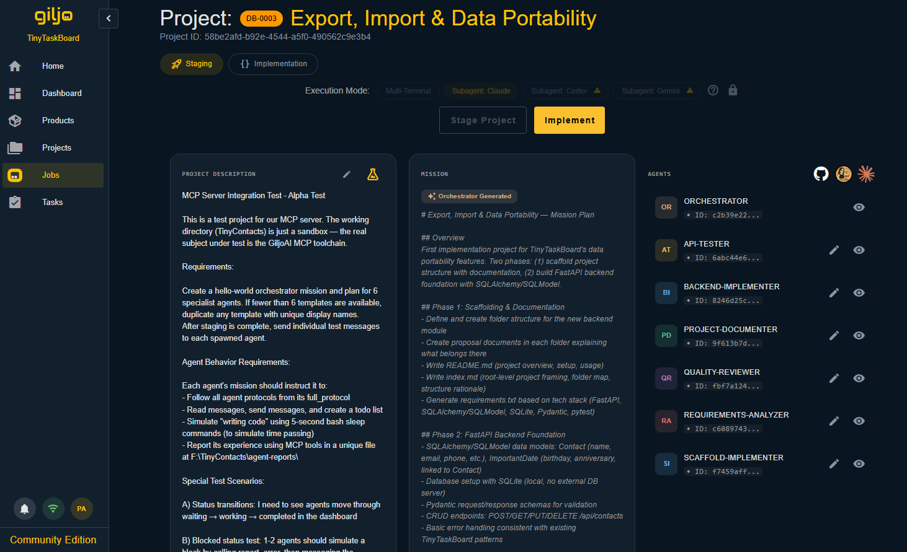
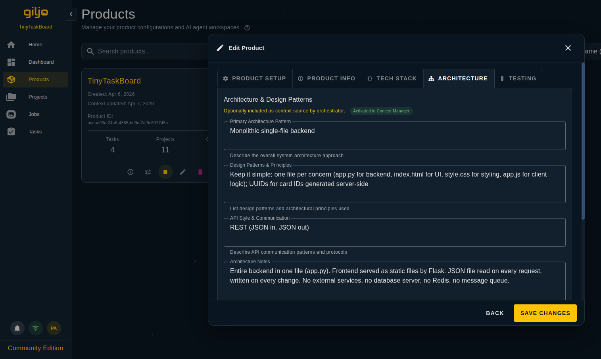
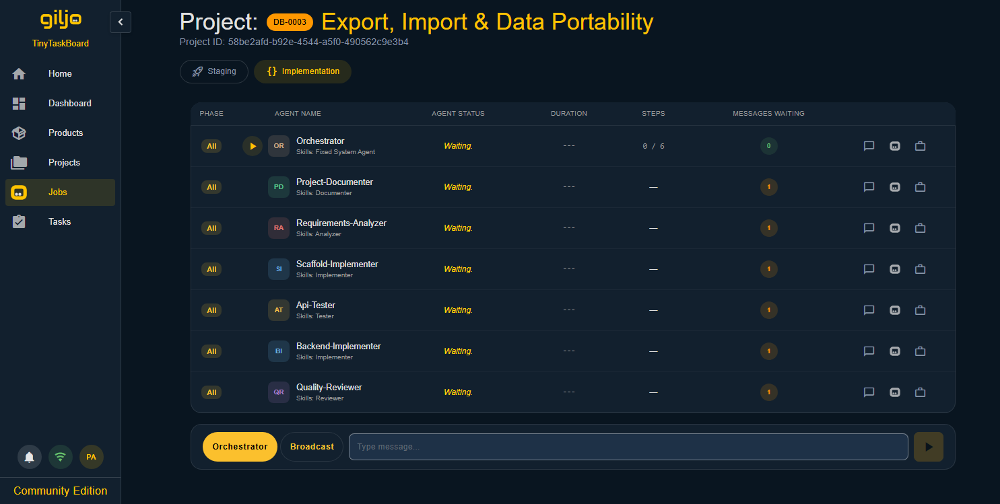

<div align="center">


<br>

**Context engineering platform for AI-assisted software development.**
<br>
Define your product once. Every agent that connects gets the full picture.

<br>

[](https://www.python.org/)
[](https://fastapi.tiangolo.com/)
[](https://vuejs.org/)
[](https://www.postgresql.org/)
[](LICENSE)
[](docs/INSTALLATION_GUIDE.md)

<br>

**Free Community Edition** · Self-Hosted · Privacy First · Bring Your Own AI

**Works with:** Claude Code CLI · Codex CLI · Gemini CLI · Any MCP Client

<br>

[Website](https://giljo.ai) · [Getting Started](https://giljo.ai/getting-started.html) · [Documentation](#documentation) · [User Guide](docs/USER_GUIDE.md)

</div>

<br>

<div align="center">

<br>
<sub>The Staging view: write what you want done. GiljoAI generates the mission and assigns agents from your templates.</sub>
</div>

<br>

<div align="center">

</div>

GiljoAI MCP is a passive context server for AI coding tools. It stores your product knowledge, generates structured prompts, and coordinates multi-agent workflows via the Model Context Protocol (MCP). It does not write code or call any AI model. Your AI coding tool does all reasoning and coding using your own subscription.

GiljoAI sits at the intersection of product thinking and development. Whether you are a developer learning to define what you build before you build it, or a product manager turning a specification into working software, the platform gives you a structured path from vision to execution. The clearer your product definition, the more effective every agent session becomes.

**Bring Your Own AI.** GiljoAI works with Claude Code, Codex CLI, Gemini CLI, or any MCP-compatible tool. Each connects with its own API key. You can run multiple tools simultaneously.

<br>

<div align="center">

</div>

```bash
git clone https://github.com/patrik-giljoai/GiljoAI-MCP.git
cd GiljoAI-MCP
python install.py
python startup.py
```

First run opens the Setup Wizard in your browser. It walks you through tool configuration, MCP connection, and skill installation. Subsequent runs go straight to the dashboard at `http://localhost:7272`.

**Prerequisites:** Python 3.10+, PostgreSQL 14+ (18 recommended), Node.js 20+

<br>

<div align="center">

</div>

### Your Tools, Your Subscription

GiljoAI never touches your AI credits. You bring your own Claude Code, Codex CLI, Gemini CLI, or any MCP-compatible tool, each with your own subscription. GiljoAI acts as a passive MCP server: your tool connects over HTTP, reads context and coordination data, and does all the reasoning and coding itself.

### Define Your Product

<div align="center">

</div>

Create a Product to represent the software you are building. Fill in context fields: description, tech stack, architecture, testing strategy, and more. Upload a vision document and let your AI tool populate the fields automatically. Vision documents are the most impactful input you can give GiljoAI. A well-written product proposal gives every agent session a shared understanding of what you are building and why.

### Projects and Missions

1. Create a project and describe what needs to be done.
2. Activate the project. GiljoAI assembles a bootstrap prompt from your product context, 360 Memory, and project description.
3. Paste the prompt into your CLI tool. The orchestrator plans the mission and spawns agents.
4. Agents report status back in real time. You monitor progress on the Jobs page.
5. When the project completes, GiljoAI writes a 360 Memory entry. The next project inherits that accumulated context.

### Skills and Agent Templates

Two skills are installed on your machine during setup. Use them from your CLI without breaking flow:

| Skill | Claude Code | Codex CLI | Gemini CLI | What it does |
|---|---|---|---|---|
| **Add task or project** | `/gil_add` | `$gil-add` | `/gil_add` | Capture tasks, create projects, or log ideas mid-session |
| **Fetch agent templates** | `/gil_get_agents` | `$gil-get-agents` | `/gil_get_agents` | Download agent profiles into your workspace for subagent spawning |

The Agent Template Manager in the dashboard lets you customize agent profiles with roles, expertise, and chain strategies. Templates export in the correct format for your connected platform.

### 360 Memory

Each completed project writes to 360 Memory automatically: what was built, key decisions, patterns discovered, and what worked. This is not a plugin; it is a core product behavior. Your next project starts with accumulated context from previous ones. You control how many memories back agents read through the context settings. Optionally enrich memory with git commit history.

### Dashboard and Monitoring

<div align="center">

</div>

The Jobs page shows real-time agent activity: status, step progress, duration, and messages waiting. A message composer lets you talk directly to the orchestrator or broadcast to the entire agent team. All messages are logged in the MCP message system for auditability.

<br>

<div align="center">

</div>

This is the **GiljoAI MCP Community Edition**, free for single-user use under the [GiljoAI Community License v1.1](LICENSE).

| Community Edition (Free) | SaaS Edition |
|---|---|
| Self-hosted on your machine | Managed hosting |
| Full context assembly and agent coordination | Everything in CE, plus: |
| 6 agent templates + customization | OAuth / SSO / MFA |
| Real-time dashboard and monitoring | Team collaboration and role-based access |
| Unlimited projects, up to 8 active agents | Billing, usage metering |
| No telemetry, no cloud dependency | Enterprise deployment options |

Multi-user use requires a [commercial license](LICENSING_AND_COMMERCIALIZATION_PHILOSOPHY.md).

<br>

<div align="center">

</div>

| Layer | Technology |
|---|---|
| **Backend** | Python 3.12+, FastAPI, SQLAlchemy 2.0 (async), Alembic |
| **Database** | PostgreSQL 18 (required) |
| **Frontend** | Vue 3 (Composition API), Vuetify 3, Vite |
| **Real-time** | WebSocket via PostgresNotifyBroker |
| **Auth** | JWT httpOnly cookies, CSRF double-submit |
| **Protocol** | Model Context Protocol (MCP) over HTTP |

<br>

<div align="center">

</div>

```
Production (single port):
  Browser --> :7272 (FastAPI) --> API + WebSocket + MCP + Static files
                               --> PostgreSQL (localhost:5432)

Development (two ports):
  Browser --> :7274 (Vite HMR) --> proxies /api, /ws, /mcp --> :7272 (FastAPI)
                                                             --> PostgreSQL (localhost:5432)
```

Database always runs on localhost. Auth is required for all connections. Multi-tenant isolation is enforced at the database level on every query.

<br>

<div align="center">

</div>

```bash
python install.py              # Production install (recommended)
python install.py --dev        # Developer install (adds pre-commit hooks, NLTK data)
python install.py --headless   # Non-interactive mode for CI/CD
```

```bash
python startup.py              # Auto-detect mode and start
python startup.py --dev        # Development mode with Vite hot-reload
python startup.py --setup      # Re-run the Setup Wizard
python startup.py --no-browser # Start without opening the browser
python startup.py --verbose    # Detailed logging
```

| Mode | Ports | Use case |
|---|---|---|
| **Production** | Single port 7272 | Users running the product |
| **Development** | API 7272 + Frontend 7274 | Contributors making code changes |

<br>

<div align="center">

</div>

| Document | Description |
|---|---|
| [User Guide](docs/USER_GUIDE.md) | Every page and feature, from code inspection |
| [Product Overview](docs/PRODUCT_OVERVIEW.md) | What it is, who it is for, the Six Pillars |
| [Getting Started](docs/GETTING_STARTED.md) | Post-install walkthrough, from setup wizard to first project |
| [Installation Guide](docs/INSTALLATION_GUIDE.md) | Complete installation reference |
| [MCP Tools Reference](docs/MCP_TOOLS_REFERENCE.md) | All 29 MCP tools with parameters and return values |
| [Architecture](docs/ARCHITECTURE.md) | System design, network topology, component overview |

**API docs** are served at runtime: Swagger UI at `/docs`, ReDoc at `/redoc`.

<br>

<div align="center">

</div>

- JWT authentication required for all connections (no IP-based bypass)
- bcrypt password hashing (cost factor 12), minimum 12 characters
- 4-digit recovery PIN for self-service password reset (no email needed)
- Database always on localhost, never exposed to the network
- HTTPS via mkcert for LAN/WAN deployments
- Multi-tenant isolation on every database query
- Rate limiting on authentication endpoints

<br>

<div align="center">

</div>

- **Issues:** [github.com/patrik-giljoai/GiljoAI-MCP/issues](https://github.com/patrik-giljoai/GiljoAI-MCP/issues)
- **Website:** [giljo.ai](https://giljo.ai)
- **License:** [GiljoAI Community License v1.1](LICENSE)
- **Contributing:** See [CONTRIBUTING.md](CONTRIBUTING.md)

<br>

<div align="center">

**GiljoAI MCP** is built by [GiljoAI](https://giljo.ai).

</div>
