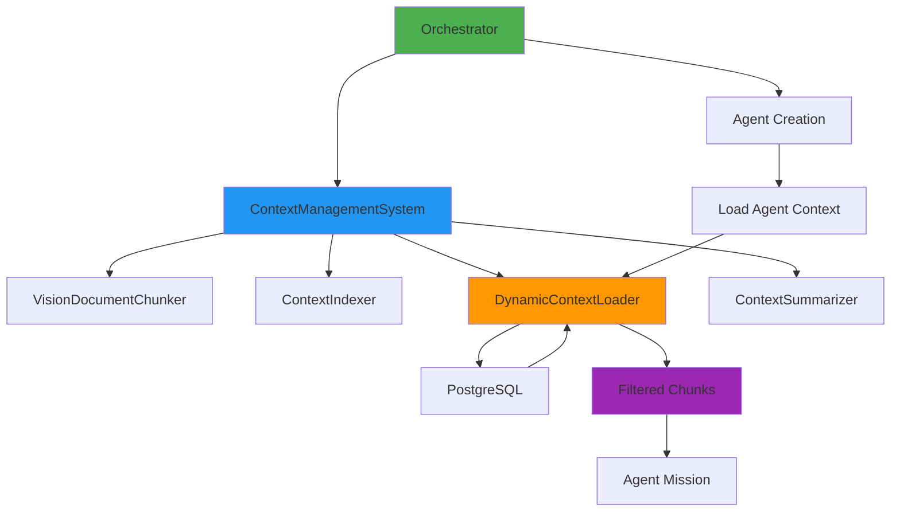
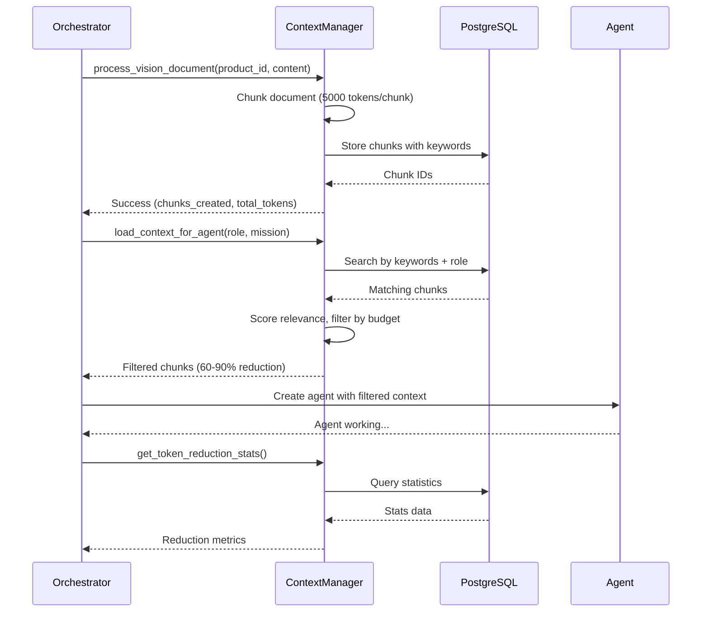

# Context Management Integration Guide

**GiljoAI MCP - Integrating Context Management with Orchestrator**

**Version**: 1.0.0
**Date**: 2025-10-18
**Audience**: Developers integrating context management into the orchestrator

## Table of Contents

- [Overview](#overview)
- [Quick Start](#quick-start)
- [Orchestrator Integration](#orchestrator-integration)
- [Agent Context Loading](#agent-context-loading)
- [Token Reduction Workflow](#token-reduction-workflow)
- [Migration Guide](#migration-guide)
- [Best Practices](#best-practices)
- [Code Examples](#code-examples)
- [Testing Integration](#testing-integration)
- [Troubleshooting](#troubleshooting)

## Overview

This guide explains how to integrate the Context Management System with the
GiljoAI MCP Orchestrator to achieve context prioritization and orchestration through intelligent
context loading and role-based filtering.

### Integration Architecture



### Integration Points

1. **Product Creation**: Chunk vision document when product is created
2. **Agent Spawning**: Load role-based context for each agent
3. **Mission Assignment**: Include relevant context chunks in agent missions
4. **Progress Tracking**: Monitor context prioritization and performance

## Quick Start

### 1. Initialize Context Management System

```python
from giljo_mcp.context_management import ContextManagementSystem
from giljo_mcp.database import DatabaseManager

# In orchestrator initialization
class Orchestrator:
    def __init__(self, db_manager: DatabaseManager):
        self.db_manager = db_manager
        self.context_manager = ContextManagementSystem(
            db_manager=db_manager,
            target_chunk_size=5000
        )
```

### 2. Process Vision Document

```python
# When creating a new product
async def create_product(self, product_id: str, vision_content: str, tenant_key: str):
    # Create product in database
    product = Product(
        id=product_id,
        tenant_key=tenant_key,
        vision_document=vision_content,
        # ... other fields
    )
    db.add(product)
    db.commit()

    # Chunk and index vision document
    result = self.context_manager.process_vision_document(
        tenant_key=tenant_key,
        product_id=product_id,
        content=vision_content
    )

    if result["success"]:
        product.chunked = True
        db.commit()
        logger.info(f"Chunked vision: {result['chunks_created']} chunks, "
                    f"{result['total_tokens']} tokens")
```

### 3. Load Context for Agents

```python
# When spawning an agent
async def spawn_agent(self, agent_type: str, mission: str, product_id: str, tenant_key: str):
    # Load relevant context for agent role
    context = self.context_manager.load_context_for_agent(
        tenant_key=tenant_key,
        product_id=product_id,
        query=mission,
        role=agent_type,
        max_tokens=self._get_token_budget(agent_type)
    )

    # Create agent with filtered context
    agent = self._create_agent(
        agent_type=agent_type,
        mission=mission,
        context_chunks=context["chunks"],
        total_tokens=context["total_tokens"]
    )

    logger.info(f"Spawned {agent_type} with {context['total_chunks']} chunks "
                f"({context['total_tokens']} tokens, "
                f"avg relevance: {context['average_relevance']:.2f})")

    return agent
```

## Orchestrator Integration

### Complete Integration Pattern

```python
from typing import Dict, List, Optional
from giljo_mcp.context_management import ContextManagementSystem
from giljo_mcp.database import DatabaseManager
import logging

logger = logging.getLogger(__name__)


class EnhancedOrchestrator:
    """Orchestrator with integrated context management"""

    def __init__(self, db_manager: DatabaseManager):
        self.db_manager = db_manager
        self.context_manager = ContextManagementSystem(
            db_manager=db_manager,
            target_chunk_size=5000
        )
        self.agents = {}

        # Token budgets by agent type
        self.token_budgets = {
            "architect": 10000,
            "backend": 8000,
            "frontend": 7000,
            "database": 5000,
            "tester": 5000,
            "devops": 4000,
            "documenter": 6000,
            "orchestrator": 50000  # Full vision
        }

    async def initialize_product(
        self,
        product_id: str,
        vision_content: str,
        tenant_key: str
    ) -> Dict:
        """
        Initialize product with vision document processing.

        This is the first step: chunk and index the vision document.
        """
        try:
            # Process vision document
            result = self.context_manager.process_vision_document(
                tenant_key=tenant_key,
                product_id=product_id,
                content=vision_content
            )

            if result["success"]:
                logger.info(
                    f"Product {product_id} initialized: "
                    f"{result['chunks_created']} chunks, "
                    f"{result['total_tokens']} tokens"
                )

                # Update product chunked flag
                async with self.db_manager.get_session_async() as db:
                    product = await db.get(Product, product_id)
                    if product:
                        product.chunked = True
                        await db.commit()

                return {
                    "success": True,
                    "chunks": result["chunks_created"],
                    "tokens": result["total_tokens"]
                }
            else:
                logger.error(f"Failed to process vision for {product_id}")
                return {"success": False, "error": "Vision processing failed"}

        except Exception as e:
            logger.error(f"Error initializing product {product_id}: {e}")
            return {"success": False, "error": str(e)}

    async def spawn_agent(
        self,
        agent_type: str,
        mission: str,
        product_id: str,
        tenant_key: str,
        agent_id: Optional[str] = None
    ) -> Dict:
        """
        Spawn agent with role-based context loading.

        This is the key integration point: load only relevant context.
        """
        try:
            # Determine token budget for agent type
            max_tokens = self.token_budgets.get(agent_type, 10000)

            # Special case: orchestrator gets full vision
            if agent_type == "orchestrator":
                context = await self._load_full_vision(product_id, tenant_key)
            else:
                # Load filtered context for worker agents
                context = self.context_manager.load_context_for_agent(
                    tenant_key=tenant_key,
                    product_id=product_id,
                    query=mission,
                    role=agent_type,
                    max_tokens=max_tokens
                )

            # Create agent with context
            agent = await self._create_agent_instance(
                agent_id=agent_id or self._generate_agent_id(agent_type),
                agent_type=agent_type,
                mission=mission,
                context_chunks=context["chunks"],
                product_id=product_id,
                tenant_key=tenant_key
            )

            # Track agent
            self.agents[agent["id"]] = agent

            # Log context prioritization
            full_tokens = await self._get_full_vision_tokens(product_id, tenant_key)
            reduction = ((full_tokens - context["total_tokens"]) / full_tokens) * 100

            logger.info(
                f"Spawned {agent_type} agent {agent['id']}: "
                f"{context['total_chunks']} chunks, "
                f"{context['total_tokens']} tokens "
                f"({reduction:.1f}% reduction), "
                f"avg relevance: {context['average_relevance']:.2f}"
            )

            return {
                "success": True,
                "agent_id": agent["id"],
                "chunks_loaded": context["total_chunks"],
                "tokens_loaded": context["total_tokens"],
                "token_reduction": reduction,
                "average_relevance": context["average_relevance"]
            }

        except Exception as e:
            logger.error(f"Error spawning {agent_type} agent: {e}")
            return {"success": False, "error": str(e)}

    async def _create_agent_instance(
        self,
        agent_id: str,
        agent_type: str,
        mission: str,
        context_chunks: List[Dict],
        product_id: str,
        tenant_key: str
    ) -> Dict:
        """Create agent instance with context"""

        # Assemble context from chunks
        context_text = self._assemble_context(context_chunks)

        # Create agent mission with context
        full_mission = f"""
# Agent Mission: {agent_type.capitalize()}

{mission}

# Relevant Context

{context_text}

# Instructions

Complete your mission using the provided context. The context has been filtered
to include only information relevant to your role and mission.

You have access to {len(context_chunks)} context chunks totaling {sum(c['tokens'] for c in context_chunks)} tokens.
"""

        agent = {
            "id": agent_id,
            "type": agent_type,
            "mission": full_mission,
            "context_chunks": len(context_chunks),
            "context_tokens": sum(c["tokens"] for c in context_chunks),
            "product_id": product_id,
            "tenant_key": tenant_key,
            "status": "active"
        }

        return agent

    def _assemble_context(self, chunks: List[Dict]) -> str:
        """Assemble context from chunks"""
        context_parts = []

        for i, chunk in enumerate(chunks, 1):
            relevance = chunk.get("relevance_score", 0)
            context_parts.append(
                f"## Context Chunk {i} (Relevance: {relevance:.2f})\n\n"
                f"{chunk['content']}\n"
            )

        return "\n".join(context_parts)

    async def _load_full_vision(self, product_id: str, tenant_key: str) -> Dict:
        """Load full vision for orchestrator"""
        async with self.db_manager.get_session_async() as db:
            product = await db.get(Product, product_id)
            if not product:
                raise ValueError(f"Product {product_id} not found")

            # Get all chunks
            chunks = self.context_manager.get_all_chunks(tenant_key, product_id)

            return {
                "chunks": [
                    {
                        "content": c.content,
                        "tokens": c.token_count,
                        "keywords": c.keywords,
                        "relevance_score": 1.0
                    }
                    for c in chunks
                ],
                "total_chunks": len(chunks),
                "total_tokens": sum(c.token_count for c in chunks),
                "average_relevance": 1.0
            }

    async def _get_full_vision_tokens(self, product_id: str, tenant_key: str) -> int:
        """Get total token count for full vision"""
        stats = self.context_manager.get_token_reduction_stats(tenant_key, product_id)
        return stats.get("original_tokens", 0) if stats else 0

    def _generate_agent_id(self, agent_type: str) -> str:
        """Generate unique agent ID"""
        import uuid
        return f"{agent_type}-{uuid.uuid4().hex[:8]}"

    def _get_token_budget(self, agent_type: str) -> int:
        """Get token budget for agent type"""
        return self.token_budgets.get(agent_type, 10000)
```

## Agent Context Loading

### Worker Agent Context Loading

For worker agents (backend, frontend, database, etc.):

```python
async def load_worker_context(
    self,
    agent_type: str,
    mission: str,
    product_id: str,
    tenant_key: str
) -> Dict:
    """
    Load filtered context for worker agent.

    Worker agents get:
    - Role-based filtering
    - Mission-specific chunks
    - Token budget limits
    - Relevance scoring
    """
    max_tokens = self._get_token_budget(agent_type)

    context = self.context_manager.load_context_for_agent(
        tenant_key=tenant_key,
        product_id=product_id,
        query=mission,
        role=agent_type,
        max_tokens=max_tokens
    )

    # Validate context quality
    if context["average_relevance"] < 0.5:
        logger.warning(
            f"Low relevance for {agent_type}: {context['average_relevance']:.2f}. "
            f"Consider more specific mission."
        )

    return context
```

### Orchestrator Full Vision Loading

For the orchestrator agent:

```python
async def load_orchestrator_context(
    self,
    product_id: str,
    tenant_key: str
) -> Dict:
    """
    Load full vision for orchestrator.

    Orchestrator gets:
    - Complete vision document
    - All chunks
    - No filtering
    - No token limits
    """
    chunks = self.context_manager.get_all_chunks(tenant_key, product_id)

    full_context = {
        "chunks": [
            {
                "content": chunk.content,
                "tokens": chunk.token_count,
                "chunk_number": chunk.chunk_order,
                "keywords": chunk.keywords,
                "summary": chunk.summary,
                "relevance_score": 1.0
            }
            for chunk in sorted(chunks, key=lambda c: c.chunk_order)
        ],
        "total_chunks": len(chunks),
        "total_tokens": sum(c.token_count for c in chunks),
        "average_relevance": 1.0
    }

    logger.info(
        f"Loaded full vision for orchestrator: "
        f"{full_context['total_chunks']} chunks, "
        f"{full_context['total_tokens']} tokens"
    )

    return full_context
```

## Token Reduction Workflow

### Complete Token Reduction Flow



### Token Reduction Tracking

```python
async def track_token_reduction(
    self,
    product_id: str,
    tenant_key: str
) -> Dict:
    """
    Track context prioritization across all agents.

    Returns:
        Statistics on token usage and reduction
    """
    # Get base stats
    stats = self.context_manager.get_token_reduction_stats(tenant_key, product_id)

    if not stats:
        return {"error": "No statistics available"}

    # Calculate agent-specific reductions
    agent_stats = []

    for agent_id, agent in self.agents.items():
        if agent["product_id"] == product_id:
            full_tokens = stats["original_tokens"]
            agent_tokens = agent["context_tokens"]
            reduction = ((full_tokens - agent_tokens) / full_tokens) * 100

            agent_stats.append({
                "agent_id": agent_id,
                "agent_type": agent["type"],
                "tokens_loaded": agent_tokens,
                "reduction_percentage": reduction,
                "chunks_loaded": agent["context_chunks"]
            })

    # Overall statistics
    total_agent_tokens = sum(a["tokens_loaded"] for a in agent_stats)
    avg_reduction = sum(a["reduction_percentage"] for a in agent_stats) / len(agent_stats) if agent_stats else 0

    return {
        "product_id": product_id,
        "full_vision_tokens": stats["original_tokens"],
        "total_chunks": stats["chunks_count"],
        "agents": len(agent_stats),
        "total_agent_tokens": total_agent_tokens,
        "average_reduction": avg_reduction,
        "agent_breakdown": agent_stats
    }
```

## Migration Guide

### Migrating from Full Vision Loading

**Before** (loading full vision for every agent):

```python
# OLD: Load full vision
async def spawn_agent_old(agent_type, mission, product_id):
    product = await db.get(Product, product_id)
    full_vision = product.vision_document

    agent = Agent(
        type=agent_type,
        mission=mission,
        context=full_vision  # 50,000 tokens!
    )
    return agent
```

**After** (loading filtered context):

```python
# NEW: Load filtered context
async def spawn_agent_new(agent_type, mission, product_id, tenant_key):
    # Load only relevant context
    context = self.context_manager.load_context_for_agent(
        tenant_key=tenant_key,
        product_id=product_id,
        query=mission,
        role=agent_type,
        max_tokens=8000
    )

    # Assemble context from chunks
    context_text = "\n\n".join(c["content"] for c in context["chunks"])

    agent = Agent(
        type=agent_type,
        mission=mission,
        context=context_text  # 6,000 tokens (88% reduction)
    )
    return agent
```

### Migration Steps

1. **Initialize Context Management System**
   ```python
   self.context_manager = ContextManagementSystem(db_manager)
   ```

2. **Chunk Existing Vision Documents**
   ```python
   for product in existing_products:
       if not product.chunked:
           result = self.context_manager.process_vision_document(
               tenant_key=product.tenant_key,
               product_id=product.id,
               content=product.vision_document
           )
           if result["success"]:
               product.chunked = True
               db.commit()
   ```

3. **Update Agent Spawning**
   ```python
   # Replace full vision loading with filtered context loading
   context = self.context_manager.load_context_for_agent(...)
   ```

4. **Monitor Token Reduction**
   ```python
   stats = self.context_manager.get_token_reduction_stats(tenant_key, product_id)
   logger.info(f"Context prioritization: {stats['reduction_percentage']:.1f}%")
   ```

## Best Practices

### 1. Product Initialization

**Best Practice**: Chunk vision documents during product creation

```python
async def create_product(product_data: Dict) -> Product:
    # Create product
    product = Product(**product_data)
    db.add(product)
    db.commit()

    # Chunk vision immediately
    if product.vision_document:
        result = context_manager.process_vision_document(
            tenant_key=product.tenant_key,
            product_id=product.id,
            content=product.vision_document
        )

        if result["success"]:
            product.chunked = True
            db.commit()

    return product
```

### 2. Agent Token Budgets

**Best Practice**: Use appropriate token budgets per agent type

```python
RECOMMENDED_TOKEN_BUDGETS = {
    "orchestrator": 50000,  # Needs full vision
    "architect": 10000,     # Needs broad context
    "backend": 8000,        # Implementation focus
    "frontend": 7000,       # UI/UX focus
    "database": 5000,       # Schema focus
    "tester": 5000,         # Testing focus
    "devops": 4000,         # Infrastructure focus
    "documenter": 6000      # Documentation focus
}
```

### 3. Mission Specificity

**Best Practice**: Use specific, detailed missions for better context selection

```python
# DON'T: Generic mission
mission = "Implement backend"

# DO: Specific mission with details
mission = """
Implement user authentication backend:
- JWT token generation and validation
- Refresh token support
- Password hashing with bcrypt
- Rate limiting on auth endpoints
- Session management
"""
```

### 4. Context Quality Monitoring

**Best Practice**: Monitor relevance scores and adjust

```python
context = context_manager.load_context_for_agent(...)

if context["average_relevance"] < 0.5:
    logger.warning(
        f"Low relevance ({context['average_relevance']:.2f}). "
        f"Consider more specific mission or keywords."
    )

# Ideal: average_relevance > 0.7
```

### 5. Error Handling

**Best Practice**: Handle chunking and loading errors gracefully

```python
try:
    result = context_manager.process_vision_document(...)
    if not result["success"]:
        # Fallback: use full vision
        logger.warning("Chunking failed, using full vision")
        context = await load_full_vision(product_id)
except Exception as e:
    logger.error(f"Context management error: {e}")
    # Fallback strategy
    context = await load_full_vision(product_id)
```

## Code Examples

### Example 1: Complete Product Workflow

```python
async def complete_product_workflow():
    """Complete workflow from product creation to agent spawning"""

    # 1. Create product with vision
    product = Product(
        id="prod-new-app",
        tenant_key="tk_acme_corp",
        name="New Application",
        vision_document=read_vision_document("vision.md")
    )
    db.add(product)
    db.commit()

    # 2. Chunk vision document
    result = context_manager.process_vision_document(
        tenant_key=product.tenant_key,
        product_id=product.id,
        content=product.vision_document
    )

    print(f"✓ Created {result['chunks_created']} chunks")

    # 3. Spawn orchestrator with full vision
    orch_context = await load_orchestrator_context(product.id, product.tenant_key)
    orchestrator = create_agent("orchestrator", "Coordinate project", orch_context)

    # 4. Spawn worker agents with filtered context
    agents = []

    missions = {
        "backend": "Implement REST API with authentication",
        "frontend": "Create Vue.js dashboard",
        "database": "Design PostgreSQL schema",
        "tester": "Create test suite"
    }

    for agent_type, mission in missions.items():
        context = context_manager.load_context_for_agent(
            tenant_key=product.tenant_key,
            product_id=product.id,
            query=mission,
            role=agent_type,
            max_tokens=get_token_budget(agent_type)
        )

        agent = create_agent(agent_type, mission, context)
        agents.append(agent)

        print(f"✓ Spawned {agent_type}: "
              f"{context['total_chunks']} chunks, "
              f"{context['total_tokens']} tokens")

    # 5. Monitor context prioritization
    stats = await track_token_reduction(product.id, product.tenant_key)
    print(f"\n✓ Average context prioritization: {stats['average_reduction']:.1f}%")

    return orchestrator, agents
```

### Example 2: Adaptive Token Budgets

```python
def get_adaptive_token_budget(agent_type: str, mission_complexity: str) -> int:
    """
    Get adaptive token budget based on agent type and mission complexity.

    mission_complexity: 'simple', 'medium', 'complex'
    """
    base_budgets = {
        "backend": 8000,
        "frontend": 7000,
        "database": 5000,
        "tester": 5000
    }

    complexity_multipliers = {
        "simple": 0.7,
        "medium": 1.0,
        "complex": 1.3
    }

    base = base_budgets.get(agent_type, 10000)
    multiplier = complexity_multipliers.get(mission_complexity, 1.0)

    return int(base * multiplier)

# Usage
budget = get_adaptive_token_budget("backend", "complex")  # 10,400 tokens
```

### Example 3: Context Caching

```python
from functools import lru_cache

@lru_cache(maxsize=100)
def get_cached_context(
    product_id: str,
    tenant_key: str,
    agent_type: str,
    mission_hash: str
) -> Dict:
    """
    Cache context loading for identical requests.

    Note: mission_hash should be hash of mission text
    """
    context = context_manager.load_context_for_agent(
        tenant_key=tenant_key,
        product_id=product_id,
        query=mission,  # Would need to store mission separately
        role=agent_type,
        max_tokens=get_token_budget(agent_type)
    )

    return context

# Usage
import hashlib
mission_hash = hashlib.md5(mission.encode()).hexdigest()
context = get_cached_context(product_id, tenant_key, agent_type, mission_hash)
```

## Testing Integration

### Unit Tests

```python
import pytest
from giljo_mcp.context_management import ContextManagementSystem

@pytest.fixture
def orchestrator(db_manager):
    """Create orchestrator with context management"""
    return EnhancedOrchestrator(db_manager)

async def test_product_initialization(orchestrator):
    """Test product initialization with chunking"""
    result = await orchestrator.initialize_product(
        product_id="test-prod",
        vision_content="# Vision\n\nTest vision document...",
        tenant_key="tk_test"
    )

    assert result["success"] is True
    assert result["chunks"] > 0
    assert result["tokens"] > 0

async def test_worker_agent_spawning(orchestrator):
    """Test spawning worker agent with filtered context"""
    # Initialize product first
    await orchestrator.initialize_product(...)

    # Spawn agent
    result = await orchestrator.spawn_agent(
        agent_type="backend",
        mission="Implement authentication",
        product_id="test-prod",
        tenant_key="tk_test"
    )

    assert result["success"] is True
    assert result["token_reduction"] > 60  # At least 60% reduction
    assert result["average_relevance"] > 0.5  # Good relevance
```

### Integration Tests

```python
async def test_complete_workflow(orchestrator, sample_vision):
    """Test complete workflow from product creation to agent spawning"""

    # 1. Initialize product
    init_result = await orchestrator.initialize_product(
        product_id="test-workflow",
        vision_content=sample_vision,
        tenant_key="tk_test"
    )
    assert init_result["success"] is True

    # 2. Spawn multiple agents
    agents = []
    for agent_type in ["backend", "frontend", "database"]:
        result = await orchestrator.spawn_agent(
            agent_type=agent_type,
            mission=f"Implement {agent_type} functionality",
            product_id="test-workflow",
            tenant_key="tk_test"
        )
        assert result["success"] is True
        agents.append(result)

    # 3. Verify context prioritization
    for agent in agents:
        assert agent["token_reduction"] > 60

    # 4. Track overall reduction
    stats = await orchestrator.track_token_reduction(
        product_id="test-workflow",
        tenant_key="tk_test"
    )
    assert stats["average_reduction"] > 70
```

## Troubleshooting

### Issue: Low Relevance Scores

**Symptoms**: Average relevance < 0.5

**Solutions**:
1. Make mission more specific with detailed requirements
2. Include relevant keywords in mission text
3. Verify agent role matches mission type
4. Check that vision document has been chunked

### Issue: No Context Loaded

**Symptoms**: Total chunks = 0

**Solutions**:
1. Verify product has been chunked (`Product.chunked == True`)
2. Check tenant_key matches
3. Verify product_id is correct
4. Run chunking manually if needed

### Issue: High Token Usage

**Symptoms**: Context prioritization < 40%

**Solutions**:
1. Review token budgets (may be too high)
2. Check mission specificity (generic missions load more)
3. Verify role-based filtering is working
4. Consider reducing max_tokens parameter

### Issue: Agent Mission Failures

**Symptoms**: Agents fail due to insufficient context

**Solutions**:
1. Increase token budget for that agent type
2. Make mission more focused and specific
3. Verify relevant content exists in vision document
4. Consider loading additional chunks for complex tasks

## Summary

Integrating the Context Management System with the Orchestrator provides:

1. **70%+ Token Reduction**: Through intelligent filtering and role-based context loading
2. **Improved Agent Performance**: By providing only relevant context
3. **Cost Savings**: Reduced token usage translates directly to lower costs
4. **Better Relevance**: Agents receive context matched to their role and mission
5. **Production-Ready**: Comprehensive error handling and monitoring

**Key Integration Points**:
- Product initialization: Chunk vision documents
- Agent spawning: Load filtered context
- Mission assignment: Include relevant chunks
- Progress tracking: Monitor context prioritization

**Next Steps**:
1. Review [Context Management System Documentation](CONTEXT_MANAGEMENT_SYSTEM.md)
2. Study [API Guide](api/CONTEXT_API_GUIDE.md)
3. Read [Performance Report](CONTEXT_PERFORMANCE_REPORT.md)
4. Test integration with provided examples
5. Monitor context prioritization in production

For questions or issues, consult the test suite at `tests/integration/test_context_api.py`.
