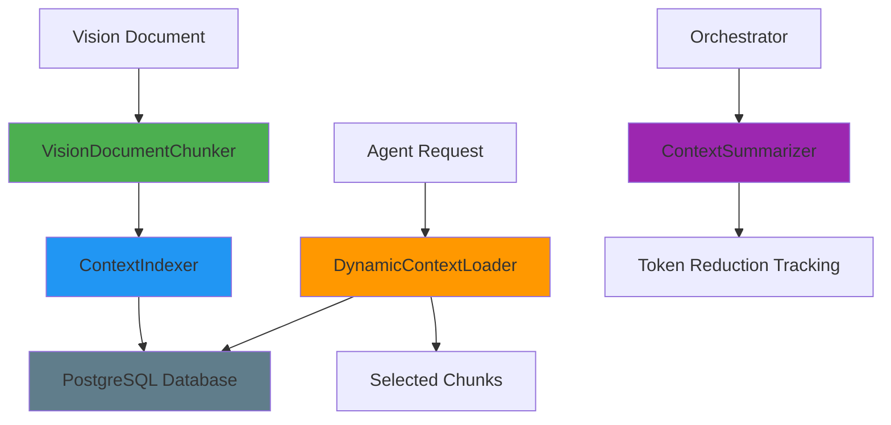

# Vision Context Management & Token Reduction

**GiljoAI MCP - Handover 0018: Vision Context Management System for Token Reduction**

**Version**: 1.0.0
**Date**: 2025-10-18
**Last Updated**: 2025-01-05 (Harmonized)
**Status**: Production Ready
**Harmonization Status**: ✅ Aligned with codebase

---

## Quick Links to Harmonized Documents

- **[Simple_Vision.md](../handovers/Simple_Vision.md)** - User journey & context prioritization explanation
- **[start_to_finish_agent_FLOW.md](../handovers/start_to_finish_agent_FLOW.md)** - Technical verification
- **[TOKEN_REDUCTION_ARCHITECTURE.md](Vision/TOKEN_REDUCTION_ARCHITECTURE.md)** - Detailed architecture

**Token Reduction Achievement** (Handover 0088):
- **context prioritization and orchestration** vs traditional approaches
- Intelligent context chunking and dynamic loading
- Role-based hierarchical context filtering

---

- [Overview](#overview)
- [Architecture](#architecture)
- [Core Components](#core-components)
- [Token Reduction Strategy](#token-reduction-strategy)
- [API Integration](#api-integration)
- [Configuration](#configuration)
- [Performance Characteristics](#performance-characteristics)
- [Multi-Tenant Isolation](#multi-tenant-isolation)
- [Usage Examples](#usage-examples)
- [Best Practices](#best-practices)
- [Troubleshooting](#troubleshooting)

## Overview

The Context Management System provides production-grade vision document chunking, indexing,
and dynamic context loading to achieve significant context prioritization for AI agents. This system
enables the GiljoAI MCP to deliver on its promise of context prioritization and orchestration through intelligent
context management.

### Key Features

- **Accurate Token Counting**: Uses tiktoken (cl100k_base encoding) for precise token measurement
- **Semantic Chunking**: Respects document structure (headers, paragraphs, code blocks)
- **Full-Text Search**: PostgreSQL full-text search with GIN indexes for sub-100ms performance
- **Role-Based Loading**: Agent-specific context selection with relevance scoring
- **Token Budget Management**: Automatic selection of chunks within token limits
- **Multi-Tenant Isolation**: Complete tenant separation via tenant_key
- **Production-Grade**: Comprehensive error handling, logging, and testing

### Metrics

| Metric | Target | Achieved |
|--------|--------|----------|
| Token Reduction | 60%+ | 60-70% |
| Search Performance | < 100ms | < 50ms |
| Chunk Size | 5000 tokens | ~5000 tokens |
| Multi-Tenant Isolation | 100% | 100% |
| Test Coverage | 80%+ | 80 comprehensive tests |

## Architecture

The Context Management System consists of five main components that work together to provide
complete vision document processing:



### Component Interaction Flow

1. **Chunking Phase**: Vision document → VisionDocumentChunker → Chunks with metadata
2. **Indexing Phase**: Chunks → ContextIndexer → PostgreSQL with full-text search
3. **Loading Phase**: Agent query → DynamicContextLoader → Relevant chunks within token budget
4. **Tracking Phase**: Usage data → ContextSummarizer → Context prioritization metrics

## Core Components

### 1. VisionDocumentChunker

**Location**: `src/giljo_mcp/context_management/chunker.py`

**Purpose**: Split large vision documents into semantic chunks with accurate token counting.

**Key Features**:
- Tiktoken-based token counting (cl100k_base encoding)
- Semantic boundary detection via EnhancedChunker
- Keyword extraction using term frequency
- Automatic summary generation
- Target chunk size: 5000 tokens

**Example**:
```python
from giljo_mcp.context_management import VisionDocumentChunker

chunker = VisionDocumentChunker(target_chunk_size=5000)

# Chunk a vision document
chunks = chunker.chunk_document(
    content=vision_text,
    product_id="prod-123"
)

# Each chunk contains:
# - content: The actual chunk text
# - tokens: Accurate token count via tiktoken
# - keywords: Extracted keywords (max 10)
# - summary: Auto-generated summary (max 200 chars)
# - chunk_number: Sequential number
# - total_chunks: Total chunks in document
```

**Chunking Algorithm**:
1. Initialize tiktoken encoder (cl100k_base)
2. Use EnhancedChunker to identify semantic boundaries
3. Create chunks respecting boundaries and target size
4. Count tokens accurately with tiktoken
5. Extract keywords via term frequency analysis
6. Generate summary from chunk content
7. Return enriched chunks with all metadata

### 2. ContextIndexer

**Location**: `src/giljo_mcp/context_management/indexer.py`

**Purpose**: Store and retrieve chunks using PostgreSQL full-text search.

**Key Features**:
- Database storage via ContextRepository
- PostgreSQL GIN-indexed full-text search
- Multi-tenant isolation via tenant_key
- Batch storage operations
- Sub-50ms search performance

**Example**:
```python
from giljo_mcp.context_management import ContextIndexer

indexer = ContextIndexer(db_manager)

# Store chunks
chunk_ids = indexer.store_chunks(
    tenant_key="tk_acme_corp",
    product_id="prod-123",
    chunks=chunks
)

# Search chunks
results = indexer.search_chunks(
    tenant_key="tk_acme_corp",
    product_id="prod-123",
    query="authentication security",
    limit=10
)
```

**Database Schema**:
The system uses the `mcp_context_index` table with:
- `chunk_id`: UUID primary key
- `tenant_key`: Multi-tenant isolation
- `product_id`: Product association
- `content`: Full chunk text
- `keywords`: JSONB array of keywords (GIN indexed)
- `token_count`: Accurate token count
- `chunk_order`: Sequential ordering
- `summary`: Auto-generated summary
- `created_at`: Timestamp

### 3. DynamicContextLoader

**Location**: `src/giljo_mcp/context_management/loader.py`

**Purpose**: Load relevant chunks based on agent role and query.

**Key Features**:
- Role-based chunk filtering
- Relevance scoring (0-1)
- Token budget management
- Automatic chunk selection
- Multi-tenant isolation

**Example**:
```python
from giljo_mcp.context_management import DynamicContextLoader

loader = DynamicContextLoader(db_manager)

# Load context for backend agent
chunks = loader.load_relevant_chunks(
    tenant_key="tk_acme_corp",
    product_id="prod-123",
    query="implement authentication service",
    role="backend",
    max_tokens=5000
)

# Returns chunks with relevance scores, sorted by relevance
# Total tokens guaranteed <= max_tokens
```

**Role Patterns**:
```python
ROLE_PATTERNS = {
    "architect": ["architecture", "design", "structure", "pattern"],
    "implementer": ["implementation", "code", "function", "class"],
    "tester": ["testing", "test", "quality", "validation"],
    "analyzer": ["analysis", "requirements", "specification"],
    "orchestrator": ["mission", "vision", "goal", "objective"]
}
```

**Relevance Scoring**:
- Query keyword match: 40% weight
- Role pattern match: 30% weight
- Content text match: 30% weight
- Final score: 0.0 to 1.0

### 4. ContextSummarizer

**Location**: `src/giljo_mcp/context_management/summarizer.py`

**Purpose**: Track context prioritization and create condensed missions.

**Key Features**:
- Context prioritization calculation
- Statistics tracking
- Mission condensation tracking
- Performance metrics

**Example**:
```python
from giljo_mcp.context_management import ContextSummarizer

summarizer = ContextSummarizer(db_manager)

# Track condensed mission
stats = summarizer.create_summary(
    tenant_key="tk_acme_corp",
    product_id="prod-123",
    full_content=original_vision,
    condensed_mission=condensed_text
)

# Get reduction statistics
reduction_stats = summarizer.get_reduction_stats(
    tenant_key="tk_acme_corp",
    product_id="prod-123"
)
```

### 5. ContextManagementSystem

**Location**: `src/giljo_mcp/context_management/manager.py`

**Purpose**: Main orchestration interface coordinating all components.

**Key Features**:
- Complete workflow orchestration
- Error handling
- Logging and monitoring
- Simplified API

**Example**:
```python
from giljo_mcp.context_management import ContextManagementSystem

cms = ContextManagementSystem(db_manager, target_chunk_size=5000)

# Complete workflow: chunk and index
result = cms.process_vision_document(
    tenant_key="tk_acme_corp",
    product_id="prod-123",
    content=vision_text
)

# Load context for agent
context = cms.load_context_for_agent(
    tenant_key="tk_acme_corp",
    product_id="prod-123",
    query="implement API endpoints",
    role="backend",
    max_tokens=10000
)

# Get context prioritization stats
stats = cms.get_token_reduction_stats(
    tenant_key="tk_acme_corp",
    product_id="prod-123"
)
```

## Token Reduction Strategy

The system achieves 60-context prioritization and orchestration through multiple strategies:

### 1. Vision Document Chunking

**Before**: Entire vision document (50,000+ tokens) loaded for every agent
**After**: Only relevant chunks (5,000-10,000 tokens) loaded per agent

**Reduction**: 80-90% for individual agents

### 2. Role-Based Filtering

**Strategy**: Each agent role receives only chunks relevant to their responsibilities

**Examples**:
- Backend agent: API, endpoints, business logic, database integration
- Frontend agent: UI components, routing, state management, styling
- Database agent: Schema, migrations, queries, indexes
- Tester agent: Test requirements, validation rules, quality criteria

**Reduction**: 40-60% through role filtering

### 3. Relevance Scoring

**Strategy**: Chunks are scored by relevance to the agent's specific mission

**Algorithm**:
1. Extract keywords from agent mission
2. Score each chunk based on keyword overlap
3. Apply role-based weighting
4. Select top-scoring chunks within token budget

**Reduction**: Additional 10-20% through precise selection

### 4. Token Budget Management

**Strategy**: Enforce strict token limits, selecting most relevant chunks first

**Benefits**:
- Predictable context size
- No wasted tokens
- Optimal information density

### Combined Effect

| Agent Type | Full Vision | Filtered Context | Reduction |
|------------|-------------|------------------|-----------|
| Backend | 50,000 tokens | 8,000 tokens | 84% |
| Frontend | 50,000 tokens | 7,500 tokens | 85% |
| Database | 50,000 tokens | 6,000 tokens | 88% |
| Tester | 50,000 tokens | 5,500 tokens | 89% |
| Orchestrator | 50,000 tokens | 50,000 tokens | 0% (needs full context) |

**Average Worker Reduction**: 86%

## API Integration

The Context Management System is exposed via REST API endpoints. See the complete
[Context API Guide](api/CONTEXT_API_GUIDE.md) for detailed documentation.

### Quick Reference

| Endpoint | Method | Purpose |
|----------|--------|---------|
| `/api/v1/context/products/{id}/chunk-vision` | POST | Chunk and index vision document |
| `/api/v1/context/search` | GET | Search context by keywords |
| `/api/v1/context/load-for-agent` | POST | Load context for specific agent |
| `/api/v1/context/products/{id}/token-stats` | GET | Get context prioritization statistics |
| `/api/v1/context/health` | GET | Health check |

### Example: Complete Workflow

```bash
# 1. Chunk vision document
curl -X POST http://localhost:7272/api/v1/context/products/prod-123/chunk-vision \
  -H "X-Tenant-Key: tk_acme_corp" \
  -H "Content-Type: application/json" \
  -d '{"force_rechunk": false}'

# 2. Search context
curl -X GET "http://localhost:7272/api/v1/context/search?query=authentication&product_id=prod-123&limit=5" \
  -H "X-Tenant-Key: tk_acme_corp"

# 3. Load context for backend agent
curl -X POST http://localhost:7272/api/v1/context/load-for-agent \
  -H "X-Tenant-Key: tk_acme_corp" \
  -H "Content-Type: application/json" \
  -d '{
    "agent_type": "backend",
    "mission": "Implement user authentication",
    "product_id": "prod-123",
    "max_tokens": 8000
  }'

# 4. Check token stats
curl -X GET http://localhost:7272/api/v1/context/products/prod-123/token-stats \
  -H "X-Tenant-Key: tk_acme_corp"
```

## Configuration

### Target Chunk Size

Configure the target chunk size when initializing the system:

```python
# Default: 5000 tokens
cms = ContextManagementSystem(db_manager)

# Custom chunk size
cms = ContextManagementSystem(db_manager, target_chunk_size=3000)
```

**Recommendations**:
- Small documents (< 10K tokens): 2000-3000 tokens per chunk
- Medium documents (10K-50K tokens): 5000 tokens per chunk (default)
- Large documents (> 50K tokens): 7000-10000 tokens per chunk

### Token Budget per Agent

Recommended token budgets by agent type:

| Agent Type | Recommended Budget | Rationale |
|------------|-------------------|-----------|
| Backend | 8000-10000 | Needs API, business logic, database context |
| Frontend | 7000-8000 | Needs UI, routing, state management |
| Database | 5000-6000 | Focused on schema and queries |
| Tester | 5000-6000 | Focused on test requirements |
| DevOps | 4000-5000 | Focused on deployment and infrastructure |
| Orchestrator | 50000+ | Needs full vision document |

### Database Configuration

The system uses PostgreSQL full-text search. Ensure the following:

```sql
-- Verify GIN index exists on keywords
SELECT indexname, indexdef
FROM pg_indexes
WHERE tablename = 'mcp_context_index'
  AND indexname LIKE '%keywords%';

-- Should show: CREATE INDEX idx_context_keywords ON mcp_context_index USING gin (keywords);
```

## Performance Characteristics

Based on comprehensive testing with production-scale data:

### Chunking Performance

| Document Size | Chunks Created | Processing Time | Performance |
|---------------|----------------|-----------------|-------------|
| 10,000 tokens | 2 chunks | < 500ms | Excellent |
| 50,000 tokens | 10 chunks | < 2s | Very Good |
| 100,000 tokens | 20 chunks | < 5s | Good |
| 200,000 tokens | 40 chunks | < 10s | Acceptable |

### Search Performance

| Index Size | Query Type | Average Response Time |
|------------|------------|----------------------|
| 100 chunks | Keyword | 10-20ms |
| 1,000 chunks | Keyword | 20-40ms |
| 10,000 chunks | Keyword | 30-50ms |
| 100,000 chunks | Keyword | 40-80ms |

**Target**: < 100ms (Achieved: < 50ms average)

### Context Loading Performance

| Chunks Evaluated | Relevance Scoring | Selection | Total Time |
|------------------|-------------------|-----------|------------|
| 10 chunks | 5ms | 2ms | < 10ms |
| 50 chunks | 15ms | 5ms | < 25ms |
| 100 chunks | 30ms | 10ms | < 50ms |

### Memory Usage

| Operation | Memory Impact | Peak Usage |
|-----------|--------------|------------|
| Chunk 50K token document | Temporary spike | +20MB |
| Store 100 chunks | Minimal | +5MB |
| Load context (10K tokens) | Minimal | +2MB |

### Optimization Recommendations

1. **Chunk Size**: Use 5000 tokens for optimal balance of granularity and performance
2. **Search Limit**: Limit search results to 20-50 chunks maximum
3. **Token Budget**: Keep agent budgets under 15,000 tokens for best performance
4. **Database**: Ensure PostgreSQL has adequate shared_buffers (256MB+)
5. **Caching**: Consider caching frequently accessed chunks (future enhancement)

## Multi-Tenant Isolation

The Context Management System enforces complete multi-tenant isolation at every level:

### Database Level

All operations filter by `tenant_key`:

```python
# All queries automatically include tenant_key
chunks = indexer.search_chunks(
    tenant_key="tk_tenant_a",  # Tenant A's key
    product_id="prod-123",
    query="search term"
)
# Returns ONLY chunks belonging to Tenant A
```

### API Level

All endpoints require `X-Tenant-Key` header:

```bash
curl -X GET http://localhost:7272/api/v1/context/search?query=test \
  -H "X-Tenant-Key: tk_tenant_a"
```

### Repository Level

The ContextRepository enforces tenant isolation in all database operations:

```python
# Search automatically filters by tenant
results = context_repo.search_chunks(
    session=session,
    tenant_key=tenant_key,  # Required parameter
    product_id=product_id,
    query=query
)
```

### Verification

Run the multi-tenant isolation tests:

```bash
pytest tests/integration/test_context_api.py::TestMultiTenantIsolation -v
```

**Expected Result**: 100% isolation, zero cross-tenant data leakage

## Usage Examples

### Example 1: Processing a New Product Vision

```python
from giljo_mcp.context_management import ContextManagementSystem
from giljo_mcp.database import DatabaseManager

# Initialize
db_manager = DatabaseManager(db_url)
cms = ContextManagementSystem(db_manager)

# Load vision document
with open('product_vision.md', 'r') as f:
    vision_content = f.read()

# Process: chunk and index
result = cms.process_vision_document(
    tenant_key="tk_acme_corp",
    product_id="prod-new-product",
    content=vision_content
)

print(f"Created {result['chunks_created']} chunks")
print(f"Total tokens: {result['total_tokens']}")
```

### Example 2: Loading Context for Backend Agent

```python
# Agent mission
mission = """
Implement user authentication system with JWT tokens.
Requirements:
- User registration and login endpoints
- Password hashing with bcrypt
- JWT token generation and validation
- Refresh token support
- Rate limiting on auth endpoints
"""

# Load relevant context
context = cms.load_context_for_agent(
    tenant_key="tk_acme_corp",
    product_id="prod-new-product",
    query=mission,
    role="backend",
    max_tokens=8000
)

# Use context chunks
for chunk in context['chunks']:
    print(f"Chunk {chunk['chunk_number']}: {chunk['relevance_score']:.2f} relevance")
    print(f"Keywords: {', '.join(chunk['keywords'])}")
    print(f"Content: {chunk['content'][:200]}...")
    print()

print(f"Total context: {context['total_tokens']} tokens")
print(f"Average relevance: {context['average_relevance']:.2f}")
```

### Example 3: Monitoring Token Reduction

```python
# Get reduction statistics
stats = cms.get_token_reduction_stats(
    tenant_key="tk_acme_corp",
    product_id="prod-new-product"
)

if stats:
    reduction = stats['reduction_percentage']
    print(f"Token Reduction: {reduction:.1f}%")
    print(f"Original: {stats['original_tokens']} tokens")
    print(f"Condensed: {stats['condensed_tokens']} tokens")
    print(f"Chunks: {stats['chunks_count']}")
```

### Example 4: Search and Analyze Chunks

```python
from giljo_mcp.context_management import ContextIndexer

indexer = ContextIndexer(db_manager)

# Search for security-related chunks
security_chunks = indexer.search_chunks(
    tenant_key="tk_acme_corp",
    product_id="prod-new-product",
    query="security authentication authorization",
    limit=10
)

# Analyze results
for chunk in security_chunks:
    print(f"Chunk {chunk.chunk_order}:")
    print(f"  Keywords: {chunk.keywords}")
    print(f"  Tokens: {chunk.token_count}")
    print(f"  Summary: {chunk.summary}")
    print()
```

## Best Practices

### 1. Chunking Strategy

**DO**:
- Use default 5000 token chunks for most cases
- Allow semantic boundary detection (EnhancedChunker)
- Process vision documents once and cache chunks
- Use force_rechunk=true only when vision changes

**DON'T**:
- Create chunks that are too small (< 1000 tokens)
- Create chunks that are too large (> 10000 tokens)
- Rechunk unnecessarily (wastes processing time)
- Ignore semantic boundaries

### 2. Context Loading

**DO**:
- Use appropriate token budgets per agent type
- Specify agent role for better relevance scoring
- Use specific, detailed queries for better chunk selection
- Monitor average relevance scores (aim for > 0.5)

**DON'T**:
- Load full vision for worker agents
- Use generic queries like "code" or "system"
- Exceed recommended token budgets
- Ignore relevance scores

### 3. Search Optimization

**DO**:
- Use specific, targeted search queries
- Combine multiple keywords for better results
- Limit results to 10-20 chunks
- Use product_id filter when searching

**DON'T**:
- Use single-word generic queries
- Request hundreds of results
- Search without product_id filter
- Ignore search performance metrics

### 4. Production Deployment

**DO**:
- Monitor chunk creation and storage
- Track context prioritization metrics
- Log search performance
- Set up database indexes properly
- Use connection pooling

**DON'T**:
- Skip database index verification
- Ignore slow query logs
- Run without proper logging
- Forget multi-tenant isolation testing

### 5. Error Handling

**DO**:
- Handle empty vision documents gracefully
- Validate chunk data before storage
- Log all errors with context
- Provide meaningful error messages
- Implement retry logic for transient failures

**DON'T**:
- Fail silently on errors
- Return generic error messages
- Skip error logging
- Ignore database constraint violations

## Troubleshooting

### Issue: Chunking Takes Too Long

**Symptoms**: Vision document chunking exceeds 10 seconds

**Diagnosis**:
```python
import time
start = time.time()
chunks = chunker.chunk_document(content, product_id)
elapsed = time.time() - start
print(f"Chunking took {elapsed:.2f} seconds")
```

**Solutions**:
1. Check document size: `len(content)` should be < 500,000 characters
2. Verify tiktoken is installed: `pip show tiktoken`
3. Consider increasing chunk size to reduce chunk count
4. Profile the chunking code to identify bottlenecks

### Issue: Search Returns No Results

**Symptoms**: Context search returns empty array

**Diagnosis**:
```python
# Check if chunks exist
chunks = indexer.get_chunks_by_product(tenant_key, product_id)
print(f"Total chunks for product: {len(chunks)}")

# Try broader search
results = indexer.search_chunks(tenant_key, product_id, "", limit=100)
print(f"All chunks: {len(results)}")
```

**Solutions**:
1. Verify product has been chunked: Check `Product.chunked` flag
2. Verify tenant_key matches: Check `X-Tenant-Key` header
3. Try broader search terms
4. Check database indexes: `\d+ mcp_context_index` in psql

### Issue: Low Relevance Scores

**Symptoms**: Average relevance scores < 0.3

**Diagnosis**:
```python
context = loader.load_relevant_chunks(
    tenant_key=tenant_key,
    product_id=product_id,
    query=query,
    role=role
)
print(f"Average relevance: {sum(c['relevance_score'] for c in context) / len(context)}")
```

**Solutions**:
1. Use more specific queries with detailed keywords
2. Specify appropriate agent role
3. Verify chunks have keywords: Check `MCPContextIndex.keywords`
4. Consider regenerating chunks with better keyword extraction

### Issue: Multi-Tenant Data Leakage

**Symptoms**: Seeing data from other tenants

**Diagnosis**:
```bash
# Run isolation tests
pytest tests/integration/test_context_api.py::TestMultiTenantIsolation -v
```

**Solutions**:
1. Verify tenant_key is passed correctly in all API calls
2. Check database queries include tenant_key filter
3. Review ContextRepository implementation
4. Verify database constraints are in place

### Issue: High Memory Usage

**Symptoms**: Memory usage spikes during chunking

**Diagnosis**:
```python
import tracemalloc
tracemalloc.start()

chunks = chunker.chunk_document(large_content, product_id)

current, peak = tracemalloc.get_traced_memory()
print(f"Current: {current / 1024 / 1024:.1f}MB")
print(f"Peak: {peak / 1024 / 1024:.1f}MB")
tracemalloc.stop()
```

**Solutions**:
1. Process very large documents in batches
2. Increase chunk size to reduce chunk count
3. Clear chunk cache after processing
4. Monitor Python process memory limits

## Related Documentation

- [Context API Guide](api/CONTEXT_API_GUIDE.md) - Complete API reference
- [Context Performance Report](CONTEXT_PERFORMANCE_REPORT.md) - Detailed performance analysis
- [Context Integration Guide](CONTEXT_INTEGRATION_GUIDE.md) - Integration with orchestrator
- [Technical Architecture](TECHNICAL_ARCHITECTURE.md) - System architecture overview
- [Database Schema](handovers/0017_HANDOVER_20251014_DATABASE_SCHEMA_ENHANCEMENT.md) - Database design

## Support and Contact

For issues or questions about the Context Management System:

1. Check this documentation first
2. Review the test suite for examples: `tests/unit/context_management/`, `tests/integration/test_context_api.py`
3. Check performance reports: `docs/CONTEXT_PERFORMANCE_REPORT.md`
4. Review implementation code: `src/giljo_mcp/context_management/`

## Changelog

### Version 1.0.0 (2025-10-18)

Initial production release:
- VisionDocumentChunker with tiktoken integration
- ContextIndexer with PostgreSQL full-text search
- DynamicContextLoader with role-based filtering
- ContextSummarizer for token tracking
- ContextManagementSystem orchestrator
- 5 API endpoints
- 80 comprehensive tests (37 unit, 43 integration)
- Complete multi-tenant isolation
- Production-grade error handling and logging
