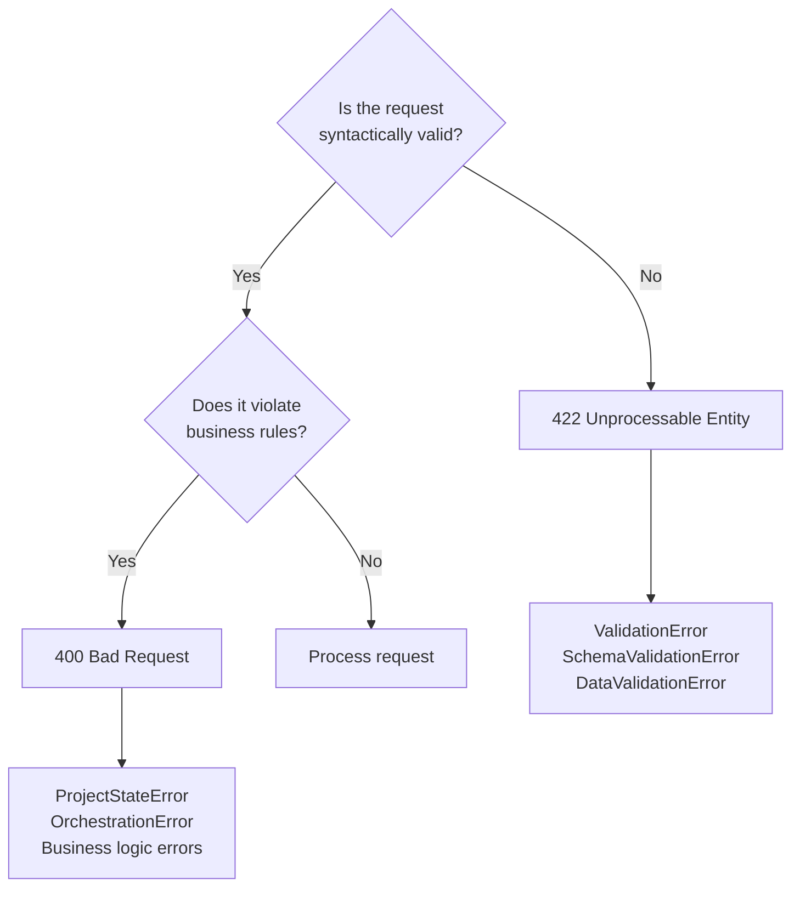
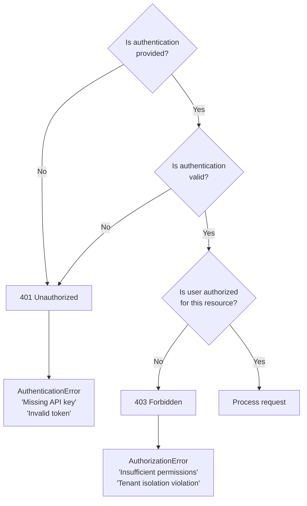

# Exception Handling Architecture

**Version**: 3.0
**Status**: Active (Remediation Series 0480)
**Last Updated**: 2026-01-26

## Table of Contents

- [Overview](#overview)
- [Design Principles](#design-principles)
- [Exception Hierarchy](#exception-hierarchy)
- [HTTP Status Code Mapping](#http-status-code-mapping)
- [Service Layer Patterns](#service-layer-patterns)
- [Endpoint Layer Patterns](#endpoint-layer-patterns)
- [Frontend Patterns](#frontend-patterns)
- [Logging & Correlation](#logging--correlation)
- [Testing Patterns](#testing-patterns)
- [Migration Guide](#migration-guide)

---

## Overview

### Purpose

The GiljoAI MCP exception handling architecture provides:

1. **Consistent Error Semantics** - Uniform error representation across all layers
2. **Proper HTTP Mapping** - Client-appropriate status codes for API errors
3. **Observability** - Request correlation and structured logging
4. **Developer Experience** - Clear error messages and debugging context
5. **Production Reliability** - Fail-fast with explicit error handling

### Design Principles

#### 1. Fail Fast, Fail Explicitly

```python
# ✅ CORRECT - Explicit validation with clear error
if not product_id:
    raise ValidationError(
        "Product ID is required",
        error_code="PRODUCT_ID_REQUIRED",
        context={"field": "product_id"}
    )

# ❌ WRONG - Silent failure or generic exceptions
if not product_id:
    return None  # Ambiguous - error or valid empty result?
```

#### 2. Use Specific Exception Types

```python
# ✅ CORRECT - Specific exception type
raise ResourceNotFoundError(
    f"Product {product_id} not found",
    context={"product_id": product_id, "tenant_key": tenant_key}
)

# ❌ WRONG - Generic exception
raise Exception(f"Product {product_id} not found")
```

#### 3. Enrich Context, Don't Suppress

```python
# ✅ CORRECT - Re-raise with context
try:
    await db.execute(query)
except SQLAlchemyError as e:
    raise DatabaseError(
        "Failed to create product",
        context={"product_name": name, "original_error": str(e)}
    ) from e

# ❌ WRONG - Swallow exception
try:
    await db.execute(query)
except SQLAlchemyError:
    return None  # Lost error context
```

#### 4. Let Exceptions Propagate

Service layer and endpoint layer should raise exceptions and let the centralized exception handler convert them to HTTP responses.

```python
# ✅ CORRECT - Endpoint lets service exception propagate
@router.get("/products/{product_id}")
async def get_product(product_id: str, db: AsyncSession = Depends(get_db)):
    """Exception handler middleware will catch and convert to HTTP response"""
    product = await product_service.get_product(db, product_id)
    return ProductResponse.from_orm(product)

# ❌ WRONG - Endpoint catches and returns HTTP exception
@router.get("/products/{product_id}")
async def get_product(product_id: str, db: AsyncSession = Depends(get_db)):
    try:
        product = await product_service.get_product(db, product_id)
        return ProductResponse.from_orm(product)
    except ResourceNotFoundError:
        raise HTTPException(status_code=404, detail="Product not found")
```

### Token Benefits

The exception handling architecture provides significant token savings:

1. **Request Correlation** - Structlog automatically includes `request_id` in all logs
2. **Automatic Context Enrichment** - Exception middleware adds tenant, user, and timing info
3. **Standardized Error Responses** - Clients can rely on consistent error schema
4. **Reduced Debugging Time** - Full error context captured automatically

---

## Exception Hierarchy

### Base Exception

All custom exceptions inherit from `BaseGiljoException`:

```python
class BaseGiljoException(Exception):
    """Base exception for all GiljoAI MCP errors."""

    def __init__(
        self,
        message: str,
        error_code: Optional[str] = None,
        context: Optional[dict] = None
    ):
        super().__init__(message)
        self.message = message
        self.error_code = error_code or self.__class__.__name__.upper()
        self.context = context or {}
```

**Properties**:
- `message` - Human-readable error description
- `error_code` - Machine-readable error identifier (defaults to class name)
- `context` - Additional error context (dict)

### Category Breakdown

```mermaid
graph TD
    A[BaseGiljoException] --> B[APIError]
    A --> C[ResourceError]
    A --> D[OrchestrationError]
    A --> E[DatabaseError]
    A --> F[ValidationError]
    A --> G[ConfigurationError]
    A --> H[TemplateError]
    A --> I[MCPError]
    A --> J[SessionError]

    B --> B1[AuthenticationError]
    B --> B2[AuthorizationError]
    B --> B3[RateLimitError]

    C --> C1[ResourceNotFoundError]
    C --> C2[ResourceExhaustedError]
    C --> C3[RetryExhaustedError]

    D --> D1[AgentCreationError]
    D --> D2[AgentCommunicationError]
    D --> D3[ProjectStateError]
    D --> D4[HandoffError]

    E --> E1[DatabaseConnectionError]
    E --> E2[DatabaseMigrationError]
    E --> E3[DatabaseIntegrityError]

    F --> F1[SchemaValidationError]
    F --> F2[DataValidationError]
```



### Category Reference

| Category | Base Class | HTTP Code | Use Case |
|----------|-----------|-----------|----------|
| **Authentication** | `AuthenticationError` | 401 | Invalid credentials, expired tokens |
| **Authorization** | `AuthorizationError` | 403 | Insufficient permissions, tenant isolation violations |
| **Validation** | `ValidationError` | 422 | Invalid request data, schema violations |
| **Resource** | `ResourceNotFoundError` | 404 | Entity not found in database |
| **Business Logic** | `ProjectStateError` | 400 | Invalid state transitions, business rule violations |
| **Rate Limiting** | `RateLimitError` | 429 | Too many requests |
| **Database** | `DatabaseError` | 500 | Database connectivity, integrity errors |
| **Configuration** | `ConfigurationError` | 500 | Missing or invalid configuration |
| **System** | `BaseGiljoException` | 500 | Unexpected system errors |

### Error Code Conventions

Error codes follow the pattern: `{CATEGORY}_{SPECIFIC_ERROR}`

**Examples**:
- `RESOURCE_NOT_FOUND` - Generic resource not found
- `PRODUCT_NOT_FOUND` - Specific product resource not found
- `TENANT_ISOLATION_VIOLATION` - Authorization error for cross-tenant access
- `INVALID_STATE_TRANSITION` - Business logic error for state changes
- `DATABASE_CONNECTION_FAILED` - System error for database connectivity

**Naming Rules**:
1. Use SCREAMING_SNAKE_CASE
2. Start with category (RESOURCE, VALIDATION, AUTH, etc.)
3. Be specific but not verbose
4. Include entity type when relevant (PRODUCT, PROJECT, AGENT)

---

## HTTP Status Code Mapping

### Complete Mapping Table

| HTTP Code | Exception Type | Use Case | Example |
|-----------|---------------|----------|---------|
| **400 Bad Request** | `ProjectStateError`<br>`OrchestrationError` | Invalid state transition<br>Business rule violation | "Cannot activate inactive project"<br>"Cannot spawn agent without active orchestrator" |
| **401 Unauthorized** | `AuthenticationError` | Missing or invalid credentials | "Invalid API key"<br>"Expired JWT token" |
| **403 Forbidden** | `AuthorizationError` | Insufficient permissions | "User cannot access this tenant"<br>"Read-only user cannot delete" |
| **404 Not Found** | `ResourceNotFoundError`<br>`TemplateNotFoundError` | Entity does not exist | "Product abc123 not found"<br>"Agent template 'orchestrator' not found" |
| **409 Conflict** | `DatabaseIntegrityError` | Unique constraint violation<br>Concurrent modification | "Product name already exists"<br>"Optimistic lock failure" |
| **422 Unprocessable Entity** | `ValidationError`<br>`SchemaValidationError`<br>`DataValidationError` | Invalid request payload<br>Schema validation failure | "Field 'email' is not a valid email"<br>"Missing required field 'tenant_key'" |
| **429 Too Many Requests** | `RateLimitError` | Rate limit exceeded | "API rate limit exceeded (100 req/min)" |
| **500 Internal Server Error** | `DatabaseError`<br>`ConfigurationError`<br>`BaseGiljoException` | Database connectivity<br>System misconfiguration<br>Unexpected errors | "Database connection pool exhausted"<br>"Missing required config: DATABASE_URL" |
| **503 Service Unavailable** | `DatabaseConnectionError`<br>`ResourceExhaustedError` | Temporary service outage | "Database unavailable"<br>"Context window exhausted" |

### Decision Tree: 400 vs 422



**Rule of Thumb**:
- **422** - Request structure is wrong (missing fields, invalid types, schema violations)
- **400** - Request structure is correct but content violates business rules

**Examples**:

```python
# 422 - Schema validation failure
{
    "product_name": 123,  # Should be string
    "tenant_key": None    # Required field missing
}
# Raise: SchemaValidationError → HTTP 422

# 400 - Business rule violation
{
    "product_name": "MyProduct",
    "tenant_key": "tenant_abc",
    "status": "inactive"
}
# Trying to activate an already-inactive product
# Raise: ProjectStateError → HTTP 400
```

### Decision Tree: 403 vs 401



**Examples**:

```python
# 401 - No authentication
# Request missing X-API-Key header
# Raise: AuthenticationError("Missing API key") → HTTP 401

# 401 - Invalid authentication
# Request has X-API-Key but token is expired
# Raise: AuthenticationError("Token expired") → HTTP 401

# 403 - Valid auth but insufficient permissions
# User authenticated but trying to access different tenant
# Raise: AuthorizationError("Cannot access tenant_xyz") → HTTP 403
```

---

## Service Layer Patterns

### How Services Should Raise Exceptions

Services are the **source of truth** for exception raising. They validate inputs, enforce business rules, and interact with the database.

#### Pattern 1: Resource Not Found

```python
async def get_product(
    db: AsyncSession,
    product_id: str,
    tenant_key: str
) -> Product:
    """
    Retrieve product by ID.

    Raises:
        ResourceNotFoundError: Product does not exist
    """
    result = await db.execute(
        select(Product).where(
            Product.id == product_id,
            Product.tenant_key == tenant_key
        )
    )
    product = result.scalar_one_or_none()

    if not product:
        raise ResourceNotFoundError(
            f"Product {product_id} not found",
            error_code="PRODUCT_NOT_FOUND",
            context={
                "product_id": product_id,
                "tenant_key": tenant_key
            }
        )

    return product
```

#### Pattern 2: Input Validation

```python
async def create_product(
    db: AsyncSession,
    name: str,
    tenant_key: str,
    description: Optional[str] = None
) -> Product:
    """
    Create a new product.

    Raises:
        ValidationError: Invalid input parameters
        DatabaseIntegrityError: Product name already exists
    """
    # Validate inputs
    if not name or not name.strip():
        raise ValidationError(
            "Product name cannot be empty",
            error_code="INVALID_PRODUCT_NAME",
            context={"name": name}
        )

    if len(name) > 255:
        raise ValidationError(
            "Product name too long (max 255 characters)",
            error_code="PRODUCT_NAME_TOO_LONG",
            context={"name_length": len(name), "max_length": 255}
        )

    # Create product
    product = Product(
        id=str(uuid.uuid4()),
        name=name.strip(),
        description=description,
        tenant_key=tenant_key
    )

    try:
        db.add(product)
        await db.commit()
        await db.refresh(product)
        return product
    except IntegrityError as e:
        await db.rollback()
        raise DatabaseIntegrityError(
            f"Product name '{name}' already exists",
            error_code="DUPLICATE_PRODUCT_NAME",
            context={"name": name, "tenant_key": tenant_key}
        ) from e
```

#### Pattern 3: Business Rule Enforcement

```python
async def activate_project(
    db: AsyncSession,
    project_id: str,
    tenant_key: str
) -> Project:
    """
    Activate a project.

    Raises:
        ResourceNotFoundError: Project does not exist
        ProjectStateError: Project is already active or in invalid state
    """
    project = await get_project(db, project_id, tenant_key)

    # Enforce business rule: can only activate inactive projects
    if project.status == "active":
        raise ProjectStateError(
            "Cannot activate project that is already active",
            error_code="PROJECT_ALREADY_ACTIVE",
            context={
                "project_id": project_id,
                "current_status": project.status
            }
        )

    if project.status == "archived":
        raise ProjectStateError(
            "Cannot activate archived project",
            error_code="CANNOT_ACTIVATE_ARCHIVED",
            context={
                "project_id": project_id,
                "current_status": project.status
            }
        )

    # Transition state
    project.status = "active"
    project.activated_at = datetime.utcnow()
    await db.commit()
    await db.refresh(project)

    return project
```

#### Pattern 4: Database Error Handling

```python
async def update_product_vision(
    db: AsyncSession,
    product_id: str,
    vision_content: str,
    tenant_key: str
) -> Product:
    """
    Update product vision document.

    Raises:
        ResourceNotFoundError: Product does not exist
        DatabaseError: Database operation failed
    """
    product = await get_product(db, product_id, tenant_key)

    try:
        product.vision = vision_content
        product.updated_at = datetime.utcnow()
        await db.commit()
        await db.refresh(product)
        return product
    except SQLAlchemyError as e:
        await db.rollback()
        raise DatabaseError(
            "Failed to update product vision",
            error_code="VISION_UPDATE_FAILED",
            context={
                "product_id": product_id,
                "original_error": str(e)
            }
        ) from e
```

### When NOT to Raise

Not all "empty" results are errors. Distinguish between:

1. **Expected Empty Results** - Return empty list/None
2. **Unexpected Missing Data** - Raise exception

```python
# ✅ CORRECT - Expected empty result
async def list_products(
    db: AsyncSession,
    tenant_key: str
) -> List[Product]:
    """List all products for tenant. Returns empty list if none exist."""
    result = await db.execute(
        select(Product).where(Product.tenant_key == tenant_key)
    )
    return list(result.scalars().all())  # Empty list is valid

# ✅ CORRECT - Unexpected missing data
async def get_product(
    db: AsyncSession,
    product_id: str,
    tenant_key: str
) -> Product:
    """Get product by ID. Raises if not found."""
    result = await db.execute(
        select(Product).where(
            Product.id == product_id,
            Product.tenant_key == tenant_key
        )
    )
    product = result.scalar_one_or_none()

    if not product:
        raise ResourceNotFoundError(f"Product {product_id} not found")

    return product
```

### Transaction Handling on Exceptions

Always rollback transactions when exceptions occur:

```python
async def complex_operation(db: AsyncSession, data: dict) -> Result:
    """
    Complex multi-step operation.

    Raises:
        DatabaseError: Any database operation failed
        ValidationError: Invalid input data
    """
    try:
        # Step 1: Validate
        if not data.get("required_field"):
            raise ValidationError("Missing required field")

        # Step 2: Create entity
        entity = Entity(**data)
        db.add(entity)
        await db.flush()  # Get ID without committing

        # Step 3: Create related entity
        related = RelatedEntity(entity_id=entity.id)
        db.add(related)

        # Step 4: Commit transaction
        await db.commit()
        await db.refresh(entity)

        return entity

    except ValidationError:
        await db.rollback()
        raise  # Re-raise validation error

    except SQLAlchemyError as e:
        await db.rollback()
        raise DatabaseError(
            "Complex operation failed",
            context={"original_error": str(e)}
        ) from e
```

---

## Endpoint Layer Patterns

### How to Let Exceptions Propagate

Endpoints should **let service exceptions propagate** to the centralized exception handler middleware. This ensures consistent error responses and proper logging.

#### Pattern 1: Simple Passthrough

```python
@router.get("/products/{product_id}", response_model=ProductResponse)
async def get_product(
    product_id: str,
    tenant_key: str = Depends(get_tenant_key),
    db: AsyncSession = Depends(get_db)
):
    """
    Get product by ID.

    Service layer raises ResourceNotFoundError → Exception handler converts to HTTP 404
    """
    product = await product_service.get_product(db, product_id, tenant_key)
    return ProductResponse.from_orm(product)
```

#### Pattern 2: Pydantic Validation (422 Automatic)

```python
class CreateProductRequest(BaseModel):
    name: str = Field(..., min_length=1, max_length=255)
    description: Optional[str] = None
    tenant_key: str

@router.post("/products", response_model=ProductResponse, status_code=201)
async def create_product(
    request: CreateProductRequest,  # Pydantic validates automatically
    db: AsyncSession = Depends(get_db)
):
    """
    Create new product.

    Pydantic validation failures → HTTP 422 automatically
    Service exceptions → Exception handler converts to appropriate HTTP code
    """
    product = await product_service.create_product(
        db=db,
        name=request.name,
        description=request.description,
        tenant_key=request.tenant_key
    )
    return ProductResponse.from_orm(product)
```

### When to Catch and Transform

Only catch exceptions when you need to:

1. **Add endpoint-specific context**
2. **Convert between exception types**
3. **Handle background tasks**

```python
@router.post("/projects/{project_id}/launch")
async def launch_project(
    project_id: str,
    background_tasks: BackgroundTasks,
    tenant_key: str = Depends(get_tenant_key),
    db: AsyncSession = Depends(get_db)
):
    """
    Launch orchestrator for project.

    Catches to add background task context, then re-raises.
    """
    try:
        # Validate project exists and is active
        project = await project_service.get_project(db, project_id, tenant_key)

        # Queue background orchestration
        background_tasks.add_task(
            orchestrate_project,
            project_id=project_id,
            tenant_key=tenant_key
        )

        return {"status": "launching", "project_id": project_id}

    except ResourceNotFoundError:
        # Let exception handler deal with it
        raise

    except Exception as e:
        # Add background task context
        raise OrchestrationError(
            "Failed to launch orchestrator",
            error_code="ORCHESTRATOR_LAUNCH_FAILED",
            context={
                "project_id": project_id,
                "original_error": str(e)
            }
        ) from e
```

### Response Model Standards

Use Pydantic models for consistent error responses:

```python
class ErrorDetail(BaseModel):
    """Standard error detail structure"""
    message: str
    error_code: str
    context: Optional[Dict[str, Any]] = None
    request_id: Optional[str] = None

class ErrorResponse(BaseModel):
    """Standard error response"""
    error: ErrorDetail
    timestamp: datetime = Field(default_factory=datetime.utcnow)

# Exception handler middleware returns this structure:
@app.exception_handler(BaseGiljoException)
async def giljo_exception_handler(request: Request, exc: BaseGiljoException):
    """Convert GiljoAI exceptions to HTTP responses"""
    status_code = get_http_status_code(exc)

    return JSONResponse(
        status_code=status_code,
        content=ErrorResponse(
            error=ErrorDetail(
                message=exc.message,
                error_code=exc.error_code,
                context=exc.context,
                request_id=request.state.request_id
            )
        ).dict()
    )
```

---

## Frontend Patterns

### Error Discrimination (4xx vs 5xx)

Frontend should handle client errors (4xx) differently from server errors (5xx):

```javascript
async function fetchProduct(productId) {
  try {
    const response = await api.get(`/products/${productId}`);
    return response.data;

  } catch (error) {
    const status = error.response?.status;

    // Client errors (4xx) - User can potentially fix
    if (status >= 400 && status < 500) {
      switch (status) {
        case 401:
          // Redirect to login
          router.push('/login');
          throw new Error('Please log in to continue');

        case 403:
          // Show permission error
          throw new Error('You do not have permission to access this resource');

        case 404:
          // Show not found message
          throw new Error('Product not found');

        case 422:
          // Show validation errors
          const validationErrors = error.response.data.error.context;
          throw new ValidationError(validationErrors);

        default:
          throw new Error(error.response.data.error.message);
      }
    }

    // Server errors (5xx) - System issue
    if (status >= 500) {
      // Log error for debugging
      console.error('Server error:', error.response.data);

      // Show generic error to user
      throw new Error('A system error occurred. Please try again later.');
    }

    // Network errors (no response)
    throw new Error('Unable to connect to server. Please check your connection.');
  }
}
```

### User-Facing Error Messages

Map technical error codes to user-friendly messages:

```javascript
const ERROR_MESSAGES = {
  // Authentication
  'AUTHENTICATION_FAILED': 'Invalid username or password',
  'TOKEN_EXPIRED': 'Your session has expired. Please log in again.',

  // Authorization
  'TENANT_ISOLATION_VIOLATION': 'You do not have access to this resource',
  'INSUFFICIENT_PERMISSIONS': 'You do not have permission to perform this action',

  // Validation
  'PRODUCT_NAME_REQUIRED': 'Product name is required',
  'PRODUCT_NAME_TOO_LONG': 'Product name must be less than 255 characters',

  // Resources
  'PRODUCT_NOT_FOUND': 'Product not found',
  'PROJECT_NOT_FOUND': 'Project not found',

  // Business logic
  'PROJECT_ALREADY_ACTIVE': 'This project is already active',
  'CANNOT_ACTIVATE_ARCHIVED': 'Cannot activate an archived project',

  // System
  'DATABASE_CONNECTION_FAILED': 'Database connection failed. Please try again.',

  // Default
  'DEFAULT': 'An unexpected error occurred. Please try again.'
};

function getUserMessage(errorCode) {
  return ERROR_MESSAGES[errorCode] || ERROR_MESSAGES['DEFAULT'];
}
```

### Retry Strategies

Implement smart retry logic based on error type:

```javascript
async function apiCallWithRetry(fn, maxRetries = 3) {
  let lastError;

  for (let attempt = 1; attempt <= maxRetries; attempt++) {
    try {
      return await fn();

    } catch (error) {
      lastError = error;
      const status = error.response?.status;

      // Don't retry client errors (except 429 rate limit)
      if (status >= 400 && status < 500 && status !== 429) {
        throw error;
      }

      // Retry server errors with exponential backoff
      if (status >= 500 || status === 429) {
        const delay = Math.pow(2, attempt - 1) * 1000; // 1s, 2s, 4s
        console.log(`Retry attempt ${attempt}/${maxRetries} after ${delay}ms`);
        await sleep(delay);
        continue;
      }

      // Network errors - retry
      if (!error.response) {
        const delay = Math.pow(2, attempt - 1) * 1000;
        console.log(`Network error, retry ${attempt}/${maxRetries} after ${delay}ms`);
        await sleep(delay);
        continue;
      }

      throw error;
    }
  }

  throw lastError;
}
```

### Global Error Handler

Register a global error handler in Vue:

```javascript
// main.js
app.config.errorHandler = (err, instance, info) => {
  // Log to console in development
  if (process.env.NODE_ENV === 'development') {
    console.error('Global error:', err, info);
  }

  // Send to error tracking service in production
  if (process.env.NODE_ENV === 'production') {
    trackError(err, {
      component: instance?.$options.name,
      info: info
    });
  }

  // Show user-friendly error message
  const message = err.userMessage || 'An unexpected error occurred';
  showErrorNotification(message);
};
```

---

## Logging & Correlation

### Request ID Middleware

Every request gets a unique request ID for correlation:

```python
import uuid
from fastapi import Request
from starlette.middleware.base import BaseHTTPMiddleware

class RequestIDMiddleware(BaseHTTPMiddleware):
    """Attach unique request ID to every request"""

    async def dispatch(self, request: Request, call_next):
        # Generate or extract request ID
        request_id = request.headers.get('X-Request-ID', str(uuid.uuid4()))

        # Attach to request state
        request.state.request_id = request_id

        # Process request
        response = await call_next(request)

        # Include in response headers
        response.headers['X-Request-ID'] = request_id

        return response
```

### Structlog Integration

Configure structlog for structured logging with automatic context:

```python
import structlog
from structlog.contextvars import bind_contextvars, clear_contextvars

# Configure structlog
structlog.configure(
    processors=[
        structlog.contextvars.merge_contextvars,
        structlog.processors.add_log_level,
        structlog.processors.TimeStamper(fmt="iso"),
        structlog.processors.JSONRenderer()
    ],
    wrapper_class=structlog.make_filtering_bound_logger(logging.INFO),
    context_class=dict,
    logger_factory=structlog.PrintLoggerFactory(),
    cache_logger_on_first_use=True,
)

# Middleware that binds request context
class StructlogMiddleware(BaseHTTPMiddleware):
    """Bind request context to structlog"""

    async def dispatch(self, request: Request, call_next):
        # Clear previous context
        clear_contextvars()

        # Bind request context
        bind_contextvars(
            request_id=request.state.request_id,
            path=request.url.path,
            method=request.method,
            tenant_key=getattr(request.state, 'tenant_key', None),
            user_id=getattr(request.state, 'user_id', None)
        )

        # Process request
        response = await call_next(request)

        return response
```

### Error Context Enrichment

Exception handler automatically enriches error context:

```python
@app.exception_handler(BaseGiljoException)
async def giljo_exception_handler(request: Request, exc: BaseGiljoException):
    """
    Convert GiljoAI exceptions to HTTP responses with full context.
    """
    # Get logger with bound context
    logger = structlog.get_logger()

    # Determine HTTP status code
    status_code = get_http_status_code(exc)

    # Enrich context
    enriched_context = {
        **exc.context,
        'request_id': request.state.request_id,
        'tenant_key': getattr(request.state, 'tenant_key', None),
        'user_id': getattr(request.state, 'user_id', None),
        'path': request.url.path,
        'method': request.method,
        'status_code': status_code
    }

    # Log based on severity
    if status_code >= 500:
        logger.error(
            "server_error",
            error_code=exc.error_code,
            message=exc.message,
            **enriched_context
        )
    elif status_code >= 400:
        logger.warning(
            "client_error",
            error_code=exc.error_code,
            message=exc.message,
            **enriched_context
        )

    # Return error response
    return JSONResponse(
        status_code=status_code,
        content={
            "error": {
                "message": exc.message,
                "error_code": exc.error_code,
                "context": exc.context,  # Don't leak internal context to client
                "request_id": request.state.request_id
            },
            "timestamp": datetime.utcnow().isoformat()
        }
    )
```

### Example Log Output

```json
{
  "event": "server_error",
  "error_code": "DATABASE_CONNECTION_FAILED",
  "message": "Failed to connect to database",
  "request_id": "a1b2c3d4-e5f6-7890-abcd-ef1234567890",
  "tenant_key": "tenant_abc",
  "user_id": "user_123",
  "path": "/api/products/123",
  "method": "GET",
  "status_code": 503,
  "timestamp": "2026-01-26T10:30:45.123456",
  "level": "error",
  "original_error": "psycopg2.OperationalError: could not connect to server"
}
```

---

## Testing Patterns

### How to Test Exception Flows

Use pytest fixtures and markers for comprehensive exception testing:

```python
import pytest
from src.giljo_mcp.exceptions import (
    ResourceNotFoundError,
    ValidationError,
    ProjectStateError
)

class TestProductService:
    """Test exception handling in product service"""

    @pytest.mark.asyncio
    async def test_get_product_not_found(self, db_session):
        """Test ResourceNotFoundError raised when product not found"""
        with pytest.raises(ResourceNotFoundError) as exc_info:
            await product_service.get_product(
                db=db_session,
                product_id="nonexistent",
                tenant_key="tenant_abc"
            )

        # Verify exception details
        assert "Product nonexistent not found" in str(exc_info.value)
        assert exc_info.value.error_code == "PRODUCT_NOT_FOUND"
        assert exc_info.value.context["product_id"] == "nonexistent"

    @pytest.mark.asyncio
    async def test_create_product_validation_error(self, db_session):
        """Test ValidationError raised for invalid input"""
        with pytest.raises(ValidationError) as exc_info:
            await product_service.create_product(
                db=db_session,
                name="",  # Empty name
                tenant_key="tenant_abc"
            )

        assert "Product name cannot be empty" in str(exc_info.value)
        assert exc_info.value.error_code == "INVALID_PRODUCT_NAME"

    @pytest.mark.asyncio
    async def test_create_product_duplicate_name(
        self,
        db_session,
        sample_product
    ):
        """Test DatabaseIntegrityError for duplicate product name"""
        with pytest.raises(DatabaseIntegrityError) as exc_info:
            await product_service.create_product(
                db=db_session,
                name=sample_product.name,  # Duplicate
                tenant_key=sample_product.tenant_key
            )

        assert "already exists" in str(exc_info.value)
        assert exc_info.value.error_code == "DUPLICATE_PRODUCT_NAME"
```

### Fixtures to Use

Standard pytest fixtures for exception testing:

```python
# conftest.py

@pytest.fixture
async def db_session():
    """Provide clean database session for each test"""
    async with AsyncSession(engine) as session:
        yield session
        await session.rollback()

@pytest.fixture
async def sample_product(db_session):
    """Create sample product for testing"""
    product = Product(
        id=str(uuid.uuid4()),
        name="Test Product",
        tenant_key="tenant_abc"
    )
    db_session.add(product)
    await db_session.commit()
    await db_session.refresh(product)
    return product

@pytest.fixture
async def sample_project(db_session, sample_product):
    """Create sample project for testing"""
    project = Project(
        id=str(uuid.uuid4()),
        name="Test Project",
        description="Test project for exception testing",
        product_id=sample_product.id,
        tenant_key="tenant_abc",
        status="inactive"
    )
    db_session.add(project)
    await db_session.commit()
    await db_session.refresh(project)
    return project
```

### Endpoint Exception Testing

Test HTTP status code mapping:

```python
from fastapi.testclient import TestClient
from api.app import app

client = TestClient(app)

class TestProductEndpoints:
    """Test exception handling in product endpoints"""

    def test_get_product_404(self):
        """Test 404 response for missing product"""
        response = client.get(
            "/products/nonexistent",
            headers={"X-API-Key": "test_key"}
        )

        assert response.status_code == 404
        error = response.json()["error"]
        assert error["error_code"] == "PRODUCT_NOT_FOUND"
        assert "request_id" in error

    def test_create_product_422(self):
        """Test 422 response for validation error"""
        response = client.post(
            "/products",
            json={"name": "", "tenant_key": "tenant_abc"},
            headers={"X-API-Key": "test_key"}
        )

        assert response.status_code == 422
        error = response.json()["error"]
        assert error["error_code"] == "INVALID_PRODUCT_NAME"

    def test_activate_project_400(self, sample_active_project):
        """Test 400 response for business rule violation"""
        response = client.post(
            f"/projects/{sample_active_project.id}/activate",
            headers={"X-API-Key": "test_key"}
        )

        assert response.status_code == 400
        error = response.json()["error"]
        assert error["error_code"] == "PROJECT_ALREADY_ACTIVE"
```

### Coverage Requirements

Achieve >80% coverage with focus on exception paths:

```bash
# Run tests with coverage report
pytest tests/ --cov=src/giljo_mcp --cov=api --cov-report=html

# Coverage must include:
# 1. All exception types raised
# 2. All HTTP status codes mapped
# 3. Error context enrichment
# 4. Transaction rollback on errors
# 5. Logging integration
```

---

## Migration Guide

### Step 1: Identify Current Anti-Patterns

Scan codebase for these anti-patterns:

```bash
# Find generic Exception raises
rg "raise Exception" --type py

# Find HTTPException usage (should use domain exceptions)
rg "raise HTTPException" --type py

# Find silent exception swallowing
rg "except.*:\s*pass" --type py

# Find return None on errors
rg "except.*:\s*return None" --type py
```

### Step 2: Replace with Proper Exceptions

**Before (Anti-pattern)**:
```python
async def get_product(db: AsyncSession, product_id: str):
    try:
        result = await db.execute(
            select(Product).where(Product.id == product_id)
        )
        product = result.scalar_one_or_none()

        if not product:
            return None  # Ambiguous

        return product
    except Exception as e:
        print(f"Error: {e}")  # Lost context
        return None
```

**After (Correct)**:
```python
async def get_product(
    db: AsyncSession,
    product_id: str,
    tenant_key: str
) -> Product:
    """
    Get product by ID.

    Raises:
        ResourceNotFoundError: Product not found
        DatabaseError: Database operation failed
    """
    try:
        result = await db.execute(
            select(Product).where(
                Product.id == product_id,
                Product.tenant_key == tenant_key
            )
        )
        product = result.scalar_one_or_none()

        if not product:
            raise ResourceNotFoundError(
                f"Product {product_id} not found",
                error_code="PRODUCT_NOT_FOUND",
                context={"product_id": product_id, "tenant_key": tenant_key}
            )

        return product

    except SQLAlchemyError as e:
        raise DatabaseError(
            "Failed to retrieve product",
            context={"product_id": product_id, "original_error": str(e)}
        ) from e
```

### Step 3: Update Endpoints

Remove try-except blocks that convert to HTTPException:

**Before**:
```python
@router.get("/products/{product_id}")
async def get_product(
    product_id: str,
    db: AsyncSession = Depends(get_db)
):
    try:
        product = await product_service.get_product(db, product_id)
        if not product:
            raise HTTPException(status_code=404, detail="Product not found")
        return product
    except Exception as e:
        raise HTTPException(status_code=500, detail=str(e))
```

**After**:
```python
@router.get("/products/{product_id}", response_model=ProductResponse)
async def get_product(
    product_id: str,
    tenant_key: str = Depends(get_tenant_key),
    db: AsyncSession = Depends(get_db)
):
    """Exception handler middleware converts exceptions to HTTP responses"""
    product = await product_service.get_product(db, product_id, tenant_key)
    return ProductResponse.from_orm(product)
```

### Step 4: Add Exception Handler Middleware

Register centralized exception handler:

```python
# api/app.py

from api.middleware.exception_handler import (
    giljo_exception_handler,
    validation_exception_handler,
    sqlalchemy_exception_handler
)
from src.giljo_mcp.exceptions import BaseGiljoException

# Register exception handlers
app.add_exception_handler(BaseGiljoException, giljo_exception_handler)
app.add_exception_handler(RequestValidationError, validation_exception_handler)
app.add_exception_handler(SQLAlchemyError, sqlalchemy_exception_handler)
```

### Step 5: Add Tests

For each modified service/endpoint, add exception tests:

```python
# tests/services/test_product_service_exceptions.py

class TestProductServiceExceptions:
    """Test exception handling in product service"""

    @pytest.mark.asyncio
    async def test_get_product_not_found(self, db_session):
        with pytest.raises(ResourceNotFoundError):
            await product_service.get_product(
                db=db_session,
                product_id="nonexistent",
                tenant_key="tenant_abc"
            )

    # Add tests for all exception paths...
```

### Step 6: Update Documentation

Update API documentation with error responses:

```python
@router.get(
    "/products/{product_id}",
    response_model=ProductResponse,
    responses={
        404: {"model": ErrorResponse, "description": "Product not found"},
        500: {"model": ErrorResponse, "description": "Internal server error"}
    }
)
async def get_product(...):
    """Get product by ID"""
    ...
```

---

## References

- **Exception Hierarchy**: `src/giljo_mcp/exceptions.py`
- **HTTP Status Codes**: [RFC 7231](https://tools.ietf.org/html/rfc7231)
- **FastAPI Exception Handling**: [FastAPI Docs](https://fastapi.tiangolo.com/tutorial/handling-errors/)
- **Structlog**: [Structlog Documentation](https://www.structlog.org/)
- **Remediation Series**: `handovers/0480/`

---

**Document Status**: Living Document - Updated as exception handling architecture evolves
**Maintained By**: Documentation Manager Agent
**Review Cycle**: After each remediation handover (0480)
