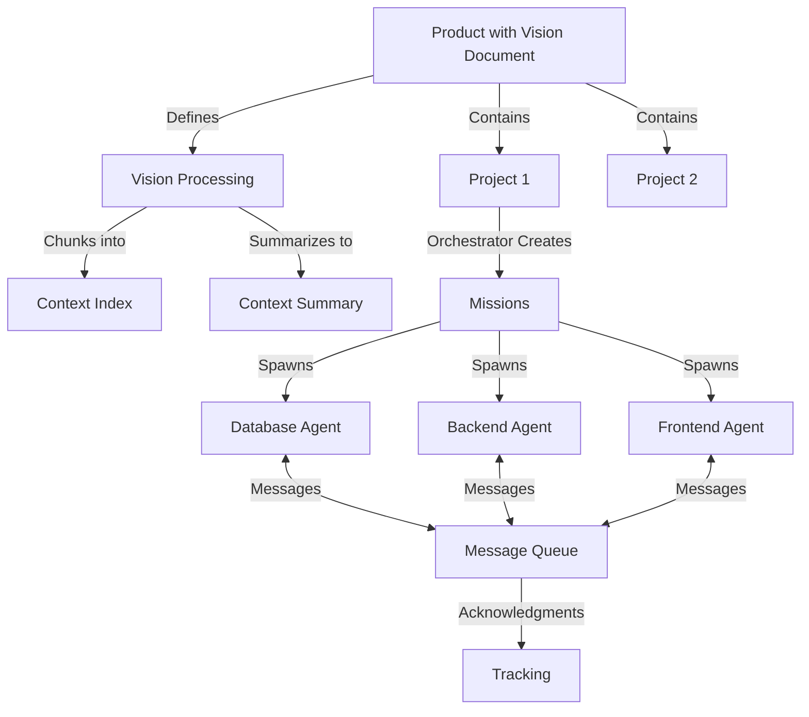

# GiljoAI MCP - Agentic Project Management Vision
## From Manual Workflows to Sophisticated Multi-Agent Orchestration

**Document Version**: 1.1.0
**Created**: 2025-10-14
**Last Updated**: 2025-01-05
**Status**: Strategic Vision Document
**Based On**: Handover 0012 Findings & AKE-MCP Proven Patterns
**Harmonization Status**: ✅ Aligned with codebase

---

## Quick Links to Harmonized Documents

- **[Simple_Vision.md](../../handovers/Simple_Vision.md)** - User journey & product vision (harmonized)
- **[start_to_finish_agent_FLOW.md](../../handovers/start_to_finish_agent_FLOW.md)** - Technical flow verification (code-verified)

**Current Agent Templates** (as of 2025-01-05):
- orchestrator, implementer, tester, analyzer, reviewer, documenter (seeded via `template_seeder.py`)

---

## Related Documentation

This document provides the **strategic vision** for GiljoAI MCP's agentic capabilities. For additional context, see:

- **[Complete Vision Document](COMPLETE_VISION_DOCUMENT.md)** - Executive overview of entire product vision
- **[Multi-Agent Coordination Patterns](MULTI_AGENT_COORDINATION_PATTERNS.md)** - Implementation patterns for agent orchestration
- **[Project Roadmap](../../handovers/completed/HANDOVER_0012_PROJECT_ROADMAP-C.md)** - 5-project implementation timeline
- **[Server Architecture](../SERVER_ARCHITECTURE_TECH_STACK.md)** - v3.0 unified architecture overview

### Reading Recommendations
- **Business stakeholders**: Read this document, then review Complete Vision and Project Roadmap
- **Technical architects**: Follow with Coordination Patterns
- **Developers**: Move to Coordination Patterns and implementation handovers (0017-0021)

---

## Executive Summary

GiljoAI MCP is evolving from a **multi-tenant task management system with manual workflows** into a **sophisticated agentic project management platform** that automatically orchestrates teams of specialized AI agents to tackle complex software development projects.

This document outlines the strategic vision, architectural patterns, and implementation roadmap to achieve true multi-agent orchestration with context prioritization and orchestration and 95% reliability.

---

## The Vision: Intelligent Project Orchestration

### Current Reality (October 2025)

**What We Have**:
- Multi-tenant task management infrastructure
- Manual workflow tools for agent coordination
- Role-based context filtering (~40% context prioritization)
- Template system for prompt generation
- Real-time dashboard for task monitoring
- WebSocket communication layer
- Solid PostgreSQL backend with SQLAlchemy

**What's Missing**:
- Automated sub-agent spawning
- Vision document chunking and indexing
- Context summarization by orchestrator
- Agent job management (separate from user tasks)
- Agent-to-agent communication with acknowledgment
- Product → Project → Agent hierarchical workflow
- Dynamic context discovery and loading

### Target Vision: Sophisticated Agentic System

**Core Capability**: An intelligent orchestration layer that automatically spawns, coordinates, and manages teams of specialized AI agents, achieving massive context prioritization while maintaining perfect context awareness.

**Key Features**:

1. **Automated Agent Spawning**
   - Orchestrator analyzes project requirements
   - Automatically spawns specialized sub-agents
   - Each agent receives minimal, focused context
   - Agents work in parallel on different aspects

2. **Vision Document Processing**
   - Large vision documents (50K+ tokens) chunked into 5K sections
   - Searchable context index with keywords
   - Agentic RAG for dynamic context retrieval
   - Semantic understanding of project goals

3. **Orchestrator-Driven Summarization**
   - Orchestrator reads full project context
   - Creates condensed missions for each agent type
   - context prioritization and orchestration through intelligent summarization
   - Maintains perfect context awareness

4. **Multi-Agent Coordination**
   - Agent job tracking separate from user tasks
   - Message queue with acknowledgment tracking
   - Agent-to-agent communication protocols
   - Automatic handoffs at context thresholds

5. **Real-Time Monitoring**
   - Live dashboard showing all agent activities
   - Message history and acknowledgments
   - Performance metrics and token usage
   - Interactive controls for manual intervention

---

## Architectural Patterns (From AKE-MCP)

### Product → Projects → Agents Hierarchy



### Context Management Strategy

**Traditional Approach**:
- Full codebase context to every agent
- Repeated information across agents
- Context overflow common

**GiljoAI MCP Approach**:

1. **Vision Chunking** (large docs into manageable sections)
   - Semantic boundary detection
   - Keyword extraction
   - Searchable index creation

2. **Orchestrator Summarization** (focused missions per agent)
   - Read full context once
   - Extract agent-specific requirements
   - Create focused missions

3. **Dynamic Discovery** (load only what's needed)
   - Agents request specific context
   - Serena MCP for codebase exploration
   - Just-in-time context loading

**Result**: Focused context delivery with better context awareness

### Agent Communication Architecture

```python
# Message Flow Pattern
class AgentCommunication:
    """
    Agent-to-Agent messaging with acknowledgment
    """

    def send_message(self, from_agent: str, to_agent: str, content: str):
        message = {
            "id": generate_uuid(),
            "from": from_agent,
            "to": to_agent,
            "content": content,
            "timestamp": datetime.now(),
            "acknowledged": []  # List of agents that acknowledged
        }

        # Store in JSONB array in agent job
        self.db.append_job_message(to_agent, message)

        # Real-time notification via WebSocket
        self.websocket.notify_agent(to_agent, message)

    def acknowledge_message(self, agent_id: str, message_id: str):
        # Prevent duplicate processing
        if agent_id not in message["acknowledged"]:
            message["acknowledged"].append(agent_id)
            self.db.update_message_acknowledgment(message_id, agent_id)
```

---

## Implementation Roadmap

### Phase 1: Foundation (Week 1)
**Database Schema Enhancement**
- Add tables for context indexing, summarization, agent jobs
- Product hierarchy for vision documents
- Message acknowledgment tracking
- Port proven schemas from AKE-MCP

### Phase 2: Core Systems (Weeks 2-3)
**Context Management & Agent Jobs**
- Vision document chunking (5K sections)
- Searchable context index
- Agent job management (separate from tasks)
- Message queue with acknowledgments

### Phase 3: Intelligence (Weeks 4-5)
**Orchestrator Enhancement**
- Context summarization workflow
- Automated mission generation
- Agent spawning coordination
- Multi-agent orchestration

### Phase 4: User Experience (Week 6)
**Dashboard Integration**
- Real-time agent monitoring
- Interactive message interface
- Performance visualization
- Manual intervention controls

### Phase 5: Validation (Week 7)
**Testing & Documentation**
- Integration testing
- Performance benchmarking
- Documentation updates
- User training materials

---

## Success Metrics

### Context Efficiency
- **Target**: Deliver focused, relevant context to each agent
- **Measurement**: Agents receive only task-relevant context
- **Method**: Orchestrator summarization and vision chunking

### Reliability
- **Target**: 95% successful agent coordination
- **Measurement**: Completed jobs / total jobs
- **Method**: Track agent job completion rates

### Performance
- **Parallel Execution**: Multiple agents working simultaneously
- **Context Accuracy**: Agents have right context at right time
- **Communication Efficiency**: No duplicate message processing

### User Experience
- **Setup Time**: < 5 minutes from download to first agent
- **Monitoring**: Real-time visibility of all agent activities
- **Control**: Manual intervention when needed

---

## Technical Architecture

### Database Schema (PostgreSQL)

```sql
-- Context Management
CREATE TABLE mcp_context_index (
    chunk_id TEXT PRIMARY KEY,
    product_id TEXT,
    content TEXT,
    summary TEXT,
    keywords TEXT[],
    token_count INTEGER,
    searchable_vector TSVECTOR
);

CREATE TABLE mcp_context_summary (
    context_id TEXT PRIMARY KEY,
    full_content TEXT,
    condensed_mission JSONB,
    reduction_percent DECIMAL
);

-- Agent Management
CREATE TABLE mcp_agent_jobs (
    job_id TEXT PRIMARY KEY,
    agent_type TEXT,
    mission TEXT,
    status TEXT,
    context_chunks TEXT[],
    messages JSONB DEFAULT '[]',
    acknowledged BOOLEAN DEFAULT FALSE
);

-- Product Hierarchy
CREATE TABLE products (
    product_id TEXT PRIMARY KEY,
    name TEXT,
    vision_document TEXT,
    chunked BOOLEAN DEFAULT FALSE
);
```

### API Layer (FastAPI)

```python
# New Endpoints for Agent Management
@router.post("/api/products/{product_id}/process-vision")
async def process_vision_document(product_id: str):
    """Chunk vision document and create context index"""

@router.post("/api/orchestrator/create-missions")
async def create_agent_missions(project_id: str):
    """Orchestrator creates condensed missions from full context"""

@router.post("/api/agents/spawn")
async def spawn_agent(agent_type: str, mission: str):
    """Spawn new agent with focused mission"""

@router.get("/api/agent-jobs/active")
async def get_active_agent_jobs():
    """Real-time agent job monitoring"""

@router.ws("/ws/agent-monitor")
async def agent_monitor_websocket():
    """WebSocket for real-time agent updates"""
```

### Frontend (Vue 3 + Vuetify)

```vue
<!-- Agent Monitor Component -->
<template>
  <v-container>
    <agent-job-grid :jobs="activeJobs" />
    <message-timeline :messages="agentMessages" />
    <performance-metrics :metrics="tokenMetrics" />
    <control-panel @spawn="spawnAgent" @message="sendMessage" />
  </v-container>
</template>
```

---

## Competitive Advantages

### vs Traditional AI Assistants
- **No context limits**: Unlimited project size through chunking
- **Parallel execution**: Multiple agents work simultaneously
- **Persistent memory**: Knowledge retained across sessions
- **Team coordination**: Agents work together, not in isolation

### vs Other Orchestration Systems
- **Multi-tenant**: Multiple users/teams on same instance
- **Server-based**: No multiple CLI windows required
- **Cross-platform agents**: Not limited to single AI provider
- **Real-time monitoring**: Full visibility and control
- **Proven patterns**: Based on working AKE-MCP implementation

---

## Risk Mitigation

### Technical Risks
- **Complexity**: Mitigated by incremental development and proven patterns
- **Performance**: PostgreSQL indexes and efficient queries
- **Reliability**: Message acknowledgments prevent loss

### Implementation Risks
- **Scope creep**: Fixed 5-project roadmap with clear boundaries
- **Integration issues**: Comprehensive testing at each phase
- **User adoption**: Progressive enhancement preserves existing features

---

## Long-Term Vision

### Year 1 (2025)
- Complete 5-project implementation
- Achieve context prioritization and orchestration
- Support 10+ agent types
- Handle 100K+ line codebases

### Year 2 (2026)
- Cloud deployment option
- Enterprise features (SSO, audit logs)
- Custom agent creation SDK
- Integration with CI/CD pipelines

### Year 3 (2027)
- AI model agnostic (OpenAI, Anthropic, Google, local)
- Distributed agent execution
- Advanced orchestration strategies
- Industry-specific agent templates

---

## Call to Action

GiljoAI MCP has the foundation to become the industry-leading agentic project management platform. With proven patterns from AKE-MCP and a clear implementation roadmap, we can transform manual AI coordination into sophisticated automated orchestration.

**Next Steps**:
1. Execute Project 1: Database Schema Enhancement
2. Port proven patterns from AKE-MCP
3. Implement context management system
4. Build agent job management
5. Enhance orchestrator with intelligence
6. Deploy real-time monitoring dashboard

**The vision is clear. The patterns are proven. The foundation exists.**

**Let's build the future of AI-powered software development.**

---

*This vision document represents the strategic direction for GiljoAI MCP based on Handover 0012 findings and proven patterns from AKE-MCP. It will be updated as implementation progresses.*
