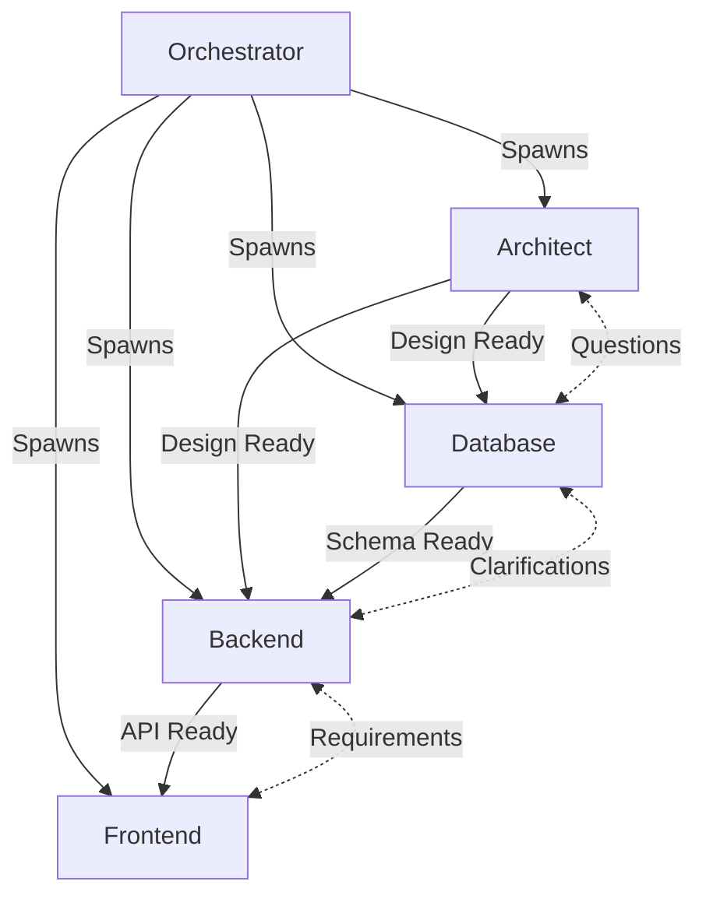

# Multi-Agent Coordination Patterns
## Orchestrating Teams of Specialized AI Agents

**Document Version**: 1.1.0
**Created**: 2025-10-14
**Last Updated**: 2025-01-05
**Status**: Architecture Pattern Document
**Harmonization Status**: ✅ Aligned with codebase

---

## Quick Links to Harmonized Documents

- **[Simple_Vision.md](../../handovers/Simple_Vision.md)** - User journey & product vision
- **[start_to_finish_agent_FLOW.md](../../handovers/start_to_finish_agent_FLOW.md)** - Technical verification & flow

---

## Related Documentation

This document defines **implementation patterns** for coordinating multiple AI agents. For broader context, see:

- **[Complete Vision Document](COMPLETE_VISION_DOCUMENT.md)** - Executive overview of product vision
- **[Agentic Project Management Vision](AGENTIC_PROJECT_MANAGEMENT_VISION.md)** - Strategic vision and business case
- **[Project Roadmap](../../handovers/completed/HANDOVER_0012_PROJECT_ROADMAP-C.md)** - Implementation timeline
- **[Agent Job Management Handover](../../handovers/0019_HANDOVER_20251014_AGENT_JOB_MANAGEMENT.md)** - Implementation for Handover 0019
- **[Orchestrator Enhancement Handover](../../handovers/0020_HANDOVER_20251014_ORCHESTRATOR_ENHANCEMENT.md)** - Implementation for Handover 0020

### Reading Recommendations
- **Developers**: Start here, then review implementation handovers (0019, 0020)
- **Architects**: Read alongside Agentic Project Management Vision for complete technical picture
- **Team leads**: Review coordination strategies section, then see Agentic Vision for business context
- **New contributors**: Study core coordination principles first, then dive into specific patterns

---

## Overview

This document defines the coordination patterns that enable GiljoAI MCP to orchestrate multiple specialized AI agents working together on complex software development projects. These patterns, proven in AKE-MCP, enable sophisticated multi-agent collaboration with minimal overhead.

---

## Core Coordination Principles

### 1. Specialized Roles, Shared Goals

Each agent has a specific role but works toward the shared project vision.

**🎯 Current Default Templates** (as of 2025-01-05):
The system ships with **6 default agent templates** seeded during first user creation:
- **orchestrator**: Project planning, agent coordination, context summarization
- **implementer**: Code implementation, refactoring, bug fixes
- **tester**: Test strategy, implementation, validation, quality assurance
- **analyzer**: Investigation, documentation research, external resources
- **reviewer**: Code review, standards compliance, best practices
- **documenter**: Documentation, comments, API docs, user guides

**Source**: `src/giljo_mcp/template_seeder.py::_get_default_templates_v103()`

**Extensible Architecture** - Additional agent types can be defined:

```python
POTENTIAL_AGENT_SPECIALIZATIONS = {
    # Core 6 (default templates)
    "orchestrator": "Project planning, agent coordination, context summarization",
    "implementer": "Code implementation, refactoring, bug fixes",
    "tester": "Test strategy, implementation, validation, quality assurance",
    "analyzer": "Investigation, documentation research, external resources",
    "reviewer": "Code review, standards compliance, best practices",
    "documenter": "Documentation, comments, API docs, user guides",

    # Extensible (user-created templates)
    "architect": "System design, component relationships, technical decisions",
    "database": "Schema design, migrations, query optimization, data modeling",
    "backend": "API development, business logic, integration, security",
    "frontend": "UI components, user experience, state management, routing",
    "devops": "Deployment, CI/CD, infrastructure, monitoring",
    "security": "Security analysis, vulnerability assessment, compliance"
}
```

### 2. Hierarchical Coordination

Orchestrator manages high-level coordination while agents handle peer-to-peer communication:



### 3. Message-Based Communication

All coordination happens through a persistent message queue with acknowledgments:

```python
class AgentMessage:
    """
    Structured message format for agent communication
    """
    def __init__(self):
        self.id = str(uuid4())
        self.from_agent = None  # Sender agent ID
        self.to_agent = None    # Recipient agent ID (or "broadcast")
        self.type = None        # "info", "request", "response", "handoff"
        self.content = None     # Message payload
        self.context_refs = []  # References to context chunks
        self.timestamp = datetime.now()
        self.acknowledged_by = []  # Agents that acknowledged receipt
        self.requires_response = False
        self.response_deadline = None
        self.priority = "normal"  # "low", "normal", "high", "critical"
```

---

## Coordination Patterns

### Pattern 1: Orchestrated Mission Assignment

**When to Use**: Starting a new project or major feature

**How It Works**:
1. Orchestrator reads full project requirements
2. Creates specialized missions for each agent type
3. Spawns agents with focused context
4. Monitors progress and coordinates handoffs

```python
class OrchestratedMissionPattern:
    """
    Orchestrator creates and assigns missions to specialized agents
    """

    async def execute_project(self, project_requirements: str):
        # Step 1: Analyze requirements
        analysis = await self.analyze_requirements(project_requirements)

        # Step 2: Create mission plan
        mission_plan = {
            "architect": {
                "mission": "Design system architecture for requirements",
                "context": analysis.technical_requirements,
                "deliverables": ["component_diagram", "api_design", "data_model"],
                "deadline": "2 hours"
            },
            "database": {
                "mission": "Create database schema from data model",
                "context": None,  # Waits for architect's data_model
                "dependencies": ["architect.data_model"],
                "deliverables": ["schema.sql", "migrations"],
                "deadline": "1 hour after dependencies"
            },
            "backend": {
                "mission": "Implement API endpoints per design",
                "context": None,  # Waits for architect's api_design
                "dependencies": ["architect.api_design", "database.schema"],
                "deliverables": ["api_implementation", "business_logic"],
                "deadline": "3 hours after dependencies"
            },
            "frontend": {
                "mission": "Create UI components for API",
                "context": None,  # Waits for backend API
                "dependencies": ["backend.api_implementation"],
                "deliverables": ["components", "views", "routing"],
                "deadline": "3 hours after dependencies"
            }
        }

        # Step 3: Spawn agents in dependency order
        await self.spawn_agents_with_dependencies(mission_plan)

        # Step 4: Monitor and coordinate
        await self.monitor_mission_progress(mission_plan)
```

### Pattern 2: Peer-to-Peer Handoff

**When to Use**: Agent completes work that another agent needs

**How It Works**:
1. Agent A completes its deliverable
2. Sends handoff message to Agent B
3. Agent B acknowledges receipt
4. Agent B begins work with deliverable as context

```python
class PeerHandoffPattern:
    """
    Direct handoff between agents with acknowledgment
    """

    async def handoff_deliverable(
        self,
        from_agent: str,
        to_agent: str,
        deliverable: Dict
    ):
        # Step 1: Package deliverable with context
        handoff_package = {
            "type": "handoff",
            "from": from_agent,
            "to": to_agent,
            "deliverable": {
                "type": deliverable["type"],
                "content": deliverable["content"],
                "context_chunks": deliverable["context_refs"],
                "validation": deliverable["tests_passed"]
            },
            "message": f"{from_agent} completed {deliverable['type']}, ready for your work",
            "requires_acknowledgment": True
        }

        # Step 2: Send via message queue
        message_id = await self.message_queue.send(handoff_package)

        # Step 3: Wait for acknowledgment (with timeout)
        acknowledged = await self.wait_for_acknowledgment(
            message_id,
            to_agent,
            timeout=30
        )

        if not acknowledged:
            # Step 4: Escalate to orchestrator if no acknowledgment
            await self.escalate_to_orchestrator(
                f"No acknowledgment from {to_agent} for handoff"
            )

        return acknowledged
```

### Pattern 3: Broadcast Communication

**When to Use**: Announcing project-wide changes or seeking help

**How It Works**:
1. Agent broadcasts message to all active agents
2. Relevant agents acknowledge and respond
3. Original agent processes responses

```python
class BroadcastPattern:
    """
    One agent communicates with all others
    """

    async def broadcast_change(
        self,
        from_agent: str,
        change_type: str,
        details: Dict
    ):
        # Step 1: Create broadcast message
        broadcast = {
            "type": "broadcast",
            "from": from_agent,
            "to": "all_agents",
            "subject": change_type,
            "content": {
                "change": details,
                "impact": self.analyze_impact(details),
                "action_required": self.determine_actions(details)
            },
            "requires_acknowledgment": True,
            "priority": "high"
        }

        # Step 2: Send to all active agents
        active_agents = await self.get_active_agents()
        message_id = await self.message_queue.broadcast(broadcast)

        # Step 3: Collect acknowledgments
        acknowledgments = await self.collect_acknowledgments(
            message_id,
            active_agents,
            timeout=60
        )

        # Step 4: Process responses
        responses = []
        for agent_id in acknowledgments:
            response = await self.get_agent_response(message_id, agent_id)
            if response:
                responses.append({
                    "agent": agent_id,
                    "response": response,
                    "action": response.get("action_taken")
                })

        return responses

    async def request_help(
        self,
        from_agent: str,
        problem: str,
        context: str
    ):
        # Broadcast request for assistance
        responses = await self.broadcast_change(
            from_agent,
            "help_request",
            {
                "problem": problem,
                "context": context,
                "urgency": "high"
            }
        )

        # Find agents that can help
        helpers = [r for r in responses if r["response"].get("can_help")]
        return helpers
```

### Pattern 4: Context Threshold Handoff

**When to Use**: Agent approaching context limit

**How It Works**:
1. Agent monitors its context usage
2. At 80% threshold, prepares handoff
3. Spawns continuation agent
4. Transfers state and continues work

```python
class ContextThresholdPattern:
    """
    Automatic handoff when context limit approached
    """

    async def monitor_and_handoff(self, agent: Agent):
        while agent.active:
            # Step 1: Check context usage
            usage = agent.get_context_usage()

            if usage.percentage > 80:
                # Step 2: Prepare handoff package
                handoff = {
                    "work_completed": agent.get_completed_work(),
                    "work_remaining": agent.get_remaining_tasks(),
                    "current_context": agent.get_essential_context(),
                    "learned_patterns": agent.get_discoveries(),
                    "warnings": agent.get_warnings()
                }

                # Step 3: Spawn continuation agent
                new_agent = await self.spawn_continuation_agent(
                    agent.type,
                    handoff["work_remaining"],
                    handoff["current_context"]
                )

                # Step 4: Transfer and terminate
                await self.transfer_state(agent, new_agent, handoff)
                await agent.graceful_shutdown()

                return new_agent

            await asyncio.sleep(30)  # Check every 30 seconds
```

### Pattern 5: Collaborative Problem Solving

**When to Use**: Complex problems requiring multiple perspectives

**How It Works**:
1. Orchestrator identifies complex problem
2. Spawns specialized agents for different aspects
3. Agents collaborate through structured discussion
4. Orchestrator synthesizes solution

```python
class CollaborativePattern:
    """
    Multiple agents work together on complex problems
    """

    async def solve_complex_problem(self, problem: Dict):
        # Step 1: Identify required expertise
        required_experts = self.identify_required_expertise(problem)

        # Step 2: Spawn expert agents
        experts = {}
        for expert_type in required_experts:
            experts[expert_type] = await self.spawn_expert_agent(
                expert_type,
                problem,
                focus_area=required_experts[expert_type]
            )

        # Step 3: Structured discussion rounds
        solutions = []
        for round_num in range(3):  # Three rounds of discussion
            round_solutions = {}

            # Each expert proposes solution
            for expert_type, agent in experts.items():
                proposal = await agent.propose_solution(
                    problem,
                    previous_solutions=solutions
                )
                round_solutions[expert_type] = proposal

            # Experts review each other's proposals
            reviews = {}
            for reviewer_type, reviewer in experts.items():
                reviews[reviewer_type] = {}
                for proposer_type, proposal in round_solutions.items():
                    if reviewer_type != proposer_type:
                        review = await reviewer.review_proposal(
                            proposal,
                            problem
                        )
                        reviews[reviewer_type][proposer_type] = review

            # Synthesize round results
            round_result = self.synthesize_round(
                round_solutions,
                reviews
            )
            solutions.append(round_result)

            # Check for consensus
            if self.has_consensus(reviews):
                break

        # Step 4: Orchestrator creates final solution
        final_solution = await self.orchestrator.synthesize_solution(
            problem,
            solutions,
            experts
        )

        return final_solution
```

### Pattern 6: Pipeline Processing

**When to Use**: Sequential processing with clear stages

**How It Works**:
1. Work flows through pipeline of specialized agents
2. Each agent performs its transformation
3. Output becomes input for next stage
4. Orchestrator monitors pipeline health

```python
class PipelinePattern:
    """
    Sequential processing through specialized agents
    """

    async def execute_pipeline(self, input_data: Dict, pipeline_config: List):
        # Step 1: Initialize pipeline
        pipeline = []
        for stage_config in pipeline_config:
            agent = await self.spawn_pipeline_agent(
                stage_config["agent_type"],
                stage_config["transformation"]
            )
            pipeline.append({
                "agent": agent,
                "config": stage_config,
                "status": "waiting"
            })

        # Step 2: Process through pipeline
        current_data = input_data
        for stage in pipeline:
            # Update status
            stage["status"] = "processing"

            # Process data
            result = await stage["agent"].process(
                current_data,
                stage["config"]["parameters"]
            )

            # Validate output
            if not self.validate_stage_output(result, stage["config"]):
                # Handle failure
                await self.handle_pipeline_failure(
                    stage,
                    result,
                    pipeline
                )
                return None

            # Pass to next stage
            current_data = result
            stage["status"] = "complete"

        # Step 3: Return final output
        return current_data

    async def handle_pipeline_failure(
        self,
        failed_stage: Dict,
        result: Dict,
        pipeline: List
    ):
        # Notify orchestrator
        await self.orchestrator.notify_failure({
            "pipeline": pipeline,
            "failed_stage": failed_stage,
            "error": result.get("error"),
            "recovery_options": self.identify_recovery_options(failed_stage)
        })
```

---

## Message Queue Implementation

### Message Storage and Acknowledgment

```python
class MessageQueue:
    """
    Persistent message queue with acknowledgment tracking
    """

    async def send_message(self, message: Dict) -> str:
        """
        Send message to specific agent or broadcast
        """
        # Add to database
        message_record = {
            "id": str(uuid4()),
            "from_agent": message["from"],
            "to_agent": message["to"],
            "type": message["type"],
            "content": json.dumps(message["content"]),
            "context_refs": message.get("context_refs", []),
            "timestamp": datetime.now(),
            "acknowledged_by": [],  # JSONB array
            "requires_response": message.get("requires_response", False),
            "priority": message.get("priority", "normal"),
            "status": "waiting"  # Initial state: waiting → active → working → complete
        }

        await self.db.insert("agent_messages", message_record)

        # Notify via WebSocket
        if message["to"] == "all_agents":
            await self.websocket.broadcast(
                "new_message",
                message_record
            )
        else:
            await self.websocket.send_to_agent(
                message["to"],
                "new_message",
                message_record
            )

        return message_record["id"]

    async def acknowledge_message(
        self,
        message_id: str,
        agent_id: str,
        response: Optional[Dict] = None
    ):
        """
        Agent acknowledges receipt of message
        """
        # Prevent duplicate acknowledgment
        message = await self.db.get_message(message_id)

        if agent_id in message["acknowledged_by"]:
            return  # Already acknowledged

        # Update acknowledgment
        message["acknowledged_by"].append(agent_id)
        message["status"] = "acknowledged"

        if response:
            if "responses" not in message:
                message["responses"] = {}
            message["responses"][agent_id] = response

        await self.db.update_message(message_id, message)

        # Notify sender of acknowledgment
        await self.websocket.send_to_agent(
            message["from_agent"],
            "message_acknowledged",
            {
                "message_id": message_id,
                "acknowledged_by": agent_id,
                "response": response
            }
        )
```

---

## Agent Lifecycle Management

### Spawning Agents

```python
class AgentLifecycle:
    """
    Manage agent creation, monitoring, and termination
    """

    async def spawn_agent(
        self,
        agent_type: str,
        mission: str,
        context: str,
        dependencies: List[str] = None
    ) -> Agent:
        """
        Spawn new agent with mission and context
        """
        # Step 1: Create agent job record
        job_id = str(uuid4())
        job_record = {
            "job_id": job_id,
            "agent_type": agent_type,
            "mission": mission,
            "status": "initializing",
            "context_chunks": self.identify_context_chunks(context),
            "dependencies": dependencies or [],
            "spawned_by": "orchestrator",
            "created_at": datetime.now()
        }

        await self.db.insert("mcp_agent_jobs", job_record)

        # Step 2: Wait for dependencies
        if dependencies:
            await self.wait_for_dependencies(dependencies)

        # Step 3: Spawn agent via Task tool
        agent = await self.task_tool.spawn_agent(
            type=agent_type,
            prompt=self.create_agent_prompt(mission, context)
        )

        # Step 4: Update job status
        job_record["status"] = "active"
        job_record["started_at"] = datetime.now()
        job_record["agent_id"] = agent.id
        await self.db.update_job(job_id, job_record)

        # Step 5: Start monitoring
        asyncio.create_task(self.monitor_agent(agent))

        return agent

    async def monitor_agent(self, agent: Agent):
        """
        Monitor agent health and progress
        """
        while agent.is_active():
            # Check health
            health = await agent.get_health()

            if health["status"] == "unhealthy":
                await self.handle_unhealthy_agent(agent, health)

            # Check progress
            progress = await agent.get_progress()

            if progress["stuck"]:
                await self.handle_stuck_agent(agent, progress)

            # Update metrics
            await self.update_agent_metrics(agent, health, progress)

            await asyncio.sleep(30)

    async def terminate_agent(
        self,
        agent: Agent,
        reason: str
    ):
        """
        Gracefully terminate agent
        """
        # Step 1: Notify agent of termination
        await agent.notify_termination(reason)

        # Step 2: Collect final state
        final_state = await agent.get_final_state()

        # Step 3: Update job record
        job = await self.db.get_job_by_agent_id(agent.id)
        job["status"] = "completed"
        job["completed_at"] = datetime.now()
        job["final_state"] = final_state
        await self.db.update_job(job["job_id"], job)

        # Step 4: Clean up resources
        await agent.cleanup()
```

---

## Coordination Strategies

### Strategy 1: Waterfall Coordination
- Sequential execution with clear handoffs
- Best for: Well-defined projects with clear dependencies
- Token efficiency: High (no parallel overhead)

### Strategy 2: Parallel Burst
- Spawn all agents simultaneously
- Best for: Independent tasks that can run in parallel
- Token efficiency: Moderate (some duplicate context)

### Strategy 3: Dynamic Spawning
- Spawn agents as needed based on discoveries
- Best for: Exploratory projects with unknown scope
- Token efficiency: Variable (depends on discoveries)

### Strategy 4: Hub and Spoke
- Orchestrator as central coordinator
- Best for: Complex projects needing central oversight
- Token efficiency: High (orchestrator manages context)

---

## Error Handling and Recovery

### Agent Failure Recovery

```python
class AgentRecovery:
    """
    Handle agent failures gracefully
    """

    async def handle_agent_failure(self, failed_agent: Agent, error: Exception):
        # Step 1: Determine failure type
        failure_type = self.classify_failure(error)

        # Step 2: Choose recovery strategy
        if failure_type == "context_overflow":
            # Spawn continuation agent with reduced context
            recovery_agent = await self.spawn_recovery_agent(
                failed_agent,
                reduced_context=True
            )

        elif failure_type == "communication_timeout":
            # Retry with increased timeout
            recovery_agent = await self.retry_agent(
                failed_agent,
                increased_timeout=True
            )

        elif failure_type == "unrecoverable":
            # Notify orchestrator and request human intervention
            await self.escalate_to_human(failed_agent, error)
            return None

        # Step 3: Transfer state to recovery agent
        await self.transfer_state(failed_agent, recovery_agent)

        # Step 4: Resume work
        await recovery_agent.resume_from_checkpoint()

        return recovery_agent
```

---

## Performance Optimization

### Context Sharing Between Agents

```python
class ContextSharing:
    """
    Optimize context usage across agents
    """

    async def share_discoveries(self, discovering_agent: Agent, discovery: Dict):
        """
        Share useful discoveries with other agents
        """
        # Determine relevance to other agents
        relevant_agents = self.find_relevant_agents(discovery)

        # Create shared context entry
        shared_context = {
            "id": str(uuid4()),
            "discovered_by": discovering_agent.id,
            "content": discovery,
            "relevant_for": relevant_agents,
            "timestamp": datetime.now()
        }

        # Store in shared context table
        await self.db.insert("shared_context", shared_context)

        # Notify relevant agents
        for agent_id in relevant_agents:
            await self.message_queue.send_message({
                "from": discovering_agent.id,
                "to": agent_id,
                "type": "shared_discovery",
                "content": {
                    "discovery_id": shared_context["id"],
                    "summary": self.summarize_discovery(discovery),
                    "relevance": self.explain_relevance(discovery, agent_id)
                }
            })
```

---

## Monitoring and Observability

### Real-Time Coordination Metrics

```python
class CoordinationMetrics:
    """
    Track coordination effectiveness
    """

    async def collect_metrics(self):
        return {
            "active_agents": await self.count_active_agents(),
            "message_queue_depth": await self.get_queue_depth(),
            "average_acknowledgment_time": await self.calc_avg_ack_time(),
            "handoff_success_rate": await self.calc_handoff_success(),
            "context_sharing_efficiency": await self.calc_sharing_efficiency(),
            "parallel_execution_factor": await self.calc_parallelization(),
            "coordination_overhead": await self.calc_coordination_overhead()
        }
```

---

## Best Practices

### 1. Mission Clarity
- Define clear, measurable objectives for each agent
- Include success criteria in mission
- Specify expected deliverables

### 2. Context Minimization
- Give agents only essential context
- Use references instead of duplicating content
- Share discoveries to avoid re-discovery

### 3. Communication Efficiency
- Use structured message formats
- Implement acknowledgment tracking
- Batch related messages when possible

### 4. Failure Planning
- Design for graceful degradation
- Implement recovery strategies
- Maintain checkpoint states

### 5. Performance Monitoring
- Track coordination metrics
- Identify bottlenecks early
- Optimize based on patterns

---

## Conclusion

These coordination patterns enable GiljoAI MCP to orchestrate sophisticated multi-agent teams that can tackle complex projects beyond the capability of any single AI assistant. Through intelligent coordination, message-based communication, and lifecycle management, we achieve superior results with focused context delivery.

---

*This document describes multi-agent coordination patterns based on proven implementations from AKE-MCP and designed for the GiljoAI MCP architecture.*