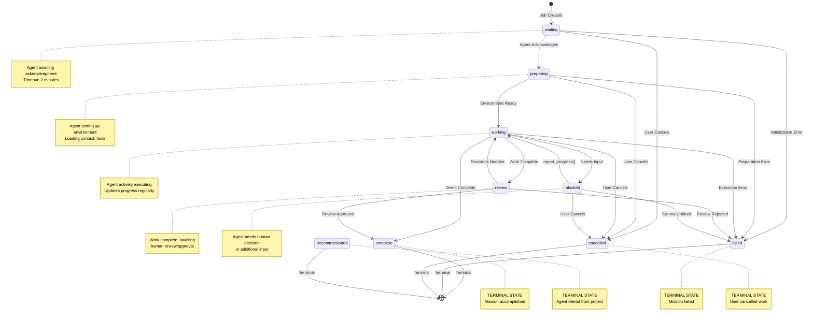
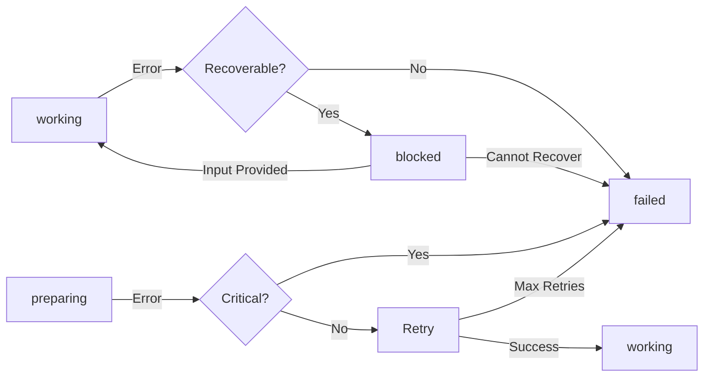
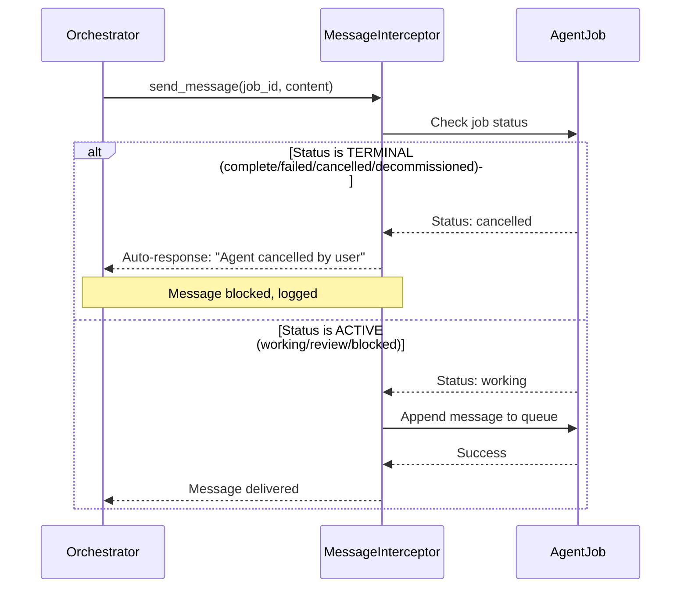

# Agent State Transition Diagram

## State Transition Flow (Mermaid)

## Transition Triggers

### User Actions
| From State | To State | Trigger | API Endpoint |
|-----------|----------|---------|--------------|
| waiting | cancelled | User cancels job | POST /{job_id}/cancel |
| preparing | cancelled | User cancels job | POST /{job_id}/cancel |
| working | cancelled | User cancels job | POST /{job_id}/cancel |
| blocked | cancelled | User gives up | POST /{job_id}/cancel |
| review | working | User requests revisions | POST /{job_id}/transition |
| review | complete | User approves work | POST /{job_id}/transition |
| review | failed | User rejects work | POST /{job_id}/transition |
| blocked | working | User provides input | POST /{job_id}/transition |
| * | decommissioned | User retires agent | POST /{job_id}/decommission |

### Agent Actions
| From State | To State | Trigger | MCP Tool |
|-----------|----------|---------|----------|
| waiting | preparing | Agent acknowledges | acknowledge_job() |
| preparing | working | Agent ready | update_job_status() |
| working | review | Agent completes work | update_job_status() |
| working | complete | Agent finishes | complete_job() |
| working | blocked | Agent needs help | update_job_status() |
| working | failed | Agent encounters error | fail_job() |

### System Events
| From State | To State | Trigger | Source |
|-----------|----------|---------|--------|
| waiting | failed | Timeout (2 min) | Health Monitor |
| preparing | failed | Timeout (5 min) | Health Monitor |
| working | blocked | Timeout (10 min) | Health Monitor |
| working | blocked | Health critical | Health Monitor |

## State Properties

### Active States

**waiting**
- Messages: Queued for delivery after acknowledgment
- Progress: 0%
- Can transition to: preparing, failed, cancelled
- Timeout: 2 minutes (configurable per agent type)

**preparing**
- Messages: Queued, agent may poll
- Progress: 0-10%
- Can transition to: working, failed, cancelled
- Timeout: 5 minutes

**working**
- Messages: Delivered immediately
- Progress: 10-99%
- Can transition to: review, complete, failed, blocked, cancelled
- Timeout: 10 minutes of no progress (configurable)

**review**
- Messages: Delivered (agent may be idle)
- Progress: 100%
- Can transition to: complete, working, failed
- No timeout (human review pending)

**blocked**
- Messages: Delivered with flag indicating blocked state
- Progress: Frozen at current value
- Can transition to: working, cancelled, failed
- No timeout (human action required)

### Terminal States

**complete**
- Messages: Blocked (auto-response: "Agent completed mission")
- Progress: 100%
- No further transitions
- Audit trail preserved

**failed**
- Messages: Blocked (auto-response: "Agent failed, review logs")
- Progress: Frozen at failure point
- No further transitions
- Error details in block_reason

**cancelled**
- Messages: Blocked (auto-response: "Agent cancelled by user")
- Progress: Frozen
- No further transitions
- Cancellation reason in block_reason

**decommissioned**
- Messages: Blocked (auto-response: "Agent retired from project")
- Progress: Final value preserved
- No further transitions
- Cannot be reactivated

## Error Recovery Paths

## Message Interception Logic

