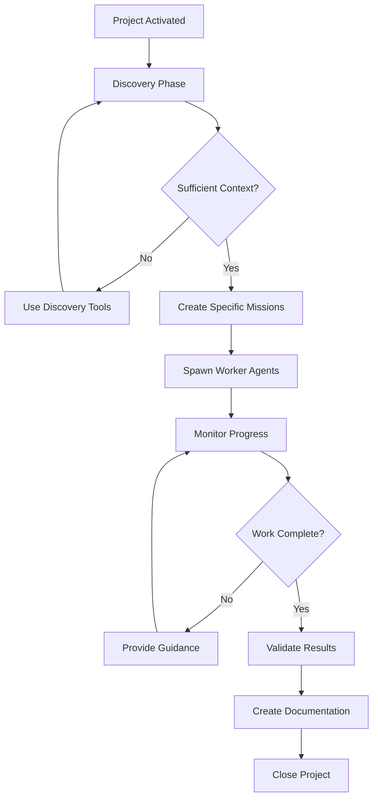

# Orchestrator Discovery Guide

**Last Updated**: October 8, 2025
**Version**: 2.0.0
**Audience**: Orchestrator agents and developers

---

## Table of Contents

1. [Overview](#overview)
2. [Discovery-First Workflow](#discovery-first-workflow)
3. [The 30-80-10 Principle](#the-30-80-10-principle)
4. [The 3-Tool Rule](#the-3-tool-rule)
5. [Discovery Phase](#discovery-phase)
6. [Mission Creation Phase](#mission-creation-phase)
7. [Delegation Phase](#delegation-phase)
8. [Coordination Phase](#coordination-phase)
9. [Completion Phase](#completion-phase)
10. [Common Pitfalls](#common-pitfalls)
11. [Real-World Examples](#real-world-examples)

---

## Overview

The **Orchestrator Discovery Guide** provides a comprehensive workflow for orchestrator agents to effectively discover project context, create specific missions, and coordinate worker agents.

### Key Principles

- **Discovery First**: Always start with discovery tools (Serena MCP, Vision, Product Settings)
- **30-80-10 Rule**: 30% discovery, 80% delegation, 10% coordination
- **3-Tool Rule**: If you use more than 3 non-communication tools, you should delegate
- **Hierarchical Context**: Orchestrators get FULL context, workers get FILTERED context
- **Token Efficiency**: Orchestrators optimize token usage across the team

### Workflow Overview



---

## Discovery-First Workflow

Orchestrators MUST begin every project with a discovery phase to understand the codebase, architecture, and requirements before delegating work.

### Discovery Tool Priority

Use discovery tools in this order:

1. **Serena MCP** (`mcp__serena__*` tools) - Codebase structure, symbols, files
2. **Vision Document** (`get_vision()`) - Project vision, goals, requirements
3. **Product Settings** (`get_product_config(filtered=False)`) - Architecture, tech stack, critical features

### Discovery Checklist

Before delegating ANY work, orchestrators should:

- [ ] Read full vision document (all parts if chunked)
- [ ] Load product configuration (unfiltered for orchestrators)
- [ ] Understand codebase structure (if Serena MCP available)
- [ ] Identify critical features and constraints
- [ ] Review test strategy and commands
- [ ] Check known issues and deployment modes
- [ ] Understand documentation standards

---

## The 30-80-10 Principle

Orchestrators should allocate their effort according to the **30-80-10 principle**:

### 30% Discovery

Spend approximately **30% of initial effort** on discovery:

- Reading vision documents
- Exploring codebase with Serena MCP
- Loading and analyzing product configuration
- Understanding project constraints and critical features
- Reviewing documentation and memories

**Example Discovery Session:**

```python
# Step 1: Get vision document
vision = await get_vision(part=1)
vision_index = await get_vision_index()

# Step 2: Get FULL product configuration
config = await get_product_config(
    project_id=current_project_id,
    filtered=False  # Orchestrator gets ALL fields
)

# Step 3: Explore codebase (if Serena MCP enabled)
if config.get("serena_mcp_enabled"):
    # List project structure
    structure = await mcp__serena__list_dir(
        relative_path=".",
        recursive=True
    )

    # Find key symbols
    models = await mcp__serena__find_symbol(
        name_path="models",
        include_kinds=[5]  # Class kind
    )
```

### 80% Delegation

Spend approximately **80% of effort** on delegation and coordination:

- Creating clear, specific missions for worker agents
- Spawning agents with appropriate roles
- Monitoring agent progress
- Providing guidance when agents request help
- Coordinating handoffs between agents

**Example Delegation:**

```python
# Create specific mission based on discovery
implementer_mission = """
Implement the user authentication system with the following requirements:

**Architecture**: {config['architecture']}
**Tech Stack**: {', '.join(config['tech_stack'])}

**Tasks**:
1. Create User model in src/models.py (follow existing patterns)
2. Implement /api/auth/login endpoint
3. Implement /api/auth/logout endpoint
4. Add JWT token generation and validation

**Critical Features to Preserve**:
{', '.join(config['critical_features'])}

**Testing**:
Run: {config['test_commands'][0]}
Target coverage: {config['test_config']['coverage_threshold']}%

**Handoff**: When implementation complete, handoff to tester-agent
"""

# Spawn implementer with specific mission
await ensure_agent(
    project_id=current_project_id,
    agent_name="implementer-auth",
    mission=implementer_mission
)
```

### 10% Coordination

Spend approximately **10% of effort** on coordination and completion:

- Monitoring overall project health
- Resolving blockers and conflicts
- Validating final results
- Creating after-action documentation
- Closing the project

**Example Coordination:**

```python
# Check agent health
implementer_health = await agent_health(agent_name="implementer-auth")

# If context usage > 80%, trigger handoff
if implementer_health['context_usage_percent'] > 80:
    await send_message(
        to_agents=["implementer-auth"],
        content="Context usage high. Please handoff to implementer-auth-2",
        priority="high"
    )
```

---

## The 3-Tool Rule

**Rule**: If an orchestrator uses more than 3 non-communication tools in sequence, they should delegate that work instead.

### What Counts as a Tool?

**Counts toward the 3-tool limit:**
- `mcp__serena__read_file()`
- `mcp__serena__replace_regex()`
- `mcp__serena__find_symbol()`
- `mcp__serena__search_for_pattern()`
- Any direct code manipulation tool

**Does NOT count toward limit:**
- `send_message()`
- `get_messages()`
- `get_vision()`
- `get_product_config()`
- `ensure_agent()`
- `activate_agent()`
- `assign_job()`
- `handoff()`

### Why 3 Tools?

- **Token Efficiency**: Orchestrators have full context; workers have filtered context
- **Specialization**: Workers are better equipped for focused tasks
- **Parallel Work**: Multiple workers can work simultaneously
- **Context Management**: Workers can handoff when they hit 80% context

### Example Violation (DON'T DO THIS)

```python
# BAD: Orchestrator doing implementation work
file1 = await mcp__serena__read_file("src/models.py")  # Tool 1
file2 = await mcp__serena__read_file("src/api/users.py")  # Tool 2
file3 = await mcp__serena__read_file("tests/test_auth.py")  # Tool 3
await mcp__serena__replace_regex("src/models.py", ...)  # Tool 4 - VIOLATION!
```

### Correct Approach (DO THIS)

```python
# GOOD: Orchestrator delegates to implementer
mission = """
Add User authentication model to src/models.py.

Reference existing patterns in:
- src/models.py (line 40-80)
- src/api/users.py (authentication flow)

Test with: {test_command}
"""

await ensure_agent(
    project_id=current_project_id,
    agent_name="implementer-auth",
    mission=mission
)
```

---

## Discovery Phase

### Step 1: Activate Orchestrator

When spawned, orchestrators are activated with `activate_agent()` which triggers the discovery workflow.

```python
# System automatically calls this when orchestrator spawns
orchestrator = await activate_agent(
    project_id="uuid-here",
    agent_name="orchestrator",
    mission="Coordinate implementation of feature X"
)
```

### Step 2: Load Vision Document

Always start by loading the vision document to understand project goals:

```python
# Get vision index to see document structure
vision_index = await get_vision_index()

# Load vision parts (auto-chunked at 50K tokens)
vision_part1 = await get_vision(part=1, max_tokens=20000)

# If multiple parts, load additional parts
if vision_index['total_parts'] > 1:
    vision_part2 = await get_vision(part=2, max_tokens=20000)
```

### Step 3: Load Product Configuration

Get the FULL product configuration (orchestrators are NOT filtered):

```python
config = await get_product_config(
    project_id=current_project_id,
    filtered=False  # Critical: orchestrators need full config
)

# config contains:
# {
#     "architecture": "FastAPI + PostgreSQL + Vue.js",
#     "tech_stack": ["Python 3.11", "PostgreSQL 18", "Vue 3"],
#     "codebase_structure": {...},
#     "critical_features": [...],
#     "test_commands": [...],
#     "test_config": {...},
#     "database_type": "postgresql",
#     "backend_framework": "fastapi",
#     "frontend_framework": "vue",
#     "deployment_modes": ["localhost", "server"],
#     "known_issues": [...],
#     "api_docs": "...",
#     "documentation_style": "...",
#     "serena_mcp_enabled": true
# }
```

### Step 4: Explore Codebase (if Serena MCP Available)

If `config['serena_mcp_enabled']` is true, use Serena MCP for discovery:

```python
# List project structure
project_structure = await mcp__serena__list_dir(
    relative_path=".",
    recursive=True
)

# Find key components
models = await mcp__serena__find_symbol(
    name_path="/",  # Top-level symbols
    include_kinds=[5, 12],  # Classes and functions
    depth=1
)

# Search for specific patterns
auth_code = await mcp__serena__search_for_pattern(
    substring_pattern="authenticate",
    restrict_search_to_code_files=True
)
```

### Step 5: Analyze Discovery Results

Synthesize discovery information to understand:

- **What exists**: Current codebase state
- **What's missing**: Gaps to fill
- **What's critical**: Features that must be preserved
- **What's the architecture**: How components fit together
- **What's the test strategy**: How to validate work

---

## Mission Creation Phase

After discovery, orchestrators create **specific, actionable missions** for worker agents.

### Mission Template

Good missions follow this structure:

```
## Objective
[Clear, one-sentence goal]

## Context
Architecture: {architecture}
Tech Stack: {tech_stack}
Critical Features to Preserve: {critical_features}

## Tasks
1. [Specific task with file references]
2. [Specific task with expected outcome]
3. [Specific task with testing requirements]

## Constraints
- Follow patterns in [file:line]
- Preserve [critical feature]
- Use [technology/framework]

## Testing
Commands: {test_commands}
Coverage Target: {test_config.coverage_threshold}%

## Handoff
When complete, handoff to: [next-agent]
```

### Good Mission Example

```python
mission = """
## Objective
Implement user registration API endpoint with email validation.

## Context
Architecture: FastAPI + PostgreSQL + Vue.js
Tech Stack: Python 3.11, PostgreSQL 18, SQLAlchemy 2.0
Critical Features to Preserve: Multi-tenant isolation, API key auth

## Tasks
1. Add POST /api/auth/register endpoint in api/endpoints/auth.py
2. Create email validation function in src/utils/validators.py
3. Add User model registration method in src/models.py (line 120-150)
4. Write integration tests in tests/integration/test_registration.py

## Constraints
- Follow existing endpoint patterns in api/endpoints/users.py
- Preserve tenant_key in all database operations
- Use EmailStr from pydantic for validation

## Testing
Commands: pytest tests/integration/test_registration.py -v
Coverage Target: 80%

## Handoff
When complete, handoff to: tester-integration
"""
```

### Bad Mission Example (TOO GENERIC)

```python
# BAD: Too vague, no context, no specific tasks
mission = "Implement user registration"
```

---

## Delegation Phase

### Spawning Worker Agents

Use `ensure_agent()` to spawn worker agents (idempotent - safe to call multiple times):

```python
# Spawn implementer
implementer = await ensure_agent(
    project_id=current_project_id,
    agent_name="implementer-registration",
    mission=registration_mission
)

# Spawn tester (to work in parallel or sequence)
tester = await ensure_agent(
    project_id=current_project_id,
    agent_name="tester-integration",
    mission=testing_mission
)
```

### Assigning Jobs

For more structured work, use `assign_job()`:

```python
await assign_job(
    agent_name="implementer-registration",
    job_type="implementation",
    project_id=current_project_id,
    tasks=[
        "Add POST /api/auth/register endpoint",
        "Create email validation",
        "Write integration tests"
    ],
    scope_boundary="Registration endpoint only - do not modify existing auth",
    vision_alignment="Aligns with Phase 2: User Management (vision page 3)"
)
```

---

## Coordination Phase

### Monitoring Agent Health

Check agent context usage regularly:

```python
health = await agent_health(agent_name="implementer-registration")

# health = {
#     "agent_name": "implementer-registration",
#     "status": "active",
#     "context_usage_percent": 75,
#     "message_queue_size": 2,
#     "last_activity": "2025-10-08T14:30:00Z"
# }

if health['context_usage_percent'] > 80:
    # Trigger handoff
    await send_message(
        to_agents=["implementer-registration"],
        content="Context usage at 80%. Please handoff to implementer-registration-2",
        priority="high"
    )
```

### Handling Agent Messages

Process messages from worker agents:

```python
messages = await get_messages(
    agent_name="orchestrator",
    project_id=current_project_id
)

for msg in messages:
    # Acknowledge receipt
    await acknowledge_message(
        message_id=msg['id'],
        agent_name="orchestrator"
    )

    # Process message
    if msg['type'] == "question":
        # Provide guidance
        await send_message(
            to_agents=[msg['from_agent']],
            content="Answer to your question...",
            priority="high"
        )

        # Mark complete
        await complete_message(
            message_id=msg['id'],
            agent_name="orchestrator",
            result="Guidance provided"
        )
```

### Facilitating Handoffs

Coordinate work transitions between agents:

```python
# Agent requests handoff
await handoff(
    from_agent="implementer-registration",
    to_agent="tester-integration",
    project_id=current_project_id,
    context={
        "completed_tasks": [
            "POST /api/auth/register endpoint added",
            "Email validation implemented",
            "Integration tests written"
        ],
        "files_modified": [
            "api/endpoints/auth.py",
            "src/utils/validators.py",
            "tests/integration/test_registration.py"
        ],
        "test_command": "pytest tests/integration/test_registration.py -v"
    }
)
```

---

## Completion Phase

### Validate Results

Before closing the project, validate that all work is complete:

```python
# Check project status
status = await project_status(project_id=current_project_id)

# Verify all agents completed their work
for agent in status['agents']:
    if agent['status'] != 'completed':
        # Agent still working
        continue
```

### Create After-Action Documentation

Orchestrators should create documentation summarizing the project:

```python
# Create session memory (if available)
session_summary = """
## Session Summary: User Registration Implementation

**Date**: 2025-10-08
**Agents**: orchestrator, implementer-registration, tester-integration

## What Was Done
- Implemented POST /api/auth/register endpoint
- Added email validation with EmailStr
- Wrote integration tests (coverage: 85%)

## Key Decisions
- Used EmailStr from pydantic (consistent with codebase)
- Preserved multi-tenant isolation in registration flow
- Added rate limiting to prevent abuse

## Files Modified
- api/endpoints/auth.py (added register endpoint)
- src/utils/validators.py (added email validation)
- tests/integration/test_registration.py (comprehensive tests)

## Lessons Learned
- Email validation should happen before database check (performance)
- Rate limiting critical for public endpoints
- Integration tests caught tenant isolation bug
"""

# Send to documenter if available, or log for future reference
```

### Close Project

```python
await close_project(
    project_id=current_project_id,
    summary="User registration implemented with email validation, integration tests passing at 85% coverage"
)
```

---

## Common Pitfalls

### 1. Skipping Discovery

**Problem**: Orchestrator starts delegating work without understanding the codebase.

**Solution**: Always complete discovery phase first (30% of effort).

### 2. Generic Missions

**Problem**: Missions like "Implement authentication" are too vague.

**Solution**: Create specific missions with file references, constraints, and success criteria.

### 3. Doing Implementation Work

**Problem**: Orchestrator uses Serena MCP to edit files directly.

**Solution**: Follow the 3-tool rule - delegate to implementers.

### 4. Ignoring Agent Health

**Problem**: Agents hit 100% context and fail.

**Solution**: Monitor `agent_health()` and trigger handoffs at 80%.

### 5. No After-Action Documentation

**Problem**: Project closes without documentation of what was done.

**Solution**: Always create session summaries and lessons learned.

### 6. Using Filtered Config

**Problem**: Orchestrator requests `filtered=True` and gets incomplete config.

**Solution**: Orchestrators should always use `filtered=False` to get full config.

---

## Real-World Examples

### Example 1: Database Schema Migration

```python
# DISCOVERY PHASE (30%)
vision = await get_vision(part=1)
config = await get_product_config(project_id=current_project_id, filtered=False)

# Check if Serena MCP available
if config['serena_mcp_enabled']:
    # Find current models
    models = await mcp__serena__find_symbol(
        name_path="models",
        relative_path="src/models.py"
    )

    # Find migration scripts
    migrations = await mcp__serena__list_dir(
        relative_path="migrations/versions",
        recursive=False
    )

# MISSION CREATION
migration_mission = """
## Objective
Create Alembic migration to add 'email_verified' column to User model.

## Context
Architecture: {config['architecture']}
Database: {config['database_type']}
Critical Features: {config['critical_features']}

## Tasks
1. Add 'email_verified' Boolean column to User model (src/models.py line 45)
2. Create Alembic migration: alembic revision --autogenerate -m "add email_verified"
3. Review and edit migration file for data integrity
4. Test migration: alembic upgrade head && alembic downgrade -1

## Constraints
- Default value: False
- Nullable: False (add default in migration for existing rows)
- Index on email_verified for query performance

## Testing
Commands: {config['test_commands'][0]}
Verify: SELECT email_verified FROM users; (should show False for existing users)

## Handoff
When migration tested, handoff to: tester-database
"""

# DELEGATION PHASE (80%)
await ensure_agent(
    project_id=current_project_id,
    agent_name="implementer-database",
    mission=migration_mission
)

# COORDINATION PHASE (10%)
# Monitor progress
health = await agent_health(agent_name="implementer-database")
messages = await get_messages(agent_name="orchestrator")

# Process completion
await close_project(
    project_id=current_project_id,
    summary="email_verified column added to User model with Alembic migration"
)
```

### Example 2: API Endpoint Refactoring

```python
# DISCOVERY PHASE
config = await get_product_config(project_id=current_project_id, filtered=False)

# Find all API endpoints
if config['serena_mcp_enabled']:
    endpoints = await mcp__serena__search_for_pattern(
        substring_pattern="@router\\.(get|post|put|delete)",
        paths_include_glob="api/endpoints/*.py"
    )

# MISSION CREATION
refactor_mission = """
## Objective
Refactor /api/users endpoints to use new response model pattern.

## Context
Architecture: {config['architecture']}
Backend Framework: {config['backend_framework']}
API Docs: {config['api_docs']}

## Tasks
1. Create UserResponse model in src/schemas/user.py (follow pattern in schemas/auth.py)
2. Update GET /api/users/{id} to return UserResponse
3. Update GET /api/users (list) to return List[UserResponse]
4. Update API documentation strings

## Constraints
- Preserve existing endpoint URLs
- Maintain backward compatibility with response fields
- Follow Pydantic BaseModel pattern from schemas/auth.py
- Do NOT change authentication logic

## Testing
Commands: {config['test_commands'][0]}
Also test: curl http://localhost:7272/api/users/1 (verify response format)

## Handoff
When refactoring complete, handoff to: tester-api
"""

# DELEGATION
await ensure_agent(
    project_id=current_project_id,
    agent_name="implementer-api-refactor",
    mission=refactor_mission
)

# Spawn tester in parallel
test_mission = """
## Objective
Verify API endpoint refactoring maintains backward compatibility.

## Tasks
1. Run integration tests: {config['test_commands'][0]}
2. Manual testing: GET /api/users/{id} (verify all fields present)
3. Manual testing: GET /api/users (verify list format)
4. Performance test: Verify response time < 200ms

## Success Criteria
- All integration tests pass
- Response format unchanged
- Performance within bounds

## Report
Document results and report to orchestrator
"""

await ensure_agent(
    project_id=current_project_id,
    agent_name="tester-api",
    mission=test_mission
)
```

---

## Summary

Effective orchestrators follow these principles:

1. **Discovery First**: Always start with discovery tools (30% effort)
2. **Specific Missions**: Create detailed, actionable missions with context
3. **3-Tool Rule**: Delegate work instead of doing it yourself
4. **Monitor Health**: Track agent context usage and trigger handoffs
5. **Coordinate Handoffs**: Ensure smooth transitions between agents
6. **Document Results**: Create after-action summaries
7. **Use Full Config**: Always get unfiltered config (`filtered=False`)

By following this guide, orchestrators can effectively coordinate multi-agent development teams, optimize token usage, and deliver high-quality results.

---

**See Also:**
- [Role-Based Context Filtering Guide](ROLE_BASED_CONTEXT_FILTERING.md)
- [MCP Tools Manual](../manuals/MCP_TOOLS_MANUAL.md)
- [Technical Architecture](../TECHNICAL_ARCHITECTURE.md)

---

_Last Updated: October 8, 2025_
_Version: 2.0.0_
