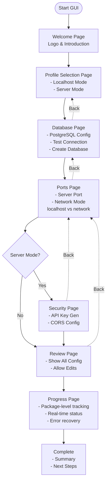
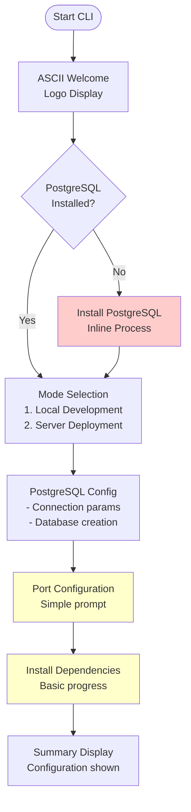
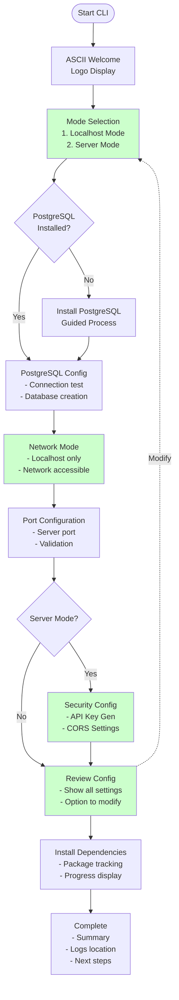

# Installer Flow Visual Comparison

## GUI Installer Flow (setup_gui.py) - REFERENCE

## CLI Installer Flow (setup_cli.py) - CURRENT

## CLI Installer Flow - PROPOSED ALIGNED

## Key Visual Differences

### Current Gaps (Red/Yellow items in Current CLI)
- 🔴 **PostgreSQL First**: CLI checks PostgreSQL before mode selection (wrong order)
- 🟡 **No Network Mode**: CLI doesn't explicitly set network binding
- 🟡 **Basic Port Config**: No validation or network mode consideration
- 🟡 **No Security Page**: CORS configuration missing
- 🔴 **No Review Step**: Can't review before installation
- 🟡 **Basic Progress**: No package-level tracking

### Proposed Improvements (Green items)
- ✅ **Aligned Mode Names**: "localhost" and "server"
- ✅ **Mode Selection First**: Matches GUI flow order
- ✅ **Network Mode Selection**: Explicit binding configuration
- ✅ **Security Configuration**: API key and CORS for server mode
- ✅ **Review Step**: See all config before installing
- ✅ **Navigation**: Can modify configuration before commit

## Side-by-Side Comparison Table

| Step | GUI Page | Current CLI | Proposed CLI | Status |
|------|----------|-------------|--------------|--------|
| 1 | Welcome with Logo | ASCII Welcome | ASCII Welcome | ✅ OK |
| 2 | Mode Selection (localhost/server) | PostgreSQL Check | Mode Selection | 🔴 Fix Order |
| 3 | PostgreSQL Config | Mode Selection | PostgreSQL Check | 🔴 Fix Order |
| 4 | Port + Network Config | PostgreSQL Config | PostgreSQL Config | ✅ OK |
| 5 | Security (if server) | Port Config (basic) | Network Mode | 🆕 Add |
| 6 | Review Page | Install Dependencies | Port Config | ⚡ Enhance |
| 7 | Progress Install | Summary | Security (if server) | 🆕 Add |
| 8 | Complete | - | Review | 🆕 Add |
| 9 | - | - | Install with Progress | ⚡ Enhance |
| 10 | - | - | Complete | ✅ OK |

## User Decision Points Comparison

### GUI Decision Points
1. **Mode**: Radio button selection with descriptions
2. **PostgreSQL**: Multiple fields, test button
3. **Ports**: Spinner control with validation
4. **Network**: Dropdown (localhost/network)
5. **CORS**: Text field for origins (server only)
6. **Review**: Next/Back/Cancel buttons

### CLI Current Decision Points
1. **PostgreSQL Install**: Y/N prompt
2. **Mode**: Menu 1/2 selection
3. **PostgreSQL Config**: Sequential prompts
4. **Port**: Simple number input
5. **Continue**: Y/N at errors only

### CLI Proposed Decision Points
1. **Mode**: Menu 1/2 selection (FIRST)
2. **PostgreSQL Install**: Y/N if needed
3. **PostgreSQL Config**: Sequential with validation
4. **Network Mode**: Menu 1/2 (server only)
5. **Port**: Number with validation
6. **CORS**: Multi-line input (server only)
7. **Review**: 1=Continue/2=Modify/3=Cancel

## Implementation Effort Estimate

| Component | LOC Estimate | Complexity | Time |
|-----------|-------------|------------|------|
| Mode Name Alignment | ~20 lines | Low | 30 min |
| CORS Configuration | ~50 lines | Medium | 2 hours |
| Network Mode Selection | ~40 lines | Medium | 1.5 hours |
| Review Step | ~80 lines | Medium | 2 hours |
| Enhanced Progress | ~100 lines | Medium | 3 hours |
| Improved Error Handling | ~150 lines | High | 4 hours |
| Logging System | ~60 lines | Low | 1.5 hours |
| **Total Estimate** | **~500 lines** | **Medium** | **~14 hours** |

---

*Visual comparison for quick reference during implementation*