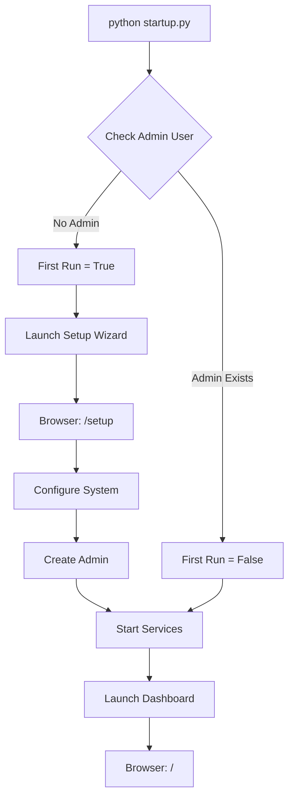
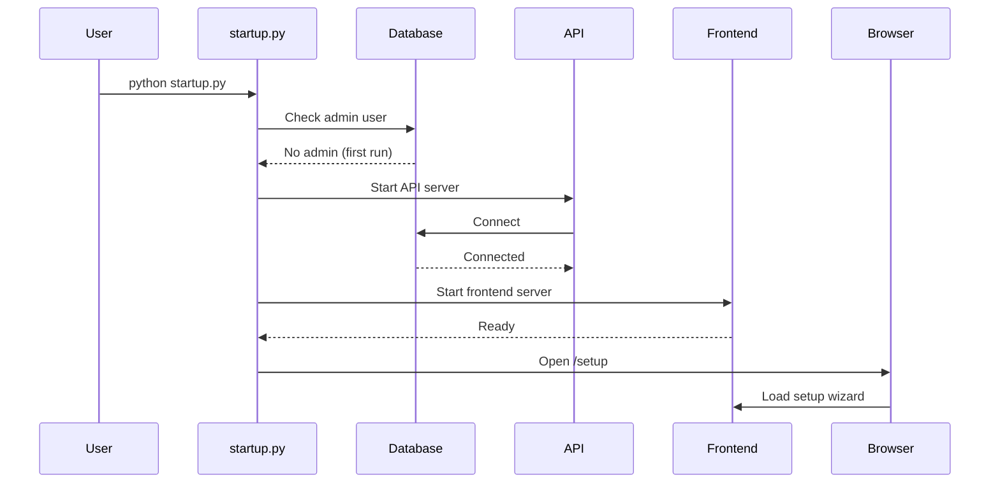
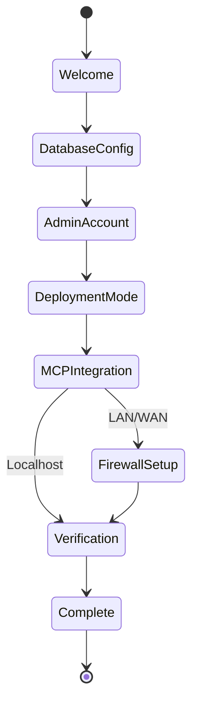

# Startup Simplification Guide

**Version**: 3.0.0
**Date**: 2025-10-09
**Status**: Production Ready

## Overview

GiljoAI MCP v3.0 introduces `startup.py`, a unified entry point that simplifies installation and launch. This replaces multiple platform-specific scripts (install.bat, quickstart.sh) with a single, intelligent startup command that works everywhere.

**Key Benefits**:
- Single command to install and run: `python startup.py`
- Automatic first-run detection with setup wizard
- Existing installations launch directly to dashboard
- Cross-platform compatibility (Windows, Linux, macOS)
- No manual configuration required

## Quick Start

### First Time Installation

```bash
# Clone the repository
git clone https://github.com/giljoai/GiljoAI_MCP.git
cd GiljoAI_MCP

# Run startup.py - handles everything automatically
python startup.py
```

That's it. The startup script will:
1. Detect if this is your first run
2. Launch the setup wizard in your browser
3. Guide you through configuration
4. Start all services automatically

### Existing Installation

```bash
# Navigate to project directory
cd GiljoAI_MCP

# Launch services
python startup.py
```

For existing installations, startup.py detects that setup is complete and launches directly to the dashboard.

## What Happens During Startup

### Phase 1: Environment Check

The startup script performs comprehensive environment validation:

**Python Version Verification**:
```
Checking Python version... 3.10.8 [OK]
```
- Requires Python 3.10 or higher
- Validates virtual environment if present
- Checks for required system dependencies

**PostgreSQL Detection**:
```
Checking PostgreSQL... PostgreSQL 18.0 detected [OK]
Database connectivity... Connected [OK]
```
- Detects installed PostgreSQL version
- Tests database connectivity
- Verifies giljo_mcp database exists

**Dependency Validation**:
```
Checking Python dependencies... 25/25 installed [OK]
Checking frontend dependencies... node_modules found [OK]
```
- Validates all core dependencies installed
- Checks for missing packages
- Offers to install missing dependencies

### Phase 2: First-Run Detection

The startup script intelligently determines if this is a first-time setup:

**Detection Logic**:
```python
# Checks for admin user in database
# If no admin exists: First run = True (show setup wizard)
# If admin exists: First run = False (launch dashboard)
```

**First Run Indicators**:
- No admin user in database
- Missing config.yaml
- No .env file
- Empty or uninitialized database

**Existing Installation Indicators**:
- Admin user exists in database
- Valid config.yaml present
- Environment configured
- Services previously started

### Phase 3: Setup Wizard (First Run Only)

If first run is detected, startup.py launches the interactive setup wizard:

**Browser Auto-Launch**:
```
First run detected - launching setup wizard...
Opening browser: http://localhost:7274/setup
```

**Setup Wizard Steps**:

1. **Welcome Screen**
   - Introduction to GiljoAI MCP
   - System requirements checklist
   - Deployment mode overview

2. **Database Configuration**
   - PostgreSQL connection test
   - Database initialization
   - Schema creation and migration

3. **Admin Account Creation**
   - Username and email
   - Secure password (bcrypt hashed)
   - Role assignment (admin)
   - Tenant key (default or custom)

4. **Deployment Mode Selection**

   **Localhost Mode** (Default):
   - API binds to 127.0.0.1
   - No authentication required
   - Auto-login for localhost users
   - Best for individual developers

   **LAN Mode**:
   - API binds to network adapter IP (e.g., 10.1.0.164)
   - API key authentication required
   - Firewall configuration needed
   - Best for team environments

   **WAN Mode**:
   - API binds to public IP or domain
   - OAuth + API key authentication
   - TLS/SSL encryption mandatory
   - Firewall and security hardening required
   - Best for public or remote access

5. **MCP Tool Integration**

   Configure your AI coding tools:

   **Claude Code CLI**:
   ```json
   {
     "mcpServers": {
       "giljo-mcp": {
         "command": "python",
         "args": ["-m", "giljo_mcp"],
         "env": {
           "GILJO_MCP_HOME": "/path/to/GiljoAI_MCP",
           "GILJO_SERVER_URL": "http://localhost:7272"
         }
       }
     }
   }
   ```

   **Cline (VSCode)**:
   ```json
   {
     "mcpServers": {
       "giljo-mcp": {
         "command": "python",
         "args": ["-m", "giljo_mcp"],
         "cwd": "/path/to/GiljoAI_MCP"
       }
     }
   }
   ```

   **Cursor IDE**:
   ```json
   {
     "mcp": {
       "servers": {
         "giljo-mcp": {
           "command": "python -m giljo_mcp"
         }
       }
     }
   }
   ```

6. **Firewall Configuration** (LAN/WAN only)

   Wizard displays platform-specific firewall rules:

   **Windows** (PowerShell):
   ```powershell
   New-NetFirewallRule -DisplayName "GiljoAI MCP API" `
     -Direction Inbound -LocalPort 7272 -Protocol TCP -Action Allow

   New-NetFirewallRule -DisplayName "GiljoAI MCP Dashboard" `
     -Direction Inbound -LocalPort 7274 -Protocol TCP -Action Allow
   ```

   **Linux** (UFW):
   ```bash
   sudo ufw allow 7272/tcp comment "GiljoAI MCP API"
   sudo ufw allow 7274/tcp comment "GiljoAI MCP Dashboard"
   ```

   **macOS** (PF Firewall):
   ```bash
   # Add to /etc/pf.conf
   pass in proto tcp from any to any port 7272
   pass in proto tcp from any to any port 7274

   # Reload firewall
   sudo pfctl -f /etc/pf.conf
   ```

7. **System Verification**
   - Tests all service connectivity
   - Validates authentication system
   - Checks MCP tool integration
   - Confirms firewall rules (if configured)
   - Final health check

**Setup Completion**:
```
Setup Complete!
Services starting...
API Server: http://localhost:7272 [RUNNING]
Dashboard: http://localhost:7274 [RUNNING]
Opening dashboard in browser...
```

### Phase 4: Service Startup

After setup (or for existing installations), startup.py launches all services:

**API Server Launch**:
```bash
Starting API server on http://localhost:7272...
[INFO] Uvicorn running on http://127.0.0.1:7272 (Press CTRL+C to quit)
[INFO] Database connected: PostgreSQL 18.0
[INFO] MCP tools loaded: 22 tools available
```

**Frontend Server Launch**:
```bash
Starting frontend server on http://localhost:7274...
[INFO] Vue.js development server ready
[INFO] Dashboard accessible at http://localhost:7274
```

**Browser Auto-Open**:
```
Opening dashboard: http://localhost:7274
```
- Automatically opens default browser
- Navigates to dashboard
- Shows auto-login for localhost mode
- Shows login page for LAN/WAN mode

**Service Health Check**:
```
Health Check Results:
  API Server: http://localhost:7272/health [OK]
  Database: giljo_mcp @ localhost:5432 [OK]
  MCP Tools: 22 tools loaded [OK]
  Dashboard: http://localhost:7274 [OK]

All systems operational.
```

## Command-Line Options

```bash
# Standard startup (auto-detects first run)
python startup.py

# Force setup wizard (even if already configured)
python startup.py --setup

# Skip browser auto-open
python startup.py --no-browser

# Specify custom port
python startup.py --port 7272

# Verbose logging
python startup.py --verbose

# Development mode (with auto-reload)
python startup.py --dev

# Show help
python startup.py --help
```

## Troubleshooting

### Issue: Python Version Too Old

**Error**:
```
ERROR: Python 3.10+ required. Found: 3.9.7
```

**Solution**:
```bash
# Windows (using Chocolatey)
choco install python --version=3.10.8

# Ubuntu/Debian
sudo apt update
sudo apt install python3.10

# macOS (using Homebrew)
brew install python@3.10
```

### Issue: PostgreSQL Not Detected

**Error**:
```
ERROR: PostgreSQL not found. Please install PostgreSQL 18.
```

**Solution**:
```bash
# Windows
# Download installer from https://www.postgresql.org/download/windows/

# Ubuntu/Debian
sudo apt update
sudo apt install postgresql-18

# macOS
brew install postgresql@18
```

### Issue: Database Connection Failed

**Error**:
```
ERROR: Could not connect to database 'giljo_mcp'
```

**Solution**:
```bash
# 1. Verify PostgreSQL is running
# Windows
Get-Service postgresql*

# Linux
sudo systemctl status postgresql

# macOS
brew services list | grep postgresql

# 2. Create database if missing
psql -U postgres -c "CREATE DATABASE giljo_mcp;"

# 3. Check credentials in .env file
cat .env | grep DB_
```

### Issue: Port Already in Use

**Error**:
```
ERROR: Port 7272 is already in use
```

**Solution**:
```bash
# Option 1: Stop the process using the port
# Windows
netstat -ano | findstr :7272
taskkill /PID <process_id> /F

# Linux/macOS
lsof -i :7272
kill -9 <process_id>

# Option 2: Use a different port
python startup.py --port 7273
```

### Issue: Missing Dependencies

**Error**:
```
ERROR: Missing required packages: fastapi, uvicorn, sqlalchemy
```

**Solution**:
```bash
# Install core dependencies
pip install -r requirements.txt

# If using virtual environment
python -m venv venv
source venv/bin/activate  # Windows: venv\Scripts\activate
pip install -r requirements.txt
```

### Issue: Browser Doesn't Auto-Open

**Symptom**: Services start but browser doesn't open

**Solution**:
```bash
# Manually open browser
# Localhost mode:
open http://localhost:7274

# LAN mode (replace with your IP):
open http://10.1.0.164:7274

# Or use --no-browser flag to suppress the attempt
python startup.py --no-browser
```

### Issue: Setup Wizard Doesn't Appear

**Symptom**: Dashboard shows login page instead of setup wizard

**Possible Causes**:
- Admin user already exists in database
- Setup was previously completed

**Solution**:
```bash
# Option 1: Force setup wizard
python startup.py --setup

# Option 2: Check if admin exists
psql -U postgres -d giljo_mcp -c "SELECT username, role FROM users WHERE role='admin';"

# Option 3: Reset database (WARNING: Deletes all data)
psql -U postgres -c "DROP DATABASE IF EXISTS giljo_mcp;"
psql -U postgres -c "CREATE DATABASE giljo_mcp;"
python startup.py
```

### Issue: Firewall Blocks Network Access

**Symptom**: Works on localhost but not from other machines (LAN/WAN mode)

**Solution**:

**Windows**:
```powershell
# Check firewall rules
Get-NetFirewallRule | Where-Object {$_.DisplayName -like "*GiljoAI*"}

# Add rules if missing
New-NetFirewallRule -DisplayName "GiljoAI MCP API" `
  -Direction Inbound -LocalPort 7272 -Protocol TCP -Action Allow

New-NetFirewallRule -DisplayName "GiljoAI MCP Dashboard" `
  -Direction Inbound -LocalPort 7274 -Protocol TCP -Action Allow
```

**Linux (UFW)**:
```bash
# Check firewall status
sudo ufw status

# Add rules
sudo ufw allow 7272/tcp comment "GiljoAI MCP API"
sudo ufw allow 7274/tcp comment "GiljoAI MCP Dashboard"
sudo ufw reload
```

**Linux (firewalld)**:
```bash
# Check firewall
sudo firewall-cmd --list-all

# Add rules
sudo firewall-cmd --permanent --add-port=7272/tcp
sudo firewall-cmd --permanent --add-port=7274/tcp
sudo firewall-cmd --reload
```

**macOS**:
```bash
# PF firewall rules
sudo nano /etc/pf.conf

# Add lines:
pass in proto tcp from any to any port 7272
pass in proto tcp from any to any port 7274

# Reload
sudo pfctl -f /etc/pf.conf
```

See [FIREWALL_CONFIGURATION.md](FIREWALL_CONFIGURATION.md) for comprehensive firewall setup.

## Migration from Old Scripts

### Before (v2.x)

**Multiple scripts for different purposes**:
```bash
# Installation
install.bat              # Windows only
quickstart.sh            # Linux/macOS only

# Starting services
start_backend.bat        # Windows - API only
start_frontend.bat       # Windows - Frontend only
start_giljo.bat          # Windows - Both services

# Different commands for different platforms
# Complex multi-step process
# No automatic first-run detection
```

### After (v3.0)

**Single unified script**:
```bash
# Works everywhere
python startup.py

# Handles everything:
# - First-run detection
# - Setup wizard
# - Service startup
# - Browser launch
# - Health checks
```

### Migration Steps

1. **Update Your Workflow**:
   ```bash
   # Old way (v2.x)
   install.bat
   start_giljo.bat

   # New way (v3.0)
   python startup.py
   ```

2. **Update Documentation References**:
   - Replace `install.bat` references with `python startup.py`
   - Remove platform-specific script instructions
   - Update Quick Start guides

3. **Update CI/CD Pipelines**:
   ```yaml
   # Old (.github/workflows/deploy.yml)
   - name: Install
     run: ./install.bat

   # New
   - name: Install and Start
     run: python startup.py --no-browser
   ```

4. **Update Team Instructions**:
   ```markdown
   # Old Team README
   **Windows**: Run `install.bat`
   **Linux/Mac**: Run `quickstart.sh`

   # New Team README
   **All Platforms**: Run `python startup.py`
   ```

### Backward Compatibility

The old scripts remain available for backward compatibility:

**Windows**:
```bash
install.bat              # Still works, calls startup.py internally
start_giljo.bat          # Still works, calls startup.py
```

**Linux/macOS**:
```bash
quickstart.sh            # Still works, calls startup.py
```

**Recommendation**: Migrate to `python startup.py` for the best experience and future-proofing.

## Advanced Usage

### Custom Configuration

```bash
# Specify custom config file
python startup.py --config /path/to/config.yaml

# Generate sample config
python startup.py --generate-config config.yaml

# Validate config without starting
python startup.py --validate-config
```

### Development Mode

```bash
# Enable hot-reload for API and frontend
python startup.py --dev

# With verbose logging
python startup.py --dev --verbose

# Custom development ports
python startup.py --dev --api-port 8000 --dashboard-port 8001
```

### Production Mode

```bash
# Production-optimized startup
python startup.py --production

# With systemd service (Linux)
sudo systemctl start giljo-mcp

# With Windows Service
sc start "GiljoAI MCP"

# With Docker
docker-compose up -d
```

### Automated Deployment

```bash
# Headless installation (CI/CD)
python startup.py --headless --config install_config.yaml

# Non-interactive mode
python startup.py --non-interactive

# With environment variables
export DB_PASSWORD="secure_password"
export GILJO_API_PORT="7272"
python startup.py --headless
```

## Architecture

### First-Run Detection Flow



### Service Startup Sequence



### Setup Wizard Flow



## Security Considerations

### Localhost Mode Security

- No network exposure (binds to 127.0.0.1)
- Auto-login enabled for localhost users
- No authentication required
- Safe for individual development

### LAN Mode Security

- API key authentication required
- Firewall configuration mandatory
- IP-based auto-login for localhost
- Network clients require API key

### WAN Mode Security

- OAuth + API key authentication
- TLS/SSL encryption mandatory
- Rate limiting enabled
- DDoS protection recommended
- Security hardening required

## Related Documentation

- [Installation Guide](../manuals/INSTALL.md) - Detailed installation instructions
- [Quick Start Guide](../manuals/QUICK_START.md) - 5-minute quick start
- [Firewall Configuration](FIREWALL_CONFIGURATION.md) - Comprehensive firewall setup
- [Migration Guide](../MIGRATION_GUIDE_V3.md) - v2.x to v3.0 upgrade guide
- [Production Deployment](../deployment/PRODUCTION_DEPLOYMENT_V3.md) - Production deployment runbook

## Frequently Asked Questions

### Q: Can I skip the setup wizard?

**A**: Yes, with configuration file:
```bash
python startup.py --config install_config.yaml --headless
```

### Q: How do I reset the setup?

**A**: Force setup wizard:
```bash
python startup.py --setup
```

Or reset database:
```bash
psql -U postgres -c "DROP DATABASE IF EXISTS giljo_mcp;"
python startup.py
```

### Q: What if I want to change deployment mode later?

**A**: Edit config.yaml and restart:
```yaml
# config.yaml
deployment_context: lan  # Change from localhost to lan
```
```bash
python startup.py
```

### Q: Can I run multiple instances?

**A**: Yes, with different ports:
```bash
# Instance 1
python startup.py --api-port 7272 --dashboard-port 7274

# Instance 2
python startup.py --api-port 7372 --dashboard-port 7374
```

### Q: How do I automate deployment?

**A**: Use configuration file:
```bash
# Generate config template
python startup.py --generate-config install_config.yaml

# Edit install_config.yaml with your settings

# Deploy non-interactively
python startup.py --config install_config.yaml --headless
```

## Summary

The new `startup.py` entry point simplifies the GiljoAI MCP installation and launch experience:

**Key Advantages**:
- Single command for all platforms
- Automatic first-run detection
- Interactive setup wizard
- Intelligent service management
- Built-in troubleshooting

**Typical Usage**:
```bash
# First time
git clone https://github.com/giljoai/GiljoAI_MCP.git
cd GiljoAI_MCP
python startup.py  # Launches setup wizard

# Every subsequent time
cd GiljoAI_MCP
python startup.py  # Launches dashboard directly
```

No manual configuration. No platform-specific scripts. Just `python startup.py` and you're running.
