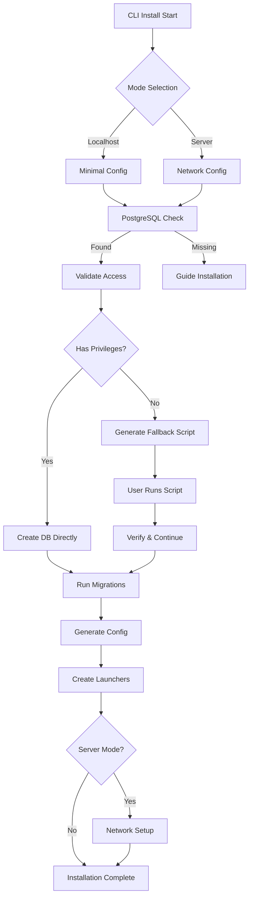

# GiljoAI MCP Installation System - CLI Project Overview

## Executive Summary

Ship a professional, cross-platform CLI installation system that delivers zero post-install launch for both localhost development and server deployments. The system standardizes on PostgreSQL 18, provides elevation fallback strategies, and maintains a clean architecture ready for future SaaS expansion without current complexity.

## Project Vision

"Professional installation that just works - localhost or server, no friction"
- < 5 minutes to working system on localhost
- < 10 minutes for server deployment with network configuration
- Foundation for SaaS without the overhead

## Core Architecture

### Technology Stack
- **CLI Framework**: Click (interactive & batch modes)
- **Database**: PostgreSQL 18 (both modes)
- **Config**: YAML + python-dotenv
- **Testing**: pytest
- **Packaging**: ZIP/Tarball with venv bootstrap

### Two-Mode Architecture

```yaml
modes:
  localhost:
    description: "Developer workstation"
    bind: "127.0.0.1"
    ssl: false
    users: single
    complexity: minimal
    
  server:
    description: "Team LAN/WAN deployment"  
    bind: "0.0.0.0"
    ssl: optional_with_warnings
    users: basic_multi_user
    api_keys: true
    complexity: moderate
```

### Directory Structure
```
GiljoAI_MCP/
├── installer/
│   ├── cli/                    # Click CLI implementation
│   ├── core/                   # Installation logic
│   │   ├── installer.py        # Main orchestration
│   │   ├── database.py         # PostgreSQL setup
│   │   ├── network.py          # Server mode config
│   │   ├── validator.py        # Pre/post validation
│   │   └── config.py           # Configuration management
│   ├── scripts/                # Elevation fallbacks
│   │   ├── create_db.ps1       # Windows
│   │   ├── create_db.sh        # Linux/macOS
│   │   └── firewall_helper.sh  # Server mode
│   └── tests/                  # Test suites
├── launchers/
│   ├── start_giljo.py          # Universal launcher
│   ├── start_giljo.bat         # Windows wrapper
│   └── start_giljo.sh          # Unix wrapper
└── runtime/
    └── wheels/                  # Cached dependencies
```

## Installation Flow



## Privilege & Elevation Strategy

### Principle
Never fail silently. If elevation needed, pause → generate script → guide → verify → continue.

### Windows
```powershell
# Generated script with all parameters
.\installer\scripts\create_db.ps1
```

### Linux/macOS
```bash
# Generated script ready to run
sudo bash installer/scripts/create_db.sh
```

## Database Strategy

### Standardization
- PostgreSQL 18 for both modes (consistency for future SaaS)
- Same schema, same roles, different access configs

### Role Model
```sql
postgres (existing)    -- Admin for setup only
giljo_owner           -- Owns database/schema
giljo_user            -- App runtime (least privilege)
```

### Server Mode Additions
- Remote access configuration (pg_hba.conf)
- Connection pooling defaults
- Basic SSL support

## Configuration Management

### Localhost Mode (config.yaml)
```yaml
mode: localhost
database:
  host: localhost
  port: 5432
  name: giljo_mcp
services:
  bind: 127.0.0.1
  api_port: 8000
  websocket_port: 8001
  dashboard_port: 3000
features:
  ssl: false
  api_keys: false
  multi_user: false
```

### Server Mode Additions
```yaml
mode: server
services:
  bind: 0.0.0.0
features:
  ssl: true  # or false with warnings
  api_keys: true
  multi_user: true
  admin_user: configured
network:
  allowed_ips: []  # Empty = all
  firewall_rules_generated: true
```

## CLI Implementation

### Interactive Mode (Default)
```bash
python install.py

# Prompts:
Installation mode [localhost/server]: localhost
PostgreSQL host [localhost]: 
PostgreSQL port [5432]: 
PostgreSQL admin password: ****
```

### Batch Mode
```bash
# Localhost
python install.py --mode localhost --batch

# Server with options
python install.py --mode server \
  --bind 192.168.1.100 \
  --admin-password SecurePass \
  --batch
```

### Configuration File
```bash
# Generate template
python install.py --generate-config > my_config.yaml

# Install from config
python install.py --config my_config.yaml
```

## Security Approach

### Localhost
- Bind 127.0.0.1 only
- No SSL required
- Single user
- Development friendly

### Server
- Network binding with explicit consent
- SSL recommended (red warning without)
- API key authentication
- Basic admin user
- Firewall rules generated (manual apply)

## Launch System

### Universal Launcher
- `start_giljo.py` validates then starts services
- Dependency order management
- Health checks before proceeding
- Browser auto-open (configurable)
- Clean shutdown handling

### Zero Post-Install
- Database exists and initialized
- All configs generated
- Services start immediately
- No additional setup required

## Testing Strategy

### Core Tests
- Fresh install (both modes)
- Elevation fallback paths
- PostgreSQL missing scenarios
- Port conflicts
- Permission issues
- Cross-platform validation

### Success Metrics
- Install time: < 5 min (localhost), < 10 min (server)
- First launch: < 30 seconds
- Success rate: > 95%
- Zero post-install config

## Distribution

### Primary: Source + Bootstrap
```bash
# User flow
wget/curl installer package
extract
./bootstrap.sh  # Creates venv, installs deps
python install.py
```

### Optional: Docker
```yaml
docker-compose up  # Everything ready
```

## SaaS Foundation (Built but Dormant)

### Schema Ready
- Multi-tenant tables exist but single-tenant enforced
- Usage tracking schema present but disabled
- Upgrade hooks in place

### Activation Path
```python
# Future one-command upgrade
python install.py --enable-saas-features
```

## Phase Breakdown

### Phase 1: Core CLI (Week 1-2)
- CLI framework (interactive + batch)
- PostgreSQL setup with fallbacks
- Localhost mode complete
- Basic launchers

### Phase 2: Server Mode (Week 3)
- Network configuration
- SSL support (optional)
- API keys & admin user
- Firewall helpers

### Phase 3: Polish (Week 4)
- Launch validation
- Error recovery
- Cross-platform testing
- Documentation

## Risk Mitigation

| Risk | Impact | Mitigation |
|------|--------|-----------|
| No elevation | Can't create DB | Fallback scripts with clear guidance |
| PostgreSQL missing | Can't proceed | Detection + installation guide |
| Port conflicts | Launch fails | Detection + alternative suggestions |
| Network security | Exposure risk | Default localhost, explicit consent for network |

## Success Criteria

- CLI installer works on all platforms
- Both modes fully functional
- Database creation handled gracefully
- Zero post-install configuration
- Clean upgrade path to SaaS
- Professional, maintainable code


## Agent Coordination Matrix

| From → To | Handoff | Critical Points |
|-----------|---------|-----------------|
| Orchestrator → Database | PostgreSQL requirements | Version 18, fallback strategy |
| Database → Network | Remote access config | pg_hba.conf, SSL requirements |
| Network → Implementation | Server mode features | SSL paths, API keys |
| Implementation → Testing | Complete installer | Both modes, all platforms |
| Testing → Orchestrator | Test results | Go/no-go decision |

## Communication Protocols

### Task Assignment
task:
  agent: database-specialist
  action: implement-fallback-scripts
  requirements:
    - Windows PowerShell version
    - Linux/macOS bash version
    - Idempotent operations
    - Clear user guidance
  success_criteria:
    - Scripts generated with parameters
    - User can run elevated
    - Installation continues after
Status Reporting
yamlstatus:
  agent: implementation-developer
  phase: localhost-cli
  progress: 75%
  completed:
    - CLI framework
    - Interactive prompts
    - Batch mode
  blocking:
    - None
  next:
    - Configuration generation
    - Launcher creation
Issue Escalation
yamlissue:
  agent: network-engineer
  severity: medium
  description: SSL cert generation failing on Windows
  impact: Server mode without SSL
  recommendation: Use OpenSSL binary or Python cryptography
  decision_needed: true
Quality Standards
All agents must ensure:

No GUI components - CLI only
Two modes only - Localhost and server
PostgreSQL 18 - Single database option
Zero post-install - Must work immediately
Cross-platform - Windows, Linux, macOS
Professional output - Clear, helpful, no emojis
Error recovery - Never fail silently
Security by default - Localhost binding, explicit network consent

Success Metrics
Phase 1 (Localhost)

Database created during install ✓
Fallback scripts work ✓
start_giljo launches immediately ✓

Phase 2 (Server)

Network binding with warnings ✓
SSL optional but recommended ✓
Firewall rules generated ✓

Phase 3 (Polish)

Launch validation complete ✓
Error recovery implemented ✓
Performance targets met ✓