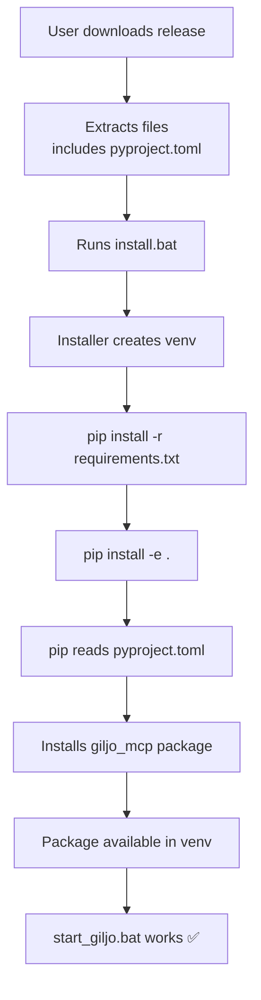

# DevLog: Installer Package Installation Fix

**Date**: 2025-10-02
**Developer**: Claude Code + User
**Issue**: Fresh installation failing with "No module named giljo_mcp"
**Status**: Fixed ✅

---

## Problem Summary

Users running fresh installation via `install.bat` would complete the installer successfully, but launching with `start_giljo.bat` would fail with:

```
ModuleNotFoundError: No module named 'giljo_mcp'
```

## Investigation Process

### Step 1: Identified Missing Package Installation
- Installer was installing dependencies from `requirements.txt` ✅
- Installer was NOT installing the `giljo_mcp` package itself ❌
- The package source exists in `src/giljo_mcp/` but wasn't pip-installed into venv

### Step 2: Found Root Causes

#### Cause 1: Missing pyproject.toml in Releases
```python
# giltest.py was excluding:
EXCLUDE_FILES = [
    ...
    "pyproject.toml",  # ❌ WRONG - needed for package install
    ...
]
```

#### Cause 2: Conflicting setup.py File
```python
# setup.py was installer helper utilities, NOT package config
# This confused pip when trying to run: pip install -e .
```

#### Cause 3: Build Artifacts in Git
- `src/giljo_mcp.egg-info/` was in repo
- Caused "Multiple .egg-info directories found" error during editable install

## Solution Implementation

### Fix 1: Include pyproject.toml in Releases ✅
**File**: `giltest.py`
**Change**: Removed `pyproject.toml` from exclusion list
**Commit**: `c16f32d`

```python
# Development configs
".gitignore", ".gitignore.release", ".gitattributes",
".dockerignore", ".coveragerc",
".pre-commit-config.yaml",
".claude*",
".eslintrc*", ".prettierrc*",
"tsconfig.json", "jest.config.*",
"ruff.toml", ".ruff.toml",
# NOTE: pyproject.toml is NEEDED for package installation - DO NOT EXCLUDE
```

### Fix 2: Rename setup.py to Avoid Conflicts ✅
**File**: `setup.py` → `setup_installer.py`
**Change**: Renamed installer utilities to avoid pip confusion
**Commit**: `69933f7`

**Rationale**:
- `setup.py` has special meaning to pip (legacy package config)
- Our file was installer utilities (port checking, config generation)
- Renaming prevents pip from trying to use it for package metadata

### Fix 3: Exclude Build Artifacts from Git ✅
**File**: `.gitignore`
**Added**:
```gitignore
*.egg-info/
build/
dist/
```

**Also updated giltest.py**:
```python
EXCLUDE_DIRS = [
    ...
    "*.egg-info",  # Exclude egg-info directories from releases
    ...
]
```

### Fix 4: Deleted Existing Build Artifacts ✅
```bash
rm -rf src/giljo_mcp.egg-info/
```

## Package Configuration Structure

### Static Files (in git, included in releases):
- `pyproject.toml` - Package definition (name, version, dependencies)
- `requirements.txt` - Dependency list
- `src/giljo_mcp/` - Package source code

### Dynamic Files (created by installer):
- `config.yaml` - Deployment-specific settings
- `.env` - Environment variables
- `venv/` - Virtual environment

### Excluded Files (never in git or releases):
- `*.egg-info/` - Build metadata
- `build/`, `dist/` - Build artifacts
- `.coverage`, `.pytest_cache/` - Test artifacts

## Installation Flow (Fixed)



## Testing Checklist

### Pre-Test Cleanup:
- [ ] Delete `C:\install_test\Giljo_MCP\venv\`
- [ ] Delete `C:\install_test\Giljo_MCP\config.yaml`
- [ ] Delete `C:\install_test\Giljo_MCP\.env`

### Test Fresh Install:
- [ ] Run `giltest.py` (clean install option)
- [ ] Verify `pyproject.toml` is copied to test folder
- [ ] Run `install.bat`
- [ ] Installation completes without errors
- [ ] Check package installed: `venv\Scripts\pip.exe list | grep giljo`
- [ ] Run `start_giljo.bat`
- [ ] Services start successfully
- [ ] No "ModuleNotFoundError: No module named giljo_mcp"

## Files Modified

| File | Action | Reason |
|------|--------|--------|
| `.gitignore` | Added `*.egg-info/`, `build/`, `dist/` | Exclude build artifacts |
| `giltest.py` | Removed `pyproject.toml` exclusion | Include in releases |
| `setup.py` | Renamed to `setup_installer.py` | Avoid pip conflicts |
| `src/giljo_mcp.egg-info/` | Deleted | Remove build artifacts |

## Commits

1. **69933f7**: "fix: Rename setup.py to avoid package install conflicts"
2. **c16f32d**: "fix: Include pyproject.toml in release files"

## Related Documentation

- `/session/2025-10-02_installer_package_setup_fix.md` - Session memory
- `docs/install_project/01_main_project_overview.md` - Installer architecture
- `docs/INSTALLATION.md` - User installation guide

## Next Steps

1. ✅ Commit fixes
2. ⏳ User testing of fresh installation
3. ⏳ Update installer documentation if needed
4. ⏳ Consider adding automated test for package installation

## Dependencies Analysis Note

During troubleshooting, we also analyzed which packages from `requirements.txt` are actually used:

**Definitely Used (15)**:
- Core: fastmcp, fastapi, uvicorn, pydantic, sqlalchemy, psycopg2-binary
- Networking: aiohttp, httpx, websockets
- Config: pyyaml, toml, python-dotenv
- CLI: click
- Utils: psutil
- Testing: pytest

**Likely Unused (12)**: anthropic, asyncpg, google-generativeai, jira, openai, prometheus-client, pydantic-settings, PyGithub, python-jose, python-multipart, rich, slack-sdk

See `analyze_dependencies.py` for full analysis.

---

**End of DevLog**
