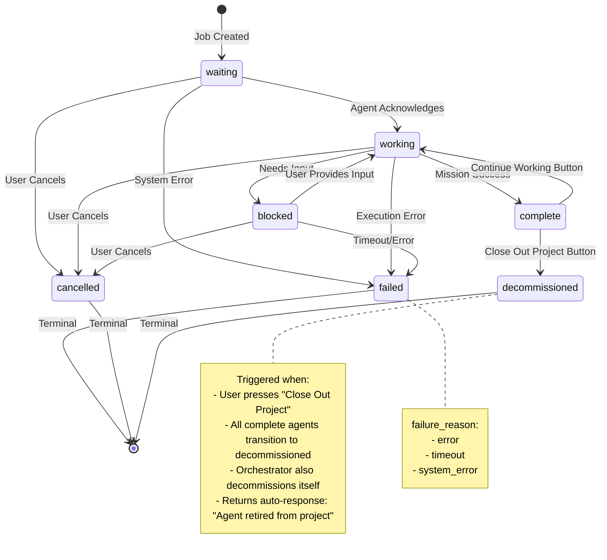

---
**Handover ID:** 0113
**Title:** Unified Agent State System - Eliminate Legacy Agent Model
**Date:** 2025-01-07
**Status:** Planning
**Priority:** Critical
**Complexity:** High
**Estimated Effort:** 4 weeks
**Related Handovers:**
- 0045 (Multi-tool orchestration)
- 0073 (Static agent grid)
- 0107 (Agent monitoring and cancellation)
- 0088 (Thin client architecture)
- 0080 (Orchestrator succession)
---

## Executive Summary

### Problem Statement

**Dual-Model Complexity:** The codebase currently maintains two overlapping agent models that cause confusion, complexity, and maintenance burden:

1. **Legacy `Agent` model** (`models.py:558-603`) - Originally used for agent tracking
2. **Modern `MCPAgentJob` model** (`models.py:2048-2197`) - Current job orchestration system

**Audit Findings:**
- **197 files** import/use the `Agent` model
- **73 files** import/use the `MCPAgentJob` model
- **Significant overlap** where files use BOTH models simultaneously
- **9 status states** in MCPAgentJob (too complex, per user feedback)

**Critical Issues:**
- Dual state machines create confusion about agent status
- `Agent.job_id` creates circular dependency with `MCPAgentJob`
- Data duplication between `Agent.status` and `MCPAgentJob.status`
- Inconsistent state transitions across the two models
- Developer confusion: "Which model should I query?"

### Goal

**Single Source of Truth:** Migrate entirely to `MCPAgentJob` with a SIMPLIFIED state system.

**User Requirement:** Simplified state system with clear semantics. Reduce from 9 states to 7 states with proper decommissioned workflow.

**Benefits:**
- ✅ Single model for all agent job operations
- ✅ Simpler state machine (7 states vs 9 states)
- ✅ Clear project closeout workflow with decommissioned state
- ✅ Eliminates circular dependencies
- ✅ Clearer mental model for developers
- ✅ Reduced database queries (one table vs two)
- ✅ Easier testing and validation
- ✅ Simplified WebSocket event handling

---

## Simplified State System

### Current State (MCPAgentJob - 9 States)

**Status constraint:** `waiting`, `preparing`, `active`, `working`, `review`, `complete`, `failed`, `blocked`, `cancelling`

**Problems:**
- Too many states create confusion
- `active` vs `working` - redundant distinction
- `preparing` vs `waiting` - unclear boundary
- `cancelling` vs `cancelled` - unnecessary intermediate state
- `review` - can be represented as a progress field, not a state

### Proposed State System (7 States)

#### Active States (Non-Terminal)

**`waiting`** - Agent job created, awaiting work assignment
- Entry: Job creation, successor orchestrator created
- Exit: Agent acknowledges job → `working`
- Exit: User cancels → `cancelled`
- Exit: System error → `failed`

**`working`** - Agent actively executing mission
- Entry: Agent acknowledges job and begins work
- Exit: Mission complete → `complete`
- Exit: Agent needs input → `blocked`
- Exit: Error during execution → `failed`
- Exit: User cancels → `cancelled`

**`blocked`** - Agent needs human input or decision
- Entry: Agent encounters blocker requiring user intervention
- Exit: User provides input, agent resumes → `working`
- Exit: User decides to cancel → `cancelled`
- Exit: Timeout or error → `failed`

#### Terminal States (No Further Transitions)

**`complete`** - Mission successfully completed
- Entry: Agent successfully completes all mission objectives
- Exit: User presses "Continue Working" button → `working` (project continues)
- Exit: User presses "Close Out Project" button → `decommissioned` (project ends)
- Cleanup: `completed_at` timestamp set
- Note: Can transition to `decommissioned` when project closes out

**`failed`** - Mission failed due to errors or timeouts
- Entry: Execution error, timeout, system failure
- Terminal: No further state changes allowed
- Context: `failure_reason` field provides specific cause
- Values: `error`, `timeout`, `system_error`

**`cancelled`** - User explicitly cancelled the job
- Entry: User cancels via UI or API
- Terminal: No further state changes allowed
- Cleanup: `completed_at` timestamp set

**`decommissioned`** - Agent permanently retired from project
- Entry: User presses "Close Out Project" button (all `complete` agents → `decommissioned`)
- Terminal: No further state changes allowed
- Purpose: Indicates agent lifecycle ended with project closeout
- Cleanup: `decommissioned_at` timestamp set
- Note: Orchestrator also decommissions itself at project end

### Removed States (Merged)

**~~`preparing`~~** → Merge into `waiting`
- Rationale: Preparation is part of waiting for work to begin
- Migration: All `preparing` jobs become `waiting`

**~~`active`~~** → Use `working` instead
- Rationale: `active` and `working` are redundant
- Migration: All `active` jobs become `working`

**~~`review`~~** → Merge into `working` with progress field
- Rationale: Review is a phase of work, not a distinct state
- Migration: Add `current_task: "In review"` to `job_metadata`
- Frontend: Display review phase via progress indicators

**~~`cancelling`~~** → Use `cancelled` directly
- Rationale: Intermediate state adds complexity without value
- Migration: All `cancelling` jobs transition to `cancelled`
- Note: Cancellation is now atomic operation (Handover 0107)

### State Transition Rules

```
waiting → {working, failed, cancelled}
working → {complete, failed, blocked, cancelled}
blocked → {working, failed, cancelled}
complete → {working, decommissioned}  # Continue working OR close out project
failed → {} (terminal)
cancelled → {} (terminal)
decommissioned → {} (terminal)
```

**Validation:** All state transitions must follow these rules or raise `InvalidStateTransitionError`.

**Special Transitions:**
- `complete → working`: Triggered by "Continue Working" button (user wants to extend project)
- `complete → decommissioned`: Triggered by "Close Out Project" button (user ends project lifecycle)

### State Transition Diagram



---

## Project Closeout Workflow (PDF Slide 6 Implementation)

### UI Components

**"Close Out Project" Button:**
- Appears when ALL agents reach `complete` status
- Positioned alongside "Continue Working" button
- Triggers project closeout workflow
- Transitions ALL `complete` agents → `decommissioned`
- Orchestrator also transitions to `decommissioned`
- Project status changes to `completed`
- Optional: Generate/download project summary documentation

**"Continue Working" Button:**
- Appears alongside "Close Out Project" when all agents complete
- Allows user to resume project without decommissioning
- Transitions ALL `complete` agents → `working`
- User can assign new tasks to agents
- Project remains in `active` status

### Workflow Logic

**Close Out Project:**
```python
def close_out_project(project_id: str, tenant_key: str) -> dict:
    """
    Close out project - transition all complete agents to decommissioned.

    This is the final step in the project lifecycle.
    """
    with db_session() as session:
        # Get all complete agents for this project
        complete_agents = session.query(MCPAgentJob).filter(
            MCPAgentJob.project_id == project_id,
            MCPAgentJob.tenant_key == tenant_key,
            MCPAgentJob.status == 'complete'
        ).all()

        # Transition all to decommissioned
        decommissioned_count = 0
        for agent in complete_agents:
            agent.status = 'decommissioned'
            agent.decommissioned_at = datetime.now(timezone.utc)
            decommissioned_count += 1

        # Update project status to completed
        project = session.query(Project).filter(
            Project.id == project_id,
            Project.tenant_key == tenant_key
        ).first()
        if project:
            project.status = 'completed'

        session.commit()

        return {
            "success": True,
            "decommissioned_count": decommissioned_count,
            "project_status": "completed",
            "message": f"Project closed out. {decommissioned_count} agents decommissioned."
        }
```

**Continue Working:**
```python
def continue_working(project_id: str, tenant_key: str) -> dict:
    """
    Resume work on project - transition all complete agents back to working.

    Allows project to continue without closing out.
    """
    with db_session() as session:
        # Get all complete agents for this project
        complete_agents = session.query(MCPAgentJob).filter(
            MCPAgentJob.project_id == project_id,
            MCPAgentJob.tenant_key == tenant_key,
            MCPAgentJob.status == 'complete'
        ).all()

        # Transition all back to working
        resumed_count = 0
        for agent in complete_agents:
            agent.status = 'working'
            resumed_count += 1

        session.commit()

        return {
            "success": True,
            "resumed_count": resumed_count,
            "message": f"{resumed_count} agents resumed working."
        }
```

### Frontend State Management

**Button Visibility Logic:**
```javascript
// AgentCardEnhanced.vue or ProjectDashboard.vue
computed: {
  allAgentsComplete() {
    return this.agents.every(agent => agent.status === 'complete')
  },

  showProjectButtons() {
    return this.allAgentsComplete && this.agents.length > 0
  }
}
```

**Button Actions:**
```javascript
async closeOutProject() {
  if (!confirm('Close out this project? All agents will be decommissioned. This cannot be undone.')) {
    return
  }

  try {
    const response = await api.post(`/api/projects/${this.projectId}/close-out`)
    this.$toast.success(`Project closed out. ${response.decommissioned_count} agents decommissioned.`)
    this.$router.push('/projects')  // Redirect to projects list
  } catch (error) {
    this.$toast.error('Failed to close out project')
  }
}

async continueWorking() {
  try {
    const response = await api.post(`/api/projects/${this.projectId}/continue-working`)
    this.$toast.success(`${response.resumed_count} agents resumed working`)
    // Agents refresh via WebSocket, no manual reload needed
  } catch (error) {
    this.$toast.error('Failed to resume work')
  }
}
```

---

## Legacy Agent Model - DELETE Plan

### Model Definition to DELETE

**File:** `src/giljo_mcp/models.py:558-603`

**DELETE ENTIRE CLASS:**
```python
class Agent(Base):
    """DELETE THIS ENTIRE MODEL"""
    __tablename__ = "agents"

    # All columns deleted
    id = Column(String(36), primary_key=True, default=generate_uuid)
    tenant_key = Column(String(36), nullable=False)
    project_id = Column(String(36), ForeignKey("projects.id"), nullable=False)
    name = Column(String(200), nullable=False)
    role = Column(String(200), nullable=False)
    status = Column(String(50), default="active")
    mission = Column(Text, nullable=True)
    context_used = Column(Integer, default=0)
    last_active = Column(DateTime(timezone=True), server_default=func.now())
    created_at = Column(DateTime(timezone=True), server_default=func.now())
    decommissioned_at = Column(DateTime(timezone=True), nullable=True)
    meta_data = Column(JSON, default=dict)
    job_id = Column(String(36), nullable=True, index=True)
    mode = Column(String(20), default="claude", server_default="claude")
```

### Database Table to DROP

**SQL Migration:**
```sql
-- After data migration complete, drop agents table
DROP TABLE IF EXISTS agents CASCADE;
```

**Indexes to Remove:**
- `idx_agent_tenant`
- `idx_agent_project`
- `idx_agent_status`
- `uq_agent_project_name` (unique constraint)

### Agent Columns → MCPAgentJob Mapping

**PRESERVE in MCPAgentJob (Already Exist):**
- `Agent.name` → `MCPAgentJob.agent_name` ✅ (already exists)
- `Agent.role` → `MCPAgentJob.agent_type` ✅ (already exists)
- `Agent.mission` → `MCPAgentJob.mission` ✅ (already exists)
- `Agent.last_active` → `MCPAgentJob.started_at` ✅ (already exists)
- `Agent.mode` → `MCPAgentJob.tool_type` ✅ (already exists)

**PRESERVE in MCPAgentJob.job_metadata (JSONB Storage):**
- `Agent.context_used` → Store in `MCPAgentJob.job_metadata.legacy_context_used`
- `Agent.meta_data` → Merge into `MCPAgentJob.job_metadata`

**DELETE (Not Needed):**
- `Agent.id` → Use `MCPAgentJob.job_id` instead
- `Agent.status` → Use `MCPAgentJob.status` instead
- `Agent.job_id` → Circular dependency, no longer needed
- `Agent.decommissioned_at` → Use `MCPAgentJob.decommissioned_at` (NEW COLUMN)
- `Agent.tenant_key` → Use `MCPAgentJob.tenant_key` instead
- `Agent.project_id` → Use `MCPAgentJob.project_id` instead
- `Agent.created_at` → Use `MCPAgentJob.created_at` instead

---

## File Inventory & Migration Plan

### Categorization Strategy

**Category A: Legacy Functions (DELETE entirely)**
- Files that ONLY support old Agent model with no modern equivalent
- Action: Remove deprecated API endpoints, redirect to agent_jobs.py

**Category B: Hybrid Functions (REFACTOR to MCPAgentJob)**
- Files using both models that have clear migration path
- Action: Remove Agent imports, replace with MCPAgentJob queries

**Category C: Critical Functions (CAREFUL REVIEW)**
- Files where Agent model serves unique purpose not yet in MCPAgentJob
- Action: Analyze carefully, migrate data, then refactor

### High-Priority Overlap Files

Based on grep analysis, key files using BOTH models:

| File | Category | Action | Complexity | Notes |
|------|----------|--------|------------|-------|
| `api/endpoints/agents.py` | A | DELETE | Low | Deprecated API, redirect to agent_jobs.py |
| `api/endpoints/statistics.py` | B | REFACTOR | Medium | Update agent queries to MCPAgentJob |
| `src/giljo_mcp/tools/agent_coordination.py` | B | REFACTOR | High | Remove Agent.job_id lookups, use MCPAgentJob directly |
| `src/giljo_mcp/tools/orchestration.py` | B | REFACTOR | High | Update orchestrator to spawn MCPAgentJob only |
| `src/giljo_mcp/orchestrator.py` | B | REFACTOR | Critical | Core orchestrator logic, careful migration |
| `src/giljo_mcp/orchestrator_succession.py` | B | REFACTOR | High | Succession creates MCPAgentJob, remove Agent references |
| `src/giljo_mcp/slash_commands/handover.py` | B | REFACTOR | Medium | Update /gil_handover to use MCPAgentJob |
| `src/giljo_mcp/tools/agent_status.py` | B | REFACTOR | Medium | Status queries use MCPAgentJob only |
| `api/endpoints/projects.py` | B | REFACTOR | High | Project agent listing uses MCPAgentJob |
| `tests/test_orchestrator_*.py` | B | REFACTOR | High | Update all orchestrator tests to MCPAgentJob |

### Complete File Audit

**Agent Model Usage (197 files):**
All files must be reviewed and migrated. Key areas:
- API endpoints (11 files)
- Tools (15 files)
- Orchestration (8 files)
- Tests (120+ files)
- Documentation (15 files)

**MCPAgentJob Usage (73 files):**
These files already use the modern model and should serve as migration examples.

---

## Migration Strategy

### Phase 1: Preparation (Week 1)

**Tasks:**
1. **Database Backup**
   ```sql
   -- Backup agents table before migration
   CREATE TABLE agents_backup_20250107 AS SELECT * FROM agents;
   ```

2. **Data Migration Script**
   - Create `scripts/migrate_agent_to_mcp_agent_job.py`
   - Map all Agent records to MCPAgentJob records
   - Preserve `context_used` and `meta_data` in `job_metadata` JSONB
   - Set `failure_reason='decommissioned'` for decommissioned agents

3. **Document All 197 Overlap Files**
   - Create categorization table (A/B/C)
   - Identify dependencies and call chains
   - Create migration checklist

4. **Test Fixture Updates**
   - Update all test fixtures to use MCPAgentJob
   - Create factory methods for common test scenarios
   - Remove Agent-based test helpers

5. **Stakeholder Communication**
   - Notify team of upcoming breaking changes
   - Document API endpoint deprecations
   - Provide migration guide for external integrations

**Deliverables:**
- ✅ Database backup created
- ✅ Migration script tested on dev database
- ✅ File categorization complete (197 files documented)
- ✅ Test fixtures updated
- ✅ Migration guide published

### Phase 2: Simplify State System (Week 2)

**Tasks:**
1. **Update Database Constraint**
   ```sql
   -- Drop old constraint
   ALTER TABLE mcp_agent_jobs DROP CONSTRAINT IF EXISTS ck_mcp_agent_job_status;

   -- Add new 7-state constraint
   ALTER TABLE mcp_agent_jobs ADD CONSTRAINT ck_mcp_agent_job_status
     CHECK (status IN ('waiting', 'working', 'blocked', 'complete', 'failed', 'cancelled', 'decommissioned'));

   -- Add failure_reason column (for failed jobs only, NOT decommissioned)
   ALTER TABLE mcp_agent_jobs ADD COLUMN failure_reason VARCHAR(50);

   -- Add check constraint for failure_reason (decommissioned removed from here)
   ALTER TABLE mcp_agent_jobs ADD CONSTRAINT ck_mcp_agent_job_failure_reason
     CHECK (failure_reason IS NULL OR failure_reason IN ('error', 'timeout', 'system_error'));

   -- Add decommissioned_at timestamp column
   ALTER TABLE mcp_agent_jobs ADD COLUMN decommissioned_at TIMESTAMP WITH TIME ZONE;
   ```

2. **Migrate Existing States**
   ```sql
   -- Migrate old states to new states
   UPDATE mcp_agent_jobs SET status = 'waiting' WHERE status = 'preparing';
   UPDATE mcp_agent_jobs SET status = 'working' WHERE status = 'active';
   UPDATE mcp_agent_jobs SET status = 'working' WHERE status = 'review';
   UPDATE mcp_agent_jobs SET status = 'cancelled' WHERE status = 'cancelling';

   -- NOTE: No migration needed for decommissioned (it's a new terminal state)
   -- Decommissioned state will be populated when users press "Close Out Project"
   ```

3. **Update AgentJobManager**
   - File: `src/giljo_mcp/agent_job_manager.py`
   - Update `VALID_TRANSITIONS` dict to 7 states
   - Add `complete → working` transition (Continue Working)
   - Add `complete → decommissioned` transition (Close Out Project)
   - Remove transition logic for deleted states
   - Add `failure_reason` parameter to `fail_job()` method
   - Add `decommission_job()` method for project closeout
   - Add `continue_working()` method to resume from complete
   - Update state validation

4. **Update WebSocket Events**
   - File: `api/app.py`, `api/websocket_manager.py`
   - Remove events for deleted states (`preparing`, `active`, `review`, `cancelling`)
   - Add `agent:decommissioned` event for project closeout
   - Update event payloads to include `failure_reason` when applicable
   - Add `decommissioned_at` timestamp to decommissioned event payloads
   - Add migration notes to changelog

5. **Update Frontend Components**
   - File: `frontend/src/components/projects/AgentCardEnhanced.vue`
   - Remove UI states for `preparing`, `review`, `cancelling`
   - Update status badge colors (7 states)
   - Add `decommissioned` badge styling (gray/archived appearance)
   - Add failure reason display for failed jobs
   - Add "Continue Working" button when all agents are `complete`
   - Add "Close Out Project" button when all agents are `complete`
   - Update progress indicators (review shown via `current_task`)
   - Show `decommissioned_at` timestamp for decommissioned agents

6. **Update MCP Tools**
   - File: `src/giljo_mcp/tools/agent_status.py`
   - Update status descriptions for 7-state system
   - Add `decommissioned` state handling with auto-response message
   - Add failure_reason to status responses
   - Add `decommissioned_at` to status responses
   - Update docstrings

7. **Add "Close Out Project" Workflow**
   - File: `api/endpoints/projects.py`
   - Add `POST /api/projects/{id}/close-out` endpoint
   - Transitions ALL `complete` agents to `decommissioned`
   - Sets `decommissioned_at` timestamp for all agents
   - Transitions project status to `completed`
   - Returns summary of decommissioned agents

8. **Add "Continue Working" Workflow**
   - File: `api/endpoints/agent_jobs.py`
   - Add `POST /api/agent-jobs/{job_id}/continue-working` endpoint
   - Transitions `complete` → `working` for specified agent
   - Can be bulk operation for all complete agents
   - Validates agent is in `complete` state before transition

**Deliverables:**
- ✅ Database schema updated (7 states)
- ✅ AgentJobManager refactored with decommission logic
- ✅ WebSocket events updated (includes decommissioned event)
- ✅ Frontend UI reflects 7 states with project closeout buttons
- ✅ MCP tools updated with auto-response for decommissioned agents
- ✅ "Close Out Project" and "Continue Working" endpoints implemented
- ✅ All tests passing with new states

### Phase 3: Eliminate Agent Model (Week 3)

**Tasks:**
1. **Category A Files (DELETE)**
   - Delete `api/endpoints/agents.py` entirely
   - Update `api/app.py` to remove deprecated routes
   - Add redirects to `agent_jobs.py` endpoints
   - Update API documentation

2. **Category B Files (REFACTOR)**
   - Systematically refactor 197 files
   - Replace `Agent` imports with `MCPAgentJob`
   - Update all queries to use `mcp_agent_jobs` table
   - Remove `Agent.job_id` circular lookups
   - Update function signatures

3. **Category C Files (CAREFUL MIGRATION)**
   - Analyze unique Agent model usage
   - Migrate data requirements to MCPAgentJob.job_metadata
   - Refactor logic to use MCPAgentJob
   - Add comprehensive tests

4. **Drop Agent Table**
   ```sql
   -- Final verification: no more Agent references
   -- Drop foreign keys first
   ALTER TABLE messages DROP CONSTRAINT IF EXISTS fk_message_from_agent;
   ALTER TABLE jobs DROP CONSTRAINT IF EXISTS fk_job_agent;

   -- Drop agent table
   DROP TABLE IF EXISTS agents CASCADE;

   -- Keep backup for 30 days
   -- agents_backup_20250107 remains until 2025-02-06
   ```

5. **Update Relationships**
   - Remove `Agent` from `models.py` entirely
   - Update `Project.agents` relationship to use `Project.agent_jobs`
   - Update `Message` model (remove agent references or migrate to job_id)
   - Update all `ForeignKey` references

6. **Remove Agent Imports**
   - Search codebase: `from.*models.*import.*Agent`
   - Remove all Agent imports (197 files)
   - Verify no runtime errors with comprehensive test suite

**Deliverables:**
- ✅ All 197 files refactored
- ✅ Agent model deleted from models.py
- ✅ Agent table dropped from database
- ✅ No Agent imports in codebase
- ✅ All relationships updated
- ✅ API endpoints updated/deprecated

### Phase 4: Validation (Week 4)

**Tasks:**
1. **Full Test Suite**
   - Run all 500+ tests
   - Target: 100% pass rate
   - Fix any regressions
   - Add new tests for 6-state system

2. **Performance Testing**
   - Benchmark database queries (single table vs dual table)
   - Measure WebSocket event latency
   - Validate state transition performance
   - Compare before/after metrics

3. **Integration Testing**
   - Test orchestrator succession workflow
   - Test agent job lifecycle (waiting → working → complete)
   - Test cancellation flows
   - Test blocked state recovery
   - Test multi-tenant isolation

4. **User Acceptance Testing**
   - Deploy to staging environment
   - Test all agent workflows via UI
   - Verify state transitions display correctly
   - Test failure_reason display
   - Validate WebSocket real-time updates

5. **Documentation Updates**
   - Update CLAUDE.md with single-model architecture
   - Update API documentation (remove deprecated endpoints)
   - Update developer guides
   - Create migration guide for users
   - Update database schema diagrams

6. **Rollback Plan**
   - Document rollback procedure
   - Keep `agents_backup_20250107` table for 30 days
   - Create restoration script if needed
   - Test rollback procedure in dev environment

**Deliverables:**
- ✅ 100% test pass rate
- ✅ Performance benchmarks documented
- ✅ Integration tests passing
- ✅ UAT sign-off
- ✅ Documentation complete
- ✅ Rollback plan tested

---

## Message Interceptor Behavior

### Current Behavior (9 States)

Multiple terminal state messages create confusion.

### Proposed Behavior (7 States)

Simplified responses for terminal states only:

**`complete`:**
```
"Agent has completed its mission. Use 'Continue Working' to resume or 'Close Out Project' to decommission."
```

**`failed`:**
```python
if failure_reason == "error":
    f"Agent job failed: {error_message}"
elif failure_reason == "timeout":
    "Agent job timed out without completing work."
elif failure_reason == "system_error":
    f"Agent job failed due to system error: {error_message}"
else:
    f"Agent job failed: {failure_reason}"
```

**`cancelled`:**
```
"Agent job was cancelled by user. Create new job to resume work."
```

**`decommissioned`:**
```python
def handle_decommissioned_agent_message(agent_job: MCPAgentJob) -> dict:
    """
    Auto-response for messages sent to decommissioned agents.

    Returns MCP-formatted response indicating agent is retired.
    """
    return {
        "success": False,
        "error": "AGENT_DECOMMISSIONED",
        "message": (
            f"This agent ({agent_job.agent_name}) has been retired from the project. "
            f"If an agent with these skills is needed, a new agent must be spawned "
            f"by the orchestrator using the same code as in the staging phase to add additional agents."
        ),
        "agent_id": agent_job.job_id,
        "agent_type": agent_job.agent_type,
        "status": "decommissioned",
        "decommissioned_at": agent_job.decommissioned_at.isoformat() if agent_job.decommissioned_at else None
    }
```

**Non-Terminal States:**
No interceptor message. Agent can still receive messages and respond.

---

## Database Schema Changes

### Migration Script

**File:** `scripts/migrate_agent_to_mcp_agent_job.py`

```sql
-- ============================================================================
-- Migration: Unified Agent State System (Handover 0113)
-- Date: 2025-01-07
-- Description: Simplify to 7 states, add decommissioned state, add failure_reason, prepare for Agent deletion
-- ============================================================================

BEGIN;

-- 1. Backup existing agents table
CREATE TABLE agents_backup_20250107 AS SELECT * FROM agents;

-- 2. Add failure_reason column to mcp_agent_jobs (for failed jobs only)
ALTER TABLE mcp_agent_jobs ADD COLUMN failure_reason VARCHAR(50);

-- 3. Add check constraint for failure_reason (decommissioned NOT included here)
ALTER TABLE mcp_agent_jobs ADD CONSTRAINT ck_mcp_agent_job_failure_reason
  CHECK (failure_reason IS NULL OR failure_reason IN ('error', 'timeout', 'system_error'));

-- 4. Add decommissioned_at timestamp column
ALTER TABLE mcp_agent_jobs ADD COLUMN decommissioned_at TIMESTAMP WITH TIME ZONE;

-- 5. Migrate existing states to new 7-state system
UPDATE mcp_agent_jobs SET status = 'waiting' WHERE status = 'preparing';
UPDATE mcp_agent_jobs SET status = 'working' WHERE status = 'active';
UPDATE mcp_agent_jobs SET status = 'working' WHERE status = 'review';
UPDATE mcp_agent_jobs SET status = 'cancelled' WHERE status = 'cancelling';

-- 6. Update status constraint to 7 states
ALTER TABLE mcp_agent_jobs DROP CONSTRAINT IF EXISTS ck_mcp_agent_job_status;
ALTER TABLE mcp_agent_jobs ADD CONSTRAINT ck_mcp_agent_job_status
  CHECK (status IN ('waiting', 'working', 'blocked', 'complete', 'failed', 'cancelled', 'decommissioned'));

-- 7. Migrate Agent data to MCPAgentJob.job_metadata (preserve legacy data)
UPDATE mcp_agent_jobs j
SET job_metadata = jsonb_set(
  jsonb_set(
    COALESCE(job_metadata, '{}'::jsonb),
    '{legacy_context_used}',
    to_jsonb(a.context_used)
  ),
  '{legacy_meta_data}',
  COALESCE(a.meta_data::jsonb, '{}'::jsonb)
)
FROM agents a
WHERE j.job_id = a.job_id
  AND a.job_id IS NOT NULL;

COMMIT;

-- ============================================================================
-- Post-migration verification queries
-- ============================================================================

-- Verify state distribution
SELECT status, COUNT(*) FROM mcp_agent_jobs GROUP BY status ORDER BY status;

-- Verify failure_reason for failed jobs
SELECT failure_reason, COUNT(*) FROM mcp_agent_jobs WHERE status = 'failed' GROUP BY failure_reason;

-- Verify no old states remain
SELECT COUNT(*) FROM mcp_agent_jobs WHERE status IN ('preparing', 'active', 'review', 'cancelling');
-- Expected: 0

-- Verify agents backup
SELECT COUNT(*) FROM agents_backup_20250107;

-- ============================================================================
-- PHASE 3: Drop agents table (execute after all code migrations complete)
-- ============================================================================

-- BEGIN;
--
-- -- Drop foreign keys
-- ALTER TABLE messages DROP CONSTRAINT IF EXISTS fk_message_from_agent;
-- ALTER TABLE jobs DROP CONSTRAINT IF EXISTS fk_job_agent;
--
-- -- Drop agents table
-- DROP TABLE IF EXISTS agents CASCADE;
--
-- COMMIT;

-- Note: agents_backup_20250107 retained for 30 days (until 2025-02-06)
```

### Schema After Migration

**`mcp_agent_jobs` table** (final state):
```sql
CREATE TABLE mcp_agent_jobs (
    id INTEGER PRIMARY KEY AUTOINCREMENT,
    tenant_key VARCHAR(36) NOT NULL,
    project_id VARCHAR(36) REFERENCES projects(id),
    job_id VARCHAR(36) UNIQUE NOT NULL,
    agent_type VARCHAR(100) NOT NULL,
    mission TEXT NOT NULL,
    status VARCHAR(50) DEFAULT 'waiting' NOT NULL,
    failure_reason VARCHAR(50),  -- NEW COLUMN (for failed jobs only)
    decommissioned_at TIMESTAMP WITH TIME ZONE,  -- NEW COLUMN (for decommissioned jobs)
    spawned_by VARCHAR(36),
    context_chunks JSON DEFAULT '[]',
    messages JSONB DEFAULT '[]',
    acknowledged BOOLEAN DEFAULT FALSE,
    started_at TIMESTAMP WITH TIME ZONE,
    completed_at TIMESTAMP WITH TIME ZONE,
    created_at TIMESTAMP WITH TIME ZONE DEFAULT NOW(),
    progress INTEGER DEFAULT 0 NOT NULL,
    block_reason TEXT,
    current_task TEXT,
    estimated_completion TIMESTAMP WITH TIME ZONE,
    tool_type VARCHAR(20) DEFAULT 'universal' NOT NULL,
    agent_name VARCHAR(255),
    instance_number INTEGER DEFAULT 1 NOT NULL,
    handover_to VARCHAR(36),
    handover_summary JSONB,
    handover_context_refs JSON DEFAULT '[]',
    succession_reason VARCHAR(100),
    context_used INTEGER DEFAULT 0 NOT NULL,
    context_budget INTEGER DEFAULT 150000 NOT NULL,
    job_metadata JSONB DEFAULT '{}' NOT NULL,
    last_health_check TIMESTAMP WITH TIME ZONE,
    health_status VARCHAR(20) DEFAULT 'unknown' NOT NULL,
    health_failure_count INTEGER DEFAULT 0 NOT NULL,
    last_progress_at TIMESTAMP WITH TIME ZONE,
    last_message_check_at TIMESTAMP WITH TIME ZONE,

    CONSTRAINT ck_mcp_agent_job_status
      CHECK (status IN ('waiting', 'working', 'blocked', 'complete', 'failed', 'cancelled', 'decommissioned')),
    CONSTRAINT ck_mcp_agent_job_failure_reason
      CHECK (failure_reason IS NULL OR failure_reason IN ('error', 'timeout', 'system_error')),
    CONSTRAINT ck_mcp_agent_job_progress_range
      CHECK (progress >= 0 AND progress <= 100),
    CONSTRAINT ck_mcp_agent_job_tool_type
      CHECK (tool_type IN ('claude-code', 'codex', 'gemini', 'universal')),
    CONSTRAINT ck_mcp_agent_job_instance_positive
      CHECK (instance_number >= 1),
    CONSTRAINT ck_mcp_agent_job_succession_reason
      CHECK (succession_reason IS NULL OR succession_reason IN ('context_limit', 'manual', 'phase_transition')),
    CONSTRAINT ck_mcp_agent_job_context_usage
      CHECK (context_used >= 0 AND context_used <= context_budget),
    CONSTRAINT ck_mcp_agent_job_health_status
      CHECK (health_status IN ('unknown', 'healthy', 'warning', 'critical', 'timeout')),
    CONSTRAINT ck_mcp_agent_job_health_failure_count
      CHECK (health_failure_count >= 0)
);
```

---

## Breaking Changes

### API Endpoints

**DEPRECATED (Remove in v4.0):**
- `GET /api/agents` → Use `GET /api/agent-jobs`
- `GET /api/agents/{agent_id}` → Use `GET /api/agent-jobs/{job_id}`
- `POST /api/agents` → Use `POST /api/agent-jobs`
- `PUT /api/agents/{agent_id}/status` → Use `PUT /api/agent-jobs/{job_id}/status`
- `DELETE /api/agents/{agent_id}` → Use `DELETE /api/agent-jobs/{job_id}` (cancellation)

**CHANGED:**
- `GET /api/agent-jobs` - Response no longer includes `agent.status` field
- `GET /api/projects/{id}/agents` - Returns MCPAgentJob objects, not Agent objects
- `GET /api/statistics/agents` - Queries mcp_agent_jobs table only

**NEW:**
- `GET /api/agent-jobs/{job_id}/failure-reason` - Get failure details
- `PUT /api/agent-jobs/{job_id}/failure-reason` - Set failure reason
- `POST /api/projects/{id}/close-out` - Close out project (all complete agents → decommissioned)
- `POST /api/agent-jobs/{job_id}/continue-working` - Resume work from complete state

### MCP Tools

**CHANGED:**
- `get_agent_status()` - Returns 7-state status, includes failure_reason and decommissioned_at
- `spawn_agent_job()` - Creates MCPAgentJob only (no Agent record)
- `acknowledge_job()` - Updates MCPAgentJob.status only
- `complete_job()` - Sets status='complete', no Agent update
- `report_error()` - Sets status='failed', requires failure_reason

**NEW:**
- `decommission_agent_job()` - Decommission agent when project closes out
- `continue_working()` - Resume agent from complete state

**DEPRECATED:**
- `get_agent()` - Removed, use `get_agent_status(job_id)` instead
- `update_agent()` - Removed, use `report_progress(job_id)` instead

### WebSocket Events

**REMOVED EVENTS:**
- `agent:preparing` - Use `agent:waiting` instead
- `agent:active` - Use `agent:working` instead
- `agent:review` - Use `agent:working` with current_task='In review'
- `agent:cancelling` - Use `agent:cancelled` instead

**NEW EVENTS:**
- `agent:decommissioned` - Emitted when agent is decommissioned (project closeout)

**CHANGED EVENTS:**
- `agent:failed` - Now includes `failure_reason` in payload
- `agent:decommissioned` - Includes `decommissioned_at` timestamp
- `agent:status_changed` - Emits 7 states only

**PAYLOAD CHANGES:**
```javascript
// Before
{
  "job_id": "uuid",
  "status": "cancelling",
  "agent_id": "uuid"  // Agent.id
}

// After (7 states)
{
  "job_id": "uuid",
  "status": "cancelled",
  "failure_reason": null,  // Only present for 'failed' status
  "decommissioned_at": null  // Only present for 'decommissioned' status
}
```

### Frontend Components

**BREAKING CHANGES:**
- `AgentCardEnhanced.vue` - Status badge supports 7 states
- `AgentList.vue` - Filters updated to 7 states
- `AgentStatusIcon.vue` - Icon set includes decommissioned state
- `ProjectDashboard.vue` - Agent queries use MCPAgentJob model
- **NEW**: "Continue Working" button when all agents complete
- **NEW**: "Close Out Project" button when all agents complete

**REMOVED PROPS:**
- `agent.status` → Use `job.status`
- `agent.id` → Use `job.job_id`

**NEW PROPS:**
- `job.decommissioned_at` - Timestamp for decommissioned agents

### Database Queries

**BEFORE:**
```python
# Query Agent model
agent = session.query(Agent).filter_by(id=agent_id).first()
status = agent.status

# Join Agent and MCPAgentJob
job = session.query(MCPAgentJob).join(Agent, Agent.job_id == MCPAgentJob.job_id).first()
```

**AFTER:**
```python
# Query MCPAgentJob only
job = session.query(MCPAgentJob).filter_by(job_id=job_id).first()
status = job.status
failure_reason = job.failure_reason  # Only for failed jobs
decommissioned_at = job.decommissioned_at  # Only for decommissioned jobs
```

---

## Success Criteria

### Code Quality
- ✅ Zero `Agent` model imports in codebase
- ✅ Zero queries to `agents` table
- ✅ All 197 overlap files cleaned to MCPAgentJob only
- ✅ No circular dependencies (Agent.job_id removed)

### Testing
- ✅ 100% test coverage for 7-state system
- ✅ All state transitions validated (including complete → working, complete → decommissioned)
- ✅ Terminal state tests include failure_reason and decommissioned_at
- ✅ 500+ existing tests updated and passing
- ✅ New integration tests for project closeout workflow
- ✅ Message interceptor tests for decommissioned state

### Database
- ✅ Database constraint enforces 7 states only
- ✅ `failure_reason` constraint validates allowed values (decommissioned removed)
- ✅ `decommissioned_at` column added and working
- ✅ `agents` table dropped successfully
- ✅ Migration script idempotent and reversible
- ✅ Backup retained for 30 days

### Frontend
- ✅ UI displays 7 states correctly
- ✅ "Continue Working" button functional
- ✅ "Close Out Project" button functional (all complete → decommissioned)
- ✅ Failure reason shown for failed jobs
- ✅ Decommissioned timestamp shown for decommissioned agents
- ✅ Status badges use correct colors (including decommissioned)
- ✅ WebSocket events update in real-time
- ✅ No UI errors or console warnings

### Documentation
- ✅ CLAUDE.md updated with single-model architecture
- ✅ API documentation reflects breaking changes
- ✅ Migration guide published for users
- ✅ State transition diagram updated
- ✅ Developer guides reference MCPAgentJob only

### Performance
- ✅ Database query time improved (single table)
- ✅ WebSocket event latency reduced
- ✅ State transition validation < 5ms
- ✅ No performance regressions

---

## Appendix A: Complete File Inventory

### Files Using Agent Model (197 total)

#### API Endpoints (11 files)
| File | Current Usage | Recommended Action | Complexity |
|------|--------------|-------------------|------------|
| `api/endpoints/agents.py` | Legacy CRUD for Agent model | DELETE endpoint, redirect to agent_jobs | Low |
| `api/endpoints/agent_templates.py` | Template operations, minimal Agent usage | REFACTOR to MCPAgentJob | Low |
| `api/endpoints/projects.py` | Lists agents per project | REFACTOR query to MCPAgentJob | Medium |
| `api/endpoints/statistics.py` | Agent count statistics | REFACTOR query to MCPAgentJob | Medium |
| `api/endpoints/orchestration.py` | Orchestrator operations | REFACTOR to MCPAgentJob only | High |
| `api/endpoints/prompts.py` | Prompt generation | REFACTOR to MCPAgentJob | Medium |
| `api/endpoints/agent_jobs.py` | BOTH models used | REMOVE Agent references | High |
| `api/endpoints/downloads.py` | Export functionality | REFACTOR to MCPAgentJob | Low |
| `api/endpoints/claude_export.py` | Claude export | REFACTOR to MCPAgentJob | Low |
| `api/endpoints/templates.py` | Template management | REFACTOR to MCPAgentJob | Medium |

#### Core Tools (15 files)
| File | Current Usage | Recommended Action | Complexity |
|------|--------------|-------------------|------------|
| `src/giljo_mcp/tools/agent_coordination.py` | Agent.job_id lookups | REMOVE Agent, use MCPAgentJob | Critical |
| `src/giljo_mcp/tools/orchestration.py` | BOTH models | REMOVE Agent references | Critical |
| `src/giljo_mcp/tools/agent_status.py` | BOTH models | REFACTOR to MCPAgentJob | High |
| `src/giljo_mcp/tools/agent_messaging.py` | BOTH models | REFACTOR to MCPAgentJob | High |
| `src/giljo_mcp/tools/agent.py` | Legacy agent tools | DELETE or refactor | Medium |
| `src/giljo_mcp/tools/task.py` | Agent references | REFACTOR to MCPAgentJob | Medium |
| `src/giljo_mcp/tools/template.py` | Template operations | REFACTOR to MCPAgentJob | Low |
| `src/giljo_mcp/tools/succession_tools.py` | Orchestrator succession | REFACTOR to MCPAgentJob | High |
| `src/giljo_mcp/tools/context.py` | Context loading | REFACTOR to MCPAgentJob | Low |
| `src/giljo_mcp/tools/message.py` | Agent messaging | REFACTOR to MCPAgentJob | Medium |
| `src/giljo_mcp/tools/tool_accessor.py` | BOTH models | REMOVE Agent references | Medium |
| `src/giljo_mcp/tools/tool_accessor_enhanced.py` | BOTH models | REMOVE Agent references | Medium |
| `src/giljo_mcp/tools/optimization.py` | Performance tools | REFACTOR to MCPAgentJob | Low |
| `src/giljo_mcp/tools/claude_code_integration.py` | Claude Code export | REFACTOR to MCPAgentJob | Medium |

#### Orchestration Core (8 files)
| File | Current Usage | Recommended Action | Complexity |
|------|--------------|-------------------|------------|
| `src/giljo_mcp/orchestrator.py` | BOTH models heavily | REMOVE all Agent usage | Critical |
| `src/giljo_mcp/orchestrator_succession.py` | BOTH models | REMOVE Agent references | Critical |
| `src/giljo_mcp/agent_selector.py` | Agent model queries | REFACTOR to MCPAgentJob | High |
| `src/giljo_mcp/prompt_generator.py` | Agent references | REFACTOR to MCPAgentJob | Medium |
| `src/giljo_mcp/thin_prompt_generator.py` | BOTH models | REMOVE Agent references | High |
| `src/giljo_mcp/agent_job_manager.py` | BOTH models | REMOVE Agent references | Critical |
| `src/giljo_mcp/job_monitoring.py` | BOTH models | REFACTOR to MCPAgentJob | High |
| `src/giljo_mcp/monitoring/agent_health_monitor.py` | BOTH models | REFACTOR to MCPAgentJob | High |

#### Slash Commands (3 files)
| File | Current Usage | Recommended Action | Complexity |
|------|--------------|-------------------|------------|
| `src/giljo_mcp/slash_commands/handover.py` | BOTH models | REMOVE Agent references | Medium |
| `src/giljo_mcp/slash_commands/import_agents.py` | Agent references | REFACTOR to MCPAgentJob | Low |

#### Template System (12 files)
| File | Current Usage | Recommended Action | Complexity |
|------|--------------|-------------------|------------|
| `src/giljo_mcp/template_seeder.py` | Agent references | REFACTOR to MCPAgentJob | Medium |
| `src/giljo_mcp/template_cache.py` | Agent references | REFACTOR to MCPAgentJob | Low |
| `src/giljo_mcp/template_manager.py` | Agent references | REFACTOR to MCPAgentJob | Medium |
| `src/giljo_mcp/template_renderer.py` | Agent references | REFACTOR to MCPAgentJob | Low |
| `src/giljo_mcp/template_materializer.py` | Agent references | REFACTOR to MCPAgentJob | Low |
| `src/giljo_mcp/template_validation.py` | Agent references | REFACTOR to MCPAgentJob | Low |
| `src/giljo_mcp/template_adapter.py` | Agent references | REFACTOR to MCPAgentJob | Low |

#### Supporting Systems (10 files)
| File | Current Usage | Recommended Action | Complexity |
|------|--------------|-------------------|------------|
| `src/giljo_mcp/staging_rollback.py` | BOTH models | REMOVE Agent references | High |
| `src/giljo_mcp/file_staging.py` | Agent references | REFACTOR to MCPAgentJob | Medium |
| `src/giljo_mcp/message_queue.py` | Agent references | REFACTOR to MCPAgentJob | Medium |

#### Tests (120+ files)
All test files must be updated to use MCPAgentJob only. Key categories:

**Unit Tests (40 files):**
- `tests/unit/test_agent_*.py` - Update all agent-related tests
- `tests/unit/test_orchestrator*.py` - Remove Agent usage
- `tests/unit/test_template_*.py` - Update template tests

**Integration Tests (35 files):**
- `tests/integration/test_orchestration_*.py` - Remove Agent usage
- `tests/integration/test_succession_*.py` - Update succession tests
- `tests/integration/test_multi_tool_*.py` - Remove Agent references

**API Tests (25 files):**
- `tests/api/test_agent*.py` - Update or delete deprecated endpoint tests
- `tests/api/test_orchestration*.py` - Remove Agent usage

**Reliability Tests (10 files):**
- `tests/reliability/test_*.py` - Update to MCPAgentJob

**Security Tests (5 files):**
- `tests/security/test_*.py` - Update to MCPAgentJob

**Performance Tests (5 files):**
- `tests/performance/test_*.py` - Benchmark MCPAgentJob queries

#### Documentation (15 files)
| File | Current Usage | Recommended Action | Complexity |
|------|--------------|-------------------|------------|
| `docs/developer_guides/orchestrator_succession_developer_guide.md` | Agent references | UPDATE to MCPAgentJob only | Low |
| `docs/developer_guides/agent_monitoring_developer_guide.md` | BOTH models | UPDATE to MCPAgentJob only | Low |
| `CLAUDE.md` | Agent references | UPDATE architecture section | Low |
| `handovers/completed/*` - Various handovers reference Agent model | ARCHIVE as historical | Low |

---

## Appendix B: Risk Assessment

### High-Risk Areas

**1. Orchestrator Core (`orchestrator.py`)**
- **Risk:** Critical path for all agent operations
- **Impact:** Breaking changes affect all orchestrations
- **Mitigation:** Comprehensive integration tests, staged rollout

**2. Agent Coordination (`tools/agent_coordination.py`)**
- **Risk:** Complex circular dependency on Agent.job_id
- **Impact:** Agent-to-agent messaging could break
- **Mitigation:** Refactor to use MCPAgentJob.job_id directly

**3. Database Migration**
- **Risk:** Data loss during state migration
- **Impact:** Lost agent history, state inconsistencies
- **Mitigation:** Full backup, rollback plan, dry-run testing

**4. WebSocket Events**
- **Risk:** Frontend expects 9-state events
- **Impact:** UI freezes, incorrect status display
- **Mitigation:** Update frontend first, then backend (compatible transition)

### Medium-Risk Areas

**1. Template System**
- **Risk:** Templates reference Agent model
- **Impact:** Template rendering fails
- **Mitigation:** Update all 12 template files simultaneously

**2. Slash Commands**
- **Risk:** /gil_handover uses Agent model
- **Impact:** Succession fails to launch
- **Mitigation:** Test handover workflow thoroughly

**3. API Endpoints**
- **Risk:** External integrations use deprecated endpoints
- **Impact:** Third-party tools break
- **Mitigation:** Deprecation warnings, 3-month sunset period

### Low-Risk Areas

**1. Statistics & Reporting**
- **Risk:** Agent count queries fail
- **Impact:** Dashboard shows incorrect numbers
- **Mitigation:** Simple query updates

**2. Export Functionality**
- **Risk:** Claude Code export broken
- **Impact:** Users can't export agents
- **Mitigation:** Update export logic to MCPAgentJob

---

## Appendix C: Rollback Plan

### Rollback Triggers

Execute rollback if:
- Critical production failures
- Data corruption detected
- > 20% test failure rate
- Unrecoverable WebSocket issues
- User-facing bugs affecting core workflows

### Rollback Procedure

**Step 1: Database Rollback**
```sql
BEGIN;

-- Restore agents table from backup
DROP TABLE IF EXISTS agents;
ALTER TABLE agents_backup_20250107 RENAME TO agents;

-- Restore old status constraint
ALTER TABLE mcp_agent_jobs DROP CONSTRAINT ck_mcp_agent_job_status;
ALTER TABLE mcp_agent_jobs ADD CONSTRAINT ck_mcp_agent_job_status
  CHECK (status IN ('waiting', 'preparing', 'active', 'working', 'review', 'complete', 'failed', 'blocked', 'cancelling'));

-- Remove failure_reason column
ALTER TABLE mcp_agent_jobs DROP COLUMN failure_reason;

-- Restore old states
UPDATE mcp_agent_jobs SET status = 'preparing' WHERE status = 'waiting' AND started_at IS NULL;
UPDATE mcp_agent_jobs SET status = 'active' WHERE status = 'working' AND acknowledged = TRUE;

COMMIT;
```

**Step 2: Code Rollback**
```bash
# Revert to pre-migration commit
git revert <migration-commit-hash>

# Restore Agent model
git checkout HEAD~1 src/giljo_mcp/models.py

# Restore API endpoints
git checkout HEAD~1 api/endpoints/agents.py
```

**Step 3: Frontend Rollback**
```bash
# Restore 9-state UI components
git checkout HEAD~1 frontend/src/components/projects/AgentCardEnhanced.vue
git checkout HEAD~1 frontend/src/components/projects/AgentList.vue

# Rebuild frontend
cd frontend && npm run build
```

**Step 4: Verification**
```bash
# Run test suite
pytest tests/

# Verify database
psql -U postgres -d giljo_mcp -c "SELECT COUNT(*) FROM agents;"

# Test API endpoints
curl http://localhost:7272/api/agents

# Check WebSocket events
# Verify 9-state events emitting correctly
```

### Post-Rollback Analysis

1. Document root cause of rollback
2. Identify missed edge cases
3. Update migration plan
4. Schedule retry timeline
5. Communicate to stakeholders

---

## Appendix D: Testing Strategy

### Test Coverage Goals

**Unit Tests:**
- ✅ 100% coverage of state transition logic
- ✅ All 6 states validated
- ✅ failure_reason validation
- ✅ Invalid state transition errors

**Integration Tests:**
- ✅ Full agent lifecycle (waiting → working → complete)
- ✅ Blocked state recovery workflow
- ✅ Cancellation from all active states
- ✅ Failure scenarios with proper failure_reason

**API Tests:**
- ✅ All deprecated endpoints return 410 Gone
- ✅ New endpoints support 6 states
- ✅ failure_reason included in failed job responses
- ✅ Multi-tenant isolation verified

**WebSocket Tests:**
- ✅ 6-state events emit correctly
- ✅ failure_reason in payloads
- ✅ No events for removed states
- ✅ Real-time updates verified

**Performance Tests:**
- ✅ Single-table queries faster than joins
- ✅ State transition validation < 5ms
- ✅ WebSocket event latency < 50ms
- ✅ Database migration completes in < 5 seconds

### Test Execution Plan

**Week 1:**
- Write migration script tests
- Test state transition logic
- Validate database constraints

**Week 2:**
- Integration tests for 6-state system
- WebSocket event tests
- Frontend component tests

**Week 3:**
- API endpoint tests (deprecated + new)
- Multi-tenant isolation tests
- Performance benchmarks

**Week 4:**
- Full regression test suite
- UAT scenarios
- Load testing

---

## Implementation Checklist

### Pre-Implementation
- [ ] Stakeholder approval obtained
- [ ] Database backup strategy confirmed
- [ ] Rollback plan tested in dev environment
- [ ] Team notified of breaking changes
- [ ] Migration timeline communicated

### Phase 1: Preparation
- [ ] Database backup created (`agents_backup_20250107`)
- [ ] Migration script written and tested
- [ ] All 197 files categorized (A/B/C)
- [ ] Test fixtures updated to MCPAgentJob
- [ ] Migration guide published

### Phase 2: Simplify State System
- [ ] Database constraint updated (6 states)
- [ ] `failure_reason` column added
- [ ] Existing states migrated
- [ ] AgentJobManager refactored
- [ ] WebSocket events updated
- [ ] Frontend UI updated (6 states)
- [ ] MCP tools updated
- [ ] All tests passing

### Phase 3: Eliminate Agent Model
- [ ] Category A files deleted
- [ ] Category B files refactored (197 files)
- [ ] Category C files analyzed and migrated
- [ ] Agent model removed from models.py
- [ ] Agent imports removed (197 files)
- [ ] Database relationships updated
- [ ] API endpoints deprecated/updated
- [ ] Agents table dropped

### Phase 4: Validation
- [ ] 500+ tests passing (100% pass rate)
- [ ] Performance benchmarks meet goals
- [ ] Integration tests passing
- [ ] UAT sign-off received
- [ ] Documentation updated
- [ ] Rollback plan verified

### Post-Implementation
- [ ] Production deployment
- [ ] Monitoring alerts configured
- [ ] User communication sent
- [ ] Migration retrospective completed
- [ ] Handover document finalized

---

## Contact & Questions

For questions about this handover:
- **Technical Lead:** [TBD]
- **Database Expert:** [TBD]
- **Frontend Lead:** [TBD]

**Handover Document:** `F:\GiljoAI_MCP\handovers\0113_unified_agent_state_system.md`
**Status:** Planning - Awaiting user approval to proceed

---

**END OF HANDOVER 0113**
