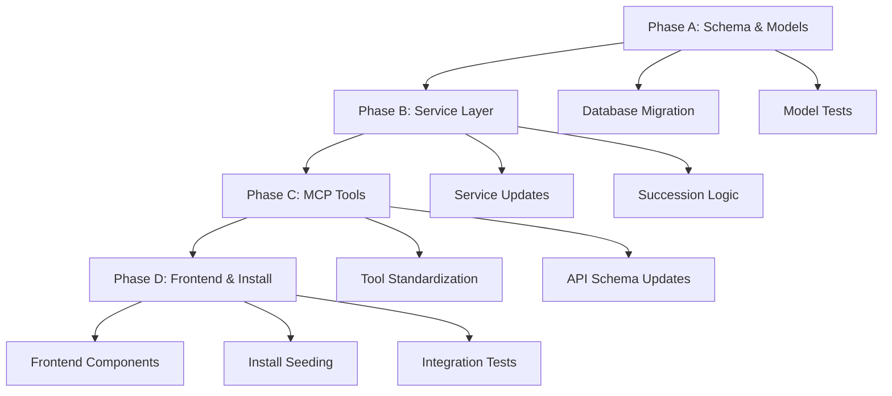

# Handover 0366: Agent Identity Refactor - Master Roadmap

**Date**: 2025-12-19
**Version**: 1.0
**Status**: Planning
**Impact**: CRITICAL - 600+ files affected
**Estimated Duration**: 52-68 hours across 4 phases

---

## Executive Summary

This roadmap outlines a **fundamental architectural change** to how GiljoAI MCP identifies and tracks agents. Currently, `job_id` conflates two distinct concepts:
1. **The work order** (mission/task being performed) - should persist across agent handovers
2. **The executor** (specific agent instance) - changes when succession/handover occurs

This conflation creates semantic confusion, complicates auditing ("which agent worked on this job?"), and limits our ability to track agent lineage and succession chains.

### The New Model

**Before (Current)**:
```
MCPAgentJob:
  - job_id: "abc-123"  # Identifies BOTH the work AND the worker (conflated)
  - agent_type: "orchestrator"
  - mission: "Build auth system"
  - status: "working"
```

**After (Proposed)**:
```
AgentJob (persistent work order):
  - job_id: "abc-123"  # The WORK (persists across succession)
  - mission: "Build auth system"
  - status: "active"

AgentExecution (executor instance):
  - agent_id: "def-456"  # The WORKER (unique per instance)
  - job_id: "abc-123"  # Foreign key to AgentJob
  - agent_type: "orchestrator"
  - instance_number: 1
  - status: "working"
  - succeeded_by: "ghi-789"  # Points to next execution on handover
```

When orchestrator 1 hands over to orchestrator 2:
- **Same job_id** (abc-123) - the work continues
- **Different agent_id** (def-456 → ghi-789) - new executor
- **Preserved lineage** (succession chain tracked)

---

## Why This Refactor Matters

### 1. **Semantic Clarity** (Commercial Product Quality)
- Current: "job_id" means both work and worker - confusing for developers AND users
- Future: Clear separation - "job_id" = work order, "agent_id" = executor instance
- **Benefit**: Code reads like plain English; onboarding time reduced

### 2. **Auditing and Compliance**
- Current: When orchestrator 3 fails, which agent worked on which phase? Unclear.
- Future: Full audit trail - "Agent def-456 worked on job abc-123 from T1-T2, then agent ghi-789 took over"
- **Benefit**: Enterprise-grade auditing for regulated industries

### 3. **Succession Tracking**
- Current: Succession creates NEW job_id - breaks historical context
- Future: Succession creates NEW agent_id, SAME job_id - context preserved
- **Benefit**: Orchestrators can see full project history on handover

### 4. **Messaging Semantics**
- Current: "Send message to job_id abc-123" - which agent instance?
- Future: "Send message to agent_id def-456" - precise delivery
- **Benefit**: Clear inter-agent communication, no ambiguity

### 5. **Database Normalization**
- Current: Duplicate mission data across succession instances (data bloat)
- Future: Mission stored ONCE in AgentJob, shared by all executions
- **Benefit**: Reduced storage, faster queries, cleaner schema

---

## Success Criteria

After all phases complete:

### Functional Requirements
- [ ] Jobs persist across agent succession (same job_id, different agent_id)
- [ ] Messaging uses agent_id semantically ("agent A talks to agent B")
- [ ] Audit trail shows which agents worked on which jobs and when
- [ ] Succession creates new execution, NOT new job
- [ ] install.py seeds new schema correctly with sample data

### Quality Requirements
- [ ] All 600+ file references updated correctly (zero compilation errors)
- [ ] All tests pass (>80% coverage across all layers)
- [ ] No breaking changes for existing functionality (backward compat where feasible)
- [ ] Database migration runs successfully on existing installations
- [ ] Documentation updated (API docs, architecture diagrams, user guides)

### Performance Requirements
- [ ] Query performance equal or better than current schema
- [ ] Message delivery latency unchanged or improved
- [ ] Dashboard load time unchanged or improved

---

## Phase Overview and Dependencies



### **Phase A: Schema and Models** (12-16 hours)
**Goal**: Split `MCPAgentJob` into `AgentJob` + `AgentExecution` with full migration

**Deliverables**:
- Database migration script (handles existing data transformation)
- New models: `AgentJob`, `AgentExecution` with relationships
- Updated indexes for query performance
- Model unit tests (TDD: write FIRST)

**Critical Path**: ALL subsequent phases depend on this foundation

### **Phase B: Service Layer Updates** (16-20 hours)
**Goal**: Update all services to use new dual-model architecture

**Deliverables**:
- Updated: orchestration_service.py, message_service.py, project_service.py, agent_job_manager.py
- New succession logic (creates new execution, NOT new job)
- Service unit tests (TDD: write FIRST)

**Dependencies**: Phase A complete

### **Phase C: MCP Tool Standardization** (12-16 hours)
**Goal**: Standardize all MCP tools to use job_id (work) and agent_id (executor) semantically

**Deliverables**:
- Updated: All tools in src/giljo_mcp/tools/
- Updated: mcp_http.py tool schemas
- Tool integration tests (TDD: write FIRST)

**Dependencies**: Phase A, B complete

### **Phase D: Frontend Integration and Seeding** (12-16 hours)
**Goal**: Update UI to display new identity model and update install scripts

**Deliverables**:
- Updated: JobsTab, LaunchTab, AgentTableView, MessageCenter components
- Updated: install.py seeding logic
- Updated: template_seeder.py
- E2E integration tests (TDD: write FIRST)

**Dependencies**: Phase A, B, C complete

---

## Risk Assessment

### **HIGH RISK** - Breaking Changes
- **Risk**: 600+ files reference job_id/agent_id - mass refactor could introduce bugs
- **Mitigation**:
  - TDD approach (write tests FIRST for each phase)
  - Phased rollout (complete each phase before next)
  - Comprehensive UUID_INDEX document to track all references
  - Integration tests after each phase

### **MEDIUM RISK** - Data Migration Complexity
- **Risk**: Existing production data must transform correctly (job → job + execution)
- **Mitigation**:
  - Thorough migration script with rollback plan
  - Test on production-like dataset before deployment
  - Database schema map document for validation

### **MEDIUM RISK** - Performance Degradation
- **Risk**: Split model could slow down queries (JOIN overhead)
- **Mitigation**:
  - Strategic indexes on foreign keys (job_id, agent_id)
  - Query optimization in service layer
  - Performance benchmarks before/after migration

### **LOW RISK** - Frontend Breaking Changes
- **Risk**: UI components may fail with new data structure
- **Mitigation**:
  - Backend provides backward-compatible API responses during transition
  - E2E tests validate UI functionality
  - Phased frontend updates (read new model → write new model)

---

## Rollback Strategy

### If Phase A Fails (Models/Migration)
- **Action**: Revert database migration, restore MCPAgentJob table
- **Impact**: No user-facing changes, development work lost
- **Recovery Time**: 1 hour

### If Phase B Fails (Services)
- **Action**: Revert service layer changes, keep dual models (unused)
- **Impact**: System continues with old code paths, new models dormant
- **Recovery Time**: 2 hours

### If Phase C/D Fails (Tools/Frontend)
- **Action**: Revert affected components, fall back to service layer
- **Impact**: Partial functionality (backend works, some UI/tools broken)
- **Recovery Time**: 4 hours

### Nuclear Option (Full Rollback)
- **Action**: Database migration rollback + full codebase revert
- **Impact**: Return to pre-0366 state completely
- **Recovery Time**: 6-8 hours

---

## Resource Requirements

### Development Environment
- PostgreSQL 18 (local instance for migration testing)
- Python 3.11+ with full test suite
- Vue 3 development server for frontend testing
- Git Bash (Windows) for cross-platform compatibility

### Testing Infrastructure
- Pytest with coverage reporting (>80% target)
- E2E test framework (Playwright or similar)
- Database seeding scripts for test data
- Isolated test database (prevent production contamination)

### Documentation Tools
- Mermaid for architecture diagrams
- Markdown editors for handover documents
- API documentation generator (Sphinx or similar)

---

## Timeline Estimate

| Phase | Duration | Parallel Work Possible? | Checkpoint |
|-------|----------|-------------------------|------------|
| **Phase A** | 12-16 hours | No (foundation) | Migration runs successfully |
| **Phase B** | 16-20 hours | Partial (different services) | All service tests pass |
| **Phase C** | 12-16 hours | Partial (different tools) | All tool tests pass |
| **Phase D** | 12-16 hours | Partial (frontend/install separate) | E2E tests pass |
| **Total** | **52-68 hours** | ~30% parallelizable | Full integration test suite |

**Aggressive Timeline**: 6-8 working days (8-hour days, focused work)
**Conservative Timeline**: 10-14 working days (buffer for issues, reviews)
**Recommended**: 12 working days with daily checkpoints and integration tests

---

## Next Steps

1. **Review and Approve** this roadmap with stakeholders
2. **Create Reference Documents**:
   - UUID_INDEX_0366.md (map all 600+ file references)
   - DATABASE_SCHEMA_MAP_0366.md (migration strategy details)
3. **Begin Phase A** with TDD approach:
   - Write model tests FIRST
   - Implement migration script
   - Validate with test database
4. **Daily Standups** during execution:
   - Progress review
   - Blocker identification
   - Risk monitoring

---

## Related Documentation

- [Phase A Handover: Schema and Models](./0366a_schema_and_models.md)
- [Phase B Handover: Service Layer Updates](./0366b_service_layer_updates.md)
- [Phase C Handover: MCP Tool Standardization](./0366c_mcp_tool_standardization.md)
- [Phase D Handover: Frontend Integration and Seeding](./0366d_frontend_integration_seeding.md)
- [UUID Index Reference](./Reference_docs/UUID_INDEX_0366.md)
- [Database Schema Map](./Reference_docs/DATABASE_SCHEMA_MAP_0366.md)
- [Architecture Documentation](../docs/SERVER_ARCHITECTURE_TECH_STACK.md)
- [Testing Strategy](../docs/TESTING.md)

---

**Prepared by**: Documentation Manager Agent
**Review Required**: System Architect, Database Expert, Orchestrator Coordinator
**Approval Status**: Pending
