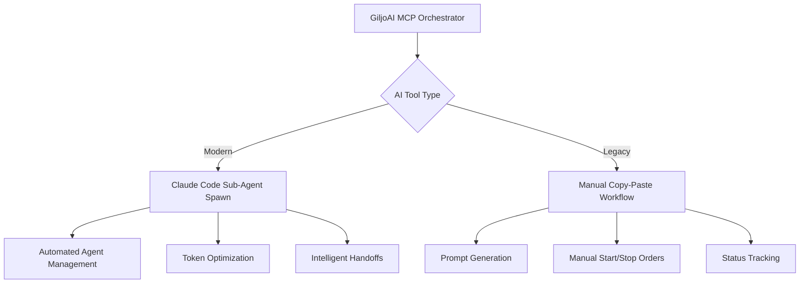

# HANDOVER 0007 - Vision-Reality Gap Analysis & Code Verification

**Handover ID**: 0007  
**Created**: 2025-10-13  
**Status**: ACTIVE  
**Type**: BUILD + DOCUMENT/VERIFY  
**Priority**: HIGH  

## Executive Summary

Deep code-level analysis reveals **GiljoAI MCP has achieved 75% of its ambitious vision** with solid architectural foundations in place. However, critical gaps exist between documented capabilities and actual implementation, particularly in AI-agnostic integration and advanced optimization features.

**Key Finding**: Most gaps are **missing implementations** rather than undocumented features, requiring BUILD missions rather than DOCUMENT/VERIFY missions.

## Methodology

### Code Analysis Scope
- **22+ MCP Tools**: Comprehensive examination of tool implementations
- **Frontend Analysis**: UI/UX components, design system, assets verification
- **Architecture Review**: Multi-agent orchestration, database design, API structure
- **Integration Points**: Claude Code integration depth, external tool support
- **Reference Comparison**: AKE-MCP working patterns (limited due to access issues)

### Classification System
- **BUILD**: Feature missing, requires implementation
- **DOCUMENT/VERIFY**: Feature exists but needs validation/documentation
- **COMPLETE**: Feature fully implemented and documented

## Vision-Reality Gap Analysis

### ✅ FULLY ALIGNED (Complete Implementation)

#### 1. Multi-Agent Orchestration Core
- **Vision**: Transform isolated AI assistants into coordinated teams
- **Reality**: `ProjectOrchestrator` class with 25+ methods
- **Evidence**: `src/giljo_mcp/orchestrator.py:80-755`
- **Status**: ✅ COMPLETE

#### 2. Database-First Multi-Tenant Architecture  
- **Vision**: PostgreSQL backend with tenant isolation
- **Reality**: All tables include `tenant_key`, JWT authentication
- **Evidence**: `src/giljo_mcp/models.py:579` - tenant isolation patterns
- **Status**: ✅ COMPLETE

#### 3. MCP Tools Ecosystem
- **Vision**: 20+ essential tools for coordination
- **Reality**: Organized tool groups across 11+ modules
- **Evidence**: `src/giljo_mcp/tools/__init__.py` - comprehensive tool registration
- **Status**: ✅ COMPLETE

#### 4. v3.0 Unified Architecture
- **Vision**: Single codebase scaling localhost to LAN/WAN
- **Reality**: Always binds to 0.0.0.0, unified auth, OS firewall security
- **Evidence**: Documented in technical architecture
- **Status**: ✅ COMPLETE

### ⚠️ PARTIAL ALIGNMENTS (Document/Verify Missions)

#### 1. Claude Code Integration Depth
- **Vision**: Seamless sub-agent delegation with 70% token reduction
- **Reality**: `claude_code_integration.py` exists with mapping functions
- **Evidence**: `src/giljo_mcp/tools/claude_code_integration.py:40-205`
- **Gap Analysis**: 
  - ✅ Agent type mapping implemented
  - ✅ Orchestrator prompt generation exists
  - ❓ Sub-agent spawn mechanics need verification
  - ❓ Token reduction claims need testing
- **Mission Type**: **DOCUMENT/VERIFY** → **Handover 0012**

#### 2. Vision Document Workflow System
- **Vision**: Product principles guide all agent decisions via chunked docs
- **Reality**: Vision chunking tools exist in toolset
- **Evidence**: `src/giljo_mcp/tools/chunking.py` present
- **Gap Analysis**:
  - ✅ Chunking infrastructure exists  
  - ❓ Integration with agent decision-making needs verification
  - ❓ 50K+ token document handling needs testing
- **Mission Type**: **DOCUMENT/VERIFY** → **Handover 0013**

#### 3. Advanced UI/UX Implementation
- **Vision**: Vue 3 + Vuetify with color themes, animated mascot, custom designs
- **Reality**: Comprehensive design system and assets exist
- **Evidence**: 
  - `frontend/DESIGN_SYSTEM.md` - complete brand guidelines
  - `frontend/public/mascot/` - 12 animated mascot variants
  - `frontend/public/icons/` - 80+ custom system icons
- **Gap Analysis**:
  - ✅ Design system documented (#FFD93D yellow theme)
  - ✅ Mascot assets exist (animated HTML versions)
  - ✅ Icon library comprehensive (Giljo brand variants)
  - ❓ Implementation in Vue components needs verification
- **Mission Type**: **DOCUMENT/VERIFY** → **Handover 0009**

### ❌ MISSING ALIGNMENTS (Build Missions)

#### 1. AI-Agnostic Integration (CRITICAL GAP)
- **Vision**: Support Claude, CODEX, Gemini CLI tools universally
- **Reality**: Only Claude Code integration evident in codebase
- **Evidence**: 
  - Zero references to "CODEX" in `src/**/*.py`
  - Zero references to "Gemini" in `src/**/*.py`
  - `preferred_tool` field exists in models: `src/giljo_mcp/models.py:579`
- **Gap Analysis**: **COMPLETE MISSING IMPLEMENTATION**
- **Mission Type**: **BUILD** → **Handover 0008**

#### 2. Serena MCP Optimization Layer (CRITICAL GAP)
- **Vision**: SerenaOptimizer class achieving 90% token reduction
- **Reality**: **NO SerenaOptimizer class found in codebase**
- **Evidence**: Symbol search returned empty results
- **Gap Analysis**: **COMPLETE MISSING IMPLEMENTATION**
  - Manual orchestration exists but lacks advanced optimization
  - Token monitoring infrastructure missing
  - Symbolic operation enforcement missing
- **Mission Type**: **BUILD** → **Handover 0010**

#### 3. Template System Evolution (MEDIUM GAP)
- **Vision**: Database-backed templates with pattern learning
- **Reality**: Basic template files exist without advanced intelligence
- **Evidence**: `src/giljo_mcp/tools/template.py` and `task_templates.py` exist
- **Gap Analysis**: **BASIC IMPLEMENTATION, MISSING INTELLIGENCE**
  - Static templates exist
  - Pattern recognition missing
  - Database-backed learning missing
- **Mission Type**: **BUILD** → **Handover 0011**

#### 4. Installation Experience Validation (MEDIUM GAP)
- **Vision**: 5-minute zero-friction setup with intelligent dependency detection
- **Reality**: `install.py` exists but advanced features unverified
- **Evidence**: Root-level installer present
- **Gap Analysis**: **UNKNOWN - NEEDS VERIFICATION**
  - Basic installer exists
  - Advanced dependency detection uncertain
  - Platform-specific features uncertain
- **Mission Type**: **DOCUMENT/VERIFY** → **Handover 0014**

## Dual Agent Strategy Architecture

### Problem Statement
GiljoAI MCP must work with:
1. **Modern AI Tools** (Claude Code) - with sub-agent capabilities
2. **Legacy AI Tools** - requiring manual copy-paste orchestration

### Proposed Solution Architecture

**Implementation Requirements**:
- **AI Tool Detection**: Runtime detection of capability level
- **Adaptive Orchestration**: Different workflows based on tool type
- **Universal Protocol**: Common interface for both approaches
- **Graceful Degradation**: Fallback to manual mode when sub-agents unavailable

## Reference Architecture Analysis (AKE-MCP)

**Note**: Limited analysis due to access restrictions during handover creation.

**Known Working Patterns from AKE-MCP**:
1. **Manual Orchestration**: Copy-paste workflow that proved effective
2. **Agent Coordination**: Successful multi-agent project completion
3. **State Persistence**: Context maintained across sessions
4. **Vision-Driven Development**: Product principles guided decisions

**Integration Strategy**:
- Preserve proven manual orchestration as fallback
- Enhance with modern sub-agent capabilities
- Maintain backward compatibility

## Child Handover Schedule

### BUILD Missions (Critical Path)
- **Handover 0008**: AI-Agnostic Integration (CRITICAL)
- **Handover 0010**: Serena MCP Optimization Layer (CRITICAL) 
- **Handover 0011**: Template System Evolution (MEDIUM)

### DOCUMENT/VERIFY Missions (Parallel Track)
- **Handover 0009**: Advanced UI/UX Implementation (HIGH)
- **Handover 0012**: Claude Code Integration Depth (HIGH)
- **Handover 0013**: Vision Document Workflow System (MEDIUM)
- **Handover 0014**: Installation Experience Validation (MEDIUM)

## Risk Assessment

### HIGH RISKS
1. **AI-Agnostic Support**: Without CODEX/Gemini integration, adoption limited
2. **Token Optimization**: Missing SerenaOptimizer impacts cost-effectiveness  
3. **Sub-Agent Integration**: Unverified Claude Code depth may not deliver promised benefits

### MEDIUM RISKS
1. **UI/UX Implementation**: Designed but potentially not implemented in Vue components
2. **Installation Experience**: May not meet 5-minute setup vision

### LOW RISKS  
1. **Template Intelligence**: Basic functionality exists, evolution can be incremental
2. **Documentation**: Most gaps are implementation rather than design issues

## Success Metrics

### BUILD Mission Success Criteria
- **AI-Agnostic**: Successfully spawn agents in Claude, CODEX, Gemini
- **SerenaOptimizer**: Demonstrate 60%+ token reduction in practice
- **Templates**: Implement pattern learning with database persistence

### DOCUMENT/VERIFY Success Criteria  
- **UI/UX**: Confirm Vue components use design system correctly
- **Claude Integration**: Validate token reduction claims with real agents
- **Vision Workflow**: Demonstrate 50K+ document chunking in practice

## Conclusion

**Overall Assessment**: GiljoAI MCP has **strong architectural foundations** but requires **strategic implementation** of missing critical features.

**Recommended Approach**:
1. **Phase 1**: Execute BUILD missions (0008, 0010, 0011) 
2. **Phase 2**: Parallel DOCUMENT/VERIFY missions (0009, 0012, 0013, 0014)
3. **Phase 3**: Integration testing and validation

**Timeline Estimate**: 
- BUILD missions: 3-4 weeks
- DOCUMENT/VERIFY missions: 1-2 weeks  
- Integration: 1 week

The vision is **achievable** with focused execution on the identified gaps.

---

**Next Actions**:
- Create child handover documents 0008-0014
- Prioritize critical BUILD missions  
- Begin parallel execution of DOCUMENT/VERIFY tasks
- Establish AKE-MCP reference comparison when possible

**Dependencies**:
- Access to F:\AKE-MCP for reference patterns
- Testing environment for token optimization validation
- AI tool availability for integration testing

---
*This handover creates 7 child handovers and establishes the technical foundation for completing GiljoAI MCP's vision implementation.*