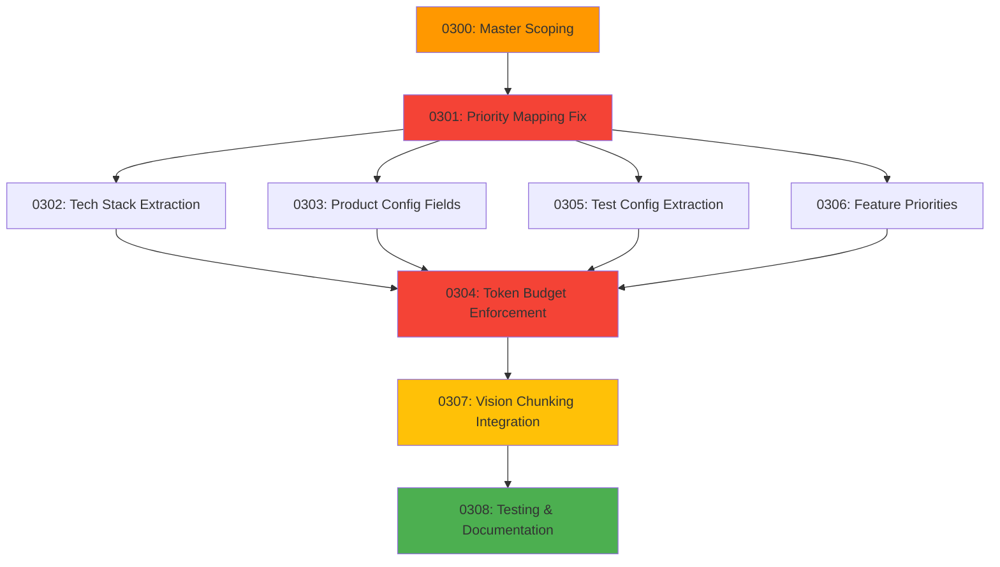

# Handover 0300: Context Management System Implementation

**Date**: 2025-01-16
**Status**: Scoping Phase - Master Document
**Priority**: P0 - Critical (Foundation for all context features)
**Estimated Duration**: 12-15 days
**Agent Budget**: 150K tokens per sub-handover
**Depends On**: None (standalone architectural enhancement)
**Blocks**: All future context-related features, agent mission quality

---

## Executive Summary

### The Problem: Three Critical Issues

After comprehensive analysis of the context management system (Handover 0112 and field priorities documentation), we've identified three critical architectural gaps:

#### 1. UI/Backend Priority Mismatch (CRITICAL BUG)
**Current State**: UI sends priorities 1-3 (draggable cards), backend expects 1-10 scale
**Impact**: ALL user-configured priorities map to "minimal" (20% detail level)
**Evidence**:
- Frontend: `UserSettings.vue` - Priority cards labeled 1, 2, 3, Unassigned
- Backend: `mission_planner.py` lines 120-131 - Maps 1-3 to "minimal", 4-6 to "abbreviated", 7-9 to "moderate", 10 to "full"
- **Result**: User sets "Priority 1" (expecting full detail) but gets minimal (20% content)

#### 2. Incomplete Context Source Implementation
**PDF Specification** (Giljo Vision Book): 9 context sources defined
**Implemented**: Only 4 of 9 sources operational
**Missing**:
- Tech stack extraction (languages, backend, frontend, database, infrastructure)
- Product config fields (architecture patterns, API style, design patterns)
- Test configuration (strategy, frameworks, coverage targets)
- Feature priorities (core features, nice-to-have, future roadmap)
- Development context (coding standards, conventions, best practices)

#### 3. Token Budget Not Enforced
**Specified**: 2000 token budget per agent mission (configurable)
**Reality**: Budget tracked but NOT enforced - missions can exceed budget without truncation or warning
**Evidence**: `mission_planner.py` - `_build_context_with_priorities()` counts tokens but never truncates

### The Solution: Systematic Remediation

Implement the complete context management system as originally architected in the Giljo Vision Book through a phased approach:

**Phase 1**: Fix critical UI/backend mismatch (prevents data loss from user expectations)
**Phase 2**: Implement missing context extractors (enables intelligent mission building)
**Phase 3**: Enforce token budget (ensures predictable agent performance)
**Phase 4**: Integrate vision document chunking (handles large documents efficiently)
**Phase 5**: Comprehensive testing and documentation (ensures production quality)

### Success Criteria

- Priority selection in UI correctly maps to backend detail levels (1=full, 2=high, 3=medium, unassigned=exclude)
- All 9 PDF-specified context sources implemented and tested
- Token budget enforcement prevents missions from exceeding configured limits
- Vision document chunking integration provides sub-100ms chunk selection
- Comprehensive test coverage (>80%) across all context components
- Documentation updated to reflect complete system architecture

---

## Scope Breakdown: Sub-Handovers 0301-0311

This master handover is divided into 11 focused sub-handovers (0301-0308 original scope + 0306-0308 renumbered + 0311 added for 360 Memory integration):

### 0301: UI/Backend Priority Mapping Fix (CRITICAL)
**Duration**: 1-2 days
**Priority**: P0 (Blocks all other work)
**Scope**:
- Align frontend priority cards with backend 1-10 scale
- Implement proper mapping: Priority 1 → backend 10 (full), Priority 2 → backend 7 (high), Priority 3 → backend 4 (medium), Unassigned → backend 0 (exclude)
- Update API contract to enforce correct mapping
- Add validation to prevent invalid priority values
- Migration strategy for existing user configurations

### 0302: Tech Stack Context Extraction
**Duration**: 2 days
**Priority**: P1
**Scope**:
- Extract from `Product.config_data` JSONB field
- Implement extractors for: languages, backend frameworks, frontend frameworks, database, infrastructure
- Priority-based detail levels: full (complete list + versions), abbreviated (names only), minimal (primary only)
- Token counting and budget tracking
- Unit tests for all extractors

### 0303: Product Configuration Fields Extraction
**Duration**: 2 days
**Priority**: P1
**Scope**:
- Architecture patterns (MVC, microservices, event-driven, etc.)
- API style (REST, GraphQL, gRPC, WebSocket)
- Design patterns (repository, factory, observer, etc.)
- Priority-based detail levels
- Integration with existing `_build_context_with_priorities()`

### 0304: Token Budget Enforcement
**Duration**: 2 days
**Priority**: P0
**Scope**:
- Implement hard token limit enforcement in `_build_context_with_priorities()`
- Truncation strategy: preserve critical sections (vision summary, core architecture)
- Warning system when approaching budget limits
- Budget allocation algorithm: distribute tokens proportionally by priority
- Logging and metrics for budget violations

### 0305: Test Configuration Context Extraction
**Duration**: 1-2 days
**Priority**: P2
**Scope**:
- Test strategy extraction (TDD, BDD, integration-first, etc.)
- Test frameworks (pytest, jest, selenium, etc.)
- Coverage targets and quality gates
- Integration with tester agent missions

### 0306: Feature Priority Context Extraction
**Duration**: 1-2 days
**Priority**: P2
**Scope**:
- Core features (must-have for MVP)
- Nice-to-have features (stretch goals)
- Future roadmap (planned but deferred)
- Priority-based inclusion in agent missions

### 0307: Vision Document Chunking Integration
**Duration**: 2-3 days
**Priority**: P1
**Scope**:
- Integration with existing `VisionDocumentChunker` (from CONTEXT_MANAGEMENT_SYSTEM.md)
- Dynamic chunk loading based on agent role and query
- Sub-100ms chunk selection using PostgreSQL full-text search
- Relevance scoring integration with priority system
- Comprehensive integration tests

### 0308: Frontend Field Labels & Tooltips
**Duration**: 1 day
**Priority**: P2
**Scope**:
- User-facing field descriptions in priority UI
- Helpful tooltips explaining each context source
- Example use cases for different priority levels
- Accessibility improvements (ARIA labels, keyboard navigation)

### 0309: Token Estimation Improvements
**Duration**: 1 day
**Priority**: P2
**Scope**:
- More accurate token counting with tiktoken
- Preview token usage before mission launch
- Token budget warnings in UI
- Analytics on context prioritization effectiveness

### 0310: Integration Testing & Documentation
**Duration**: 2 days
**Priority**: P1
**Scope**:
- Unit tests for all new extractors (>80% coverage target)
- Integration tests for end-to-end context building
- Performance benchmarks (token counting, extraction, truncation)
- Documentation updates (CONTEXT_MANAGEMENT_SYSTEM.md, FIELD_PRIORITIES_SYSTEM.md)
- User guide updates with correct priority mapping

### 0311: 360 Memory + Git Integration (NEW - Added 2025-11-16)
**Duration**: 1-2 days
**Priority**: P1 (9th context source from PDF spec)
**Scope**:
- Extract learnings from `product_memory.learnings` array (handovers 0135-0139)
- Inject git instructions when `product_memory.git_integration.enabled = true` (handover 013B)
- Priority-based detail levels: full (all learnings + details), moderate (last 5 + outcomes), abbreviated (last 3 summary), minimal (last 1 summary)
- Add "360 Memory" field to priority UI
- Integration with `_build_context_with_priorities()` method
- 8+ unit tests + 4+ integration tests
- Complete 9th context source from Giljo Vision Book PDF (Slide 9)

---

## Architecture Harmony

### Alignment with Existing Systems

#### 1. Field Priority System (FIELD_PRIORITIES_SYSTEM.md)
**Pattern**: 1-10 priority scale with detail level mapping
**Enhancement**: Add 5 new context sources while maintaining existing architecture
**Integration Points**:
- `_build_context_with_priorities()` - Add new extractor calls
- `_get_detail_level()` - Reuse existing mapping logic
- `_count_tokens()` - Reuse tiktoken-based counting

#### 2. Context Management System (CONTEXT_MANAGEMENT_SYSTEM.md)
**Pattern**: Chunking → Indexing → Loading → Tracking
**Enhancement**: Integrate chunk loading into priority-based context building
**Integration Points**:
- `VisionDocumentChunker` - Already production-ready
- `ContextIndexer` - PostgreSQL GIN-indexed full-text search
- `DynamicContextLoader` - Role-based chunk selection
- `ContextSummarizer` - Context prioritization tracking

#### 3. Mission Planner (mission_planner.py)
**Pattern**: Analysis → Context Building → Mission Generation
**Enhancement**: Enrich context building with complete product configuration
**Integration Points**:
- Lines 590-846: `_build_context_with_priorities()` - Main enhancement point
- Lines 522-588: Abbreviation methods - Extend for new context types
- Lines 208-228: Token counting - Reuse for budget enforcement

#### 4. Product Model (models.py)
**Pattern**: JSONB `config_data` field for flexible product configuration
**Enhancement**: Define standardized schema for extractable fields
**Integration Points**:
- `config_data.tech_stack` - Dictionary with sub-keys (languages, backend, frontend, etc.)
- `config_data.architecture` - Dictionary with patterns, API style, design patterns
- `config_data.test_config` - Dictionary with strategy, frameworks, coverage targets
- `config_data.features` - Dictionary with core, nice_to_have, future

### Service Layer Pattern

All new context extractors will follow the established service pattern:

```python
class ContextExtractorService:
    """
    Extract and format context from Product.config_data.

    Follows GiljoAI service pattern:
    - AsyncSession injection for database transactions
    - Multi-tenant isolation (tenant_key parameter)
    - Pydantic schemas for validation
    - Comprehensive error handling
    - Logging with structured metadata
    """

    async def extract_tech_stack(
        self,
        config_data: dict,
        priority: int,
        tenant_key: str
    ) -> str:
        """Extract tech stack context with priority-based detail level."""
        pass

    async def extract_architecture(
        self,
        config_data: dict,
        priority: int,
        tenant_key: str
    ) -> str:
        """Extract architecture context with priority-based detail level."""
        pass
```

---

## TDD Approach: Test-First Development

### Testing Strategy

Following GiljoAI's established testing patterns (TESTING.md), we implement test-first for all new components:

#### 1. Unit Tests (Per Sub-Handover)
**Coverage Target**: >80% for all new code
**Test File Pattern**: `tests/unit/context_extractors/test_{extractor_name}.py`

**Example**: Tech Stack Extractor Tests
```python
@pytest.mark.asyncio
async def test_extract_tech_stack_full_detail():
    """Priority 10 should include complete tech stack with versions."""
    config_data = {
        "tech_stack": {
            "languages": ["Python 3.11", "TypeScript 5.0"],
            "backend": ["FastAPI 0.104", "SQLAlchemy 2.0"],
            "frontend": ["Vue 3", "Vuetify 3"],
            "database": ["PostgreSQL 16"],
            "infrastructure": ["Docker", "Nginx"]
        }
    }

    result = await extractor.extract_tech_stack(
        config_data, priority=10, tenant_key="tk_test"
    )

    assert "Python 3.11" in result
    assert "FastAPI 0.104" in result
    assert "PostgreSQL 16" in result
    # Full detail: all items with versions

@pytest.mark.asyncio
async def test_extract_tech_stack_abbreviated():
    """Priority 4-6 should include names without versions."""
    config_data = {...}  # Same as above

    result = await extractor.extract_tech_stack(
        config_data, priority=5, tenant_key="tk_test"
    )

    assert "Python" in result
    assert "FastAPI" in result
    assert "3.11" not in result  # No versions in abbreviated

@pytest.mark.asyncio
async def test_extract_tech_stack_minimal():
    """Priority 1-3 should include only primary technologies."""
    config_data = {...}  # Same as above

    result = await extractor.extract_tech_stack(
        config_data, priority=2, tenant_key="tk_test"
    )

    assert "Python" in result
    assert "FastAPI" in result  # Primary backend
    assert "Docker" not in result  # Secondary (infrastructure)
```

#### 2. Integration Tests
**Coverage**: End-to-end context building with all extractors
**Test File**: `tests/integration/test_context_building_complete.py`

**Key Test Cases**:
- Full context building with all 9 sources at various priorities
- Token budget enforcement with truncation
- Multi-tenant isolation verification
- Vision chunk integration with priority filtering
- Performance benchmarks (<200ms for complete context build)

#### 3. Test Data Fixtures
**Pattern**: Reusable fixtures for consistent testing
**Location**: `tests/fixtures/context_fixtures.py`

```python
@pytest.fixture
def sample_product_config():
    """Complete product config for testing all extractors."""
    return {
        "tech_stack": {
            "languages": ["Python 3.11", "TypeScript 5.0"],
            "backend": ["FastAPI 0.104", "SQLAlchemy 2.0"],
            "frontend": ["Vue 3", "Vuetify 3"],
            "database": ["PostgreSQL 16"],
            "infrastructure": ["Docker", "Nginx", "Redis"]
        },
        "architecture": {
            "pattern": "Microservices",
            "api_style": "REST",
            "design_patterns": ["Repository", "Factory", "Observer"]
        },
        "test_config": {
            "strategy": "TDD",
            "frameworks": ["pytest", "jest", "playwright"],
            "coverage_target": 80
        },
        "features": {
            "core": ["User authentication", "Product management"],
            "nice_to_have": ["Email notifications", "Export to CSV"],
            "future": ["Mobile app", "Third-party integrations"]
        }
    }
```

### TDD Workflow (Per Sub-Handover)

**Step 1: Write Failing Tests** (Red)
- Define test cases for all extractor methods
- Cover full, abbreviated, minimal, and exclude scenarios
- Include edge cases (empty config, missing fields, invalid priorities)

**Step 2: Implement Minimum Code** (Green)
- Write extractor logic to pass tests
- Follow existing patterns from `mission_planner.py`
- Use tiktoken for accurate token counting

**Step 3: Refactor** (Refactor)
- Extract common patterns into helper methods
- Optimize for performance (minimize string operations)
- Add comprehensive logging and error handling

**Step 4: Integration** (Integrate)
- Wire extractor into `_build_context_with_priorities()`
- Add integration tests
- Verify multi-tenant isolation

**Step 5: Documentation** (Document)
- Update technical documentation
- Add code examples to docstrings
- Create user guide sections

---

## Migration Strategy

### Backward Compatibility

All enhancements are additive - no breaking changes to existing API contracts.

#### 1. User Configuration Migration (0301)

**Problem**: Existing users have priority configurations with 1-3 scale
**Solution**: Automatic migration on first login after deployment

```python
async def migrate_user_priorities_to_10_scale(user_id: str):
    """
    Migrate user's priority configuration from 1-3 to 1-10 scale.

    Mapping:
      Frontend Priority 1 (Critical) → Backend 10 (Full Detail)
      Frontend Priority 2 (Important) → Backend 7 (Moderate Detail)
      Frontend Priority 3 (Standard) → Backend 4 (Abbreviated)
      Unassigned → Backend 0 (Exclude)
    """
    async with db.session() as session:
        user = await session.get(User, user_id)

        if not user.field_priority_config:
            return  # New user, will get defaults

        # Check if already migrated
        if user.field_priority_config.get("version") == "2.0":
            return

        # Migrate priorities
        old_config = user.field_priority_config
        new_config = {"version": "2.0", "token_budget": 2000, "fields": {}}

        for field, old_priority in old_config.get("fields", {}).items():
            if old_priority == 1:
                new_config["fields"][field] = 10  # Critical → Full
            elif old_priority == 2:
                new_config["fields"][field] = 7   # Important → Moderate
            elif old_priority == 3:
                new_config["fields"][field] = 4   # Standard → Abbreviated
            else:
                new_config["fields"][field] = 0   # Unassigned → Exclude

        user.field_priority_config = new_config
        await session.commit()

        logger.info(
            f"Migrated user {user_id} priorities from 1-3 to 1-10 scale",
            extra={"user_id": user_id, "migrated_fields": len(new_config["fields"])}
        )
```

#### 2. Product Config Schema Evolution

**Problem**: Existing products may not have new config_data fields
**Solution**: Graceful degradation - extractors return empty string if fields missing

```python
def extract_tech_stack(config_data: dict, priority: int) -> str:
    """Extract tech stack with graceful degradation for missing fields."""
    tech_stack = config_data.get("tech_stack", {})

    if not tech_stack:
        logger.debug("No tech stack configured, returning empty context")
        return ""

    # Continue with extraction...
```

#### 3. Token Budget Default

**Problem**: Existing users don't have token_budget configured
**Solution**: Default to 2000 tokens (per specification)

```python
token_budget = user.field_priority_config.get("token_budget", 2000)
```

### Deployment Sequence

**Phase 1: Database Schema** (if needed)
- No schema changes required (uses existing JSONB fields)
- Add indexes for performance optimization (optional)

**Phase 2: Backend Deployment**
- Deploy new extractor services
- Deploy enhanced `_build_context_with_priorities()`
- Deploy migration endpoint (runs on user login)

**Phase 3: Frontend Deployment**
- Deploy updated priority selection UI (if changes needed for 0301)
- Update help text to reflect new capabilities

**Phase 4: Monitoring**
- Track context prioritization metrics
- Monitor budget enforcement effectiveness
- Gather user feedback on context quality

---

## Success Criteria

### Must Have (Blocking)

- **Priority Mapping**:
  - User selects "Priority 1" → Backend receives priority 10 → Full detail rendered
  - User selects "Priority 2" → Backend receives priority 7 → Moderate detail rendered
  - User selects "Priority 3" → Backend receives priority 4 → Abbreviated detail rendered
  - User leaves unassigned → Backend receives priority 0 → Field excluded
  - Validation prevents invalid priorities (must be 0-10)

- **Context Sources** (9 total from PDF spec):
  - Product name and vision (existing)
  - Tech stack extractor: languages, backend, frontend, database, infrastructure
  - Architecture extractor: patterns, API style, design patterns
  - Test config extractor: strategy, frameworks, coverage targets
  - Feature priority extractor: core, nice-to-have, future
  - Agent templates in context string
  - Project description (existing)
  - **360 Memory + Git integration** (handover 0311): learnings history + git instructions
  - All extractors support full, abbreviated, minimal, exclude detail levels

- **Token Budget**:
  - Hard enforcement: context never exceeds configured budget
  - Intelligent truncation: preserves critical sections (vision summary, core architecture)
  - Warning logs when budget forces content omission
  - Metrics tracking: budget utilization percentage per mission

- **Testing**:
  - >80% code coverage across all new extractors
  - Integration tests verify end-to-end context building
  - Performance benchmarks: <200ms for complete context generation
  - Multi-tenant isolation verified (no cross-tenant data leakage)

- **Documentation**:
  - CONTEXT_MANAGEMENT_SYSTEM.md updated with new extractors
  - FIELD_PRIORITIES_SYSTEM.md updated with correct priority mapping
  - User guide created explaining priority selection impact
  - API documentation reflects new context sources

### Nice to Have (Non-Blocking)

- Historical tracking of context prioritization effectiveness
- A/B testing framework for different truncation strategies
- User feedback mechanism for context quality
- Automated suggestions for optimal priority configurations
- Export context preview for debugging/transparency
- Graphical visualization of context composition by source

---

## Risk Assessment & Mitigation

### Risk 1: Priority Migration Breaks Existing Configurations
**Probability**: Medium
**Impact**: High (user loses custom settings)
**Mitigation**:
- Store migration timestamp to prevent double-migration
- Create backup of old configuration before migration
- Add rollback capability via admin panel
- Comprehensive testing on staging environment with production data copy
- Gradual rollout (10% → 50% → 100% over 1 week)

### Risk 2: Token Budget Too Restrictive
**Probability**: High
**Impact**: Medium (missions lack critical context)
**Mitigation**:
- Default to 2000 tokens (validated in testing)
- Allow user override up to 10,000 tokens
- Intelligent truncation prioritizes critical sections
- Warning system alerts user when budget forces omissions
- Analytics track budget violations to inform future defaults

### Risk 3: Performance Degradation
**Probability**: Low
**Impact**: Medium (slower mission generation)
**Mitigation**:
- Benchmark all extractors (<50ms per extractor target)
- Cache frequently accessed config_data
- Optimize string concatenation (use list.join instead of +=)
- Profile with production-scale data (50K token vision documents)
- Set hard timeout at 500ms for complete context build

### Risk 4: Vision Chunking Integration Complexity
**Probability**: Medium
**Impact**: High (blocks handover 0307)
**Mitigation**:
- VisionDocumentChunker already production-ready (CONTEXT_MANAGEMENT_SYSTEM.md)
- Comprehensive integration tests before production deployment
- Gradual rollout: chunking optional initially, mandatory after validation
- Fallback to full vision document if chunking fails

### Risk 5: Incomplete Product Configurations
**Probability**: High
**Impact**: Low (graceful degradation handles missing fields)
**Mitigation**:
- All extractors check for missing fields and return empty string
- Default configurations provide sensible fallbacks
- User guidance prompts completion of product configuration
- Analytics track configuration completeness to prioritize UX improvements

---

## Dependencies

### Required (Blocking)

- **PostgreSQL 16**: JSONB field support with GIN indexing (already deployed)
- **Tiktoken**: Accurate token counting (already installed and tested)
- **SQLAlchemy 2.0**: Async session management (already integrated)
- **FastAPI**: API endpoints for priority configuration (already deployed)
- **Vue 3 / Vuetify 3**: Frontend priority selection UI (already deployed)

### Optional (Non-Blocking)

- **Redis**: Caching for frequently accessed config_data (future optimization)
- **Prometheus**: Metrics collection for token budget violations (future monitoring)
- **Sentry**: Error tracking for extraction failures (already configured)

---

## Files to Modify

### Backend (Core Implementation)

#### New Files (8 files)
1. `src/giljo_mcp/context_extractors/tech_stack_extractor.py` - Tech stack extraction logic
2. `src/giljo_mcp/context_extractors/architecture_extractor.py` - Architecture patterns extraction
3. `src/giljo_mcp/context_extractors/test_config_extractor.py` - Test configuration extraction
4. `src/giljo_mcp/context_extractors/feature_priority_extractor.py` - Feature priority extraction
5. `src/giljo_mcp/context_extractors/__init__.py` - Package initialization
6. `src/giljo_mcp/services/context_extractor_service.py` - Service layer orchestration
7. `api/endpoints/context.py` - New context preview endpoints (optional for 0301)
8. `api/schemas/context.py` - Pydantic schemas for context requests/responses

#### Modified Files (6 files)
1. `src/giljo_mcp/mission_planner.py` - Enhance `_build_context_with_priorities()`
   - Add calls to new extractors (lines 590-846)
   - Implement token budget enforcement
   - Integrate vision chunk loading

2. `src/giljo_mcp/config/defaults.py` - Update default priorities for new fields
   - Add tech_stack.* defaults
   - Add architecture.* defaults
   - Add test_config.* defaults
   - Add features.* defaults

3. `api/endpoints/users.py` - Add migration endpoint (if needed for 0301)
   - `POST /api/v1/users/migrate-priorities` - Trigger manual migration

4. `src/giljo_mcp/models.py` - Add field priority version tracking (optional)
   - Add `priority_config_version` to User model

5. `api/endpoints/field_priorities.py` - Enhanced validation
   - Validate priority range 0-10
   - Reject invalid priority values

6. `src/giljo_mcp/database/repositories/context_repository.py` - Enhanced queries (if needed)
   - Optimize config_data JSONB queries

### Testing (New Files)

#### Unit Tests (8 files)
1. `tests/unit/context_extractors/test_tech_stack_extractor.py` - 10+ tests
2. `tests/unit/context_extractors/test_architecture_extractor.py` - 8+ tests
3. `tests/unit/context_extractors/test_test_config_extractor.py` - 6+ tests
4. `tests/unit/context_extractors/test_feature_priority_extractor.py` - 6+ tests
5. `tests/unit/context_extractors/test_budget_enforcement.py` - 12+ tests
6. `tests/fixtures/context_fixtures.py` - Reusable test data
7. `tests/integration/test_context_building_complete.py` - End-to-end tests
8. `tests/integration/test_priority_migration.py` - Migration tests

### Frontend (Modifications if needed for 0301)

#### Modified Files (2-3 files)
1. `frontend/src/components/settings/UserSettings.vue` - Priority mapping (if UI changes needed)
2. `frontend/src/components/projects/LaunchTab.vue` - Context preview (optional)
3. `frontend/src/stores/userSettings.js` - Priority validation (if needed)

### Documentation (Updates)

#### Modified Files (5 files)
1. `docs/CONTEXT_MANAGEMENT_SYSTEM.md` - Add new extractors section
2. `docs/technical/FIELD_PRIORITIES_SYSTEM.md` - Update priority mapping, add examples
3. `docs/guides/context_configuration_guide.md` - NEW: User guide for priority selection
4. `docs/api/CONTEXT_API_GUIDE.md` - Add new endpoint documentation (if applicable)
5. `README.md` - Update feature list with complete context system

---

## Effort Breakdown

| Handover | Task | Estimated Time |
|----------|------|---------------|
| 0301 | UI/Backend Priority Mapping Fix | 8-16 hours |
| | - Frontend priority card updates | 2-4 hours |
| | - Backend validation enhancements | 2-3 hours |
| | - Migration script development | 2-3 hours |
| | - Testing and validation | 2-3 hours |
| | - Documentation updates | 1-3 hours |
| 0302 | Tech Stack Context Extraction | 12-16 hours |
| | - Extractor implementation | 4-6 hours |
| | - Unit tests (10+ tests) | 3-4 hours |
| | - Integration with mission planner | 2-3 hours |
| | - Testing and validation | 2-3 hours |
| | - Documentation | 1-2 hours |
| 0303 | Product Configuration Fields | 12-16 hours |
| | - Architecture extractor | 3-4 hours |
| | - Unit tests (8+ tests) | 2-3 hours |
| | - Integration testing | 2-3 hours |
| | - Performance optimization | 2-3 hours |
| | - Documentation | 2-3 hours |
| 0304 | Token Budget Enforcement | 12-16 hours |
| | - Enforcement logic implementation | 4-6 hours |
| | - Intelligent truncation algorithm | 3-4 hours |
| | - Unit tests (12+ tests) | 3-4 hours |
| | - Performance benchmarks | 1-2 hours |
| | - Documentation | 1-2 hours |
| 0305 | Test Configuration Extraction | 8-12 hours |
| | - Test config extractor | 3-4 hours |
| | - Unit tests (6+ tests) | 2-3 hours |
| | - Integration testing | 2-3 hours |
| | - Documentation | 1-2 hours |
| 0306 | Feature Priority Extraction | 8-12 hours |
| | - Feature extractor | 3-4 hours |
| | - Unit tests (6+ tests) | 2-3 hours |
| | - Integration testing | 2-3 hours |
| | - Documentation | 1-2 hours |
| 0307 | Vision Chunking Integration | 16-24 hours |
| | - Chunk loader integration | 4-6 hours |
| | - Relevance scoring with priorities | 4-6 hours |
| | - Performance optimization | 3-4 hours |
| | - Integration tests | 3-4 hours |
| | - Documentation | 2-4 hours |
| 0308 | Testing & Documentation | 12-16 hours |
| | - End-to-end integration tests | 4-6 hours |
| | - Performance benchmarking | 2-3 hours |
| | - User guide creation | 3-4 hours |
| | - Technical documentation | 2-3 hours |
| | - Code review and refinement | 1-2 hours |
| **TOTAL** | | **88-128 hours (11-16 days)** |

---

## Handover Sequence & Dependencies



**Critical Path**: 0301 → 0302 → 0304 → 0307 → 0308 (8-10 days minimum)
**Parallel Work**: 0302, 0303, 0305, 0306 can run concurrently after 0301

---

## Quality Gates

Each sub-handover must pass these quality gates before proceeding:

### Code Quality
- [ ] Ruff linting passes (no errors, minimal warnings)
- [ ] Black formatting applied
- [ ] Type hints present for all public methods
- [ ] Docstrings follow Google style guide
- [ ] No hardcoded values (use config/constants)

### Testing
- [ ] >80% code coverage for new code
- [ ] All unit tests pass
- [ ] Integration tests pass
- [ ] Performance benchmarks meet targets
- [ ] Multi-tenant isolation verified

### Documentation
- [ ] Technical documentation updated
- [ ] API documentation current (if applicable)
- [ ] User guide sections added
- [ ] Code examples tested and accurate
- [ ] Changelog entry created

### Security
- [ ] No SQL injection vulnerabilities
- [ ] JSONB queries use parameterized statements
- [ ] User input validated
- [ ] Error messages don't leak sensitive data
- [ ] Multi-tenant isolation maintained

### Performance
- [ ] Individual extractor <50ms
- [ ] Complete context build <200ms
- [ ] Token counting <20ms for 10K tokens
- [ ] Database queries <100ms
- [ ] Memory usage <100MB for large contexts

---

## Communication Plan

### Stakeholder Updates

**Weekly Progress Report** (Every Friday):
- Completed sub-handovers
- Current sub-handover status
- Blockers and risks
- Metrics (test coverage, performance benchmarks)
- Next week's plan

**Milestone Celebrations**:
- 0301 Complete: Critical bug fixed, user priorities work correctly
- 0304 Complete: Token budget enforcement operational
- 0307 Complete: Vision chunking integrated
- 0308 Complete: Full system production-ready

### Documentation Handoff

Upon completion of 0308, deliver:
1. **Technical Documentation** - Complete system architecture
2. **User Guide** - How to configure priorities for optimal results
3. **API Reference** - All endpoints with examples
4. **Test Suite** - How to run, interpret results
5. **Migration Guide** - Upgrading from old priority system

---

## Post-Implementation Review

After 0308 completion, conduct comprehensive review:

### Metrics to Analyze
- Context prioritization percentage across all projects
- Budget enforcement effectiveness (violations vs compliance)
- User satisfaction with context quality
- Performance impact on mission generation time
- Cost savings from context prioritization

### Success Indicators
- Average context prioritization: >60% (target: 70%)
- Budget violations: <5% of missions
- User satisfaction: >4/5 stars
- Performance: <200ms for context generation
- Cost savings: >$100/month at scale (1000 projects)

### Lessons Learned
- What went well (process, tools, collaboration)
- What could improve (architecture decisions, testing approach)
- Recommendations for future context enhancements

---

## Related Documentation

- **Foundation Documents**:
  - [CONTEXT_MANAGEMENT_SYSTEM.md](../docs/CONTEXT_MANAGEMENT_SYSTEM.md) - Existing chunking system
  - [FIELD_PRIORITIES_SYSTEM.md](../docs/technical/FIELD_PRIORITIES_SYSTEM.md) - Current priority implementation
  - [Handover 0112](0112_context_prioritization_ux_enhancements.md) - UX enhancement proposals

- **Architecture References**:
  - [SERVICES.md](../docs/SERVICES.md) - Service layer patterns
  - [TESTING.md](../docs/TESTING.md) - Testing strategy and patterns
  - [ORCHESTRATOR.md](../docs/ORCHESTRATOR.md) - Mission generation context

- **API Documentation**:
  - [CONTEXT_API_GUIDE.md](../docs/api/CONTEXT_API_GUIDE.md) - Context endpoints
  - [CONTEXT_INTEGRATION_GUIDE.md](../docs/CONTEXT_INTEGRATION_GUIDE.md) - Integration patterns

---

**Status**: Master scoping document complete, ready for sub-handover creation
**Created By**: Documentation Manager Agent
**Date**: 2025-01-16
**Next Steps**:
1. Create detailed sub-handover documents (0301-0308)
2. Assign to appropriate agents (Implementer, Tester, etc.)
3. Begin execution with 0301 (Priority Mapping Fix)
